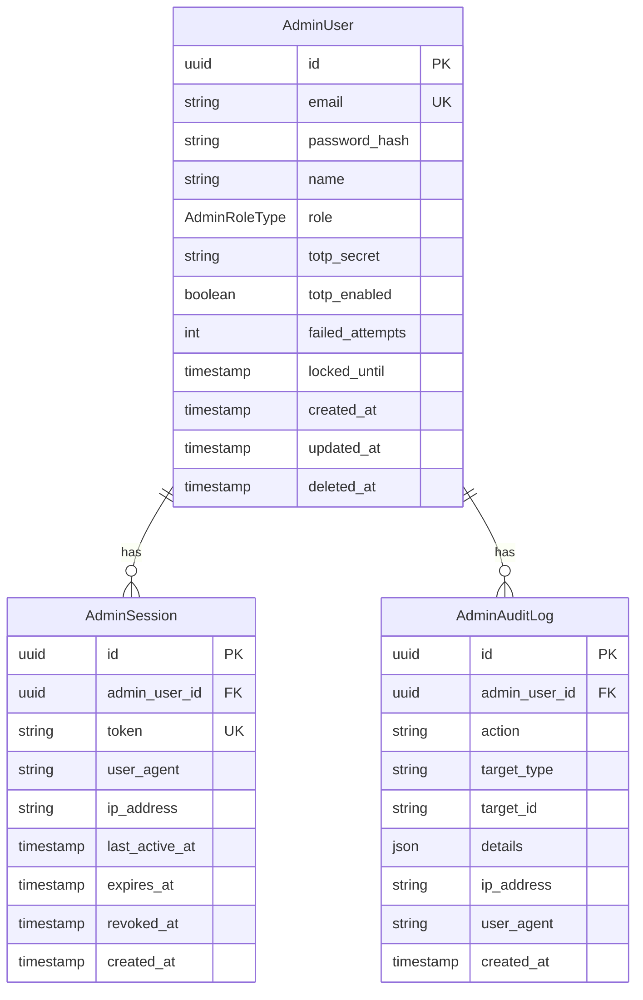

# 管理者認証テーブル設計

## 概要

管理者（システム運営者）向けの認証機能に関するテーブル定義。ユーザー認証とは完全に独立したセッション管理を提供する。

## テーブル一覧

| テーブル | 説明 |
|---------|------|
| `AdminUser` | 管理者ユーザー |
| `AdminSession` | 管理者セッション |
| `AdminAuditLog` | 管理者監査ログ |

## AdminUser

管理者ユーザー情報を管理するテーブル。

### カラム定義

| カラム | 型 | NULL | 説明 |
|--------|-----|------|------|
| `id` | UUID | NO | 主キー |
| `email` | VARCHAR(255) | NO | メールアドレス（一意） |
| `password_hash` | VARCHAR(255) | NO | パスワードハッシュ（bcrypt） |
| `name` | VARCHAR(100) | NO | 管理者名 |
| `role` | AdminRoleType | NO | ロール（デフォルト: ADMIN） |
| `totp_secret` | VARCHAR(255) | YES | TOTP シークレット（暗号化） |
| `totp_enabled` | BOOLEAN | NO | 2FA 有効フラグ（デフォルト: false） |
| `failed_attempts` | INTEGER | NO | ログイン失敗回数（デフォルト: 0） |
| `locked_until` | TIMESTAMP | YES | アカウントロック解除日時 |
| `created_at` | TIMESTAMP | NO | 作成日時 |
| `updated_at` | TIMESTAMP | NO | 更新日時 |
| `deleted_at` | TIMESTAMP | YES | 論理削除日時 |

### インデックス

```sql
CREATE UNIQUE INDEX idx_admin_users_email ON "admin_users"("email");
CREATE INDEX idx_admin_users_deleted ON "admin_users"("deleted_at");
```

### 制約

- `email` は一意制約
- パスワードは bcrypt でハッシュ化して保存
- `totp_secret` は AES-256-GCM で暗号化して保存

## AdminSession

管理者のセッション情報を管理するテーブル。

### カラム定義

| カラム | 型 | NULL | 説明 |
|--------|-----|------|------|
| `id` | UUID | NO | 主キー |
| `admin_user_id` | UUID | NO | 管理者ユーザー ID（FK） |
| `token` | VARCHAR(500) | NO | セッショントークン（一意） |
| `user_agent` | TEXT | YES | ユーザーエージェント |
| `ip_address` | VARCHAR(45) | YES | IP アドレス |
| `last_active_at` | TIMESTAMP | NO | 最終アクティブ日時 |
| `expires_at` | TIMESTAMP | NO | 有効期限 |
| `revoked_at` | TIMESTAMP | YES | 無効化日時 |
| `created_at` | TIMESTAMP | NO | 作成日時 |

### インデックス

```sql
CREATE INDEX idx_admin_sessions_user_id ON "admin_sessions"("admin_user_id");
CREATE UNIQUE INDEX idx_admin_sessions_token ON "admin_sessions"("token");
CREATE INDEX idx_admin_sessions_expires ON "admin_sessions"("expires_at");
```

### 外部キー

- `admin_user_id` → `admin_users.id`（CASCADE DELETE）

## AdminAuditLog

管理者の操作履歴を記録するテーブル。

### カラム定義

| カラム | 型 | NULL | 説明 |
|--------|-----|------|------|
| `id` | UUID | NO | 主キー |
| `admin_user_id` | UUID | NO | 管理者ユーザー ID（FK） |
| `action` | VARCHAR(100) | NO | アクション名 |
| `target_type` | VARCHAR(50) | YES | 対象リソース種別 |
| `target_id` | VARCHAR(255) | YES | 対象リソース ID |
| `details` | JSON | YES | 詳細情報 |
| `ip_address` | VARCHAR(45) | YES | IP アドレス |
| `user_agent` | TEXT | YES | ユーザーエージェント |
| `created_at` | TIMESTAMP | NO | 作成日時 |

### インデックス

```sql
CREATE INDEX idx_admin_audit_logs_user_id ON "admin_audit_logs"("admin_user_id");
CREATE INDEX idx_admin_audit_logs_action ON "admin_audit_logs"("action");
CREATE INDEX idx_admin_audit_logs_created ON "admin_audit_logs"("created_at");
```

### 外部キー

- `admin_user_id` → `admin_users.id`（CASCADE DELETE）

### アクション一覧

| アクション | 説明 |
|-----------|------|
| `LOGIN` | ログイン |
| `LOGOUT` | ログアウト |
| `LOGIN_FAILED` | ログイン失敗 |
| `2FA_SETUP` | 2FA セットアップ開始 |
| `2FA_ENABLED` | 2FA 有効化 |
| `2FA_DISABLED` | 2FA 無効化 |
| `SESSION_REFRESH` | セッション延長 |
| `ACCOUNT_LOCKED` | アカウントロック |

## AdminRoleType

管理者のロールを定義する ENUM。

| 値 | 説明 |
|-----|------|
| `SUPER_ADMIN` | 最高権限管理者（全機能へのアクセス） |
| `ADMIN` | 一般管理者（ユーザー管理、設定変更） |
| `VIEWER` | 閲覧専用（参照のみ） |

### 権限マトリクス

| 機能 | SUPER_ADMIN | ADMIN | VIEWER |
|------|:-----------:|:-----:|:------:|
| ユーザー一覧閲覧 | ✓ | ✓ | ✓ |
| ユーザー詳細閲覧 | ✓ | ✓ | ✓ |
| ユーザー停止/再開 | ✓ | ✓ | - |
| 組織一覧閲覧 | ✓ | ✓ | ✓ |
| システム設定変更 | ✓ | - | - |
| 管理者ユーザー管理 | ✓ | - | - |

## ER 図



## セキュリティ考慮事項

### パスワード管理

- bcrypt を使用（コストファクター: 12）
- 最小文字数: 8文字
- 複雑性要件: 大文字、小文字、数字、記号のうち3種類以上

### アカウントロック

- 連続5回のログイン失敗でアカウントをロック
- ロック時間: 30分
- ロック中もロック状態であることを示さない（タイミング攻撃対策）

### 2FA（TOTP）

- RFC 6238 準拠
- シークレットは AES-256-GCM で暗号化して保存
- バックアップコードは将来的に実装予定

### セッション管理

- セッショントークンは 32 バイトの暗号的に安全なランダム値
- 有効期限: 8時間
- 非アクティブ時のタイムアウト: 30分
- HttpOnly + Secure + SameSite=Strict Cookie で管理

## 関連ドキュメント

- [データベース設計概要](./index.md)
- [認証機能](../features/authentication.md)
- [管理者認証 API](../../api/admin-auth.md)
