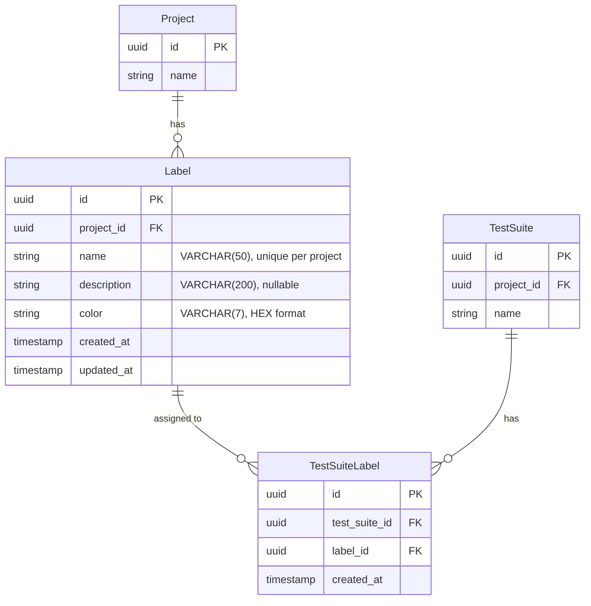

# ラベル テーブル

## 概要

テストスイートに付与するラベルを管理するテーブル群。GitHub の issue ラベルのように、テストスイートを分類・整理するために使用。

---

## Label

プロジェクト単位でラベルを管理するテーブル。

### カラム定義

| カラム | 型 | NULL | デフォルト | 説明 |
|--------|------|------|------------|------|
| `id` | UUID | NO | gen_random_uuid() | 主キー |
| `project_id` | UUID | NO | - | プロジェクト ID（外部キー） |
| `name` | VARCHAR(50) | NO | - | ラベル名（プロジェクト内で一意） |
| `description` | VARCHAR(200) | YES | NULL | ラベルの説明 |
| `color` | VARCHAR(7) | NO | - | 色（HEX形式: #RRGGBB） |
| `created_at` | TIMESTAMP | NO | now() | 作成日時 |
| `updated_at` | TIMESTAMP | NO | now() | 更新日時 |

### 制約

| 制約名 | 種類 | 対象カラム | 説明 |
|--------|------|------------|------|
| `labels_pkey` | PRIMARY KEY | `id` | 主キー |
| `labels_project_id_fkey` | FOREIGN KEY | `project_id` | プロジェクトへの外部キー |
| `labels_project_name_key` | UNIQUE | `project_id`, `name` | プロジェクト内でラベル名が一意 |

### Prisma スキーマ

```prisma
model Label {
  id          String   @id @default(uuid()) @db.Uuid
  projectId   String   @map("project_id") @db.Uuid
  name        String   @db.VarChar(50)
  description String?  @db.VarChar(200)
  color       String   @db.VarChar(7)
  createdAt   DateTime @default(now()) @map("created_at")
  updatedAt   DateTime @updatedAt @map("updated_at")

  project         Project          @relation(fields: [projectId], references: [id], onDelete: Cascade)
  testSuiteLabels TestSuiteLabel[]

  @@unique([projectId, name])
  @@index([projectId])
  @@map("labels")
}
```

### 色の値

ラベルの色は HEX 形式（#RRGGBB）で指定。例:

| 色 | HEX値 | 用途例 |
|-----|-------|--------|
| 赤 | #FF5733 | 重要、緊急 |
| 緑 | #33CC66 | 成功、完了 |
| 青 | #3366FF | 機能テスト |
| 黄 | #FFCC00 | 警告、注意 |
| 紫 | #9933FF | 回帰テスト |

---

## TestSuiteLabel

テストスイートとラベルの多対多リレーションを管理する中間テーブル。

### カラム定義

| カラム | 型 | NULL | デフォルト | 説明 |
|--------|------|------|------------|------|
| `id` | UUID | NO | gen_random_uuid() | 主キー |
| `test_suite_id` | UUID | NO | - | テストスイート ID（外部キー） |
| `label_id` | UUID | NO | - | ラベル ID（外部キー） |
| `created_at` | TIMESTAMP | NO | now() | 作成日時 |

### 制約

| 制約名 | 種類 | 対象カラム | 説明 |
|--------|------|------------|------|
| `test_suite_labels_pkey` | PRIMARY KEY | `id` | 主キー |
| `test_suite_labels_test_suite_id_fkey` | FOREIGN KEY | `test_suite_id` | テストスイートへの外部キー |
| `test_suite_labels_label_id_fkey` | FOREIGN KEY | `label_id` | ラベルへの外部キー |
| `test_suite_labels_test_suite_label_key` | UNIQUE | `test_suite_id`, `label_id` | 同一テストスイートに同一ラベルの重複付与を防止 |

### Prisma スキーマ

```prisma
model TestSuiteLabel {
  id          String   @id @default(uuid()) @db.Uuid
  testSuiteId String   @map("test_suite_id") @db.Uuid
  labelId     String   @map("label_id") @db.Uuid
  createdAt   DateTime @default(now()) @map("created_at")

  testSuite TestSuite @relation(fields: [testSuiteId], references: [id], onDelete: Cascade)
  label     Label     @relation(fields: [labelId], references: [id], onDelete: Cascade)

  @@unique([testSuiteId, labelId])
  @@index([testSuiteId])
  @@index([labelId])
  @@map("test_suite_labels")
}
```

---

## リレーション

### ER図



### 既存モデルへのリレーション追加

#### Project モデル

```prisma
model Project {
  // ... 既存フィールド
  labels Label[]
}
```

#### TestSuite モデル

```prisma
model TestSuite {
  // ... 既存フィールド
  labels TestSuiteLabel[]
}
```

---

## インデックス

| インデックス名 | テーブル | カラム | 種類 | 説明 |
|---------------|---------|--------|------|------|
| `idx_labels_project_id` | labels | project_id | INDEX | プロジェクト別ラベル検索用 |
| `idx_labels_project_name` | labels | project_id, name | UNIQUE | プロジェクト内ラベル名の一意性保証 |
| `idx_test_suite_labels_test_suite_id` | test_suite_labels | test_suite_id | INDEX | テストスイート別ラベル検索用 |
| `idx_test_suite_labels_label_id` | test_suite_labels | label_id | INDEX | ラベル別テストスイート検索用 |

### SQL

```sql
-- ラベル
CREATE INDEX idx_labels_project_id ON "labels"("project_id");
CREATE UNIQUE INDEX idx_labels_project_name ON "labels"("project_id", "name");

-- テストスイートラベル
CREATE INDEX idx_test_suite_labels_test_suite_id ON "test_suite_labels"("test_suite_id");
CREATE INDEX idx_test_suite_labels_label_id ON "test_suite_labels"("label_id");
```

---

## カスケード削除

| 親テーブル | 子テーブル | 動作 |
|-----------|-----------|------|
| Project | Label | プロジェクト削除時、ラベルも削除 |
| Label | TestSuiteLabel | ラベル削除時、関連付けも削除 |
| TestSuite | TestSuiteLabel | テストスイート削除時、関連付けも削除 |

---

## クエリ例

### テストスイートにラベルを付与

```sql
INSERT INTO test_suite_labels (id, test_suite_id, label_id, created_at)
VALUES (gen_random_uuid(), :testSuiteId, :labelId, now());
```

### テストスイートのラベルを一括更新

```sql
-- 既存のラベル関連を削除
DELETE FROM test_suite_labels WHERE test_suite_id = :testSuiteId;

-- 新しいラベル関連を追加
INSERT INTO test_suite_labels (id, test_suite_id, label_id, created_at)
SELECT gen_random_uuid(), :testSuiteId, unnest(:labelIds), now();
```

### 特定ラベルが付与されたテストスイートを検索

```sql
SELECT ts.*
FROM test_suites ts
JOIN test_suite_labels tsl ON ts.id = tsl.test_suite_id
WHERE tsl.label_id = :labelId
  AND ts.deleted_at IS NULL;
```

### ラベル使用状況の集計

```sql
SELECT
  l.*,
  COUNT(tsl.id) as usage_count
FROM labels l
LEFT JOIN test_suite_labels tsl ON l.id = tsl.label_id
LEFT JOIN test_suites ts ON tsl.test_suite_id = ts.id AND ts.deleted_at IS NULL
WHERE l.project_id = :projectId
GROUP BY l.id
ORDER BY l.name;
```

---

## 関連ドキュメント

- [テーブル一覧](./index.md)
- [組織・プロジェクト](./organization.md)
- [テストスイート](./test-suite.md)
- [ラベル API](../../api/labels.md)
- [プロジェクト管理機能](../features/project-management.md)
- [テストスイート管理機能](../features/test-suite-management.md)
