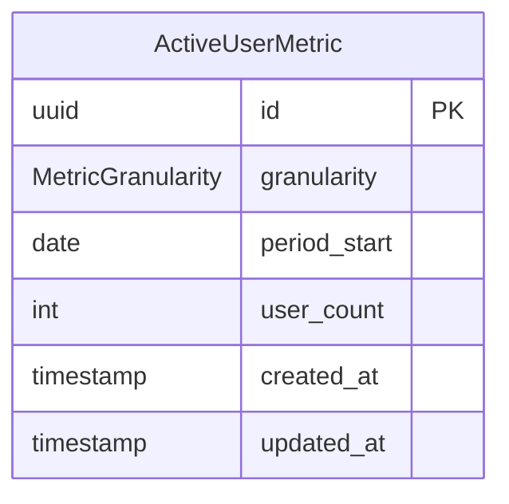

# メトリクステーブル設計

## 概要

アクティブユーザーメトリクス（DAU/WAU/MAU）の集計データを保存するテーブル。管理者ダッシュボードでの時系列グラフ表示に使用。

## テーブル一覧

| テーブル | 説明 |
|---------|------|
| `ActiveUserMetric` | アクティブユーザーメトリクス |

## ActiveUserMetric

日次/週次/月次のアクティブユーザー数を保存するテーブル。

### カラム定義

| カラム | 型 | NULL | 説明 |
|--------|-----|------|------|
| `id` | UUID | NO | 主キー |
| `granularity` | MetricGranularity | NO | 集計粒度（DAY/WEEK/MONTH） |
| `period_start` | DATE | NO | 期間開始日 |
| `user_count` | INTEGER | NO | アクティブユーザー数 |
| `created_at` | TIMESTAMP | NO | 作成日時 |
| `updated_at` | TIMESTAMP | NO | 更新日時 |

### インデックス

```sql
CREATE UNIQUE INDEX idx_active_user_metrics_granularity_period
  ON "active_user_metrics"("granularity", "period_start");
CREATE INDEX idx_active_user_metrics_period
  ON "active_user_metrics"("granularity", "period_start");
```

### 制約

- `granularity` と `period_start` の組み合わせは一意

### データ例

| granularity | period_start | user_count | 説明 |
|-------------|-------------|-----------|------|
| DAY | 2026-01-15 | 150 | 1/15のDAU |
| WEEK | 2026-01-13 | 420 | 1/13週（月曜起点）のWAU |
| MONTH | 2026-01-01 | 980 | 1月のMAU |

## MetricGranularity

メトリクス集計の粒度を定義する ENUM。

| 値 | 説明 |
|-----|------|
| `DAY` | 日次（DAU） |
| `WEEK` | 週次（WAU）- 月曜起点 |
| `MONTH` | 月次（MAU） |

## アクティブユーザーの判定条件

以下の条件をすべて満たすユーザーをアクティブとしてカウント：

1. `User.deletedAt` が NULL
2. `Session.lastActiveAt` が対象期間内
3. `Session.revokedAt` が NULL

## 集計ジョブ

`apps/jobs/src/jobs/metrics-aggregation.ts` で毎日 1:00 JST に実行。

- **DAU**: 毎日実行（前日分を集計）
- **WAU**: 月曜日に実行（前週分を集計）
- **MAU**: 月初に実行（前月分を集計）

## ER 図



## 関連ドキュメント

- [データベース設計概要](./index.md)
- [バッチ処理アーキテクチャ](../features/batch-processing.md)
- [管理者ダッシュボード API](../../api/admin-dashboard.md)
