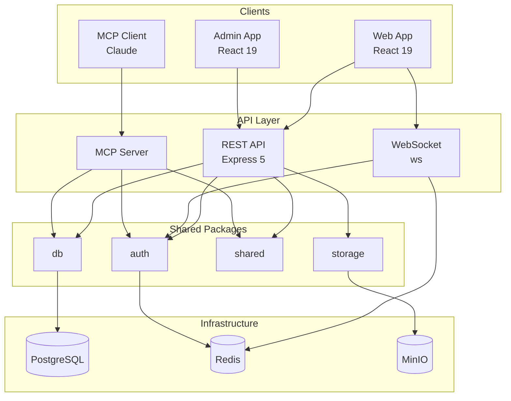
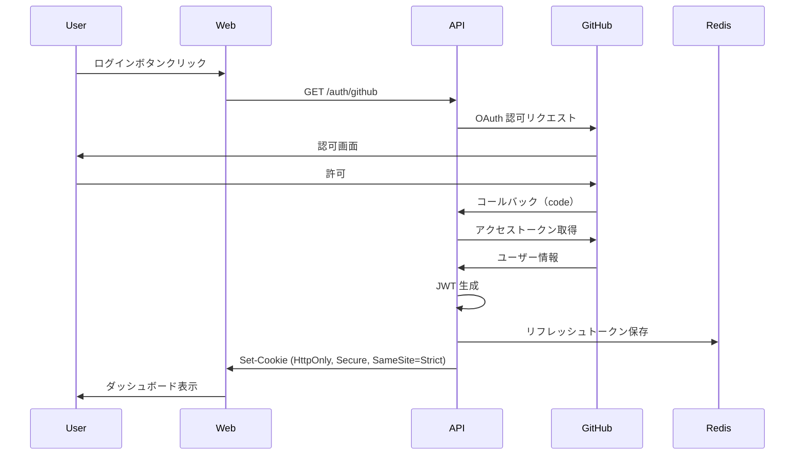
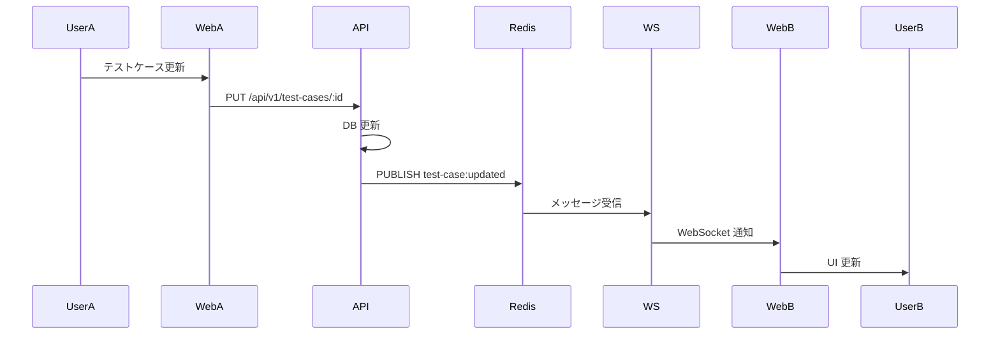
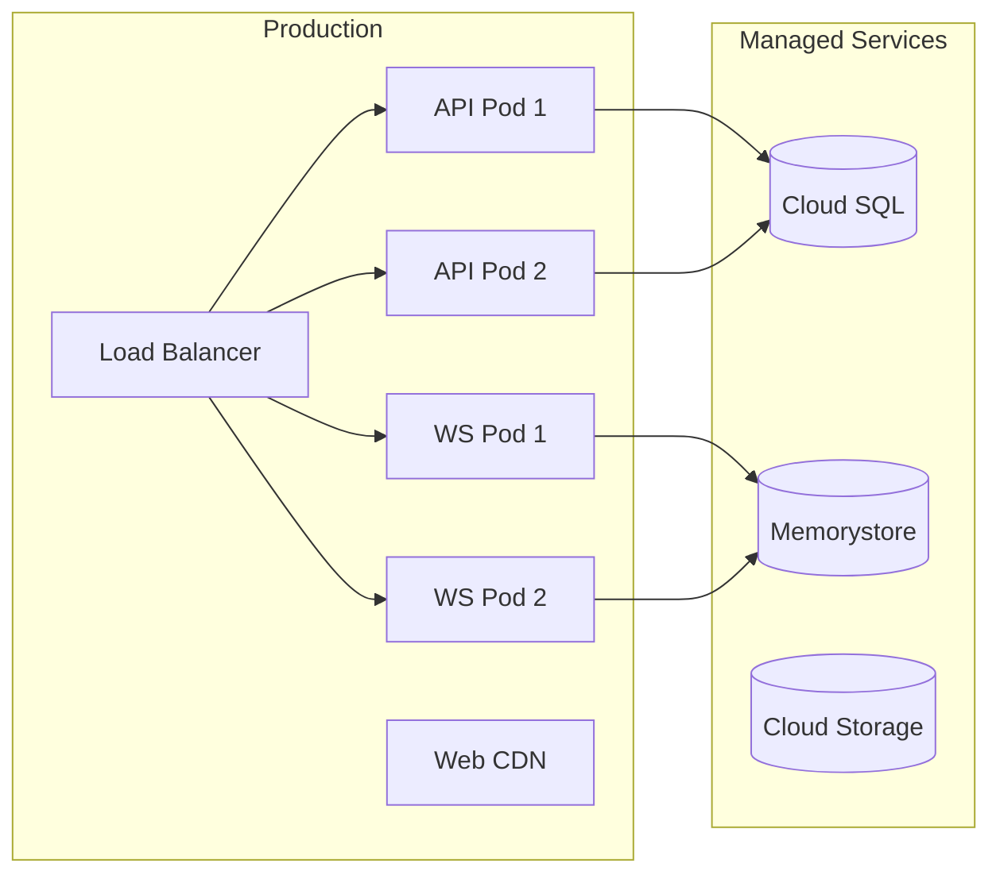

# システム構成図（詳細）

## 全体構成

## 認証フロー

> **Note**: トークンは HttpOnly Cookie で管理されるため、JavaScript からアクセス不可。XSS 耐性を確保。

## リアルタイム更新フロー

## デプロイ構成

## 関連ドキュメント

- [システム全体像](../overview.md)
- [データベース設計](../database.md)
