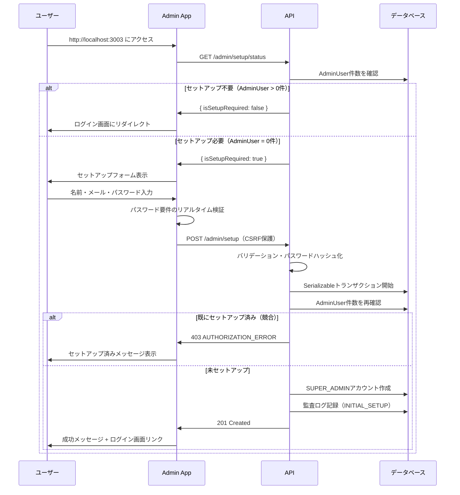
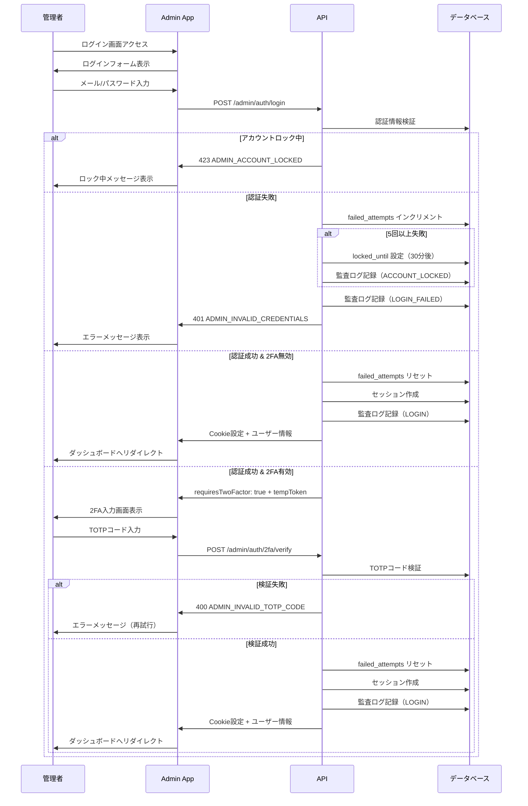
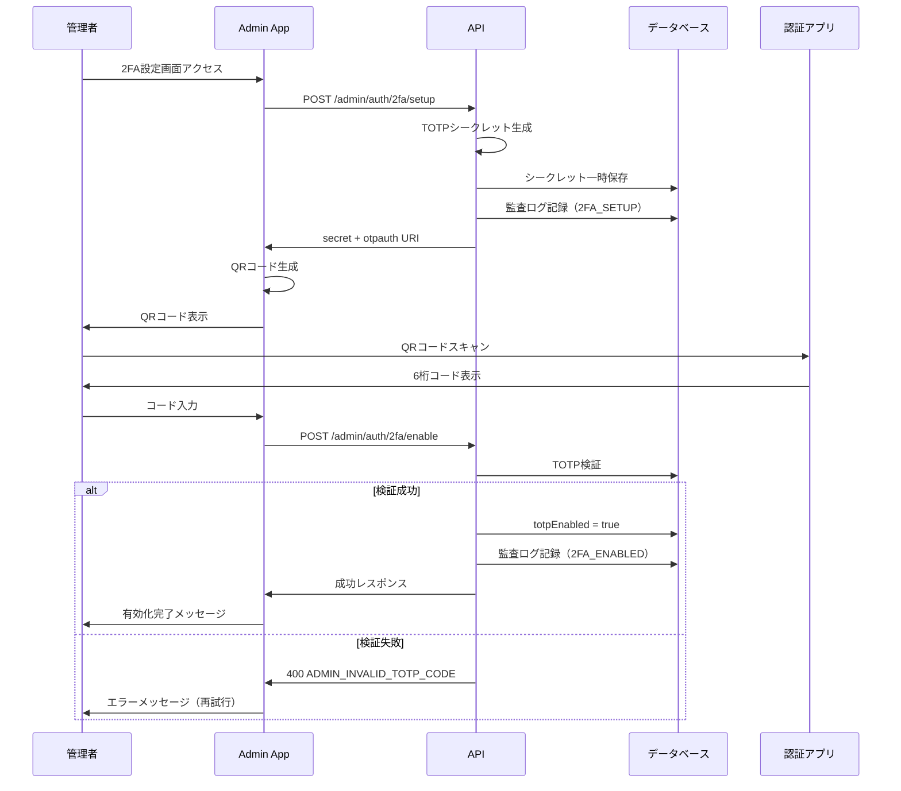
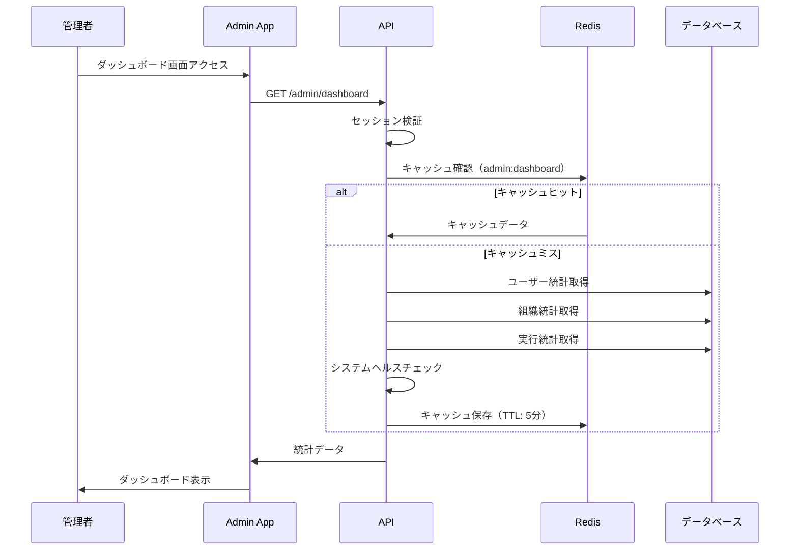
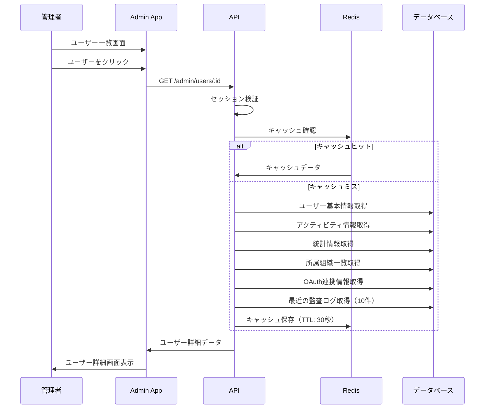
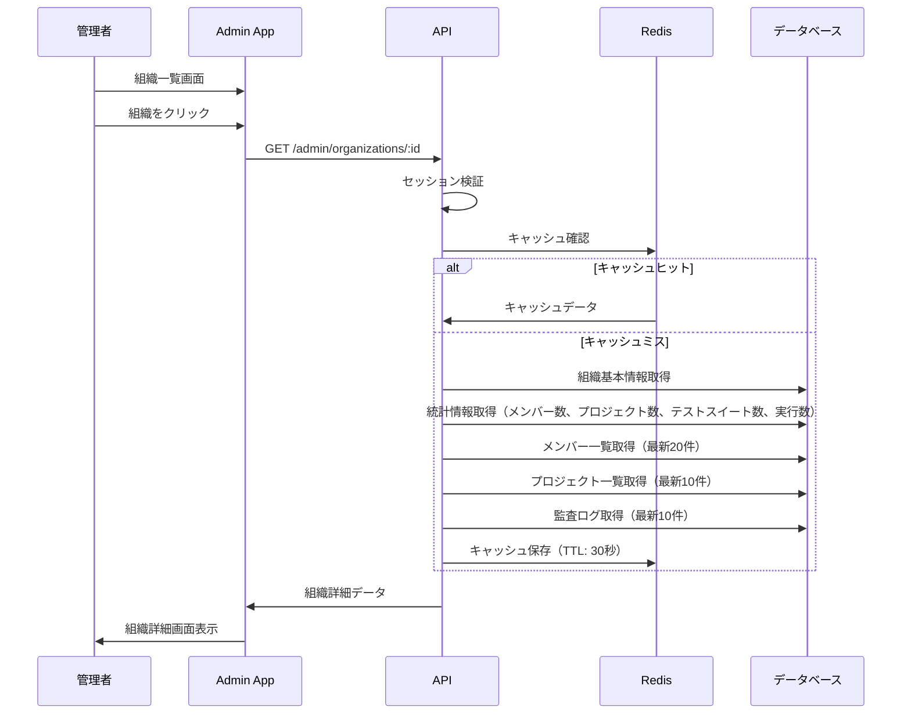
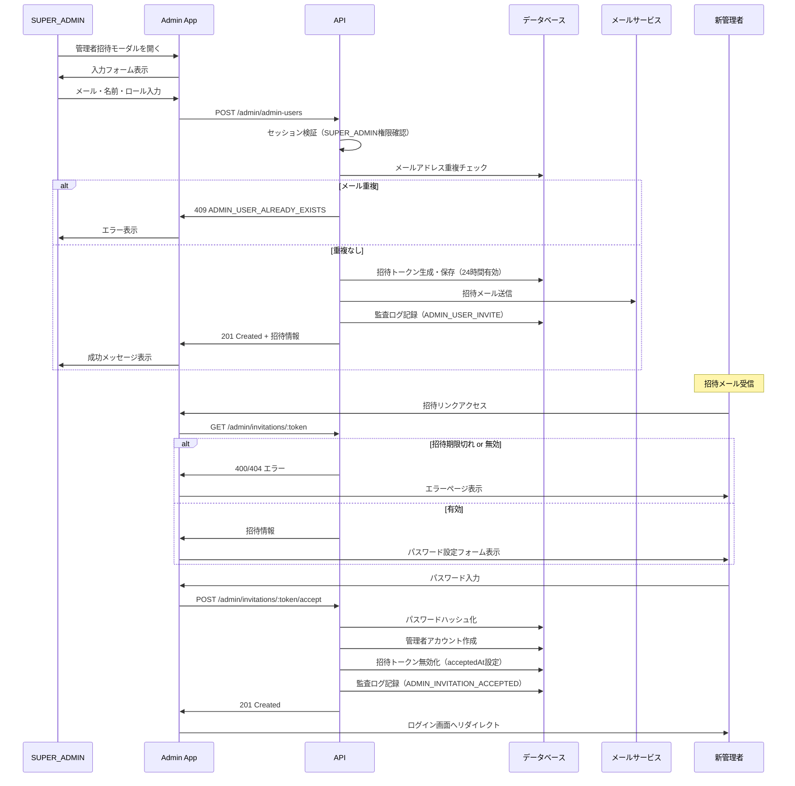
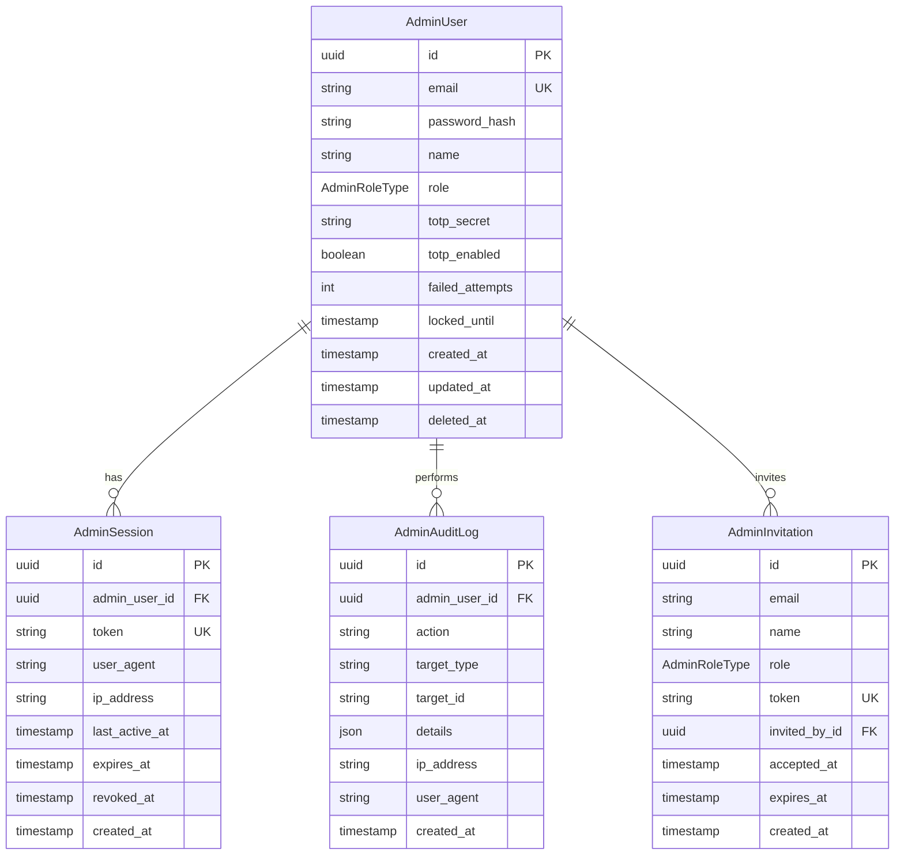

# システム管理者機能

## 概要

システム管理者（運営者）向けの管理機能を提供する。ユーザー認証とは完全に独立したセッション管理を持ち、SaaS全体のユーザー管理、システム監視、運用を行うための機能群。

### 機能範囲

- **管理者認証**: メール/パスワード認証、2要素認証（TOTP）
- **システム監視**: ダッシュボード、システムヘルス確認
- **ユーザー管理**: ユーザー一覧、詳細閲覧（停止/削除は Phase 2）
- **監査ログ**: 管理者操作の記録

### 実装状況

| カテゴリ | 状態 | 備考 |
|---------|------|------|
| 管理者認証 | ✅ 実装済 | APIのみ |
| 2FA（TOTP） | ✅ 実装済 | APIのみ |
| ダッシュボード | ✅ 実装済 | APIのみ |
| ユーザー管理（一覧・詳細） | ✅ 実装済 | APIのみ |
| 監査ログ | ✅ 実装済 | APIのみ |
| 管理画面UI | 🔲 未実装 | Phase 2 |
| ユーザー停止/有効化/削除 | 🔲 未実装 | Phase 2 |
| 組織管理（一覧） | ✅ 実装済 | APIのみ |
| 組織管理（詳細） | ✅ 実装済 | APIのみ |
| システム管理者アカウント管理 | ✅ 実装済 | API + UI |
| システム管理者招待 | ✅ 実装済 | API + UI |
| 初回セットアップウィザード | ✅ 実装済 | API + UI |

## 機能一覧

### 初回セットアップ

| ID | 機能名 | 説明 | 状態 |
|----|--------|------|------|
| ADM-SETUP-001 | セットアップ状態確認 | AdminUserが0件かどうかを判定し、セットアップが必要か返却 | 実装済 |
| ADM-SETUP-002 | 初回セットアップ実行 | 名前・メール・パスワードを入力してSUPER_ADMINアカウントを作成 | 実装済 |

### 管理者認証

| ID | 機能名 | 説明 | 状態 |
|----|--------|------|------|
| ADM-AUTH-001 | 管理者ログイン | メール/パスワードでログイン | 実装済 |
| ADM-AUTH-002 | 管理者ログアウト | セッションを終了 | 実装済 |
| ADM-AUTH-003 | セッション延長 | セッション有効期限を延長 | 実装済 |
| ADM-AUTH-004 | 現在の管理者情報取得 | 認証中の管理者情報を取得 | 実装済 |

### 2要素認証（TOTP）

| ID | 機能名 | 説明 | 状態 |
|----|--------|------|------|
| ADM-2FA-001 | 2FAセットアップ | TOTP認証のセットアップを開始 | 実装済 |
| ADM-2FA-002 | 2FA有効化 | 確認コードを送信して2FAを有効化 | 実装済 |
| ADM-2FA-003 | 2FA検証 | ログイン時の2FA検証 | 実装済 |
| ADM-2FA-004 | 2FA無効化 | 2FAを無効化 | 実装済 |

### ダッシュボード

| ID | 機能名 | 説明 | 状態 |
|----|--------|------|------|
| ADM-MON-001 | システム統計表示 | ユーザー・組織・実行統計を表示 | 実装済 |

### ユーザー管理

| ID | 機能名 | 説明 | 状態 |
|----|--------|------|------|
| ADM-USR-001 | ユーザー一覧取得 | 検索・フィルタ・ソート対応 | 実装済 |
| ADM-USR-002 | ユーザー詳細取得 | 詳細情報・統計・所属組織を表示 | 実装済 |
| ADM-USR-003 | ユーザー停止 | ユーザーアカウントを一時停止 | 未実装 |
| ADM-USR-004 | ユーザー有効化 | 停止したアカウントを再有効化 | 未実装 |
| ADM-USR-005 | ユーザー削除 | ユーザーアカウントを削除 | 未実装 |

### 組織管理

| ID | 機能名 | 説明 | 状態 |
|----|--------|------|------|
| ADM-ORG-001 | 組織一覧取得 | 検索・フィルタ・ソート対応 | 実装済 |
| ADM-ORG-002 | 組織詳細取得 | 詳細情報・統計・メンバー・プロジェクト・監査ログを表示 | 実装済 |
| ADM-ORG-003 | 組織停止 | 組織の一時停止 | 未実装 |
| ADM-ORG-004 | 組織有効化 | 停止組織の復帰 | 未実装 |
| ADM-ORG-005 | 組織削除 | 組織の完全削除 | 未実装 |

### 監査ログ

| ID | 機能名 | 説明 | 状態 |
|----|--------|------|------|
| ADM-AUD-001 | 全体監査ログ閲覧 | 全組織の監査ログを横断検索・閲覧 | 実装済 |
| ADM-AUD-002 | 監査ログ記録 | 管理者の全操作を自動記録 | 実装済 |

### システム管理者アカウント管理

| ID | 機能名 | 説明 | 状態 |
|----|--------|------|------|
| ADM-SEC-001-1 | 管理者一覧取得 | 検索・フィルタ・ソート対応 | 実装済 |
| ADM-SEC-001-2 | 管理者詳細取得 | セッション・監査ログ情報付き | 実装済 |
| ADM-SEC-001-3 | 管理者招待 | メール送信、24時間有効 | 実装済 |
| ADM-SEC-001-4 | 管理者更新 | ロール変更制約あり | 実装済 |
| ADM-SEC-001-5 | 管理者削除 | 論理削除、最後のSUPER_ADMIN保護 | 実装済 |
| ADM-SEC-001-6 | ロック解除・2FAリセット | セキュリティ管理 | 実装済 |

## 業務フロー

### 初回セットアップフロー

### 管理者ログインフロー（2FA含む）

### 2FAセットアップフロー

### ダッシュボード表示フロー

### ユーザー詳細閲覧フロー

### 組織詳細閲覧フロー

### 管理者招待フロー

## データモデル

### テーブル概要

| テーブル | 説明 |
|---------|------|
| AdminUser | 管理者ユーザー情報 |
| AdminSession | 管理者セッション情報 |
| AdminAuditLog | 管理者操作の監査ログ |
| AdminInvitation | 管理者招待情報 |

### 監査ログアクション一覧

| アクション | 説明 |
|-----------|------|
| INITIAL_SETUP | 初回セットアップ（SUPER_ADMIN作成） |
| LOGIN | ログイン成功 |
| LOGOUT | ログアウト |
| LOGIN_FAILED | ログイン失敗 |
| 2FA_SETUP | 2FAセットアップ開始 |
| 2FA_ENABLED | 2FA有効化 |
| 2FA_DISABLED | 2FA無効化 |
| SESSION_REFRESH | セッション延長 |
| ACCOUNT_LOCKED | アカウントロック |
| ADMIN_USER_LIST | システム管理者一覧閲覧 |
| ADMIN_USER_VIEW | システム管理者詳細閲覧 |
| ADMIN_USER_INVITE | システム管理者招待 |
| ADMIN_USER_UPDATE | システム管理者更新 |
| ADMIN_USER_DELETE | システム管理者削除 |
| ADMIN_USER_UNLOCK | アカウントロック解除 |
| ADMIN_USER_RESET_2FA | 2FAリセット |
| ADMIN_INVITATION_ACCEPTED | 招待受諾 |

## ビジネスルール

### 認証ルール

#### パスワード要件

| 項目 | 要件 |
|------|------|
| 最小文字数 | 8文字 |
| 複雑性 | 大文字、小文字、数字、記号のうち3種類以上 |
| ハッシュ化 | bcrypt（コストファクター: 12） |

#### アカウントロック

| 項目 | 値 |
|------|-----|
| ロック閾値 | 連続5回のログイン失敗 |
| ロック時間 | 30分 |
| ロック解除後 | 失敗カウントがリセット |

#### セッション管理

| 項目 | 値 |
|------|-----|
| セッション有効期限 | 8時間 |
| 非アクティブタイムアウト | 30分 |
| トークン形式 | 32バイトの暗号的に安全なランダム値 |
| Cookie属性 | HttpOnly, Secure, SameSite=Strict, Path=/admin |

### 2FAルール

| 項目 | 値 |
|------|-----|
| プロトコル | RFC 6238（TOTP） |
| 発行者名 | Agentest Admin |
| 時間ステップ | 30秒 |
| コード桁数 | 6桁 |
| シークレット保存 | AES-256-GCM暗号化 |

### レート制限

| エンドポイント | 制限 |
|---------------|------|
| /admin/auth/login | 5回 / 15分（IP単位） |
| /admin/auth/2fa/verify | 5回 / 15分（IP単位） |
| その他 | 100回 / 15分 |

## 権限

### ロール定義

| ロール | 説明 |
|--------|------|
| SUPER_ADMIN | 最高権限管理者（全機能へのアクセス） |
| ADMIN | 一般管理者（ユーザー管理、設定変更） |
| VIEWER | 閲覧専用（参照のみ） |

### 権限マトリクス

| 機能 | SUPER_ADMIN | ADMIN | VIEWER |
|------|:-----------:|:-----:|:------:|
| ダッシュボード閲覧 | ✓ | ✓ | ✓ |
| ユーザー一覧閲覧 | ✓ | ✓ | ✓ |
| ユーザー詳細閲覧 | ✓ | ✓ | ✓ |
| ユーザー停止/再開 | ✓ | ✓ | - |
| ユーザー削除 | ✓ | - | - |
| 組織一覧閲覧 | ✓ | ✓ | ✓ |
| 組織設定変更 | ✓ | ✓ | - |
| システム設定変更 | ✓ | - | - |
| 管理者ユーザー管理 | ✓ | - | - |
| 監査ログ閲覧 | ✓ | ✓ | ✓ |

## 設定値

### 認証設定

| 項目 | 値 | 説明 |
|------|-----|------|
| ADMIN_SESSION_EXPIRY | 8h | セッション有効期限 |
| ADMIN_SESSION_INACTIVE_TIMEOUT | 30m | 非アクティブタイムアウト |
| ADMIN_MAX_FAILED_ATTEMPTS | 5 | ログイン失敗閾値 |
| ADMIN_LOCKOUT_DURATION | 30m | アカウントロック時間 |
| ADMIN_BCRYPT_ROUNDS | 12 | bcryptコストファクター |

### キャッシュ設定

| キャッシュキー | TTL | 説明 |
|---------------|-----|------|
| admin:dashboard | 5分 | ダッシュボード統計 |
| admin:users:${hash} | 60秒 | ユーザー一覧 |
| admin:user:detail:${id} | 30秒 | ユーザー詳細 |
| admin:organizations:${hash} | 60秒 | 組織一覧 |
| admin:organization:detail:${id} | 30秒 | 組織詳細 |
| admin:audit-logs:${hash} | 30秒 | 全体監査ログ一覧 |

## セキュリティ考慮事項

| 項目 | 対策 |
|------|------|
| パスワード | bcryptハッシュ化、複雑性要件 |
| ブルートフォース | レート制限、アカウントロック |
| セッションハイジャック | HttpOnly Cookie、Secure、SameSite=Strict |
| TOTPシークレット | AES-256-GCM暗号化保存 |
| 監査証跡 | 全認証イベントをログ記録 |
| タイミング攻撃 | ロック中もロック状態を示さない |
| CSRF保護 | Origin/Refererヘッダー検証（初回セットアップ） |
| 競合防止 | Serializableトランザクションで重複作成を防止 |

## 関連機能

### API仕様

- [初回セットアップ API](../../api/admin-setup.md) - 初回セットアップウィザード
- [管理者認証 API](../../api/admin-auth.md) - ログイン、2FA、セッション管理
- [管理者ダッシュボード API](../../api/admin-dashboard.md) - システム統計
- [管理者ユーザー管理 API](../../api/admin-users.md) - ユーザー一覧・詳細
- [管理者組織管理 API](../../api/admin-organizations.md) - 組織一覧・詳細
- [管理者監査ログ API](../../api/admin-audit-logs.md) - 全体監査ログ閲覧
- [システム管理者管理 API](../../api/admin-admin-users.md) - システム管理者の一覧・招待・更新・削除

### データベース設計

- [管理者認証テーブル設計](../database/admin-auth.md) - AdminUser, AdminSession, AdminAuditLog

### 要件定義

- [システム管理者機能要件](../../requirements/admin-system.md)
