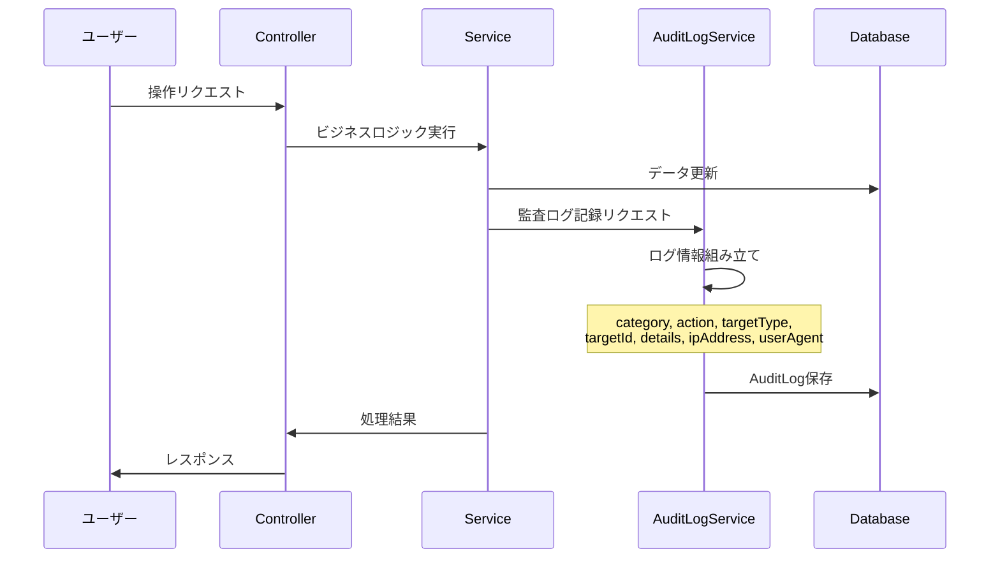
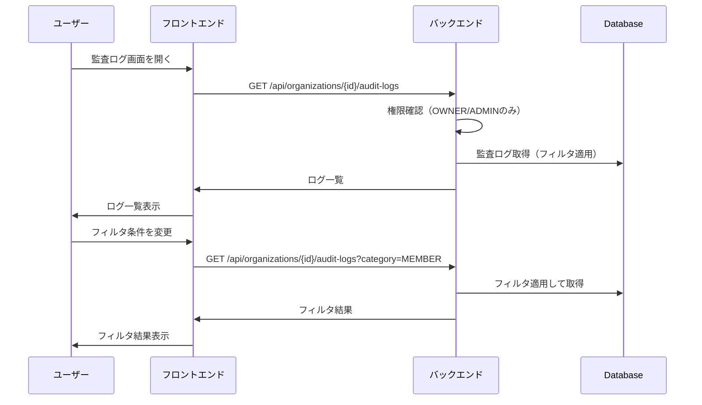
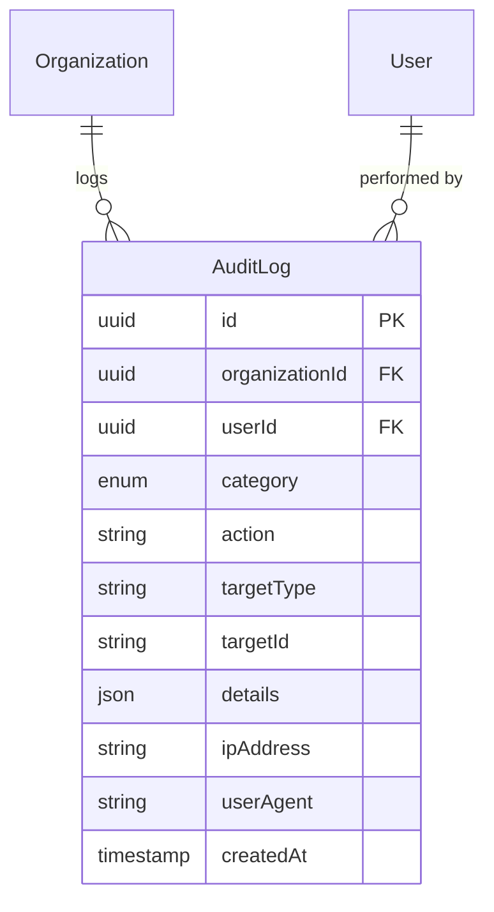

# 監査ログ機能

## 概要

組織内で行われた操作の履歴を記録・閲覧する機能。セキュリティ監査やトラブルシューティングに活用する。

## 機能一覧

| ID | 機能名 | 説明 | 状態 |
|----|--------|------|------|
| AUD-001 | ログ記録 | 操作を自動的に記録 | 実装済 |
| AUD-002 | ログ一覧 | 監査ログを一覧表示 | 実装済 |
| AUD-003 | カテゴリフィルタ | カテゴリで絞り込み | 実装済 |
| AUD-004 | ユーザーフィルタ | 操作者で絞り込み | 実装済 |
| AUD-005 | 日付フィルタ | 期間で絞り込み | 実装済 |

## 画面仕様

### 監査ログ一覧画面

- **URL**: `/organizations/{slug}/audit-logs`
- **表示要素**
  - フィルターセクション
    - カテゴリ選択
    - 操作者選択
    - 日付範囲選択
  - ログ一覧
    - 日時
    - 操作者（アバター、名前）
    - アクション（アイコン付き）
    - 詳細情報
    - IPアドレス
  - ページネーション
- **権限**
  - OWNER, ADMIN: 閲覧可能
  - MEMBER: 閲覧不可

### ログ詳細表示

- **表示要素**
  - 操作日時
  - 操作者情報
  - アクション名
  - 対象リソース
  - 変更内容（JSON形式）
  - IPアドレス
  - ユーザーエージェント

## 記録されるアクション

### カテゴリ一覧

| カテゴリ | 説明 | アイコン |
|----------|------|----------|
| AUTH | 認証関連 | Shield |
| USER | ユーザー操作 | User |
| ORGANIZATION | 組織操作 | Building2 |
| MEMBER | メンバー操作 | Users |
| PROJECT | プロジェクト操作 | FolderKanban |
| API_TOKEN | APIトークン操作 | Key |
| BILLING | 請求関連 | CreditCard |

### アクション一覧

#### 組織操作（ORGANIZATION）

| アクション | 説明 | 記録内容 |
|-----------|------|----------|
| organization.created | 組織作成 | name, slug |
| organization.updated | 組織設定変更 | 変更項目と値 |
| organization.deleted | 組織削除 | name, slug |
| organization.restored | 組織復元 | name, slug |
| organization.ownership_transferred | オーナー移譲 | previousOwnerId, newOwnerId |

#### メンバー操作（MEMBER）

| アクション | 説明 | 記録内容 |
|-----------|------|----------|
| member.invited | メンバー招待 | email, role |
| member.invitation_accepted | 招待承諾 | email, role |
| member.invitation_declined | 招待辞退 | email |
| member.invitation_cancelled | 招待取消 | email, role |
| member.role_updated | ロール変更 | targetUserId, previousRole, newRole |
| member.removed | メンバー削除 | targetUserId, email, role |

#### 認証操作（AUTH）

| アクション | 説明 | 記録内容 |
|-----------|------|----------|
| auth.login | ログイン | provider |
| auth.logout | ログアウト | - |
| auth.session_revoked | セッション無効化 | sessionId |

#### ユーザー操作（USER）

| アクション | 説明 | 記録内容 |
|-----------|------|----------|
| user.profile_updated | プロフィール更新 | 変更項目 |
| user.account_linked | OAuth連携追加 | provider |
| user.account_unlinked | OAuth連携解除 | provider |
| user.deleted | アカウント削除 | - |

## 業務フロー

### ログ記録フロー



### ログ閲覧フロー



## データモデル



## ビジネスルール

### 記録ルール

- 全ての重要な操作を自動記録
- ログは改ざん不可（追記のみ）
- 削除は物理削除ではなく保持期間経過後にアーカイブ
- 操作者のIPアドレスとユーザーエージェントを記録

### 閲覧ルール

- OWNER, ADMINのみ閲覧可能
- 組織に紐づくログのみ閲覧可能
- ページネーションで取得（デフォルト50件）
- 最大100件まで1リクエストで取得可能

### 保持期間

- 標準プラン: 90日間
- エンタープライズプラン: 1年間
- 保持期間経過後はアーカイブストレージへ移動

## 権限

| 操作 | OWNER | ADMIN | MEMBER |
|------|-------|-------|--------|
| 監査ログ閲覧 | ✓ | ✓ | - |
| ログエクスポート | ✓ | - | - |

## 設定値

| 項目 | 値 | 説明 |
|------|-----|------|
| AUDIT_LOG_DEFAULT_LIMIT | 50 | デフォルト取得件数 |
| AUDIT_LOG_MAX_LIMIT | 100 | 最大取得件数 |
| RETENTION_DAYS_STANDARD | 90 | 標準保持期間（日） |
| RETENTION_DAYS_ENTERPRISE | 365 | エンタープライズ保持期間（日） |

## ログ詳細フォーマット

### 組織作成時

```json
{
  "name": "Example Organization",
  "slug": "example-org"
}
```

### ロール変更時

```json
{
  "targetUserId": "uuid",
  "targetEmail": "user@example.com",
  "previousRole": "MEMBER",
  "newRole": "ADMIN"
}
```

### オーナー移譲時

```json
{
  "previousOwnerId": "uuid",
  "previousOwnerEmail": "old-owner@example.com",
  "newOwnerId": "uuid",
  "newOwnerEmail": "new-owner@example.com"
}
```

## 関連機能

- [組織管理](./organization.md) - 組織操作の記録
- [メンバー管理](./member-management.md) - メンバー操作の記録
- [認証](./authentication.md) - 認証操作の記録
