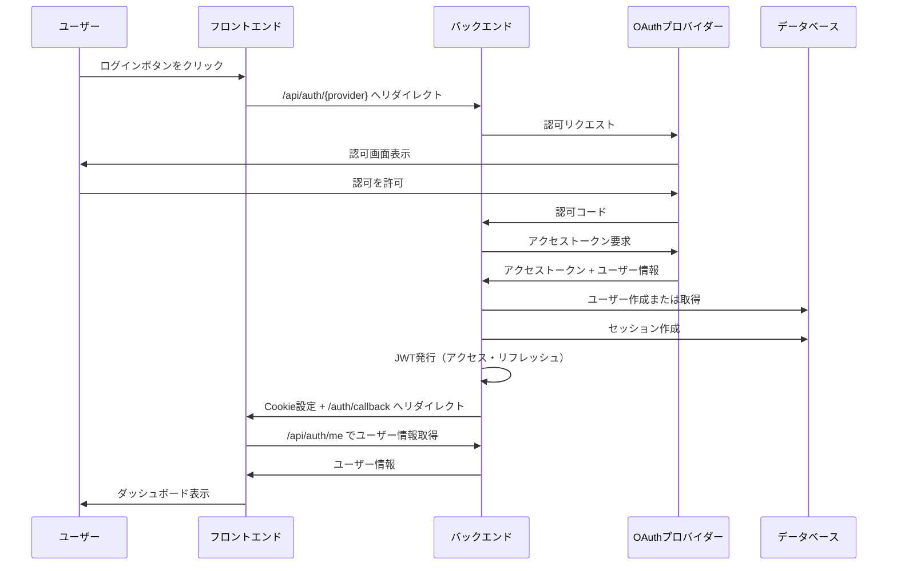
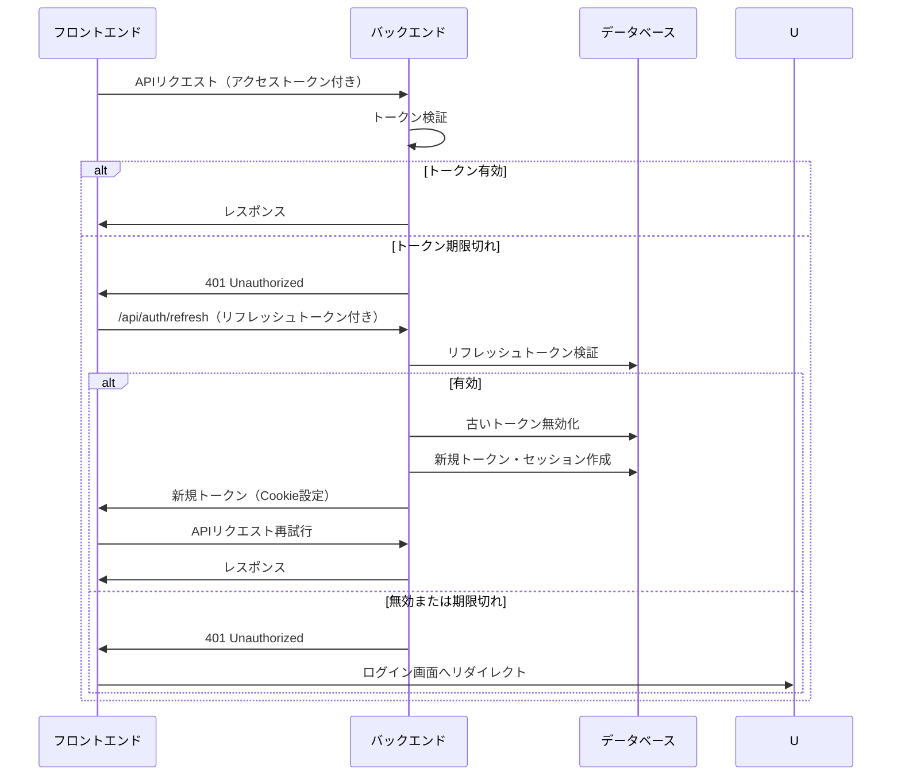
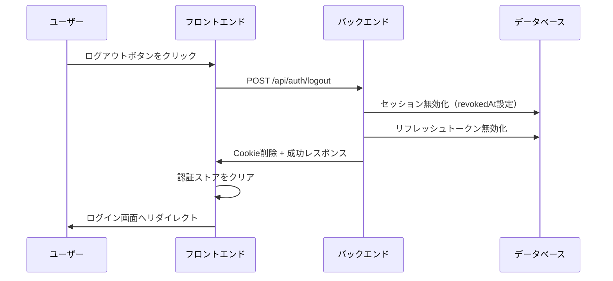
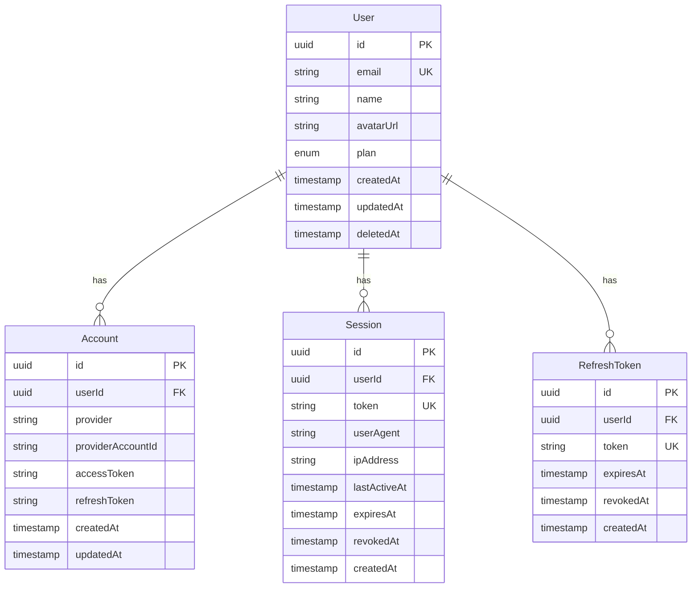
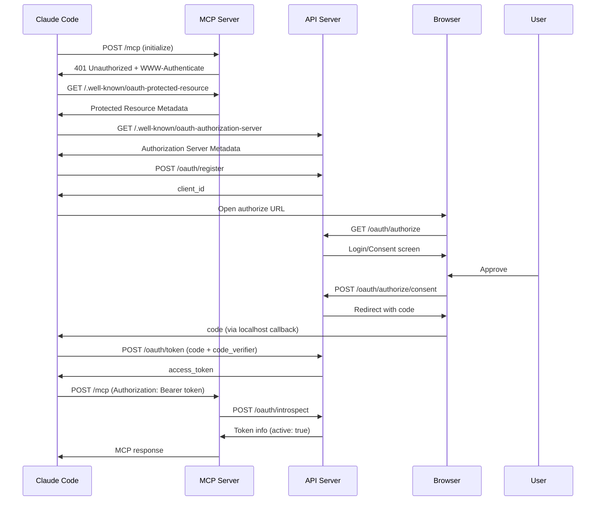
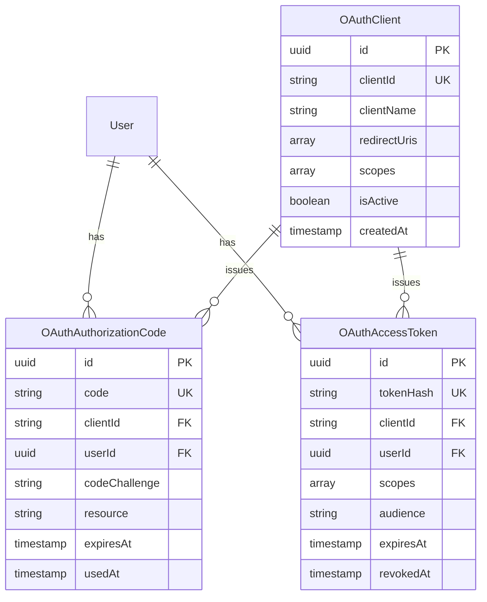
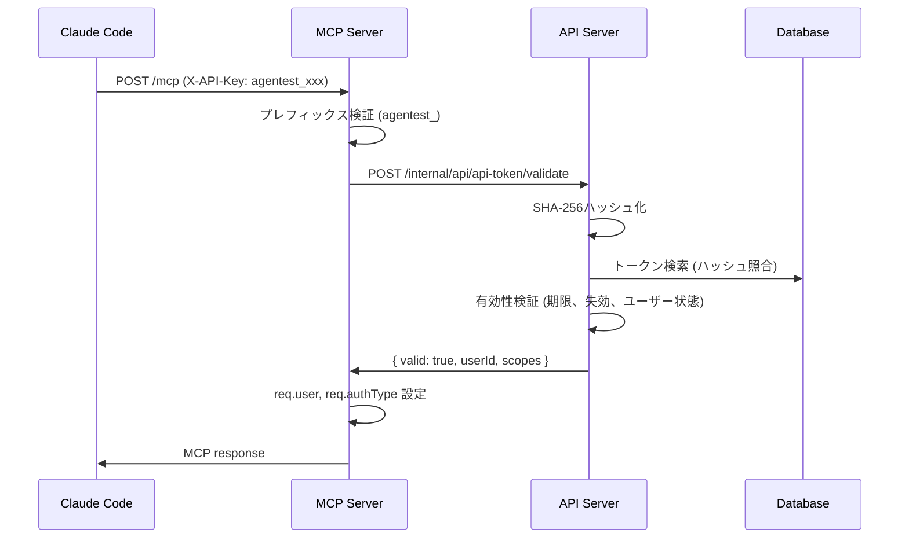
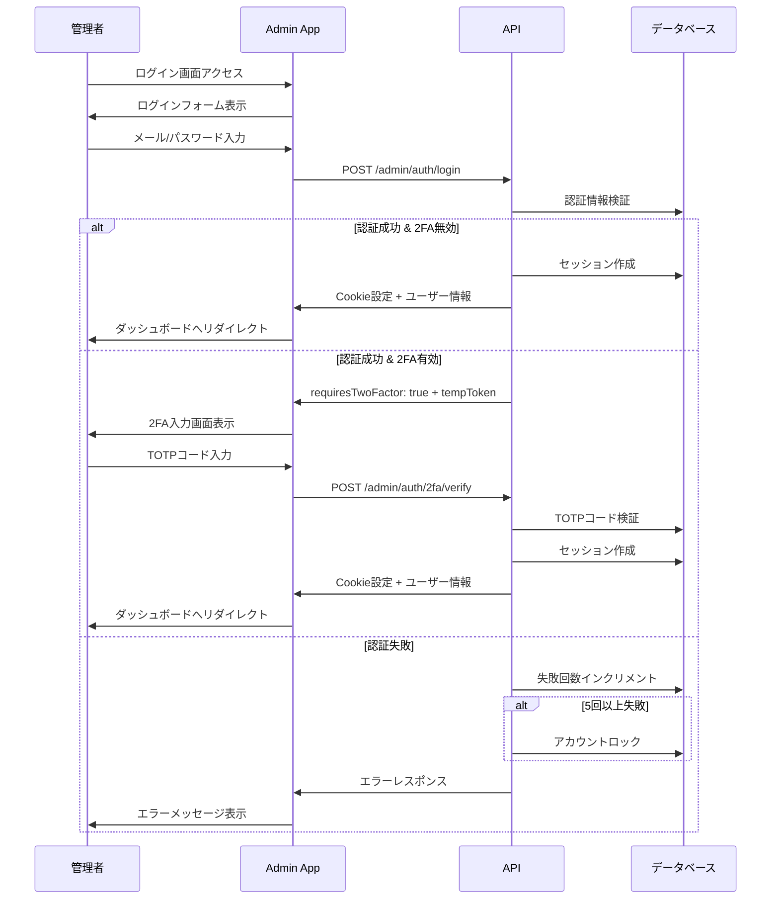
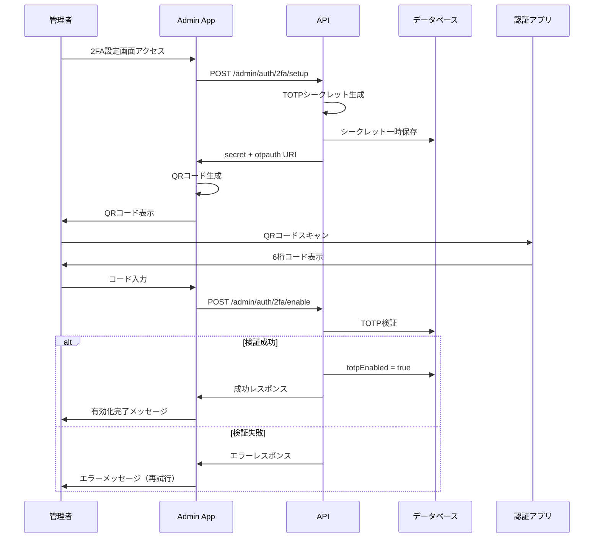
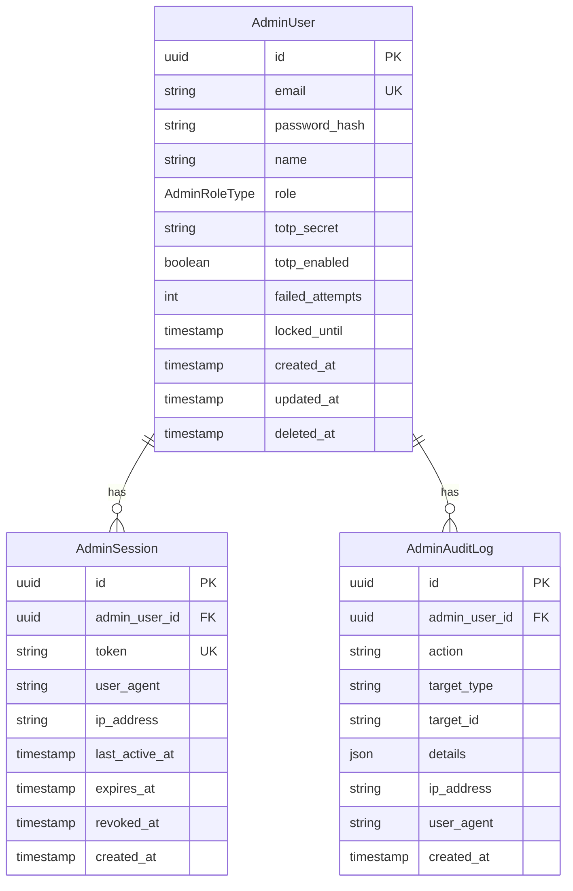

# 認証機能

## 概要

ユーザーがシステムにログインするための機能。OAuth 2.0（GitHub/Google）による認証と、JWTベースのセッション管理を提供する。

## 機能一覧

| ID | 機能名 | 説明 | 状態 |
|----|--------|------|------|
| AUTH-001 | OAuthログイン | GitHub/Googleアカウントでログイン | 実装済 |
| AUTH-002 | ログアウト | セッションを終了 | 実装済 |
| AUTH-003 | トークン更新 | アクセストークンを自動更新 | 実装済 |
| AUTH-004 | セッション一覧 | 有効なセッションを確認 | 実装済 |
| AUTH-005 | セッション無効化 | 特定のセッションを終了 | 実装済 |
| AUTH-006 | 全セッション無効化 | 現在以外の全セッションを終了 | 実装済 |
| AUTH-007 | MCP OAuth 2.1認証 | MCPクライアント向けOAuth 2.1認証フロー | 実装済 |
| AUTH-008 | 動的クライアント登録 | MCPクライアントの動的登録（RFC 7591） | 実装済 |
| AUTH-009 | トークンイントロスペクション | アクセストークンの検証 | 実装済 |
| AUTH-010 | APIキー認証 | X-API-Keyヘッダーによる認証（MCP向け） | 実装済 |
| AUTH-011 | APIキー管理 | APIキーの作成・一覧・失効 | 実装済 |
| AUTH-012 | ハイブリッド認証 | OAuth/APIキー/Cookieの優先順位付き認証 | 実装済 |

## 画面仕様

### ログイン画面

- **URL**: `/login`
- **表示要素**
  - GitHubログインボタン
  - Googleログインボタン
  - 利用規約・プライバシーポリシーへのリンク
- **操作**
  - ログインボタンクリック → OAuthプロバイダーへリダイレクト
  - 認証成功 → ダッシュボードへリダイレクト
  - 認証失敗 → エラーメッセージ表示
- **エラー表示**
  - OAuth失敗時: 「認証に失敗しました。再度お試しください。」

### OAuthコールバック画面

- **URL**: `/auth/callback`
- **表示要素**
  - ローディング表示
- **処理**
  - Cookieからユーザー情報を取得
  - 成功 → ダッシュボードへリダイレクト
  - 失敗 → ログイン画面へリダイレクト（エラーパラメータ付き）

### セッション管理画面

- **URL**: `/settings` （セキュリティタブ）
- **表示要素**
  - セッション一覧
    - デバイス情報（ブラウザ、OS）
    - IPアドレス
    - 最終アクセス日時
    - 現在のセッションにはバッジ表示
  - 「他のセッションをすべて終了」ボタン
- **操作**
  - 各セッションの「終了」ボタン → 確認ダイアログ → セッション無効化
  - 現在のセッションは終了ボタン非表示
  - 一括終了ボタン → 確認ダイアログ → 他セッション全無効化

## 業務フロー

### OAuthログインフロー



### トークン更新フロー



### ログアウトフロー



## データモデル



## ビジネスルール

### トークン管理

- アクセストークンの有効期限は15分
- リフレッシュトークンの有効期限は7日
- トークン更新時、古いリフレッシュトークンは無効化される
- 無効化されたトークンは再利用不可

### セッション管理

- 複数デバイスからの同時ログインを許可
- セッションの有効期限は7日
- 認証済みリクエストのたびに最終アクセス時刻を更新
- セッション無効化時、関連するリフレッシュトークンも無効化

### OAuth連携

- 対応プロバイダー: GitHub、Google
- 1ユーザーに複数プロバイダーを連携可能
- 同一メールアドレスの場合、既存ユーザーに連携追加
- 最低1つのOAuth連携は必須（全解除不可）

### エラーハンドリング

| エラー | 対応 |
|--------|------|
| OAuth認証失敗 | ログイン画面へリダイレクト、エラー表示 |
| トークン期限切れ | リフレッシュ試行、失敗時はログイン画面へ |
| セッション無効 | ログイン画面へリダイレクト |
| 不正なトークン | 401エラー、ログイン画面へ |

## 設定値

| 項目 | 値 | 説明 |
|------|-----|------|
| JWT_ACCESS_EXPIRES_IN | 15m | アクセストークン有効期限 |
| JWT_REFRESH_EXPIRES_IN | 7d | リフレッシュトークン有効期限 |
| SESSION_EXPIRY | 7d | セッション有効期限 |

## セキュリティ考慮事項

- **Cookie設定**
  - HttpOnly: XSS対策
  - Secure: HTTPS必須（本番環境）
  - SameSite=Strict: CSRF対策
- **トークン保存**
  - アクセストークン: HttpOnly Cookie
  - リフレッシュトークン: HttpOnly Cookie
  - クライアント側のJavaScriptからはアクセス不可
- **トークン署名**
  - アクセストークンとリフレッシュトークンで異なる秘密鍵を使用

## MCP OAuth 2.1 認証

MCPクライアント（Claude Code等）向けのOAuth 2.1認証フロー。

### 概要

- **APIサーバー**: Authorization Server（OAuth 2.1準拠）
- **MCPサーバー**: Resource Server（RFC 9728準拠）
- **クライアント登録**: Dynamic Client Registration（RFC 7591準拠）
- **PKCE**: S256のみサポート（plain禁止）
- **リソースインジケーター**: RFC 8707準拠

### MCP OAuth 2.1 認証フロー



### エンドポイント

| エンドポイント | メソッド | 説明 |
|---------------|---------|------|
| `/.well-known/oauth-authorization-server` | GET | Authorization Server Metadata |
| `/oauth/register` | POST | 動的クライアント登録 |
| `/oauth/authorize` | GET | 認可エンドポイント |
| `/oauth/authorize/consent` | POST | 同意承認 |
| `/oauth/token` | POST | トークン発行 |
| `/oauth/introspect` | POST | トークン検証 |
| `/oauth/revoke` | POST | トークン失効 |

### トークン仕様（MCP OAuth 2.1）

| 種類 | 有効期限 | 保存方法 |
|-----|---------|---------|
| アクセストークン | 1時間 | SHA256ハッシュ化してDB保存 |
| 認可コード | 10分 | DB保存（使い捨て） |

### セキュリティ要件

- PKCE必須（S256のみ）
- リソースインジケーター（RFC 8707）でAudience検証
- redirect_uriはlocalhost/127.0.0.1のみ許可
- HTTPS必須（本番環境）

### データモデル（MCP OAuth 2.1）



## APIキー認証

OAuth 2.1 に対応していない Coding Agent（Claude Code 等）向けの API キー認証機能。

### 概要

- **対象**: MCP サーバーへのアクセス
- **ヘッダー**: `X-API-Key` ヘッダーを使用
- **権限**: フルアクセス（ユーザーと同等の権限）
- **フォーマット**: `agentest_<32バイトのBase64URL>`

### 認証優先順位（ハイブリッド認証）

MCP サーバーでは以下の優先順位で認証を行う：

1. **OAuth Bearer Token** - `Authorization: Bearer <token>` があれば OAuth 2.1 認証
2. **API キー** - `X-API-Key: agentest_...` があれば API キー認証
3. **Cookie JWT** - 上記がなければ Cookie 認証（フォールバック）

### APIキー管理画面

- **URL**: `/settings`（API キータブ）
- **表示要素**
  - API キー一覧（名前、プレフィックス、作成日、最終使用日、有効期限）
  - 「新規作成」ボタン
  - 各キーの「失効」ボタン
- **操作**
  - 新規作成 → 名前と有効期限を入力 → 生成されたトークンを表示（1回のみ）
  - 失効 → 確認ダイアログ → 即時無効化

### APIキー認証フロー



### セキュリティ考慮事項

- **ハッシュ保存**: 生トークンは保存せず、SHA-256 ハッシュのみ保存
- **1回限りの表示**: 作成直後の 1 回のみ生トークンを返却
- **最終使用日時**: トークン使用時に自動更新（不正利用検知に活用）
- **即時失効**: 失効操作で即座に無効化

### 使用例（Claude Code 設定）

```json
{
  "mcpServers": {
    "agentest": {
      "url": "https://mcp.example.com/mcp",
      "headers": {
        "X-API-Key": "agentest_xxxxxxxxxxxxx",
        "X-MCP-Client-Id": "claude-code-user123",
        "X-MCP-Project-Id": "project-uuid"
      }
    }
  }
}
```

## 管理者認証機能

管理者（システム運営者）向けの認証機能。ユーザー認証とは完全に独立したセッション管理を提供。

### 機能一覧

| ID | 機能名 | 説明 | 状態 |
|----|--------|------|------|
| ADM-AUTH-001 | 管理者ログイン | メール/パスワードでログイン | 実装済 |
| ADM-AUTH-002 | 管理者ログアウト | セッションを終了 | 実装済 |
| ADM-AUTH-003 | 2FA セットアップ | TOTP 認証の設定 | 実装済 |
| ADM-AUTH-004 | 2FA 検証 | ログイン時の 2FA 検証 | 実装済 |
| ADM-AUTH-005 | セッション延長 | セッション有効期限を延長 | 実装済 |
| ADM-AUTH-006 | アカウントロック | 失敗回数超過でロック | 実装済 |

### 管理者ログインフロー



### 2FA セットアップフロー



### 管理者認証データモデル



### 管理者認証ビジネスルール

#### パスワード要件

- 最小文字数: 8文字
- 複雑性: 大文字、小文字、数字、記号のうち3種類以上
- bcrypt でハッシュ化（コストファクター: 12）

#### アカウントロック

- 連続5回のログイン失敗でアカウントをロック
- ロック時間: 30分
- ロック解除後、失敗カウントはリセット

#### セッション管理

- 有効期限: 8時間
- 非アクティブタイムアウト: 30分
- セッショントークン: 32バイトの暗号的に安全なランダム値

#### 2FA（TOTP）

- RFC 6238 準拠
- 発行者: "Agentest Admin"
- 時間ステップ: 30秒
- 桁数: 6桁

### 管理者認証セキュリティ考慮事項

| 項目 | 対策 |
|------|------|
| パスワード | bcrypt ハッシュ化、複雑性要件 |
| ブルートフォース | レート制限、アカウントロック |
| セッションハイジャック | HttpOnly Cookie、Secure、SameSite=Strict |
| TOTP シークレット | AES-256-GCM 暗号化保存 |
| 監査証跡 | 全認証イベントをログ記録 |

## 関連機能

- [ユーザー管理](./user-management.md) - OAuth連携の追加・解除
- [監査ログ](./audit-log.md) - ログイン履歴の記録
- [MCP連携](./mcp-integration.md) - MCP認証フローの詳細
- [OAuth 2.1 API](../../api/oauth.md) - APIリファレンス
- [OAuth 2.1データベース設計](../database/oauth.md) - テーブル定義
- [APIトークン データベース設計](../database/api-token.md) - APIトークンテーブル定義
- [認証 API](../../api/auth.md) - APIキー管理エンドポイント
- [管理者認証 API](../../api/admin-auth.md) - 管理者認証エンドポイント
- [管理者認証データベース設計](../database/admin-auth.md) - 管理者認証テーブル定義
