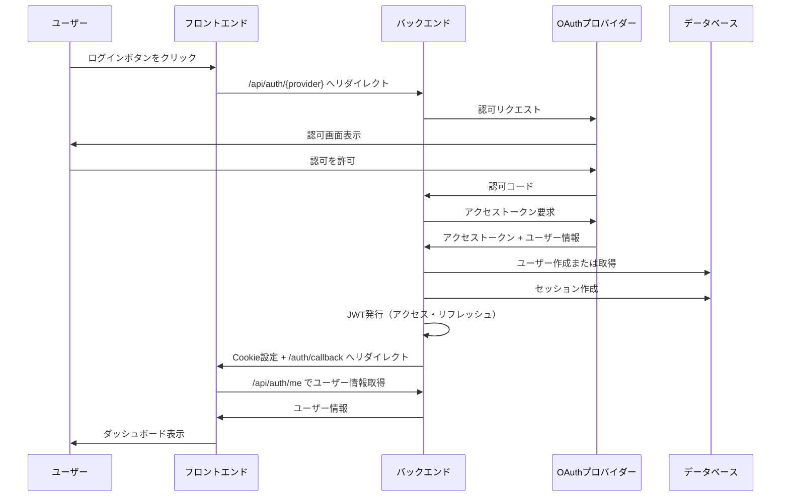
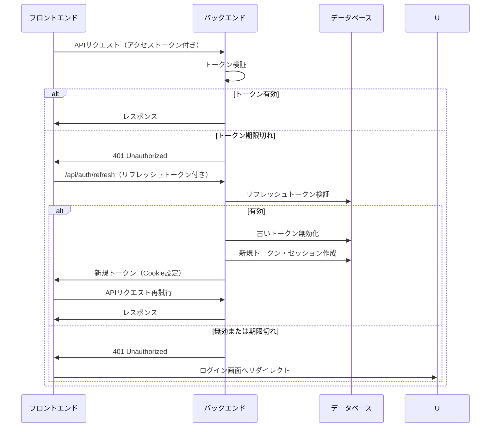
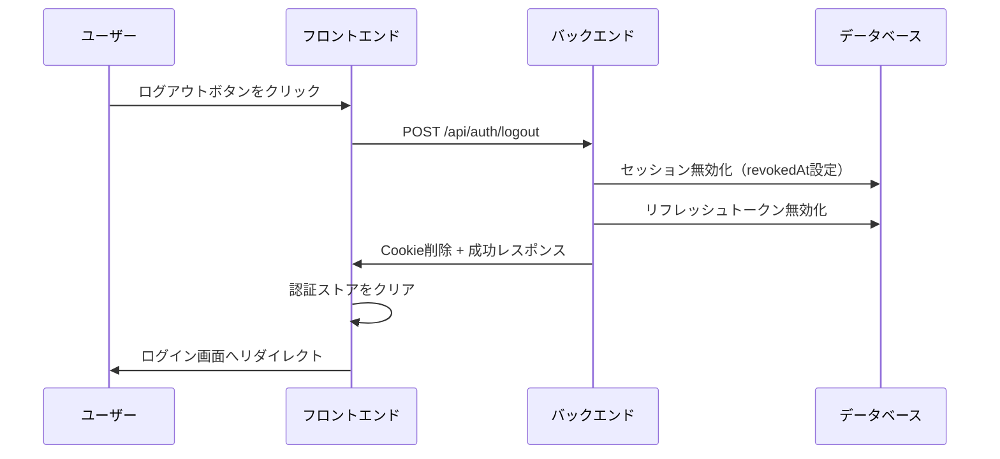
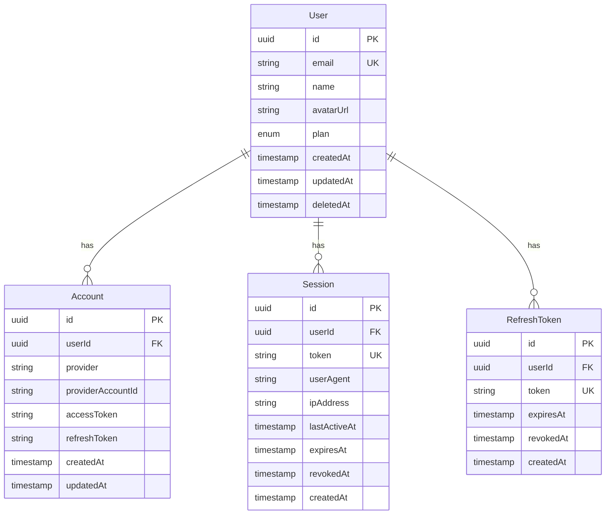

# 認証機能

## 概要

ユーザーがシステムにログインするための機能。OAuth 2.0（GitHub/Google）による認証と、JWTベースのセッション管理を提供する。

## 機能一覧

| ID | 機能名 | 説明 | 状態 |
|----|--------|------|------|
| AUTH-001 | OAuthログイン | GitHub/Googleアカウントでログイン | 実装済 |
| AUTH-002 | ログアウト | セッションを終了 | 実装済 |
| AUTH-003 | トークン更新 | アクセストークンを自動更新 | 実装済 |
| AUTH-004 | セッション一覧 | 有効なセッションを確認 | 実装済 |
| AUTH-005 | セッション無効化 | 特定のセッションを終了 | 実装済 |
| AUTH-006 | 全セッション無効化 | 現在以外の全セッションを終了 | 実装済 |

## 画面仕様

### ログイン画面

- **URL**: `/login`
- **表示要素**
  - GitHubログインボタン
  - Googleログインボタン
  - 利用規約・プライバシーポリシーへのリンク
- **操作**
  - ログインボタンクリック → OAuthプロバイダーへリダイレクト
  - 認証成功 → ダッシュボードへリダイレクト
  - 認証失敗 → エラーメッセージ表示
- **エラー表示**
  - OAuth失敗時: 「認証に失敗しました。再度お試しください。」

### OAuthコールバック画面

- **URL**: `/auth/callback`
- **表示要素**
  - ローディング表示
- **処理**
  - Cookieからユーザー情報を取得
  - 成功 → ダッシュボードへリダイレクト
  - 失敗 → ログイン画面へリダイレクト（エラーパラメータ付き）

### セッション管理画面

- **URL**: `/settings` （セキュリティタブ）
- **表示要素**
  - セッション一覧
    - デバイス情報（ブラウザ、OS）
    - IPアドレス
    - 最終アクセス日時
    - 現在のセッションにはバッジ表示
  - 「他のセッションをすべて終了」ボタン
- **操作**
  - 各セッションの「終了」ボタン → 確認ダイアログ → セッション無効化
  - 現在のセッションは終了ボタン非表示
  - 一括終了ボタン → 確認ダイアログ → 他セッション全無効化

## 業務フロー

### OAuthログインフロー

### トークン更新フロー

### ログアウトフロー

## データモデル

## ビジネスルール

### トークン管理

- アクセストークンの有効期限は15分
- リフレッシュトークンの有効期限は7日
- トークン更新時、古いリフレッシュトークンは無効化される
- 無効化されたトークンは再利用不可

### セッション管理

- 複数デバイスからの同時ログインを許可
- セッションの有効期限は7日
- 認証済みリクエストのたびに最終アクセス時刻を更新
- セッション無効化時、関連するリフレッシュトークンも無効化

### OAuth連携

- 対応プロバイダー: GitHub、Google
- 1ユーザーに複数プロバイダーを連携可能
- 同一メールアドレスの場合、既存ユーザーに連携追加
- 最低1つのOAuth連携は必須（全解除不可）

### エラーハンドリング

| エラー | 対応 |
|--------|------|
| OAuth認証失敗 | ログイン画面へリダイレクト、エラー表示 |
| トークン期限切れ | リフレッシュ試行、失敗時はログイン画面へ |
| セッション無効 | ログイン画面へリダイレクト |
| 不正なトークン | 401エラー、ログイン画面へ |

## 設定値

| 項目 | 値 | 説明 |
|------|-----|------|
| JWT_ACCESS_EXPIRES_IN | 15m | アクセストークン有効期限 |
| JWT_REFRESH_EXPIRES_IN | 7d | リフレッシュトークン有効期限 |
| SESSION_EXPIRY | 7d | セッション有効期限 |

## セキュリティ考慮事項

- **Cookie設定**
  - HttpOnly: XSS対策
  - Secure: HTTPS必須（本番環境）
  - SameSite=Strict: CSRF対策
- **トークン保存**
  - アクセストークン: HttpOnly Cookie
  - リフレッシュトークン: HttpOnly Cookie
  - クライアント側のJavaScriptからはアクセス不可
- **トークン署名**
  - アクセストークンとリフレッシュトークンで異なる秘密鍵を使用

## 関連機能

- [ユーザー管理](./user-management.md) - OAuth連携の追加・解除
- [監査ログ](./audit-log.md) - ログイン履歴の記録
