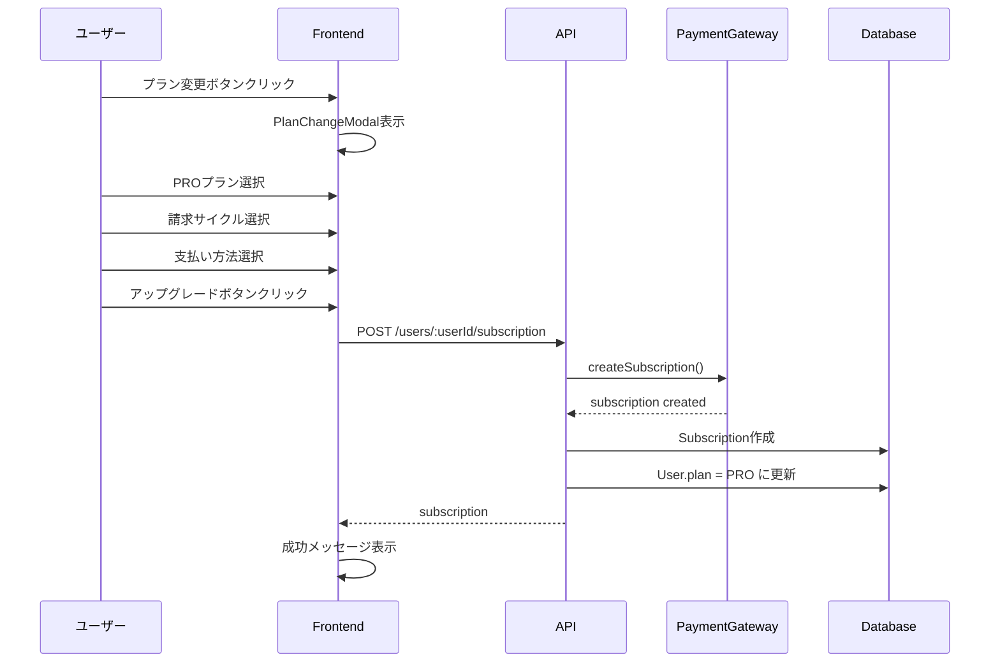
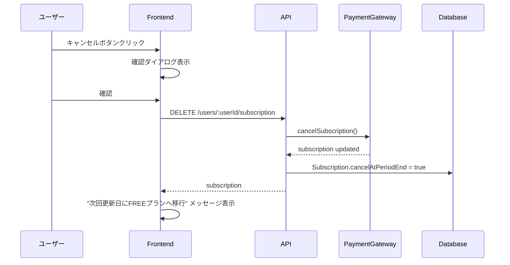
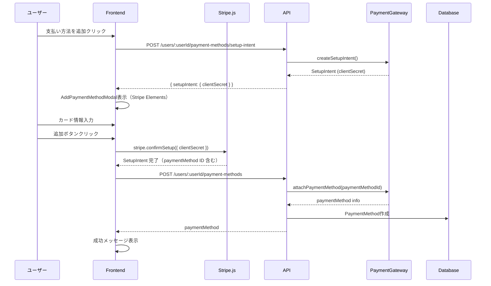
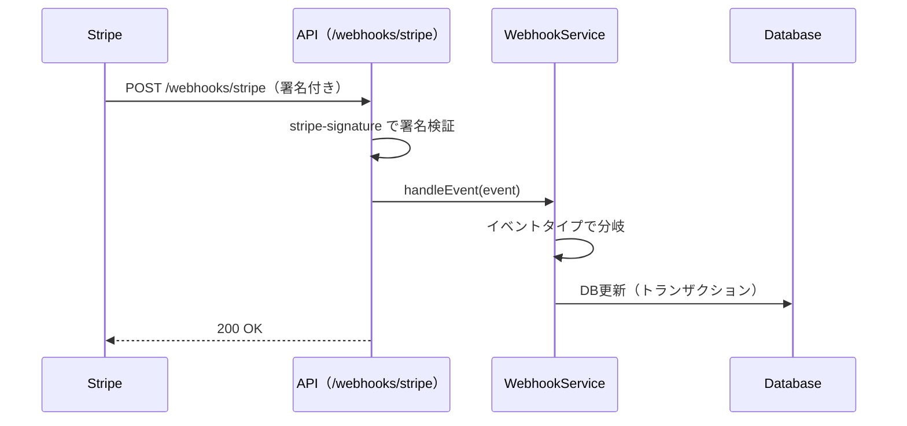
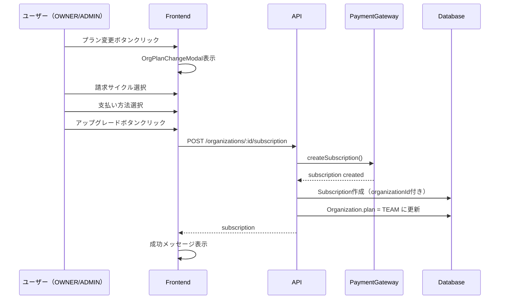
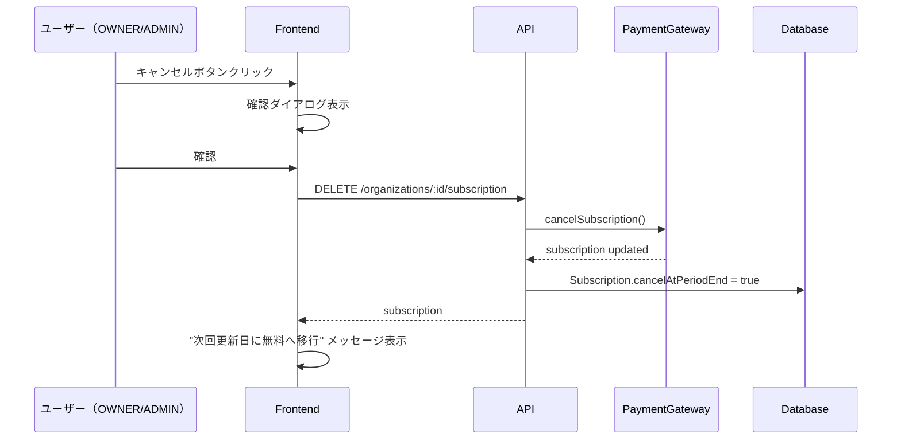
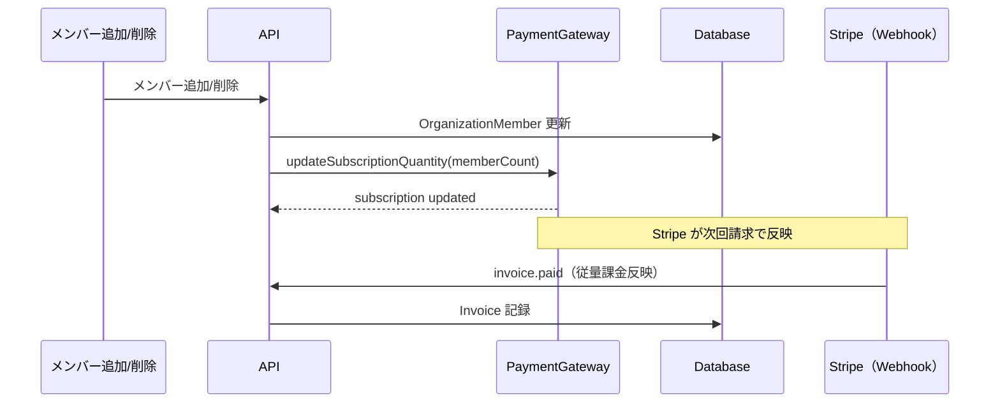

# 課金機能（個人プラン）

## 概要

個人ユーザー向けの FREE / PRO プラン選択機能を提供します。ユーザーは設定画面からプランのアップグレード・ダウングレード予約、支払い方法の管理を行えます。

本機能は USR-007（個人プラン選択）として実装されています。

## 機能一覧

| 機能 ID | 機能名 | 説明 |
|---------|--------|------|
| BIL-001 | プラン表示 | 現在のプラン、次回更新日、料金を表示 |
| BIL-002 | プランアップグレード | FREE → PRO への即時アップグレード |
| BIL-003 | プランダウングレード予約 | PRO → FREE へのダウングレードを次回更新時に予約 |
| BIL-004 | ダウングレード予約キャンセル | ダウングレード予約を取り消し |
| BIL-005 | 支払い方法一覧 | 登録済みカード一覧表示 |
| BIL-006 | 支払い方法追加 | 新規クレジットカード登録 |
| BIL-007 | 支払い方法削除 | 登録済みカード削除 |
| BIL-008 | デフォルト支払い方法設定 | 請求に使用するカードを指定 |
| BIL-009 | 請求履歴一覧 | 過去の請求履歴を表示 |
| BIL-010 | 請求書詳細 | 請求書の詳細情報を表示 |
| BIL-011 | 請求書PDFダウンロード | PDF形式で請求書をダウンロード |

## 画面仕様

### 設定画面 - 請求タブ（BillingSettings）

設定画面（`/settings`）の「Billing」タブに以下のコンポーネントを配置：

```
┌─────────────────────────────────────────────────────┐
│ Settings                                            │
├──────────┬──────────────────────────────────────────┤
│ Profile  │ ┌─────────────────────────────────────┐  │
│ Security │ │ Current Plan (CurrentPlanCard)      │  │
│ [Billing]│ │ ・現在のプラン名（FREE/PRO）        │  │
│          │ │ ・次回更新日                        │  │
│          │ │ ・料金/月 or 年                     │  │
│          │ │ ・[プラン変更] ボタン               │  │
│          │ │ ・(PRO時) [キャンセル] ボタン       │  │
│          │ └─────────────────────────────────────┘  │
│          │                                          │
│          │ ┌─────────────────────────────────────┐  │
│          │ │ Billing History (InvoiceList)       │  │
│          │ │ ・請求履歴テーブル                  │  │
│          │ │   - 請求番号                        │  │
│          │ │   - 請求日                          │  │
│          │ │   - 期間                            │  │
│          │ │   - 金額                            │  │
│          │ │   - ステータス                      │  │
│          │ │   - [PDF] ダウンロードボタン        │  │
│          │ └─────────────────────────────────────┘  │
│          │                                          │
│          │ ┌─────────────────────────────────────┐  │
│          │ │ Payment Methods (PaymentMethodsCard)│  │
│          │ │ ・登録済みカード一覧                │  │
│          │ │   - ブランドアイコン + 下4桁        │  │
│          │ │   - 有効期限                        │  │
│          │ │   - デフォルトバッジ                │  │
│          │ │   - [削除] ボタン                   │  │
│          │ │ ・[支払い方法を追加] ボタン         │  │
│          │ └─────────────────────────────────────┘  │
└──────────┴──────────────────────────────────────────┘
```

### プラン変更モーダル（PlanChangeModal）

3ステップのウィザード形式：

**Step 1: プラン選択**
```
┌─────────────────────────────────────────────────────┐
│ プランを選択                              [×]       │
├─────────────────────────────────────────────────────┤
│ ┌─────────────────┐  ┌─────────────────┐            │
│ │ FREE            │  │ PRO (選択中)    │            │
│ │ ¥0/月           │  │ ¥980/月         │            │
│ │ ・1プロジェクト │  │ ・無制限        │            │
│ │ ・100テストケース│ │ ・無制限        │            │
│ └─────────────────┘  └─────────────────┘            │
│                                                     │
│                               [キャンセル] [次へ]   │
└─────────────────────────────────────────────────────┘
```

**Step 2: 請求サイクル選択**（PRO選択時のみ）
```
┌─────────────────────────────────────────────────────┐
│ 請求サイクルを選択                        [×]       │
├─────────────────────────────────────────────────────┤
│ ○ 月払い ¥980/月                                   │
│ ◉ 年払い ¥9,800/年（2ヶ月分お得）                  │
│                                                     │
│                             [戻る] [次へ]           │
└─────────────────────────────────────────────────────┘
```

**Step 3: 支払い方法選択・確認**
```
┌─────────────────────────────────────────────────────┐
│ 確認                                      [×]       │
├─────────────────────────────────────────────────────┤
│ プラン: PRO                                         │
│ 請求サイクル: 月払い                                │
│ 料金: ¥980/月                                       │
│                                                     │
│ 支払い方法:                                         │
│ ◉ Visa •••• 4242 (12/26)                           │
│ ○ 新しいカードを追加                               │
│                                                     │
│                             [戻る] [アップグレード] │
└─────────────────────────────────────────────────────┘
```

### 支払い方法追加モーダル（AddPaymentMethodModal）

```
┌─────────────────────────────────────────────────────┐
│ 支払い方法を追加                          [×]       │
├─────────────────────────────────────────────────────┤
│ カード番号                                          │
│ ┌─────────────────────────────────────────────┐    │
│ │ (Stripe Elements)                           │    │
│ └─────────────────────────────────────────────┘    │
│                                                     │
│ 有効期限            セキュリティコード             │
│ ┌─────────────┐    ┌─────────────┐                 │
│ │ MM / YY     │    │ CVC         │                 │
│ └─────────────┘    └─────────────┘                 │
│                                                     │
│                             [キャンセル] [追加]     │
└─────────────────────────────────────────────────────┘
```

## 業務フロー

### アップグレードフロー（FREE → PRO）



### ダウングレード予約フロー（PRO → FREE）



### 支払い方法追加フロー



## データモデル

### Subscription

| カラム | 型 | 説明 |
|--------|------|------|
| id | UUID | 主キー |
| userId | UUID | ユーザーID（一意） |
| externalId | String | 決済サービスのサブスクリプションID |
| plan | Enum | プラン（FREE, PRO, TEAM, ENTERPRISE） |
| status | Enum | ステータス（ACTIVE, PAST_DUE, CANCELED, TRIALING） |
| billingCycle | Enum | 請求サイクル（MONTHLY, YEARLY） |
| currentPeriodStart | DateTime | 現在の請求期間開始日 |
| currentPeriodEnd | DateTime | 現在の請求期間終了日 |
| cancelAtPeriodEnd | Boolean | 期間終了時にキャンセル予約 |

### PaymentMethod

| カラム | 型 | 説明 |
|--------|------|------|
| id | UUID | 主キー |
| userId | UUID | ユーザーID |
| type | Enum | 支払い方法タイプ（CARD） |
| externalId | String | 決済サービスの支払い方法ID |
| brand | String | カードブランド（visa, mastercard等） |
| last4 | String | カード番号下4桁 |
| expiryMonth | Int | 有効期限（月） |
| expiryYear | Int | 有効期限（年） |
| isDefault | Boolean | デフォルト支払い方法フラグ |

## ビジネスルール

### 料金体系

| プラン | 月払い | 年払い | 備考 |
|--------|--------|--------|------|
| FREE | ¥0 | ¥0 | デフォルト |
| PRO | ¥980 | ¥9,800 | 年払いで2ヶ月分お得 |

### プラン変更ルール

1. **アップグレード（FREE → PRO）**
   - 即時適用
   - 支払い方法が必須
   - 日割り計算は Stripe に委任

2. **ダウングレード予約（PRO → FREE）**
   - 即時解約ではなく、次回更新日に適用
   - `cancelAtPeriodEnd = true` を設定
   - 現在の請求期間終了まで PRO 機能は利用可能

3. **ダウングレード予約キャンセル**
   - ダウングレード予約を取り消し、PRO 継続
   - `cancelAtPeriodEnd = false` に戻す

### 支払い方法ルール

1. 最初に登録した支払い方法は自動的にデフォルトに設定
2. デフォルト支払い方法は変更可能
3. アクティブなサブスクリプションで使用中の唯一の支払い方法は削除不可

## コンポーネント構成

### バックエンド

```
apps/api/src/
├── gateways/payment/
│   ├── payment-gateway.interface.ts   # 決済ゲートウェイインターフェース
│   ├── mock.gateway.ts                # テスト用モック実装
│   ├── stripe.gateway.ts              # Stripe実装
│   ├── types.ts                       # ゲートウェイ共通型定義
│   └── index.ts                       # ゲートウェイファクトリ（PAYMENT_GATEWAY環境変数で切替）
├── services/
│   ├── subscription.service.ts        # サブスクリプションビジネスロジック
│   ├── payment-method.service.ts      # 支払い方法ビジネスロジック
│   ├── user-invoice.service.ts        # 個人向け請求履歴（Redisキャッシュ含む）
│   └── webhook.service.ts             # Webhook イベント処理（冪等性チェック含む）
├── controllers/
│   ├── subscription.controller.ts     # サブスクリプションAPI
│   ├── payment-method.controller.ts   # 支払い方法API
│   ├── plans.controller.ts            # プランAPI
│   ├── user-invoice.controller.ts     # 個人向け請求履歴API
│   └── webhook.controller.ts          # Webhook API（署名検証含む）
├── repositories/
│   ├── subscription.repository.ts     # サブスクリプションDB操作
│   ├── payment-method.repository.ts   # 支払い方法DB操作
│   └── payment-event.repository.ts    # PaymentEvent操作（Webhook冪等性）
└── routes/
    ├── billing.ts                     # /api/plans ルート
    ├── users.ts                       # /api/users/:userId/* ルート（請求履歴含む）
    └── webhooks.ts                    # /webhooks/stripe ルート
```

### フロントエンド

```
apps/web/src/
├── lib/
│   ├── api.ts                         # subscriptionApi, paymentMethodsApi, plansApi
│   └── stripe.ts                      # Stripe.js 初期化ユーティリティ（loadStripe シングルトン）
├── components/settings/
│   ├── BillingSettings.tsx            # 請求タブコンテナ
│   ├── CurrentPlanCard.tsx            # 現在のプラン表示
│   ├── PaymentMethodsCard.tsx         # 支払い方法一覧
│   ├── PlanChangeModal.tsx            # プラン変更モーダル
│   └── AddPaymentMethodModal.tsx      # 支払い方法追加モーダル
├── components/billing/
│   └── InvoiceList.tsx                # 請求履歴一覧コンポーネント
└── routes/
    └── Settings.tsx                   # 設定ページ（billing タブ統合）
```

### 共有パッケージ

```
packages/shared/src/
└── config/
    └── plan-pricing.ts                # プラン料金定義
```

## 権限

| 操作 | 権限 |
|------|------|
| 自分のサブスクリプション取得 | 認証済みユーザー（本人のみ） |
| 自分のサブスクリプション作成/キャンセル | 認証済みユーザー（本人のみ） |
| 自分の支払い方法管理 | 認証済みユーザー（本人のみ） |
| プラン一覧取得 | 認証不要 |
| 料金計算 | 認証済みユーザー |

## 設定値

### 環境変数

#### バックエンド（apps/api）

| 変数名 | 説明 | デフォルト |
|--------|------|----------|
| `PAYMENT_GATEWAY` | 決済ゲートウェイの切替（`mock` / `stripe`） | `mock` |
| `STRIPE_SECRET_KEY` | Stripe シークレットキー | - |
| `STRIPE_WEBHOOK_SECRET` | Stripe Webhook 署名シークレット | - |
| `STRIPE_PRICE_PRO_MONTHLY` | PRO月払いの Price ID | - |
| `STRIPE_PRICE_PRO_YEARLY` | PRO年払いの Price ID | - |

#### フロントエンド（apps/web）

| 変数名 | 説明 | デフォルト |
|--------|------|----------|
| `VITE_PAYMENT_GATEWAY` | 決済ゲートウェイの切替（`mock` / `stripe`） | `mock` |
| `VITE_STRIPE_PUBLISHABLE_KEY` | Stripe 公開可能キー | - |

### レート制限

| 対象 | 制限 |
|------|------|
| 課金 API | 10 req / 1分 |

## Webhook 処理

Stripe からの Webhook イベントを受信し、データベースの状態を同期します。

### エンドポイント

`POST /webhooks/stripe` — `express.raw()` で raw body を受信し、`stripe-signature` ヘッダーで署名を検証します。

### 処理するイベント

| イベント | 処理内容 |
|---------|---------|
| `invoice.paid` | Invoice レコードを upsert（支払い完了として記録） |
| `invoice.payment_failed` | Invoice レコードを upsert（支払い失敗として記録）、Subscription ステータスを `PAST_DUE` に更新 |
| `customer.subscription.created` | Subscription レコードを作成、ユーザーのプランを更新 |
| `customer.subscription.updated` | Subscription レコードを更新（ステータス、請求期間、キャンセル予約等） |
| `customer.subscription.deleted` | Subscription レコードのステータスを `CANCELED` に更新、ユーザーのプランを `FREE` に戻す |

### 処理フロー



## キャッシュ戦略

### 請求履歴キャッシュ

Stripe APIへのリクエスト削減とレスポンス高速化のため、請求履歴をRedisでキャッシュします。

| キャッシュキー | TTL | 内容 |
|---------------|-----|------|
| `invoices:user:{userId}` | 5分 | 個人向け請求履歴一覧 |
| `invoices:org:{organizationId}` | 5分 | 組織向け請求履歴一覧 |

### キャッシュ無効化

以下のタイミングでキャッシュを無効化します：

| イベント | 無効化するキャッシュ |
|---------|-------------------|
| `invoice.paid` Webhook受信時 | 該当ユーザー/組織の請求履歴 |
| `invoice.payment_failed` Webhook受信時 | 該当ユーザー/組織の請求履歴 |
| 支払い方法変更時 | 該当ユーザー/組織の請求履歴 |

## 関連機能

- [ユーザー管理](./user-management.md) - ユーザー基本情報
- [認証](./authentication.md) - 認証・セッション

---

# 課金機能（組織プラン）

## 概要

組織向けの TEAM プラン契約機能を提供します。組織の OWNER または ADMIN は設定画面からプランのアップグレード・ダウングレード予約、支払い方法の管理を行えます。

本機能は ORG-008（組織課金）として実装されています。

## 機能一覧

| 機能 ID | 機能名 | 説明 |
|---------|--------|------|
| ORG-BIL-001 | プラン表示 | 現在のプラン、次回更新日、料金を表示 |
| ORG-BIL-002 | プランアップグレード | 組織を TEAM プランにアップグレード |
| ORG-BIL-003 | プランダウングレード予約 | TEAM プランのキャンセルを次回更新時に予約 |
| ORG-BIL-004 | ダウングレード予約キャンセル | ダウングレード予約を取り消し |
| ORG-BIL-005 | 請求サイクル変更 | 月払い ↔ 年払いの切り替え |
| ORG-BIL-006 | 支払い方法一覧 | 登録済みカード一覧表示 |
| ORG-BIL-007 | 支払い方法追加 | 新規クレジットカード登録 |
| ORG-BIL-008 | 支払い方法削除 | 登録済みカード削除 |
| ORG-BIL-009 | 請求履歴表示 | 過去の請求履歴を表示 |

## 画面仕様

### 組織設定画面 - 請求タブ（OrgBillingSettings）

組織設定画面（`/organizations/{id}/settings?tab=billing`）に以下のコンポーネントを配置：

```
┌─────────────────────────────────────────────────────┐
│ 組織設定                                            │
├──────────┬──────────────────────────────────────────┤
│ 基本情報  │ ┌─────────────────────────────────────┐  │
│ メンバー  │ │ Current Plan (OrgCurrentPlanCard)   │  │
│ [請求]   │ │ ・現在のプラン名（無料/TEAM）        │  │
│          │ │ ・メンバー数                        │  │
│          │ │ ・次回更新日                        │  │
│          │ │ ・料金/月 or 年（メンバー数×単価）  │  │
│          │ │ ・[プラン変更] ボタン               │  │
│          │ │ ・(TEAM時) [キャンセル] ボタン      │  │
│          │ └─────────────────────────────────────┘  │
│          │                                          │
│          │ ┌─────────────────────────────────────┐  │
│          │ │ Payment Methods (OrgPaymentMethods) │  │
│          │ │ ・登録済みカード一覧                │  │
│          │ │   - ブランドアイコン + 下4桁        │  │
│          │ │   - 有効期限                        │  │
│          │ │   - デフォルトバッジ                │  │
│          │ │   - [削除] ボタン                   │  │
│          │ │ ・[支払い方法を追加] ボタン         │  │
│          │ └─────────────────────────────────────┘  │
│          │                                          │
│          │ ┌─────────────────────────────────────┐  │
│          │ │ Billing History (OrgBillingHistory) │  │
│          │ │ ・請求履歴テーブル                  │  │
│          │ │   - 日付                            │  │
│          │ │   - 金額                            │  │
│          │ │   - ステータス                      │  │
│          │ │   - [PDF] リンク                    │  │
│          │ └─────────────────────────────────────┘  │
└──────────┴──────────────────────────────────────────┘
```

### プラン変更モーダル（OrgPlanChangeModal）

3ステップのウィザード形式：

**Step 1: プラン確認**
```
┌─────────────────────────────────────────────────────┐
│ TEAM プランにアップグレード                 [×]     │
├─────────────────────────────────────────────────────┤
│ ┌─────────────────────────────────────────────┐    │
│ │ TEAM プラン                                 │    │
│ │ ¥1,200/ユーザー/月                          │    │
│ │ ・プロジェクト数: 無制限                    │    │
│ │ ・テストケース数: 無制限                    │    │
│ │ ・MCP連携: 利用可能                         │    │
│ │ ・チーム機能: 利用可能                      │    │
│ └─────────────────────────────────────────────┘    │
│                                                     │
│                             [キャンセル] [次へ]     │
└─────────────────────────────────────────────────────┘
```

**Step 2: 請求サイクル選択**
```
┌─────────────────────────────────────────────────────┐
│ 請求サイクルを選択                        [×]       │
├─────────────────────────────────────────────────────┤
│ 現在のメンバー数: 5名                              │
│                                                     │
│ ○ 月払い ¥1,200/ユーザー/月 = ¥6,000/月           │
│ ◉ 年払い ¥12,000/ユーザー/年 = ¥60,000/年         │
│         （2ヶ月分お得）                             │
│                                                     │
│                             [戻る] [次へ]           │
└─────────────────────────────────────────────────────┘
```

**Step 3: 支払い方法選択・確認**
```
┌─────────────────────────────────────────────────────┐
│ 確認                                      [×]       │
├─────────────────────────────────────────────────────┤
│ プラン: TEAM                                        │
│ 請求サイクル: 月払い                                │
│ メンバー数: 5名                                     │
│ 料金: ¥6,000/月                                     │
│                                                     │
│ 支払い方法:                                         │
│ ◉ Visa •••• 4242 (12/26)                           │
│ ○ 新しいカードを追加                               │
│                                                     │
│                             [戻る] [アップグレード] │
└─────────────────────────────────────────────────────┘
```

### 支払い方法追加モーダル（OrgAddPaymentMethodModal）

```
┌─────────────────────────────────────────────────────┐
│ 支払い方法を追加                          [×]       │
├─────────────────────────────────────────────────────┤
│ カード番号                                          │
│ ┌─────────────────────────────────────────────┐    │
│ │ (Stripe Elements)                           │    │
│ └─────────────────────────────────────────────┘    │
│                                                     │
│ 有効期限            セキュリティコード             │
│ ┌─────────────────┐    ┌─────────────────┐         │
│ │ MM / YY         │    │ CVC             │         │
│ └─────────────────┘    └─────────────────┘         │
│                                                     │
│                             [キャンセル] [追加]     │
└─────────────────────────────────────────────────────┘
```

## 業務フロー

### TEAM アップグレードフロー



### キャンセル予約フロー



### メンバー数同期フロー（Webhook）



## データモデル

### Subscription（組織向け）

| カラム | 型 | 説明 |
|--------|------|------|
| id | UUID | 主キー |
| userId | UUID | ユーザーID（個人プラン用、組織の場合は null） |
| organizationId | UUID | 組織ID（組織プラン用） |
| externalId | String | 決済サービスのサブスクリプションID |
| plan | Enum | プラン（FREE, PRO, TEAM, ENTERPRISE） |
| status | Enum | ステータス（ACTIVE, PAST_DUE, CANCELED, TRIALING） |
| billingCycle | Enum | 請求サイクル（MONTHLY, YEARLY） |
| currentPeriodStart | DateTime | 現在の請求期間開始日 |
| currentPeriodEnd | DateTime | 現在の請求期間終了日 |
| cancelAtPeriodEnd | Boolean | 期間終了時にキャンセル予約 |

※ `userId` と `organizationId` は排他的（どちらか一方のみ設定）

### PaymentMethod（組織向け）

| カラム | 型 | 説明 |
|--------|------|------|
| id | UUID | 主キー |
| userId | UUID | ユーザーID（個人用、組織の場合は null） |
| organizationId | UUID | 組織ID（組織用） |
| type | Enum | 支払い方法タイプ（CARD） |
| externalId | String | 決済サービスの支払い方法ID |
| brand | String | カードブランド（visa, mastercard等） |
| last4 | String | カード番号下4桁 |
| expiryMonth | Int | 有効期限（月） |
| expiryYear | Int | 有効期限（年） |
| isDefault | Boolean | デフォルト支払い方法フラグ |

## ビジネスルール

### 料金体系

| プラン | 月払い | 年払い | 備考 |
|--------|--------|--------|------|
| NONE | - | - | 契約なし（組織作成直後のデフォルト、プロジェクト作成不可） |
| TEAM | ¥1,200/ユーザー | ¥12,000/ユーザー | 年払いで2ヶ月分お得 |
| ENTERPRISE | 要問い合わせ | 要問い合わせ | 初期リリース対象外 |

### 従量課金（メンバー数ベース）

1. 料金はメンバー数 × 単価で計算
2. メンバー追加時は日割りで請求
3. メンバー削除時は次回請求から減額
4. Stripe の `quantity` でメンバー数を管理

### プラン変更ルール

1. **アップグレード（無料 → TEAM）**
   - 即時適用
   - 支払い方法が必須
   - 日割り計算は Stripe に委任

2. **ダウングレード予約（TEAM → 無料）**
   - 即時解約ではなく、次回更新日に適用
   - `cancelAtPeriodEnd = true` を設定
   - 現在の請求期間終了まで TEAM 機能は利用可能

3. **請求サイクル変更**
   - 月払い → 年払い: 即時切り替え、差額を請求
   - 年払い → 月払い: 次回更新時から適用

## コンポーネント構成

### バックエンド

```
apps/api/src/
├── services/
│   └── organization-subscription.service.ts  # 組織サブスクリプションビジネスロジック
├── controllers/
│   └── organization-subscription.controller.ts  # 組織サブスクリプションAPI
└── routes/
    └── organizations.ts  # /api/organizations/:id/* ルート
```

### フロントエンド

```
apps/web/src/
├── components/organization/billing/
│   ├── OrgBillingSettings.tsx       # 組織請求タブコンテナ
│   ├── OrgCurrentPlanCard.tsx       # 現在のプラン表示
│   ├── OrgPaymentMethods.tsx        # 支払い方法一覧
│   ├── OrgBillingHistory.tsx        # 請求履歴
│   ├── OrgPlanChangeModal.tsx       # プラン変更モーダル
│   └── OrgAddPaymentMethodModal.tsx # 支払い方法追加モーダル
└── routes/
    └── OrganizationSettings.tsx     # 組織設定ページ（billing タブ統合）
```

## 権限

| 操作 | OWNER | ADMIN | MEMBER |
|------|-------|-------|--------|
| サブスクリプション取得 | ✓ | ✓ | ✓ |
| サブスクリプション作成/キャンセル | ✓ | ✓ | - |
| 支払い方法管理 | ✓ | ✓ | - |
| 請求履歴取得 | ✓ | ✓ | - |

## 設定値

### 環境変数

| 変数名 | 説明 | デフォルト |
|--------|------|----------|
| `STRIPE_PRICE_TEAM_MONTHLY` | TEAM 月払いの Price ID | - |
| `STRIPE_PRICE_TEAM_YEARLY` | TEAM 年払いの Price ID | - |

## 関連ドキュメント

- [組織課金 API リファレンス](../../api/billing.md#組織課金-api)
- [組織管理機能](./organization.md)
- [データベース設計 - 課金](../database/billing.md)
