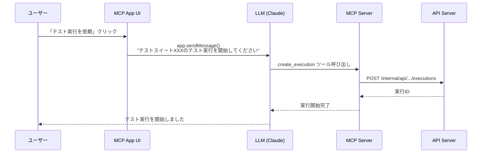
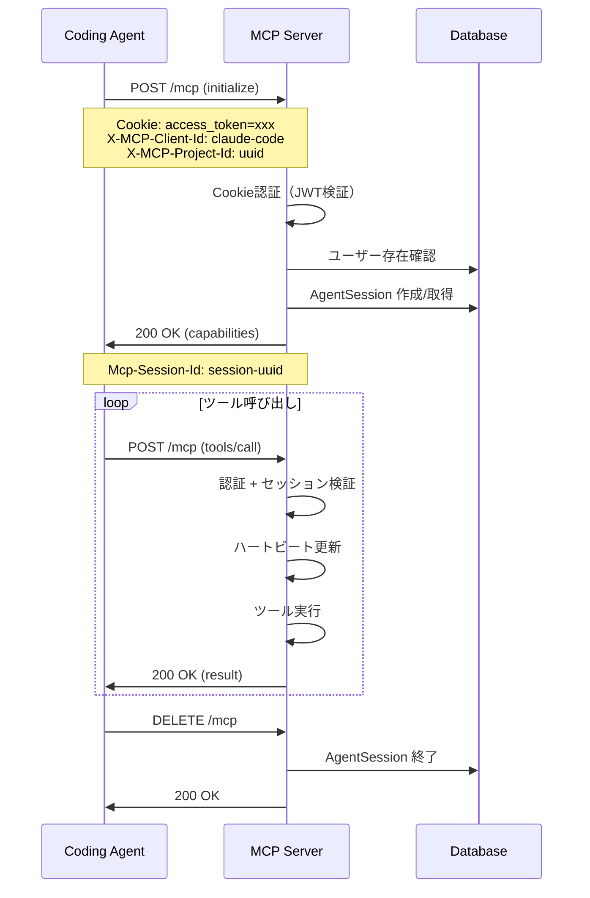
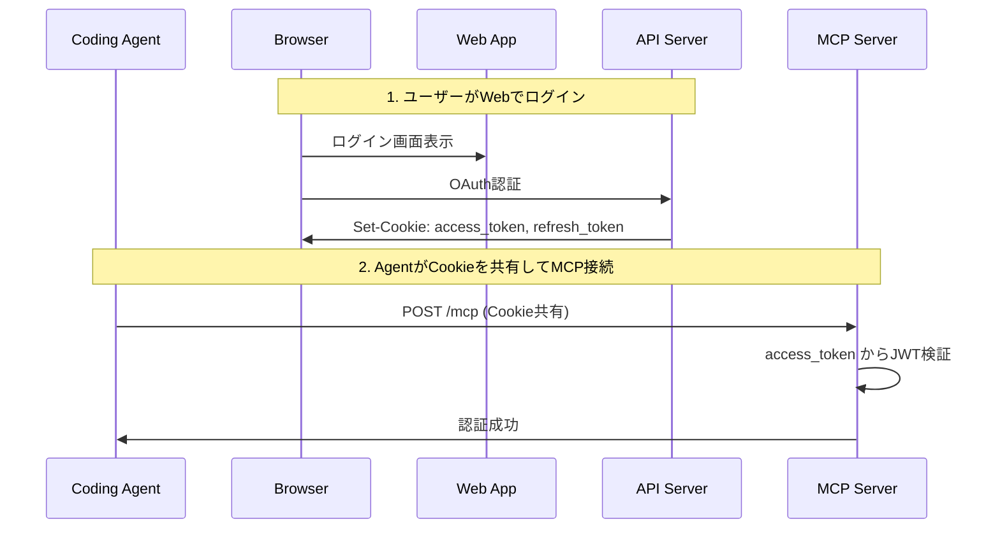
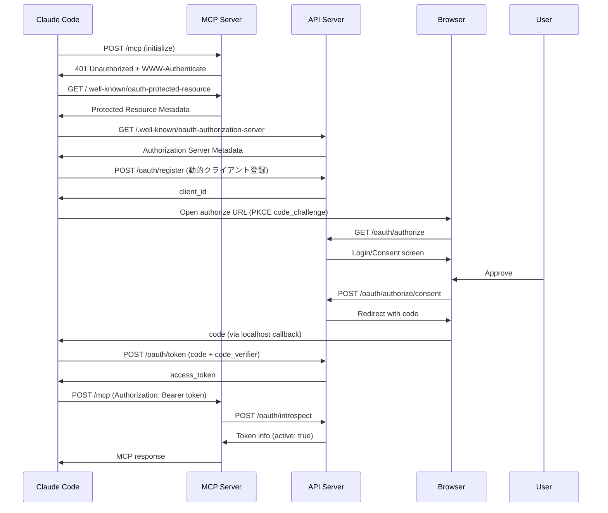
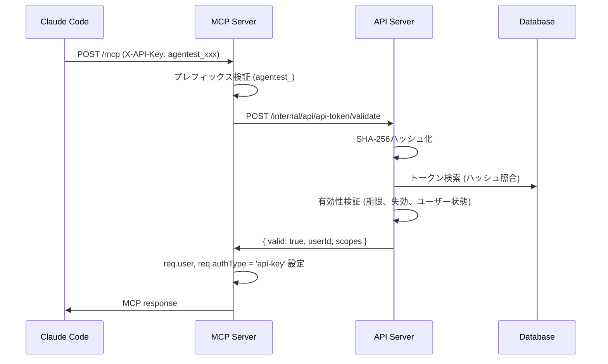
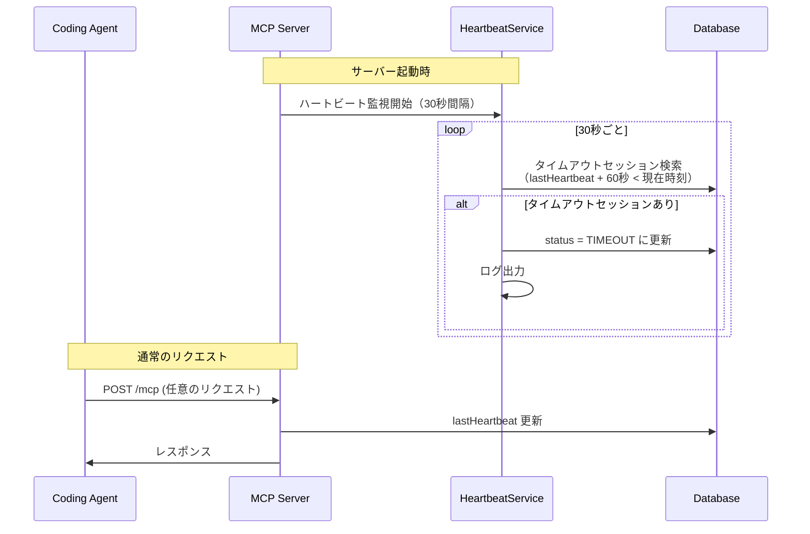
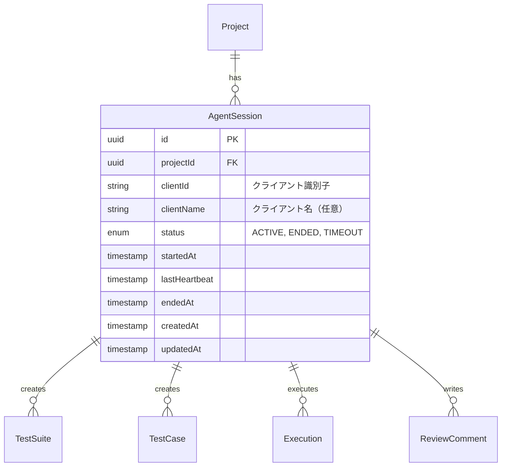
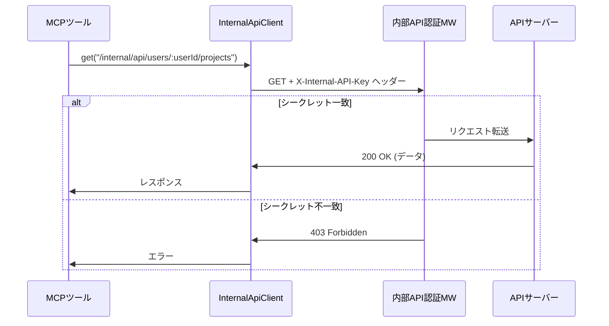
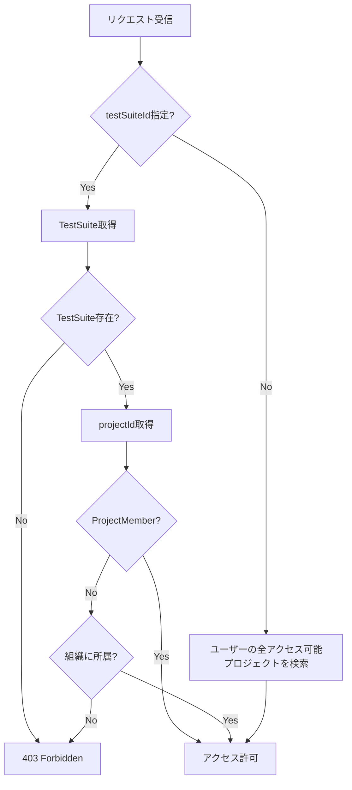

# MCP連携機能

## 概要

Coding Agent（Claude Code等）からAgentestのテスト管理機能を利用するためのMCP（Model Context Protocol）サーバーを提供する機能。Streamable HTTP + SSEトランスポートによる通信、Cookie共有によるOAuth認証連携、AgentSessionによるセッション管理を実装する。

## 機能一覧

| ID | 機能名 | 説明 | 状態 |
|----|--------|------|------|
| MCP-001 | MCP接続 | MCPプロトコルによる接続・初期化 | 実装済 |
| MCP-002 | Cookie認証連携 | Webアプリと同じOAuth認証情報を共有 | 実装済 |
| MCP-026 | OAuth 2.1認証 | MCPクライアント向けOAuth 2.1フロー | 実装済 |
| MCP-027 | Bearer Token認証 | Authorization: Bearer による認証 | 実装済 |
| MCP-028 | APIキー認証 | X-API-Keyヘッダーによる認証 | 実装済 |
| MCP-029 | ハイブリッド認証 | OAuth/APIキー/Cookieの優先順位付き認証 | 実装済 |
| MCP-003 | AgentSession管理 | AIエージェントのセッション作成・管理 | 実装済 |
| MCP-004 | ハートビート | セッションの生存確認・タイムアウト検出 | 実装済 |
| MCP-005 | ツール登録基盤 | MCPツールの登録・実行基盤 | 実装済 |
| MCP-006 | プロジェクト検索ツール | アクセス可能なプロジェクト一覧を検索 | 実装済 |
| MCP-007 | 内部API連携 | MCP↔API間の内部API通信基盤 | 実装済 |
| MCP-008 | テストスイート検索ツール | アクセス可能なテストスイート一覧を検索 | 実装済 |
| MCP-009 | テストケース検索ツール | テストスイート内のテストケースを検索 | 実装済 |
| MCP-010 | 実行履歴検索ツール | テストスイートの実行履歴を検索 | 実装済 |
| MCP-011 | プロジェクト詳細取得ツール | プロジェクトの詳細情報を取得 | 実装済 |
| MCP-012 | テストスイート詳細取得ツール | テストスイートの詳細情報を取得（テストケース含む） | 実装済 |
| MCP-013 | テストケース詳細取得ツール | テストケースの詳細情報を取得（ステップ/期待結果含む） | 実装済 |
| MCP-014 | 実行詳細取得ツール | テスト実行の詳細情報を取得（全Result含む） | 実装済 |
| MCP-015 | テストスイート作成ツール | テストスイートを作成 | 実装済 |
| MCP-016 | テストケース作成ツール | テストケースを作成 | 実装済 |
| MCP-017 | 実行開始ツール | テスト実行を開始（スナップショット＋結果行自動作成） | 実装済 |
| MCP-018 | テストスイート更新ツール | テストスイートの更新 | 実装済 |
| MCP-019 | テストケース更新ツール | テストケースの更新 | 実装済 |
| MCP-020 | 事前条件結果更新ツール | 事前条件確認結果を更新（agentNameで実施者記録可能） | 実装済 |
| MCP-021 | ステップ結果更新ツール | ステップ実行結果を更新（agentNameで実施者記録可能） | 実装済 |
| MCP-022 | 期待結果判定更新ツール | 期待結果判定を更新（agentNameで実施者記録可能） | 実装済 |
| MCP-023 | テストスイート削除ツール | テストスイートを論理削除 | 実装済 |
| MCP-024 | テストケース削除ツール | テストケースを論理削除 | 実装済 |
| MCP-025 | エビデンスアップロードツール | 期待結果にエビデンス（スクリーンショット等）をアップロード | 実装済 |
| MCP-APP-001 | テストスイート一覧App | インタラクティブUIでテストスイート表示・テスト実行依頼 | 実装済 |

## MCP Apps

### 概要

MCP Appsは`@modelcontextprotocol/ext-apps`パッケージを使用したインタラクティブUI機能です。AIクライアント（Claude Desktop等）内にリッチなUIを表示し、ユーザーがボタンクリック等の操作を行うと、その結果をLLMに伝えることができます。

### アーキテクチャ

```
┌─────────────────────────────────────────────────────────────────┐
│                   Claude Desktop / AI Client                     │
│  ┌───────────────────────────────────────────────────────────┐  │
│  │                    MCP App UI (HTML/JS)                    │  │
│  │  ┌─────────────────────────────────────────────────────┐  │  │
│  │  │  テストスイート一覧                                   │  │  │
│  │  │  ┌────────────┐ ┌────────────┐ ┌────────────┐      │  │  │
│  │  │  │ Suite A    │ │ Suite B    │ │ Suite C    │      │  │  │
│  │  │  │ [実行依頼] │ │ [実行依頼] │ │ [実行依頼] │      │  │  │
│  │  │  └────────────┘ └────────────┘ └────────────┘      │  │  │
│  │  └─────────────────────────────────────────────────────┘  │  │
│  └───────────────────────────────────────────────────────────┘  │
└─────────────────────────────────────────────────────────────────┘
                               │
                    app.sendMessage() / ontoolresult
                               │
                               ▼
┌─────────────────────────────────────────────────────────────────┐
│                         MCP Server                               │
│  ┌─────────────────────────────────────────────────────────────┐│
│  │  registerAppTool()        │    registerAppResource()        ││
│  │  - show_test_suites_app   │    - ui://agentest/...html      ││
│  └─────────────────────────────────────────────────────────────┘│
└─────────────────────────────────────────────────────────────────┘
                               │
                        内部API呼び出し
                               │
                               ▼
┌─────────────────────────────────────────────────────────────────┐
│                         API Server                               │
│                    /internal/api/users/:userId/test-suites       │
└─────────────────────────────────────────────────────────────────┘
```

### ビルドシステム

MCP Apps のUIはVite + `vite-plugin-singlefile`で単一HTMLファイルにバンドルされます。

| 項目 | 値 |
|------|-----|
| ビルドツール | Vite |
| プラグイン | vite-plugin-singlefile |
| 出力形式 | 単一HTMLファイル（CSS/JSインライン） |
| 出力先 | `apps/mcp-server/dist/src/apps/test-suites-app/index.html` |

ビルドコマンド:

```bash
docker compose exec dev pnpm --filter @agentest/mcp-server build:ui
```

### 実装ファイル一覧

| ファイル | 役割 |
|---------|------|
| `apps/mcp-server/src/apps/index.ts` | Apps登録（registerApps関数） |
| `apps/mcp-server/src/apps/types.ts` | 共通型定義 |
| `apps/mcp-server/src/apps/test-suites-app/index.html` | UIテンプレート |
| `apps/mcp-server/src/apps/test-suites-app/app.ts` | UIロジック |
| `apps/mcp-server/vite.config.ts` | Viteビルド設定 |

### テストスイート一覧App（show_test_suites_app）

#### ツール仕様

| 項目 | 説明 |
|------|------|
| ツール名 | `show_test_suites_app` |
| 説明 | テストスイート一覧をインタラクティブなUIで表示 |
| UIリソース | `ui://agentest/test-suites-app.html` |

#### 入力パラメータ

| パラメータ | 型 | 必須 | 説明 |
|-----------|-----|------|------|
| projectId | string (UUID) | × | 特定プロジェクト内のテストスイートに絞り込む場合に指定 |
| status | DRAFT / ACTIVE / ARCHIVED | × | ステータスで絞り込み |
| limit | number (1-50) | × | 取得件数（デフォルト: 20） |

#### レスポンス型

```typescript
interface SearchTestSuiteResponse {
  testSuites: TestSuite[];
  pagination: {
    total: number;
    limit: number;
    offset: number;
    hasMore: boolean;
  };
}

interface TestSuite {
  id: string;
  name: string;
  description: string | null;
  status: 'DRAFT' | 'ACTIVE' | 'ARCHIVED';
  projectId: string;
  project: { id: string; name: string };
  createdByUser: { id: string; name: string; avatarUrl: string | null } | null;
  _count: { testCases: number; preconditions: number };
  createdAt: string;
  updatedAt: string;
}
```

#### UI機能一覧

| 機能 | 説明 |
|------|------|
| テストスイートカード表示 | 名前、説明、ステータス、プロジェクト名、テストケース数、前提条件数を表示 |
| ステータスバッジ | DRAFT（グレー）、ACTIVE（緑）、ARCHIVED（オレンジ）で色分け表示 |
| テスト実行依頼ボタン | クリックするとLLMにテスト実行を依頼 |
| 依頼済み表示 | 送信済みのテストスイートは「依頼済み」と表示しボタンを無効化 |

### テスト実行依頼フロー

UIの「テスト実行を依頼」ボタンをクリックすると、`app.sendMessage()`を使用してLLMに指示を送信します。



送信されるメッセージ例:

```typescript
await app.sendMessage({
  role: 'user',
  content: [{
    type: 'text',
    text: `テストスイート「${suite.name}」（ID: ${suite.id}）のテスト実行を開始してください。
create_executionツールを使用してテスト実行を開始し、get_test_suiteで取得したテストケースを順番に実行してください。`,
  }],
});
```

### UIデザイン

CSS変数を使用し、ホストのテーマに動的に適応します。フォールバック値によりスタンドアロンでも動作します。

| 要素 | CSS変数 | フォールバック値 |
|------|---------|-----------------|
| 背景色 | `--color-background-primary` | `#0a0a0a` |
| カード背景 | `--color-background-secondary` | `#171717` |
| テキスト色 | `--color-text-primary` | `#e5e5e5` |
| 補助テキスト | `--color-text-secondary` | `#737373` |
| ボーダー | `--color-border-primary` | `#262626` |
| アクセント（ボタン） | `--color-accent-primary` | `#16a34a` |
| フォント | `--font-mono` | SF Mono, Monaco, monospace |

### ホストスタイル統合

MCP Appsは`@modelcontextprotocol/ext-apps`のスタイル適用機能を使用して、AIクライアントのテーマに動的に適応します。

#### 適用機能

| 機能 | 関数 | 説明 |
|------|------|------|
| テーマ適用 | `applyDocumentTheme()` | ライト/ダークテーマを切り替え |
| CSS変数適用 | `applyHostStyleVariables()` | ホストのCSS変数をdocumentに適用 |
| フォント適用 | `applyHostFonts()` | ホストのフォント設定を適用 |
| セーフエリア | `safeAreaInsets` | モバイル向けパディング調整 |

#### 適用タイミング

1. `onhostcontextchanged` ハンドラーでホストのテーマ変更を検知
2. `connect()` 後に `getHostContext()` で初期コンテキストを取得・適用

#### 実装例

```typescript
import {
  App,
  applyDocumentTheme,
  applyHostStyleVariables,
  applyHostFonts,
  type McpUiHostContext,
} from '@modelcontextprotocol/ext-apps';

function handleHostContextChanged(ctx: McpUiHostContext): void {
  if (ctx.theme) applyDocumentTheme(ctx.theme);
  if (ctx.styles?.variables) applyHostStyleVariables(ctx.styles.variables);
  if (ctx.styles?.css?.fonts) applyHostFonts(ctx.styles.css.fonts);
}

app.onhostcontextchanged = handleHostContextChanged;

app.connect().then(() => {
  const ctx = app.getHostContext();
  if (ctx) handleHostContextChanged(ctx);
});
```

## システム構成

### アーキテクチャ

```
┌─────────────────────────────────────────────────────────────────┐
│                      Coding Agent (Claude Code)                  │
└─────────────────────────────────────────────────────────────────┘
                                │
                    MCP Protocol (Streamable HTTP + SSE)
                                │
                                ▼
┌─────────────────────────────────────────────────────────────────┐
│                         MCP Server                               │
│  ┌─────────────┐  ┌──────────────┐  ┌─────────────────────────┐ │
│  │  認証MW     │→│ SessionMW    │→│  MCPハンドラー          │ │
│  │(Cookie JWT) │  │(AgentSession)│  │  (ツール実行)           │ │
│  └─────────────┘  └──────────────┘  └─────────────────────────┘ │
│                                              │                   │
│                                    内部APIクライアント           │
│                                    (X-Internal-API-Key)          │
└─────────────────────────────────────────────────────────────────┘
                │                              │
    共通認証・DB・ストレージ           内部API呼び出し
                │                              │
                ▼                              ▼
┌─────────────────────────────────────────────────────────────────┐
│                      既存インフラ                                │
│  ┌──────────┐  ┌──────────┐  ┌──────────┐  ┌──────────────────┐│
│  │PostgreSQL│  │  Redis   │  │  MinIO   │  │   API Server     ││
│  └──────────┘  └──────────┘  └──────────┘  │ (/internal/api)  ││
│                                             └──────────────────┘│
└─────────────────────────────────────────────────────────────────┘
```

### エンドポイント

#### MCPサーバー（外部公開）

| メソッド | パス | 説明 | 認証 |
|----------|------|------|------|
| POST | /mcp | MCPリクエスト処理 | 必須 |
| GET | /mcp | SSEストリーム開始 | 必須 |
| DELETE | /mcp | MCPセッション終了 | 必須 |
| GET | /health | ヘルスチェック | 不要 |

#### 内部API（MCP↔API間）

##### 検索系エンドポイント

| メソッド | パス | 説明 | 認証 |
|----------|------|------|------|
| GET | /internal/api/users/:userId/projects | ユーザーのプロジェクト一覧 | 共有シークレット |
| GET | /internal/api/users/:userId/test-suites | ユーザーのテストスイート一覧 | 共有シークレット |
| GET | /internal/api/test-suites/:testSuiteId/test-cases | テストスイート内のテストケース一覧 | 共有シークレット |
| GET | /internal/api/test-suites/:testSuiteId/executions | テストスイートの実行履歴一覧 | 共有シークレット |

##### 単一取得系エンドポイント

| メソッド | パス | 説明 | 認証 |
|----------|------|------|------|
| GET | /internal/api/projects/:projectId?userId=xxx | プロジェクト詳細取得 | 共有シークレット |
| GET | /internal/api/test-suites/:testSuiteId?userId=xxx | テストスイート詳細取得 | 共有シークレット |
| GET | /internal/api/test-cases/:testCaseId?userId=xxx | テストケース詳細取得 | 共有シークレット |
| GET | /internal/api/executions/:executionId?userId=xxx | 実行詳細取得 | 共有シークレット |

##### 作成系エンドポイント

| メソッド | パス | 説明 | 認証 |
|----------|------|------|------|
| POST | /internal/api/test-suites?userId=xxx | テストスイート作成 | 共有シークレット |
| POST | /internal/api/test-cases?userId=xxx | テストケース作成 | 共有シークレット |
| POST | /internal/api/test-suites/:testSuiteId/executions?userId=xxx | 実行開始 | 共有シークレット |

##### 更新系エンドポイント

| メソッド | パス | 説明 | 認証 |
|----------|------|------|------|
| PATCH | /internal/api/test-suites/:testSuiteId?userId=xxx | テストスイート更新 | 共有シークレット |
| PATCH | /internal/api/test-cases/:testCaseId?userId=xxx | テストケース更新 | 共有シークレット |
| PATCH | /internal/api/executions/:executionId/precondition-results/:preconditionResultId?userId=xxx | 事前条件結果更新 | 共有シークレット |
| PATCH | /internal/api/executions/:executionId/step-results/:stepResultId?userId=xxx | ステップ結果更新 | 共有シークレット |
| PATCH | /internal/api/executions/:executionId/expected-results/:expectedResultId?userId=xxx | 期待結果更新 | 共有シークレット |

##### 削除系エンドポイント

| メソッド | パス | 説明 | 認証 |
|----------|------|------|------|
| DELETE | /internal/api/test-suites/:testSuiteId?userId=xxx | テストスイート削除（論理削除） | 共有シークレット |
| DELETE | /internal/api/test-cases/:testCaseId?userId=xxx | テストケース削除（論理削除） | 共有シークレット |

##### エビデンス管理エンドポイント

| メソッド | パス | 説明 | 認証 |
|----------|------|------|------|
| POST | /internal/api/executions/:executionId/expected-results/:expectedResultId/evidences?userId=xxx | エビデンスアップロード（Base64形式） | 共有シークレット |

## 業務フロー

### MCP接続フロー



### 認証フロー（Cookie認証）

Cookie認証はWebアプリと同じOAuth認証情報を共有する方式。



### 認証フロー（OAuth 2.1）

MCPクライアント（Claude Code等）向けのOAuth 2.1認証フロー。PKCE、動的クライアント登録、リソースインジケーターに対応。



### OAuth 2.1 エンドポイント

#### MCPサーバー（Resource Server）

| メソッド | パス | 説明 | 認証 |
|----------|------|------|------|
| GET | `/.well-known/oauth-protected-resource` | Protected Resource Metadata | 不要 |

#### APIサーバー（Authorization Server）

| メソッド | パス | 説明 | 認証 |
|----------|------|------|------|
| GET | `/.well-known/oauth-authorization-server` | Authorization Server Metadata | 不要 |
| POST | `/oauth/register` | 動的クライアント登録 | 不要 |
| GET | `/oauth/authorize` | 認可エンドポイント | 必須 |
| POST | `/oauth/authorize/consent` | 同意承認 | 必須 |
| POST | `/oauth/token` | トークン発行 | 不要 |
| POST | `/oauth/introspect` | トークン検証 | 内部API |
| POST | `/oauth/revoke` | トークン失効 | 不要 |

### ハイブリッド認証

MCPサーバーは3つの認証方式をサポート。以下の優先順位で認証を行う：

1. **Bearer Token（OAuth 2.1）**: `Authorization: Bearer <token>` があれば OAuth 2.1 認証
2. **APIキー**: `X-API-Key: agentest_...` があれば API キー認証
3. **Cookie フォールバック**: 上記がなければ Cookie 認証

```typescript
// ハイブリッド認証ミドルウェアの動作
if (req.headers.authorization?.startsWith('Bearer ')) {
  // OAuth 2.1 Bearer Token 認証
  const token = req.headers.authorization.slice(7);
  const tokenInfo = await introspectToken(token);
  req.authType = 'oauth';
} else if (req.headers['x-api-key']) {
  // APIキー認証
  const apiKey = req.headers['x-api-key'];
  const result = await apiKeyAuthService.validateToken(apiKey);
  req.authType = 'api-key';
} else {
  // 既存の Cookie 認証
  const accessToken = req.cookies.access_token;
  req.authType = 'cookie';
}
```

### 認証フロー（APIキー認証）

OAuth 2.1 に対応していない Coding Agent（Claude Code 等）向けの API キー認証フロー。



### APIキー使用例（Claude Code 設定）

```json
{
  "mcpServers": {
    "agentest": {
      "url": "https://mcp.example.com/mcp",
      "headers": {
        "X-API-Key": "agentest_xxxxxxxxxxxxx",
        "X-MCP-Client-Id": "claude-code-user123",
        "X-MCP-Project-Id": "project-uuid"
      }
    }
  }
}
```

### ハートビート・タイムアウトフロー



## データモデル



### ステータス定義

#### AgentSessionStatus

| ステータス | 説明 |
|-----------|------|
| ACTIVE | 接続中（正常動作） |
| ENDED | 正常終了（クライアントからの切断） |
| TIMEOUT | タイムアウト（ハートビート途絶） |

## ビジネスルール

### 認証

MCPサーバーは3つの認証方式をサポート（優先順位順）：

#### 1. OAuth 2.1認証（Bearer Token）

- MCPクライアント（Claude Code等）向けのOAuth 2.1フロー
- Bearer Token認証（`Authorization: Bearer <token>`）
- 動的クライアント登録（RFC 7591）でクライアントを自動登録
- PKCE必須（S256のみ、plainは禁止）
- リソースインジケーター（RFC 8707）でAudience検証
- トークンイントロスペクション（`/oauth/introspect`）で検証
- アクセストークン有効期限: 1時間
- redirect_uriはlocalhost/127.0.0.1のみ許可（セキュリティ要件）

#### 2. APIキー認証（X-API-Key）

- OAuth 2.1に対応していないCoding Agent向けの認証方式
- `X-API-Key: agentest_xxx` ヘッダーで認証
- `agentest_` プレフィックス必須
- SHA-256ハッシュでトークン照合
- 内部API（`/internal/api/api-token/validate`）で検証
- ユーザーと同等の権限（フルアクセス）
- WebUIからAPIキーを作成・管理可能
- 最終使用日時を自動記録

#### 3. Cookie認証（フォールバック）

- MCPサーバーはWebアプリと同じOAuth認証を共有
- access_tokenはHttpOnly Cookieで受け渡し
- トークン検証には`@agentest/auth`の`verifyAccessToken`を使用
- 削除済みユーザー（deletedAt != null）は認証拒否

### セッション管理

- 同一プロジェクト + 同一clientIdで既存ACTIVEセッションがあれば再利用
- 新規接続時は新しいAgentSessionを作成
- すべてのMCPリクエストでハートビートを自動更新
- ハートビートタイムアウト（60秒）でセッションをTIMEOUT状態に移行

### ヘッダー仕様

| ヘッダー | 必須 | 説明 |
|----------|------|------|
| Authorization | 条件付き | Bearer Token認証（OAuth 2.1） |
| X-API-Key | 条件付き | APIキー認証（`agentest_xxx`形式） |
| X-MCP-Client-Id | 条件付き | クライアント識別子（セッション管理時に必要） |
| X-MCP-Client-Name | 任意 | クライアント名（表示用） |
| X-MCP-Project-Id | 条件付き | プロジェクトID（セッション管理時に必要） |
| Mcp-Session-Id | 任意 | MCPセッションID（SDK管理） |

### エラーハンドリング

| エラー | HTTPステータス | JSON-RPCコード | 対応 |
|--------|---------------|----------------|------|
| 認証トークンなし | 401 | -32001 | Cookieにaccess_tokenが必要 |
| 無効なトークン | 401 | -32001 | 再ログインが必要 |
| ユーザー削除済み | 401 | -32001 | アカウント無効 |
| 認可エラー | 403 | -32002 | プロジェクト権限不足 |
| バリデーションエラー | 400 | -32003 | リクエスト形式不正 |
| 内部エラー | 500 | -32603 | サーバーエラー |

## 権限

### プロジェクトロール継承

MCPツールの操作権限は、ユーザーのプロジェクトロールを継承する。

| 操作 | OWNER | ADMIN | WRITE | READ |
|------|:-----:|:-----:|:-----:|:----:|
| MCP接続 | ✓ | ✓ | ✓ | ✓ |
| テストスイート取得 | ✓ | ✓ | ✓ | ✓ |
| テストスイート作成 | ✓ | ✓ | ✓ | - |
| テストスイート更新 | ✓ | ✓ | ✓ | - |
| テストスイート削除 | ✓ | ✓ | ✓ | - |
| テストケース作成 | ✓ | ✓ | ✓ | - |
| テストケース更新 | ✓ | ✓ | ✓ | - |
| テストケース削除 | ✓ | ✓ | ✓ | - |
| テスト実行 | ✓ | ✓ | ✓ | - |
| 結果記録 | ✓ | ✓ | ✓ | - |

## 設定値

| 項目 | 値 | 説明 |
|------|-----|------|
| PORT | 3004 | MCPサーバーポート |
| HEARTBEAT_INTERVAL | 30秒 | ハートビートチェック間隔 |
| HEARTBEAT_TIMEOUT | 60秒 | ハートビートタイムアウト |
| JWT_ACCESS_EXPIRES_IN | 15分 | アクセストークン有効期限 |
| JWT_REFRESH_EXPIRES_IN | 7日 | リフレッシュトークン有効期限 |
| JSON_BODY_LIMIT | 1MB | リクエストボディサイズ上限 |
| INTERNAL_API_SECRET | 32文字以上 | 内部API認証用共有シークレット |
| API_INTERNAL_URL | http://api:3001 | 内部API接続先URL |

## ツール登録基盤

### ToolContext

ツール実行時に利用可能なコンテキスト情報。

```typescript
interface ToolContext {
  // 認証済みユーザーID
  userId: string;
  // AgentSession情報（存在する場合）
  agentSession?: AgentSession;
  // プロジェクトID（ヘッダーから取得）
  projectId?: string;
}
```

### ツール定義例

```typescript
import { z } from 'zod';
import { toolRegistry } from './tools/index.js';

// ツール登録
toolRegistry.register({
  name: 'list_test_suites',
  description: 'プロジェクトのテストスイート一覧を取得',
  inputSchema: z.object({
    projectId: z.string().uuid(),
    limit: z.number().optional().default(20),
    offset: z.number().optional().default(0),
  }),
  handler: async (input, context) => {
    // ツール実装
    return { testSuites: [...] };
  },
});
```

## セキュリティ考慮事項

### Cookie設定

- HttpOnly: XSS対策（JavaScriptからアクセス不可）
- Secure: 本番環境ではHTTPS必須
- SameSite=Strict: CSRF対策

### CORS設定

- 許可オリジンは環境変数で設定
- credentialsを有効化（Cookie送信許可）
- 許可ヘッダーを明示的に指定

### 入力検証

- リクエストボディサイズ制限（1MB）
- JSONパース前のContent-Type検証
- Zodスキーマによる入力バリデーション

## 内部API連携（MCP-007）

### 概要

MCPサーバーからAPIサーバーのビジネスロジックを呼び出すための内部API通信基盤。共有シークレット認証により、Docker内部ネットワーク内でセキュアな通信を実現する。

### 設計方針

- **MCPサーバー**: API側への橋渡しのみ。ビジネスロジックは持たない
- **APIサーバー**: 既存のサービス層（userService等）を再利用
- **認証**: 共有シークレット（`X-Internal-API-Key`ヘッダー）

### アーキテクチャ

```
[MCPクライアント] → [MCPサーバー] → [APIサーバー(内部API)] → [DB]
                       ↑                    ↑
                  橋渡しのみ          認証:共有シークレット
                                      ビジネスロジック配置
```

### 実装ファイル

| ファイル | 役割 |
|----------|------|
| `apps/api/src/routes/internal.ts` | 内部APIルート定義 |
| `apps/api/src/middleware/internal-api.middleware.ts` | 共有シークレット認証 |
| `apps/mcp-server/src/clients/api-client.ts` | 内部APIクライアント |
| `apps/mcp-server/src/types/context.ts` | リクエストコンテキスト型 |
| `apps/mcp-server/src/transport/streamable-http.ts` | AsyncLocalStorage管理 |

### 内部API認証フロー



### コンテキスト伝達

MCPツールハンドラーへのユーザー情報伝達にAsyncLocalStorageを使用。

```typescript
// リクエスト処理時にコンテキストを設定
await requestContext.run(
  { sessionId, userId: req.user?.id, agentSession: req.agentSession },
  async () => {
    await transport.handleRequest(req, res, req.body);
  }
);

// ツールハンドラー内でコンテキストを取得
const ctx = requestContext.getStore();
const context: ToolContext = {
  userId: ctx?.userId || '',
  agentSession: ctx?.agentSession,
};
```

### セッションデータ管理

```typescript
interface McpSessionData {
  userId: string;
  agentSession?: AgentSession;
}

// セッションデータの操作
getSessionData(sessionId): McpSessionData | undefined
deleteSession(sessionId): void
cleanupAllSessions(): void
```

## search_project ツール（MCP-006）

### 概要

AIエージェントがアクセス可能なプロジェクト一覧を検索するMCPツール。

### 入力パラメータ

| パラメータ | 型 | 必須 | デフォルト | 説明 |
|-----------|-----|------|-----------|------|
| q | string | 任意 | - | プロジェクト名で検索（最大100文字） |
| limit | number | 任意 | 50 | 取得件数（1-50） |
| offset | number | 任意 | 0 | オフセット |

### レスポンス

```typescript
interface SearchProjectResponse {
  projects: Array<{
    id: string;
    name: string;
    description: string | null;
    organizationId: string | null;
    organization: {
      id: string;
      name: string;
    } | null;
    role: string;          // ユーザーのプロジェクトロール
    _count: {
      testSuites: number;  // テストスイート数
    };
    createdAt: string;
    updatedAt: string;
  }>;
  pagination: {
    total: number;
    limit: number;
    offset: number;
    hasMore: boolean;
  };
}
```

### 使用例

```json
// リクエスト
{
  "name": "search_project",
  "arguments": {
    "q": "認証",
    "limit": 10
  }
}

// レスポンス
{
  "projects": [
    {
      "id": "proj_xxx",
      "name": "認証システムテスト",
      "description": "OAuth認証機能のテストプロジェクト",
      "organizationId": "org_xxx",
      "organization": {
        "id": "org_xxx",
        "name": "開発チーム"
      },
      "role": "WRITE",
      "_count": { "testSuites": 5 },
      "createdAt": "2024-01-01T00:00:00.000Z",
      "updatedAt": "2024-01-15T00:00:00.000Z"
    }
  ],
  "pagination": {
    "total": 1,
    "limit": 10,
    "offset": 0,
    "hasMore": false
  }
}
```

### 実装ファイル

| ファイル | 役割 |
|----------|------|
| `apps/mcp-server/src/tools/search-project.ts` | ツール定義・ハンドラー |
| `apps/api/src/routes/internal.ts` | 内部APIエンドポイント |
| `apps/api/src/services/user.service.ts` | getProjects/countProjectsメソッド |

## search_test_suite ツール（MCP-008）

### 概要

AIエージェントがアクセス可能なテストスイート一覧を検索するMCPツール。プロジェクト、名前、ステータスで絞り込み可能。

### 入力パラメータ

| パラメータ | 型 | 必須 | デフォルト | 説明 |
|-----------|-----|------|-----------|------|
| projectId | string(uuid) | 任意 | - | プロジェクトIDで絞り込み |
| q | string | 任意 | - | テストスイート名で検索（最大100文字） |
| status | enum | 任意 | - | ステータスで絞り込み（DRAFT/ACTIVE/ARCHIVED） |
| limit | number | 任意 | 20 | 取得件数（1-50） |
| offset | number | 任意 | 0 | オフセット |

### レスポンス

```typescript
interface SearchTestSuiteResponse {
  testSuites: Array<{
    id: string;
    name: string;
    description: string | null;
    status: string;              // DRAFT/ACTIVE/ARCHIVED
    projectId: string;
    project: {
      id: string;
      name: string;
    };
    createdByUser: {
      id: string;
      name: string;
      avatarUrl: string | null;
    } | null;
    _count: {
      testCases: number;         // テストケース数
      preconditions: number;     // 前提条件数
    };
    createdAt: string;
    updatedAt: string;
  }>;
  pagination: {
    total: number;
    limit: number;
    offset: number;
    hasMore: boolean;
  };
}
```

### 使用例

```json
// リクエスト
{
  "name": "search_test_suite",
  "arguments": {
    "projectId": "proj_xxx",
    "q": "認証",
    "status": "ACTIVE",
    "limit": 10
  }
}

// レスポンス
{
  "testSuites": [
    {
      "id": "suite_xxx",
      "name": "認証機能テスト",
      "description": "ログイン・ログアウト機能のテスト",
      "status": "ACTIVE",
      "projectId": "proj_xxx",
      "project": { "id": "proj_xxx", "name": "Webアプリ" },
      "createdByUser": { "id": "user_xxx", "name": "田中太郎", "avatarUrl": null },
      "_count": { "testCases": 15, "preconditions": 3 },
      "createdAt": "2024-01-01T00:00:00.000Z",
      "updatedAt": "2024-01-15T00:00:00.000Z"
    }
  ],
  "pagination": { "total": 1, "limit": 10, "offset": 0, "hasMore": false }
}
```

### 実装ファイル

| ファイル | 役割 |
|----------|------|
| `apps/mcp-server/src/tools/search-test-suite.ts` | ツール定義・ハンドラー |
| `apps/api/src/routes/internal.ts` | 内部APIエンドポイント |
| `apps/api/src/services/user.service.ts` | getTestSuites/countTestSuitesメソッド |

## search_test_case ツール（MCP-009）

### 概要

テストスイート内のテストケース一覧を検索するMCPツール。キーワード、ステータス、優先度で絞り込み可能。

### 入力パラメータ

| パラメータ | 型 | 必須 | デフォルト | 説明 |
|-----------|-----|------|-----------|------|
| testSuiteId | string(uuid) | **必須** | - | テストスイートID |
| q | string | 任意 | - | キーワード検索（タイトル、手順、期待結果）（最大100文字） |
| status | array | 任意 | - | ステータスで絞り込み（DRAFT/ACTIVE/ARCHIVED）複数選択可 |
| priority | array | 任意 | - | 優先度で絞り込み（LOW/MEDIUM/HIGH/CRITICAL）複数選択可 |
| limit | number | 任意 | 20 | 取得件数（1-50） |
| offset | number | 任意 | 0 | オフセット |
| sortBy | enum | 任意 | orderKey | ソート項目（title/createdAt/updatedAt/priority/orderKey） |
| sortOrder | enum | 任意 | asc | ソート順（asc/desc） |

### レスポンス

```typescript
interface SearchTestCaseResponse {
  testCases: Array<{
    id: string;
    testSuiteId: string;
    title: string;
    description: string | null;
    status: string;              // DRAFT/ACTIVE/ARCHIVED
    priority: string;            // LOW/MEDIUM/HIGH/CRITICAL
    orderKey: string;            // 並び順キー
    createdByUser: {
      id: string;
      name: string;
      avatarUrl: string | null;
    } | null;
    _count: {
      preconditions: number;     // 前提条件数
      steps: number;             // 手順数
      expectedResults: number;   // 期待結果数
    };
    createdAt: string;
    updatedAt: string;
  }>;
  pagination: {
    total: number;
    limit: number;
    offset: number;
    hasMore: boolean;
  };
}
```

### 使用例

```json
// リクエスト
{
  "name": "search_test_case",
  "arguments": {
    "testSuiteId": "suite_xxx",
    "q": "ログイン",
    "priority": ["HIGH", "CRITICAL"],
    "status": ["ACTIVE"],
    "sortBy": "priority",
    "sortOrder": "desc"
  }
}

// レスポンス
{
  "testCases": [
    {
      "id": "case_xxx",
      "testSuiteId": "suite_xxx",
      "title": "正常系：メールとパスワードでログイン",
      "description": "有効なメールとパスワードでログインできる",
      "status": "ACTIVE",
      "priority": "CRITICAL",
      "orderKey": "a0",
      "createdByUser": { "id": "user_xxx", "name": "田中太郎", "avatarUrl": null },
      "_count": { "preconditions": 2, "steps": 5, "expectedResults": 3 },
      "createdAt": "2024-01-01T00:00:00.000Z",
      "updatedAt": "2024-01-15T00:00:00.000Z"
    }
  ],
  "pagination": { "total": 1, "limit": 20, "offset": 0, "hasMore": false }
}
```

### 認可

テストスイートへのアクセス権限が必要。以下のいずれかを満たす必要がある：
- テストスイートが属するプロジェクトのProjectMemberである
- テストスイートが属するプロジェクトの組織のOrganizationMemberである

### 実装ファイル

| ファイル | 役割 |
|----------|------|
| `apps/mcp-server/src/tools/search-test-case.ts` | ツール定義・ハンドラー |
| `apps/api/src/routes/internal.ts` | 内部APIエンドポイント |
| `apps/api/src/services/internal-authorization.service.ts` | 認可チェック |
| `apps/api/src/services/test-suite.service.ts` | searchTestCasesメソッド |

## search_execution ツール（MCP-010）

### 概要

テストスイートの実行履歴を検索するMCPツール。期間で絞り込み可能。

### 入力パラメータ

| パラメータ | 型 | 必須 | デフォルト | 説明 |
|-----------|-----|------|-----------|------|
| testSuiteId | string(uuid) | **必須** | - | テストスイートID |
| from | string(datetime) | 任意 | - | 作成日時（開始）（ISO 8601形式） |
| to | string(datetime) | 任意 | - | 作成日時（終了）（ISO 8601形式） |
| limit | number | 任意 | 20 | 取得件数（1-50） |
| offset | number | 任意 | 0 | オフセット |
| sortBy | enum | 任意 | createdAt | ソート項目（createdAt） |
| sortOrder | enum | 任意 | desc | ソート順（asc/desc） |

### レスポンス

```typescript
interface SearchExecutionResponse {
  executions: Array<{
    id: string;
    testSuiteId: string;
    executedByUser: {
      id: string;
      name: string;
      avatarUrl: string | null;
    } | null;
    environment: {
      id: string;
      name: string;
    } | null;
    createdAt: string;
    updatedAt: string;
  }>;
  pagination: {
    total: number;
    limit: number;
    offset: number;
    hasMore: boolean;
  };
}
```

### 使用例

```json
// リクエスト
{
  "name": "search_execution",
  "arguments": {
    "testSuiteId": "suite_xxx",
    "from": "2024-01-01T00:00:00.000Z",
    "to": "2024-01-31T23:59:59.999Z",
    "limit": 10,
    "sortBy": "createdAt",
    "sortOrder": "desc"
  }
}

// レスポンス
{
  "executions": [
    {
      "id": "exec_xxx",
      "testSuiteId": "suite_xxx",
      "executedByUser": { "id": "user_xxx", "name": "田中太郎", "avatarUrl": null },
      "environment": { "id": "env_xxx", "name": "本番環境" },
      "createdAt": "2024-01-15T10:00:00.000Z",
      "updatedAt": "2024-01-15T11:30:00.000Z"
    }
  ],
  "pagination": { "total": 5, "limit": 10, "offset": 0, "hasMore": false }
}
```

### 認可

テストスイートへのアクセス権限が必要（search_test_caseと同様）。

### 実装ファイル

| ファイル | 役割 |
|----------|------|
| `apps/mcp-server/src/tools/search-execution.ts` | ツール定義・ハンドラー |
| `apps/api/src/routes/internal.ts` | 内部APIエンドポイント |
| `apps/api/src/services/internal-authorization.service.ts` | 認可チェック |
| `apps/api/src/services/test-suite.service.ts` | getExecutionsメソッド |

## get_project ツール（MCP-011）

### 概要

プロジェクトの詳細情報を取得するMCPツール。環境設定やテストスイート数も含まれる。

### 入力パラメータ

| パラメータ | 型 | 必須 | 説明 |
|-----------|-----|------|------|
| projectId | string(uuid) | **必須** | プロジェクトID |

### レスポンス

```typescript
interface GetProjectResponse {
  project: {
    id: string;
    name: string;
    description: string | null;
    organizationId: string | null;
    organization: {
      id: string;
      name: string;
    } | null;
    role: string;              // ユーザーのプロジェクトロール（OWNER/ADMIN/WRITE/READ）
    environments: Array<{      // プロジェクトの環境設定
      id: string;
      projectId: string;
      name: string;
      baseUrl: string | null;
      description: string | null;
      isDefault: boolean;
      sortOrder: number;
      createdAt: string;
      updatedAt: string;
    }>;
    _count: {
      testSuites: number;      // テストスイート数
    };
    createdAt: string;
    updatedAt: string;
  };
}
```

### 使用例

```json
// リクエスト
{
  "name": "get_project",
  "arguments": {
    "projectId": "proj_xxx"
  }
}

// レスポンス
{
  "project": {
    "id": "proj_xxx",
    "name": "認証システムテスト",
    "description": "OAuth認証機能のテストプロジェクト",
    "organizationId": "org_xxx",
    "organization": {
      "id": "org_xxx",
      "name": "開発チーム"
    },
    "role": "ADMIN",
    "environments": [
      {
        "id": "env_xxx",
        "projectId": "proj_xxx",
        "name": "開発環境",
        "baseUrl": "https://dev.example.com",
        "description": null,
        "isDefault": true,
        "sortOrder": 1,
        "createdAt": "2024-01-01T00:00:00.000Z",
        "updatedAt": "2024-01-01T00:00:00.000Z"
      }
    ],
    "_count": { "testSuites": 5 },
    "createdAt": "2024-01-01T00:00:00.000Z",
    "updatedAt": "2024-01-15T00:00:00.000Z"
  }
}
```

### 認可

`canAccessProject(userId, projectId)` を使用。以下のいずれかを満たす必要がある：
- ProjectMemberとして登録されている
- プロジェクトが所属する組織のOrganizationMemberである

### 実装ファイル

| ファイル | 役割 |
|----------|------|
| `apps/mcp-server/src/tools/get-project.ts` | ツール定義・ハンドラー |
| `apps/api/src/routes/internal.ts` | 内部APIエンドポイント |
| `apps/api/src/services/internal-authorization.service.ts` | 認可チェック |

## get_test_suite ツール（MCP-012）

### 概要

テストスイートの詳細情報を取得するMCPツール。前提条件と全テストケース一覧も含まれる。

### 入力パラメータ

| パラメータ | 型 | 必須 | 説明 |
|-----------|-----|------|------|
| testSuiteId | string(uuid) | **必須** | テストスイートID |

### レスポンス

```typescript
interface GetTestSuiteResponse {
  testSuite: {
    id: string;
    name: string;
    description: string | null;
    status: string;              // DRAFT/ACTIVE/ARCHIVED
    projectId: string;
    project: {
      id: string;
      name: string;
    };
    createdByUser: {
      id: string;
      name: string | null;
      avatarUrl: string | null;
    } | null;
    preconditions: Array<{       // スイートレベルの前提条件（orderKey昇順）
      id: string;
      testSuiteId: string;
      content: string;
      orderKey: string;
      createdAt: string;
      updatedAt: string;
    }>;
    testCases: Array<{           // 全テストケース一覧（orderKey昇順）
      id: string;
      testSuiteId: string;
      title: string;
      description: string | null;
      priority: string;          // LOW/MEDIUM/HIGH/CRITICAL
      status: string;            // DRAFT/ACTIVE/ARCHIVED
      orderKey: string;
      _count: {
        preconditions: number;
        steps: number;
        expectedResults: number;
      };
      createdAt: string;
      updatedAt: string;
    }>;
    _count: {
      testCases: number;
      preconditions: number;
    };
    createdAt: string;
    updatedAt: string;
  };
}
```

### 使用例

```json
// リクエスト
{
  "name": "get_test_suite",
  "arguments": {
    "testSuiteId": "suite_xxx"
  }
}

// レスポンス
{
  "testSuite": {
    "id": "suite_xxx",
    "name": "認証機能テスト",
    "description": "ログイン・ログアウト機能のテスト",
    "status": "ACTIVE",
    "projectId": "proj_xxx",
    "project": { "id": "proj_xxx", "name": "Webアプリ" },
    "createdByUser": { "id": "user_xxx", "name": "田中太郎", "avatarUrl": null },
    "preconditions": [
      {
        "id": "pre_xxx",
        "testSuiteId": "suite_xxx",
        "content": "テストデータベースがセットアップ済み",
        "orderKey": "00001",
        "createdAt": "2024-01-01T00:00:00.000Z",
        "updatedAt": "2024-01-01T00:00:00.000Z"
      }
    ],
    "testCases": [
      {
        "id": "case_xxx",
        "testSuiteId": "suite_xxx",
        "title": "正常系：メールとパスワードでログイン",
        "description": "有効な認証情報でログインできる",
        "priority": "CRITICAL",
        "status": "ACTIVE",
        "orderKey": "00001",
        "_count": { "preconditions": 2, "steps": 5, "expectedResults": 3 },
        "createdAt": "2024-01-01T00:00:00.000Z",
        "updatedAt": "2024-01-15T00:00:00.000Z"
      }
    ],
    "_count": { "testCases": 15, "preconditions": 3 },
    "createdAt": "2024-01-01T00:00:00.000Z",
    "updatedAt": "2024-01-15T00:00:00.000Z"
  }
}
```

### 認可

`canAccessTestSuite(userId, testSuiteId)` を使用。テストスイートが属するプロジェクトへのアクセス権限が必要。

### 実装ファイル

| ファイル | 役割 |
|----------|------|
| `apps/mcp-server/src/tools/get-test-suite.ts` | ツール定義・ハンドラー |
| `apps/api/src/routes/internal.ts` | 内部APIエンドポイント |
| `apps/api/src/services/internal-authorization.service.ts` | 認可チェック |

## get_test_case ツール（MCP-013）

### 概要

テストケースの詳細情報を取得するMCPツール。前提条件、ステップ、期待結果も含まれる。

### 入力パラメータ

| パラメータ | 型 | 必須 | 説明 |
|-----------|-----|------|------|
| testCaseId | string(uuid) | **必須** | テストケースID |

### レスポンス

```typescript
interface GetTestCaseResponse {
  testCase: {
    id: string;
    testSuiteId: string;
    testSuite: {
      id: string;
      name: string;
      projectId: string;
    };
    title: string;
    description: string | null;
    priority: string;            // LOW/MEDIUM/HIGH/CRITICAL
    status: string;              // DRAFT/ACTIVE/ARCHIVED
    orderKey: string;
    createdByUser: {
      id: string;
      name: string | null;
      avatarUrl: string | null;
    } | null;
    preconditions: Array<{       // 前提条件（orderKey昇順）
      id: string;
      testCaseId: string;
      content: string;
      orderKey: string;
      createdAt: string;
      updatedAt: string;
    }>;
    steps: Array<{               // テストステップ（orderKey昇順）
      id: string;
      testCaseId: string;
      content: string;
      orderKey: string;
      createdAt: string;
      updatedAt: string;
    }>;
    expectedResults: Array<{     // 期待結果（orderKey昇順）
      id: string;
      testCaseId: string;
      content: string;
      orderKey: string;
      createdAt: string;
      updatedAt: string;
    }>;
    createdAt: string;
    updatedAt: string;
  };
}
```

### 使用例

```json
// リクエスト
{
  "name": "get_test_case",
  "arguments": {
    "testCaseId": "case_xxx"
  }
}

// レスポンス
{
  "testCase": {
    "id": "case_xxx",
    "testSuiteId": "suite_xxx",
    "testSuite": {
      "id": "suite_xxx",
      "name": "認証機能テスト",
      "projectId": "proj_xxx"
    },
    "title": "正常系：メールとパスワードでログイン",
    "description": "有効な認証情報でログインできることを確認",
    "priority": "CRITICAL",
    "status": "ACTIVE",
    "orderKey": "00001",
    "createdByUser": { "id": "user_xxx", "name": "田中太郎", "avatarUrl": null },
    "preconditions": [
      {
        "id": "pre_xxx",
        "testCaseId": "case_xxx",
        "content": "テストユーザーが登録済み",
        "orderKey": "00001",
        "createdAt": "2024-01-01T00:00:00.000Z",
        "updatedAt": "2024-01-01T00:00:00.000Z"
      }
    ],
    "steps": [
      {
        "id": "step_xxx",
        "testCaseId": "case_xxx",
        "content": "ログインページを開く",
        "orderKey": "00001",
        "createdAt": "2024-01-01T00:00:00.000Z",
        "updatedAt": "2024-01-01T00:00:00.000Z"
      },
      {
        "id": "step_yyy",
        "testCaseId": "case_xxx",
        "content": "メールアドレスとパスワードを入力する",
        "orderKey": "00002",
        "createdAt": "2024-01-01T00:00:00.000Z",
        "updatedAt": "2024-01-01T00:00:00.000Z"
      }
    ],
    "expectedResults": [
      {
        "id": "exp_xxx",
        "testCaseId": "case_xxx",
        "content": "ダッシュボードページが表示される",
        "orderKey": "00001",
        "createdAt": "2024-01-01T00:00:00.000Z",
        "updatedAt": "2024-01-01T00:00:00.000Z"
      }
    ],
    "createdAt": "2024-01-01T00:00:00.000Z",
    "updatedAt": "2024-01-15T00:00:00.000Z"
  }
}
```

### 認可

テストケースを取得後、`canAccessTestSuite(userId, testCase.testSuiteId)` で認可チェック。

### 実装ファイル

| ファイル | 役割 |
|----------|------|
| `apps/mcp-server/src/tools/get-test-case.ts` | ツール定義・ハンドラー |
| `apps/api/src/routes/internal.ts` | 内部APIエンドポイント |
| `apps/api/src/services/internal-authorization.service.ts` | 認可チェック |

## get_execution ツール（MCP-014）

### 概要

テスト実行の詳細情報を取得するMCPツール。スナップショット、全結果データ、エビデンスも含まれる。

### 入力パラメータ

| パラメータ | 型 | 必須 | 説明 |
|-----------|-----|------|------|
| executionId | string(uuid) | **必須** | 実行ID |

### レスポンス

```typescript
interface GetExecutionResponse {
  execution: {
    id: string;
    testSuiteId: string;
    testSuite: {
      id: string;
      name: string;
      projectId: string;
    };
    executedByUser: {
      id: string;
      name: string | null;
      avatarUrl: string | null;
    } | null;
    environment: {
      id: string;
      name: string;
    } | null;
    executionTestSuite: {        // 実行時点のスナップショット
      id: string;
      executionId: string;
      originalTestSuiteId: string;
      name: string;
      description: string | null;
      createdAt: string;
      updatedAt: string;
      preconditions: Array<{     // スイートレベル前提条件スナップショット
        id: string;
        content: string;
        orderKey: string;
        originalPreconditionId: string;
        createdAt: string;
        updatedAt: string;
      }>;
      testCases: Array<{         // テストケーススナップショット
        id: string;
        executionTestSuiteId: string;
        originalTestCaseId: string;
        title: string;
        description: string | null;
        priority: string;
        orderKey: string;
        createdAt: string;
        updatedAt: string;
        preconditions: Array<{   // ケースレベル前提条件スナップショット
          id: string;
          content: string;
          orderKey: string;
          originalPreconditionId: string;
          createdAt: string;
          updatedAt: string;
        }>;
        steps: Array<{           // ステップスナップショット
          id: string;
          executionTestCaseId: string;
          originalStepId: string;
          content: string;
          orderKey: string;
          createdAt: string;
          updatedAt: string;
        }>;
        expectedResults: Array<{ // 期待結果スナップショット
          id: string;
          executionTestCaseId: string;
          originalExpectedResultId: string;
          content: string;
          orderKey: string;
          createdAt: string;
          updatedAt: string;
        }>;
      }>;
    } | null;
    preconditionResults: Array<{ // 前提条件結果
      id: string;
      executionId: string;
      executionTestCaseId: string | null;
      executionSuitePreconditionId: string | null;
      executionCasePreconditionId: string | null;
      status: string;            // PENDING/PASS/FAIL/SKIP
      note: string | null;
      checkedAt: string | null;
      suitePrecondition: { ... } | null;
      casePrecondition: { ... } | null;
      executionTestCase: { ... } | null;
    }>;
    stepResults: Array<{         // ステップ結果
      id: string;
      executionId: string;
      executionTestCaseId: string;
      executionStepId: string;
      status: string;            // PENDING/PASS/FAIL/SKIP
      note: string | null;
      executedAt: string | null;
      executionStep: { ... };
      executionTestCase: { ... };
    }>;
    expectedResults: Array<{     // 期待結果（エビデンス含む）
      id: string;
      executionId: string;
      executionTestCaseId: string;
      executionExpectedResultId: string;
      status: string;            // PENDING/PASS/FAIL/SKIP
      note: string | null;
      judgedAt: string | null;
      executionExpectedResult: { ... };
      executionTestCase: { ... };
      evidences: Array<{         // エビデンスファイル
        id: string;
        expectedResultId: string;
        fileName: string;
        fileUrl: string;
        fileType: string;
        fileSize: number;        // BigIntからnumberに変換済み
        description: string | null;
        uploadedByUserId: string;
        createdAt: string;
      }>;
    }>;
    createdAt: string;
    updatedAt: string;
  };
}
```

### 使用例

```json
// リクエスト
{
  "name": "get_execution",
  "arguments": {
    "executionId": "exec_xxx"
  }
}

// レスポンス
{
  "execution": {
    "id": "exec_xxx",
    "testSuiteId": "suite_xxx",
    "testSuite": {
      "id": "suite_xxx",
      "name": "認証機能テスト",
      "projectId": "proj_xxx"
    },
    "executedByUser": { "id": "user_xxx", "name": "田中太郎", "avatarUrl": null },
    "environment": { "id": "env_xxx", "name": "本番環境" },
    "executionTestSuite": { ... },
    "preconditionResults": [ ... ],
    "stepResults": [ ... ],
    "expectedResults": [
      {
        "id": "result_xxx",
        "executionId": "exec_xxx",
        "executionTestCaseId": "etcase_xxx",
        "executionExpectedResultId": "eexp_xxx",
        "status": "PASS",
        "note": "正常に動作を確認",
        "judgedAt": "2024-01-15T10:30:00.000Z",
        "executionExpectedResult": { ... },
        "executionTestCase": { ... },
        "evidences": [
          {
            "id": "evi_xxx",
            "expectedResultId": "result_xxx",
            "fileName": "screenshot_login.png",
            "fileUrl": "https://storage.example.com/...",
            "fileType": "image/png",
            "fileSize": 102400,
            "description": "ログイン成功時のスクリーンショット",
            "uploadedByUserId": "user_xxx",
            "createdAt": "2024-01-15T10:30:00.000Z"
          }
        ]
      }
    ],
    "createdAt": "2024-01-15T10:00:00.000Z",
    "updatedAt": "2024-01-15T11:30:00.000Z"
  }
}
```

### 認可

実行を取得後、`canAccessTestSuite(userId, execution.testSuiteId)` で認可チェック。

### 注意事項

- **BigInt変換**: `ExecutionEvidence.fileSize` はBigInt型のため、レスポンス時にnumberに変換される
- `ExecutionService.findByIdWithDetails()` メソッドを使用して詳細を取得

### 実装ファイル

| ファイル | 役割 |
|----------|------|
| `apps/mcp-server/src/tools/get-execution.ts` | ツール定義・ハンドラー |
| `apps/api/src/routes/internal.ts` | 内部APIエンドポイント |
| `apps/api/src/services/execution.service.ts` | findByIdWithDetailsメソッド |
| `apps/api/src/services/internal-authorization.service.ts` | 認可チェック |

## create_test_suite ツール（MCP-015）

### 概要

テストスイートを作成するMCPツール。プロジェクトへの書き込み権限が必要。

### 入力パラメータ

| パラメータ | 型 | 必須 | デフォルト | 説明 |
|-----------|-----|------|-----------|------|
| projectId | string(uuid) | **必須** | - | 作成先プロジェクトID |
| name | string | **必須** | - | テストスイート名（1〜200文字） |
| description | string | 任意 | - | 説明（最大2000文字） |
| status | enum | 任意 | DRAFT | ステータス（DRAFT/ACTIVE/ARCHIVED） |

### レスポンス

```typescript
interface CreateTestSuiteResponse {
  testSuite: {
    id: string;
    projectId: string;
    name: string;
    description: string | null;
    status: string;              // DRAFT/ACTIVE/ARCHIVED
    createdAt: string;
    updatedAt: string;
  };
}
```

### 使用例

```json
// リクエスト
{
  "name": "create_test_suite",
  "arguments": {
    "projectId": "proj_xxx",
    "name": "ログイン機能テスト",
    "description": "認証フローのテストスイート",
    "status": "DRAFT"
  }
}

// レスポンス
{
  "testSuite": {
    "id": "suite_xxx",
    "projectId": "proj_xxx",
    "name": "ログイン機能テスト",
    "description": "認証フローのテストスイート",
    "status": "DRAFT",
    "createdAt": "2024-01-01T00:00:00.000Z",
    "updatedAt": "2024-01-01T00:00:00.000Z"
  }
}
```

### 認可

`canWriteToProject(userId, projectId)` を使用。以下のいずれかを満たす必要がある：
- ProjectMemberとしてOWNER, ADMIN, WRITEロールを持つ
- プロジェクトが所属する組織でOWNER, ADMINロールを持つ

### 実装ファイル

| ファイル | 役割 |
|----------|------|
| `apps/mcp-server/src/tools/create-test-suite.ts` | ツール定義・ハンドラー |
| `apps/api/src/routes/internal.ts` | 内部APIエンドポイント |
| `apps/api/src/services/internal-authorization.service.ts` | 書き込み権限チェック |
| `apps/api/src/services/test-suite.service.ts` | createメソッド |

## create_test_case ツール（MCP-016）

### 概要

テストケースを作成するMCPツール。テストスイートが属するプロジェクトへの書き込み権限が必要。

### 入力パラメータ

| パラメータ | 型 | 必須 | デフォルト | 説明 |
|-----------|-----|------|-----------|------|
| testSuiteId | string(uuid) | **必須** | - | 作成先テストスイートID |
| title | string | **必須** | - | テストケースタイトル（1〜200文字） |
| description | string | 任意 | - | 説明（最大2000文字） |
| priority | enum | 任意 | MEDIUM | 優先度（LOW/MEDIUM/HIGH/CRITICAL） |
| status | enum | 任意 | DRAFT | ステータス（DRAFT/ACTIVE/ARCHIVED） |
| preconditions | array | 任意 | - | 前提条件の配列 |
| steps | array | 任意 | - | テスト手順の配列 |
| expectedResults | array | 任意 | - | 期待結果の配列 |

#### 子エンティティの構造

preconditions, steps, expectedResults の各要素は以下の構造を持つ：

```typescript
interface ChildEntityCreateInput {
  content: string;  // テキスト内容（1〜10000文字）
}
```

### レスポンス

```typescript
interface CreateTestCaseResponse {
  testCase: {
    id: string;
    testSuiteId: string;
    title: string;
    description: string | null;
    priority: string;            // LOW/MEDIUM/HIGH/CRITICAL
    status: string;              // DRAFT/ACTIVE/ARCHIVED
    orderKey: string;            // 並び順キー（自動生成）
    createdAt: string;
    updatedAt: string;
    preconditions?: Array<{      // 前提条件（指定した場合のみ）
      id: string;
      content: string;
      orderKey: string;
    }>;
    steps?: Array<{              // テスト手順（指定した場合のみ）
      id: string;
      content: string;
      orderKey: string;
    }>;
    expectedResults?: Array<{    // 期待結果（指定した場合のみ）
      id: string;
      content: string;
      orderKey: string;
    }>;
  };
}
```

### 使用例

#### 基本的な作成

```json
// リクエスト
{
  "name": "create_test_case",
  "arguments": {
    "testSuiteId": "suite_xxx",
    "title": "正常系：メールとパスワードでログイン",
    "description": "有効な認証情報でログインできることを確認",
    "priority": "CRITICAL",
    "status": "ACTIVE"
  }
}

// レスポンス
{
  "testCase": {
    "id": "case_xxx",
    "testSuiteId": "suite_xxx",
    "title": "正常系：メールとパスワードでログイン",
    "description": "有効な認証情報でログインできることを確認",
    "priority": "CRITICAL",
    "status": "ACTIVE",
    "orderKey": "00001",
    "createdAt": "2024-01-01T00:00:00.000Z",
    "updatedAt": "2024-01-01T00:00:00.000Z"
  }
}
```

#### 子エンティティを含む作成

```json
// リクエスト
{
  "name": "create_test_case",
  "arguments": {
    "testSuiteId": "suite_xxx",
    "title": "正常系：メールとパスワードでログイン",
    "priority": "CRITICAL",
    "preconditions": [
      { "content": "ユーザーアカウントが登録済みであること" },
      { "content": "アカウントがアクティブ状態であること" }
    ],
    "steps": [
      { "content": "ログインページを開く" },
      { "content": "メールアドレスを入力する" },
      { "content": "パスワードを入力する" },
      { "content": "ログインボタンをクリックする" }
    ],
    "expectedResults": [
      { "content": "ダッシュボード画面に遷移すること" },
      { "content": "ユーザー名が画面右上に表示されること" }
    ]
  }
}

// レスポンス
{
  "testCase": {
    "id": "case_xxx",
    "testSuiteId": "suite_xxx",
    "title": "正常系：メールとパスワードでログイン",
    "description": null,
    "priority": "CRITICAL",
    "status": "DRAFT",
    "orderKey": "00001",
    "createdAt": "2024-01-01T00:00:00.000Z",
    "updatedAt": "2024-01-01T00:00:00.000Z",
    "preconditions": [
      { "id": "pre_1", "content": "ユーザーアカウントが登録済みであること", "orderKey": "00001" },
      { "id": "pre_2", "content": "アカウントがアクティブ状態であること", "orderKey": "00002" }
    ],
    "steps": [
      { "id": "step_1", "content": "ログインページを開く", "orderKey": "00001" },
      { "id": "step_2", "content": "メールアドレスを入力する", "orderKey": "00002" },
      { "id": "step_3", "content": "パスワードを入力する", "orderKey": "00003" },
      { "id": "step_4", "content": "ログインボタンをクリックする", "orderKey": "00004" }
    ],
    "expectedResults": [
      { "id": "exp_1", "content": "ダッシュボード画面に遷移すること", "orderKey": "00001" },
      { "id": "exp_2", "content": "ユーザー名が画面右上に表示されること", "orderKey": "00002" }
    ]
  }
}
```

### 認可

`canWriteToTestSuite(userId, testSuiteId)` を使用。テストスイートが属するプロジェクトへの書き込み権限が必要。

### 実装ファイル

| ファイル | 役割 |
|----------|------|
| `apps/mcp-server/src/tools/create-test-case.ts` | ツール定義・ハンドラー |
| `apps/api/src/routes/internal.ts` | 内部APIエンドポイント |
| `apps/api/src/services/internal-authorization.service.ts` | 書き込み権限チェック |
| `apps/api/src/services/test-case.service.ts` | createメソッド |

## create_execution ツール（MCP-017）

### 概要

テスト実行を開始するMCPツール。実行開始時に、テストスイートのスナップショットと全テストケースの結果行が自動作成される。

### 入力パラメータ

| パラメータ | 型 | 必須 | デフォルト | 説明 |
|-----------|-----|------|-----------|------|
| testSuiteId | string(uuid) | **必須** | - | 実行対象のテストスイートID |
| environmentId | string(uuid) | 任意 | - | 実行環境ID |

### レスポンス

```typescript
interface CreateExecutionResponse {
  execution: {
    id: string;
    testSuiteId: string;
    environmentId: string | null;
    createdAt: string;
    updatedAt: string;
  };
}
```

### 使用例

```json
// リクエスト
{
  "name": "create_execution",
  "arguments": {
    "testSuiteId": "suite_xxx",
    "environmentId": "env_xxx"
  }
}

// レスポンス
{
  "execution": {
    "id": "exec_xxx",
    "testSuiteId": "suite_xxx",
    "environmentId": "env_xxx",
    "createdAt": "2024-01-15T10:00:00.000Z",
    "updatedAt": "2024-01-15T10:00:00.000Z"
  }
}
```

### 自動作成されるデータ

実行開始時に以下のデータが自動作成される：

1. **ExecutionTestSuite** - テストスイートのスナップショット
2. **ExecutionSuitePrecondition** - スイートレベル前提条件のスナップショット
3. **ExecutionTestCase** - 各テストケースのスナップショット
4. **ExecutionCasePrecondition** - ケースレベル前提条件のスナップショット
5. **ExecutionStep** - 各ステップのスナップショット
6. **ExecutionExpectedResult** - 各期待結果のスナップショット
7. **PreconditionResult** - 前提条件結果行（ステータス: PENDING）
8. **StepResult** - ステップ結果行（ステータス: PENDING）
9. **ExpectedResult** - 期待結果行（ステータス: PENDING）

### 認可

`canWriteToTestSuite(userId, testSuiteId)` を使用。テストスイートが属するプロジェクトへの書き込み権限が必要。

### 実装ファイル

| ファイル | 役割 |
|----------|------|
| `apps/mcp-server/src/tools/create-execution.ts` | ツール定義・ハンドラー |
| `apps/api/src/routes/internal.ts` | 内部APIエンドポイント |
| `apps/api/src/services/internal-authorization.service.ts` | 書き込み権限チェック |
| `apps/api/src/services/test-suite.service.ts` | startExecutionメソッド |

## update_test_suite ツール（MCP-018）

### 概要

テストスイートを更新するMCPツール。テストスイートへの書き込み権限が必要。

### 入力パラメータ

| パラメータ | 型 | 必須 | 説明 |
|-----------|-----|------|------|
| testSuiteId | string(uuid) | **必須** | 更新対象のテストスイートID |
| name | string | 任意 | テストスイート名（1〜200文字） |
| description | string \| null | 任意 | 説明（最大2000文字、nullで削除） |
| status | enum | 任意 | ステータス（DRAFT/ACTIVE/ARCHIVED） |

※ name, description, status のうち少なくとも1つの指定が必要

### レスポンス

```typescript
interface UpdateTestSuiteResponse {
  testSuite: {
    id: string;
    projectId: string;
    name: string;
    description: string | null;
    status: string;              // DRAFT/ACTIVE/ARCHIVED
    createdAt: string;
    updatedAt: string;
  };
}
```

### 使用例

```json
// リクエスト
{
  "name": "update_test_suite",
  "arguments": {
    "testSuiteId": "suite_xxx",
    "name": "認証機能テスト（改訂版）",
    "status": "ACTIVE"
  }
}

// レスポンス
{
  "testSuite": {
    "id": "suite_xxx",
    "projectId": "proj_xxx",
    "name": "認証機能テスト（改訂版）",
    "description": "ログイン・ログアウト機能のテスト",
    "status": "ACTIVE",
    "createdAt": "2024-01-01T00:00:00.000Z",
    "updatedAt": "2024-01-20T00:00:00.000Z"
  }
}
```

### 認可

`canWriteToTestSuite(userId, testSuiteId)` を使用。テストスイートが属するプロジェクトへの書き込み権限が必要。

### 実装ファイル

| ファイル | 役割 |
|----------|------|
| `apps/mcp-server/src/tools/update-test-suite.ts` | ツール定義・ハンドラー |
| `apps/api/src/routes/internal.ts` | 内部APIエンドポイント（PATCH /internal/api/test-suites/:testSuiteId） |
| `apps/api/src/services/internal-authorization.service.ts` | 書き込み権限チェック |
| `apps/api/src/services/test-suite.service.ts` | updateメソッド |

## update_test_case ツール（MCP-019）

### 概要

テストケースを更新するMCPツール。テストケースが属するテストスイートへの書き込み権限が必要。

### 入力パラメータ

| パラメータ | 型 | 必須 | 説明 |
|-----------|-----|------|------|
| testCaseId | string(uuid) | **必須** | 更新対象のテストケースID |
| title | string | 任意 | テストケースタイトル（1〜200文字） |
| description | string \| null | 任意 | 説明（最大2000文字、nullで削除） |
| priority | enum | 任意 | 優先度（LOW/MEDIUM/HIGH/CRITICAL） |
| status | enum | 任意 | ステータス（DRAFT/ACTIVE/ARCHIVED） |
| preconditions | array | 任意 | 前提条件の配列（差分更新） |
| steps | array | 任意 | テスト手順の配列（差分更新） |
| expectedResults | array | 任意 | 期待結果の配列（差分更新） |

※ title, description, priority, status, preconditions, steps, expectedResults のうち少なくとも1つの指定が必要

#### 子エンティティの差分更新

preconditions, steps, expectedResults の各要素は以下の構造を持つ：

```typescript
interface ChildEntityUpdateInput {
  id?: string;    // 既存エンティティのID（省略時は新規作成）
  content: string; // テキスト内容（1〜10000文字）
}
```

**差分更新のルール：**
- `id`あり → 既存エンティティを更新
- `id`なし → 新規エンティティを作成
- リクエストに含まれないID → 該当エンティティを削除
- 空配列 `[]` → 全ての子エンティティを削除

### レスポンス

```typescript
interface UpdateTestCaseResponse {
  testCase: {
    id: string;
    testSuiteId: string;
    title: string;
    description: string | null;
    priority: string;            // LOW/MEDIUM/HIGH/CRITICAL
    status: string;              // DRAFT/ACTIVE/ARCHIVED
    orderKey: string;
    createdAt: string;
    updatedAt: string;
    preconditions?: Array<{      // 子エンティティ更新時のみ
      id: string;
      content: string;
      orderKey: string;
    }>;
    steps?: Array<{              // 子エンティティ更新時のみ
      id: string;
      content: string;
      orderKey: string;
    }>;
    expectedResults?: Array<{    // 子エンティティ更新時のみ
      id: string;
      content: string;
      orderKey: string;
    }>;
  };
}
```

### 使用例

#### 基本的な更新

```json
// リクエスト
{
  "name": "update_test_case",
  "arguments": {
    "testCaseId": "case_xxx",
    "title": "正常系：メールとパスワードでログイン（改訂版）",
    "priority": "CRITICAL"
  }
}

// レスポンス
{
  "testCase": {
    "id": "case_xxx",
    "testSuiteId": "suite_xxx",
    "title": "正常系：メールとパスワードでログイン（改訂版）",
    "description": "有効な認証情報でログインできる",
    "priority": "CRITICAL",
    "status": "ACTIVE",
    "orderKey": "00001",
    "createdAt": "2024-01-01T00:00:00.000Z",
    "updatedAt": "2024-01-20T00:00:00.000Z"
  }
}
```

#### 子エンティティの差分更新

```json
// リクエスト
// 既存: step_1, step_2, step_3 の3つのステップがある状態から
// step_1を更新、step_2を削除、新規step_4を追加
{
  "name": "update_test_case",
  "arguments": {
    "testCaseId": "case_xxx",
    "steps": [
      { "id": "step_1", "content": "ログインページを開く（更新後）" },
      { "id": "step_3", "content": "ログインボタンをクリックする" },
      { "content": "成功メッセージを確認する" }
    ]
  }
}

// レスポンス
{
  "testCase": {
    "id": "case_xxx",
    "testSuiteId": "suite_xxx",
    "title": "正常系：メールとパスワードでログイン",
    "description": null,
    "priority": "CRITICAL",
    "status": "ACTIVE",
    "orderKey": "00001",
    "createdAt": "2024-01-01T00:00:00.000Z",
    "updatedAt": "2024-01-20T00:00:00.000Z",
    "steps": [
      { "id": "step_1", "content": "ログインページを開く（更新後）", "orderKey": "00001" },
      { "id": "step_3", "content": "ログインボタンをクリックする", "orderKey": "00002" },
      { "id": "step_4", "content": "成功メッセージを確認する", "orderKey": "00003" }
    ]
  }
}
```

#### 全ての子エンティティを削除

```json
// リクエスト
{
  "name": "update_test_case",
  "arguments": {
    "testCaseId": "case_xxx",
    "steps": []
  }
}

// レスポンス
{
  "testCase": {
    "id": "case_xxx",
    "testSuiteId": "suite_xxx",
    "title": "正常系：メールとパスワードでログイン",
    "description": null,
    "priority": "CRITICAL",
    "status": "ACTIVE",
    "orderKey": "00001",
    "createdAt": "2024-01-01T00:00:00.000Z",
    "updatedAt": "2024-01-20T00:00:00.000Z",
    "steps": []
  }
}
```

### 認可

テストケースを取得後、`canWriteToTestSuite(userId, testCase.testSuiteId)` で認可チェック。

### 実装ファイル

| ファイル | 役割 |
|----------|------|
| `apps/mcp-server/src/tools/update-test-case.ts` | ツール定義・ハンドラー |
| `apps/api/src/routes/internal.ts` | 内部APIエンドポイント（PATCH /internal/api/test-cases/:testCaseId） |
| `apps/api/src/services/internal-authorization.service.ts` | 書き込み権限チェック |
| `apps/api/src/services/test-case.service.ts` | updateWithChildrenメソッド |

## update_execution_precondition_result ツール（MCP-020）

### 概要

テスト実行中の事前条件確認結果を更新するMCPツール。IN_PROGRESS状態の実行に対してのみ操作可能。

### 入力パラメータ

| パラメータ | 型 | 必須 | 説明 |
|-----------|-----|------|------|
| executionId | string(uuid) | **必須** | 実行ID |
| preconditionResultId | string(uuid) | **必須** | 事前条件結果ID |
| status | enum | **必須** | ステータス（MET/NOT_MET） |
| note | string | 任意 | メモ（最大2000文字） |
| agentName | string | 任意 | 実施AIエージェント名（最大100文字、例: "Claude Code Opus4.5"） |

### レスポンス

```typescript
interface UpdatePreconditionResultResponse {
  preconditionResult: {
    id: string;
    executionId: string;
    executionSuitePreconditionId: string | null;
    executionCasePreconditionId: string | null;
    executionTestCaseId: string | null;
    status: string;              // MET/NOT_MET
    note: string | null;
    checkedAt: string;
    createdAt: string;
    updatedAt: string;
  };
}
```

### 使用例

```json
// リクエスト
{
  "name": "update_execution_precondition_result",
  "arguments": {
    "executionId": "exec_xxx",
    "preconditionResultId": "pre_result_xxx",
    "status": "MET",
    "note": "テストデータベースのセットアップ完了を確認",
    "agentName": "Claude Code Opus4.5"
  }
}

// レスポンス
{
  "preconditionResult": {
    "id": "pre_result_xxx",
    "executionId": "exec_xxx",
    "executionSuitePreconditionId": "suite_pre_xxx",
    "executionCasePreconditionId": null,
    "executionTestCaseId": null,
    "status": "MET",
    "note": "テストデータベースのセットアップ完了を確認",
    "checkedAt": "2024-01-15T10:05:00.000Z",
    "createdAt": "2024-01-15T10:00:00.000Z",
    "updatedAt": "2024-01-15T10:05:00.000Z"
  }
}
```

### 認可

`canWriteToExecution(userId, executionId)` を使用。以下の条件を満たす必要がある：
- 実行がIN_PROGRESS状態である
- テストスイートへの書き込み権限を持つ

### 実装ファイル

| ファイル | 役割 |
|----------|------|
| `apps/mcp-server/src/tools/update-execution-precondition-result.ts` | ツール定義・ハンドラー |
| `apps/api/src/routes/internal.ts` | 内部APIエンドポイント |
| `apps/api/src/services/internal-authorization.service.ts` | canWriteToExecution認可チェック |
| `apps/api/src/services/execution.service.ts` | updatePreconditionResultメソッド |

## update_execution_step_result ツール（MCP-021）

### 概要

テスト実行中のステップ実行結果を更新するMCPツール。IN_PROGRESS状態の実行に対してのみ操作可能。

### 入力パラメータ

| パラメータ | 型 | 必須 | 説明 |
|-----------|-----|------|------|
| executionId | string(uuid) | **必須** | 実行ID |
| stepResultId | string(uuid) | **必須** | ステップ結果ID |
| status | enum | **必須** | ステータス（DONE/SKIPPED） |
| note | string | 任意 | メモ（最大2000文字） |
| agentName | string | 任意 | 実施AIエージェント名（最大100文字、例: "Claude Code Opus4.5"） |

### レスポンス

```typescript
interface UpdateStepResultResponse {
  stepResult: {
    id: string;
    executionId: string;
    executionTestCaseId: string;
    executionStepId: string;
    status: string;              // DONE/SKIPPED
    note: string | null;
    executedAt: string;
    createdAt: string;
    updatedAt: string;
  };
}
```

### 使用例

```json
// リクエスト
{
  "name": "update_execution_step_result",
  "arguments": {
    "executionId": "exec_xxx",
    "stepResultId": "step_result_xxx",
    "status": "DONE",
    "note": "ログインページへの遷移を確認",
    "agentName": "Claude Code Opus4.5"
  }
}

// レスポンス
{
  "stepResult": {
    "id": "step_result_xxx",
    "executionId": "exec_xxx",
    "executionTestCaseId": "etcase_xxx",
    "executionStepId": "estep_xxx",
    "status": "DONE",
    "note": "ログインページへの遷移を確認",
    "executedAt": "2024-01-15T10:10:00.000Z",
    "createdAt": "2024-01-15T10:00:00.000Z",
    "updatedAt": "2024-01-15T10:10:00.000Z"
  }
}
```

### 認可

`canWriteToExecution(userId, executionId)` を使用（update_execution_precondition_resultと同様）。

### 実装ファイル

| ファイル | 役割 |
|----------|------|
| `apps/mcp-server/src/tools/update-execution-step-result.ts` | ツール定義・ハンドラー |
| `apps/api/src/routes/internal.ts` | 内部APIエンドポイント |
| `apps/api/src/services/internal-authorization.service.ts` | canWriteToExecution認可チェック |
| `apps/api/src/services/execution.service.ts` | updateStepResultメソッド |

## update_execution_expected_result ツール（MCP-022）

### 概要

テスト実行中の期待結果判定を更新するMCPツール。IN_PROGRESS状態の実行に対してのみ操作可能。

### 入力パラメータ

| パラメータ | 型 | 必須 | 説明 |
|-----------|-----|------|------|
| executionId | string(uuid) | **必須** | 実行ID |
| expectedResultId | string(uuid) | **必須** | 期待結果ID |
| status | enum | **必須** | ステータス（PASS/FAIL/SKIPPED） |
| note | string | 任意 | メモ（最大2000文字） |
| agentName | string | 任意 | 実施AIエージェント名（最大100文字、例: "Claude Code Opus4.5"） |

### ステータス定義

| ステータス | 説明 |
|-----------|------|
| PASS | 期待結果と一致した（成功） |
| FAIL | 期待結果と一致しなかった（失敗） |
| SKIPPED | テストをスキップした |

### レスポンス

```typescript
interface UpdateExpectedResultResponse {
  expectedResult: {
    id: string;
    executionId: string;
    executionTestCaseId: string;
    executionExpectedResultId: string;
    status: string;              // PASS/FAIL/SKIPPED
    note: string | null;
    judgedAt: string;
    createdAt: string;
    updatedAt: string;
  };
}
```

### 使用例

```json
// リクエスト
{
  "name": "update_execution_expected_result",
  "arguments": {
    "executionId": "exec_xxx",
    "expectedResultId": "exp_result_xxx",
    "status": "PASS",
    "note": "ダッシュボードページが正常に表示されることを確認",
    "agentName": "Claude Code Opus4.5"
  }
}

// レスポンス
{
  "expectedResult": {
    "id": "exp_result_xxx",
    "executionId": "exec_xxx",
    "executionTestCaseId": "etcase_xxx",
    "executionExpectedResultId": "eexp_xxx",
    "status": "PASS",
    "note": "ダッシュボードページが正常に表示されることを確認",
    "judgedAt": "2024-01-15T10:15:00.000Z",
    "createdAt": "2024-01-15T10:00:00.000Z",
    "updatedAt": "2024-01-15T10:15:00.000Z"
  }
}
```

### 認可

`canWriteToExecution(userId, executionId)` を使用（update_execution_precondition_resultと同様）。

### 実装ファイル

| ファイル | 役割 |
|----------|------|
| `apps/mcp-server/src/tools/update-execution-expected-result.ts` | ツール定義・ハンドラー |
| `apps/api/src/routes/internal.ts` | 内部APIエンドポイント |
| `apps/api/src/services/internal-authorization.service.ts` | canWriteToExecution認可チェック |
| `apps/api/src/services/execution.service.ts` | updateExpectedResultメソッド |

## delete_test_suite ツール（MCP-023）

### 概要

テストスイートを論理削除するMCPツール。テストスイートへの書き込み権限が必要。

### 入力パラメータ

| パラメータ | 型 | 必須 | 説明 |
|-----------|-----|------|------|
| testSuiteId | string(uuid) | **必須** | 削除対象のテストスイートID |

### レスポンス

```typescript
interface DeleteTestSuiteResponse {
  success: boolean;
  deletedId: string;
}
```

### 使用例

```json
// リクエスト
{
  "name": "delete_test_suite",
  "arguments": {
    "testSuiteId": "suite_xxx"
  }
}

// レスポンス
{
  "success": true,
  "deletedId": "suite_xxx"
}
```

### 認可

`canWriteToTestSuite(userId, testSuiteId)` を使用。テストスイートが属するプロジェクトへの書き込み権限が必要。

### 注意事項

- **論理削除**: 物理削除ではなく、`deletedAt` フィールドに削除日時を設定
- 削除後も履歴データは保持され、管理者による復元が可能
- 削除されたテストスイートは検索結果から除外される

### 実装ファイル

| ファイル | 役割 |
|----------|------|
| `apps/mcp-server/src/tools/delete-test-suite.ts` | ツール定義・ハンドラー |
| `apps/api/src/routes/internal.ts` | 内部APIエンドポイント（DELETE /internal/api/test-suites/:testSuiteId） |
| `apps/api/src/services/internal-authorization.service.ts` | 書き込み権限チェック |
| `apps/api/src/services/test-suite.service.ts` | softDeleteメソッド |

## delete_test_case ツール（MCP-024）

### 概要

テストケースを論理削除するMCPツール。テストケースが属するテストスイートへの書き込み権限が必要。

### 入力パラメータ

| パラメータ | 型 | 必須 | 説明 |
|-----------|-----|------|------|
| testCaseId | string(uuid) | **必須** | 削除対象のテストケースID |

### レスポンス

```typescript
interface DeleteTestCaseResponse {
  success: boolean;
  deletedId: string;
}
```

### 使用例

```json
// リクエスト
{
  "name": "delete_test_case",
  "arguments": {
    "testCaseId": "case_xxx"
  }
}

// レスポンス
{
  "success": true,
  "deletedId": "case_xxx"
}
```

### 認可

テストケースを取得後、`canWriteToTestSuite(userId, testCase.testSuiteId)` で認可チェック。

### 注意事項

- **論理削除**: 物理削除ではなく、`deletedAt` フィールドに削除日時を設定
- 削除後も履歴データは保持され、管理者による復元が可能
- 削除されたテストケースは検索結果から除外される
- 既に削除済みのテストケースに対しては404エラーを返す

### 実装ファイル

| ファイル | 役割 |
|----------|------|
| `apps/mcp-server/src/tools/delete-test-case.ts` | ツール定義・ハンドラー |
| `apps/api/src/routes/internal.ts` | 内部APIエンドポイント（DELETE /internal/api/test-cases/:testCaseId） |
| `apps/api/src/services/internal-authorization.service.ts` | 書き込み権限チェック |
| `apps/api/src/services/test-case.service.ts` | softDeleteメソッド |

## 認可サービス（InternalAuthorizationService）

### 概要

内部API呼び出し時の認可チェックを担当するサービス。ユーザーがプロジェクトやテストスイートにアクセスできるかを判定する。

### メソッド

```typescript
class InternalAuthorizationService {
  /**
   * ユーザーがプロジェクトにアクセスできるか確認
   * アクセス可能条件:
   * 1. ProjectMemberとして登録されている
   * 2. プロジェクトが所属する組織のOrganizationMemberである
   */
  async canAccessProject(userId: string, projectId: string): Promise<boolean>;

  /**
   * ユーザーがテストスイートにアクセスできるか確認
   * テストスイートのプロジェクトへのアクセス権限を確認
   */
  async canAccessTestSuite(userId: string, testSuiteId: string): Promise<boolean>;

  /**
   * ユーザーがアクセス可能なプロジェクトIDの一覧を取得
   */
  async getAccessibleProjectIds(userId: string): Promise<string[]>;

  /**
   * ユーザーがプロジェクトに書き込みできるか確認
   * 書き込み可能条件:
   * 1. ProjectMemberとしてOWNER, ADMIN, WRITEロールを持つ
   * 2. プロジェクトが所属する組織でOWNER, ADMINロールを持つ
   */
  async canWriteToProject(userId: string, projectId: string): Promise<boolean>;

  /**
   * ユーザーがテストスイートに書き込みできるか確認
   * テストスイートのプロジェクトへの書き込み権限を確認
   */
  async canWriteToTestSuite(userId: string, testSuiteId: string): Promise<boolean>;

  /**
   * ユーザーが実行に書き込みできるか確認
   * 書き込み可能条件:
   * 1. 実行がIN_PROGRESS状態である
   * 2. テストスイートへの書き込み権限を持つ
   */
  async canWriteToExecution(userId: string, executionId: string): Promise<boolean>;
}
```

### アクセス権限フロー



### 実装ファイル

| ファイル | 役割 |
|----------|------|
| `apps/api/src/services/internal-authorization.service.ts` | 認可ロジック |

## MCPツール一覧

### 検索ツール

| ツール名 | 説明 | 状態 |
|----------|------|------|
| search_project | アクセス可能なプロジェクト一覧を検索 | 実装済 |
| search_test_suite | アクセス可能なテストスイート一覧を検索 | 実装済 |
| search_test_case | テストスイート内のテストケースを検索 | 実装済 |
| search_execution | テストスイートの実行履歴を検索 | 実装済 |

### 単一取得ツール

| ツール名 | 説明 | 状態 |
|----------|------|------|
| get_project | プロジェクト詳細取得（環境設定含む） | 実装済 |
| get_test_suite | テストスイート詳細取得（テストケース一覧含む） | 実装済 |
| get_test_case | テストケース詳細取得（ステップ/期待結果含む） | 実装済 |
| get_execution | 実行詳細取得（全Result/エビデンス含む） | 実装済 |

### 作成ツール

| ツール名 | 説明 | 状態 |
|----------|------|------|
| create_test_suite | テストスイート作成 | 実装済 |
| create_test_case | テストケース作成 | 実装済 |
| create_execution | テスト実行開始（スナップショット＋結果行自動作成） | 実装済 |

### 更新ツール

| ツール名 | 説明 | 状態 |
|----------|------|------|
| update_test_suite | テストスイート更新 | 実装済 |
| update_test_case | テストケース更新 | 実装済 |

### 実行結果更新ツール

| ツール名 | 説明 | 状態 |
|----------|------|------|
| update_execution_precondition_result | 事前条件結果更新（MET/NOT_MET） | 実装済 |
| update_execution_step_result | ステップ結果更新（DONE/SKIPPED） | 実装済 |
| update_execution_expected_result | 期待結果判定更新（PASS/FAIL/SKIPPED） | 実装済 |

### 削除ツール

| ツール名 | 説明 | 状態 |
|----------|------|------|
| delete_test_suite | テストスイート削除（論理削除） | 実装済 |
| delete_test_case | テストケース削除（論理削除） | 実装済 |

### エビデンス管理ツール

| ツール名 | 説明 | 状態 |
|----------|------|------|
| upload_execution_evidence | 期待結果にエビデンスをアップロード（Base64形式） | 実装済 |

## 関連機能

- [認証機能](./authentication.md) - OAuth認証、JWT管理、MCP OAuth 2.1
- [プロジェクト管理](./project-management.md) - プロジェクト権限
- [テストスイート管理](./test-suite-management.md) - ツール操作対象
- [テストケース管理](./test-case-management.md) - ツール操作対象
- [テスト実行](./test-execution.md) - ツール操作対象
- [監査ログ](./audit-log.md) - AgentSession操作の記録

## 関連ドキュメント

- [OAuth 2.1 API](../../api/oauth.md) - OAuth 2.1エンドポイント詳細
- [OAuth 2.1データベース設計](../database/oauth.md) - OAuthテーブル定義
