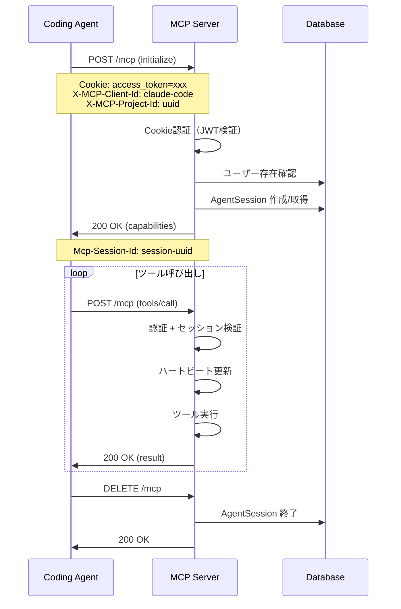
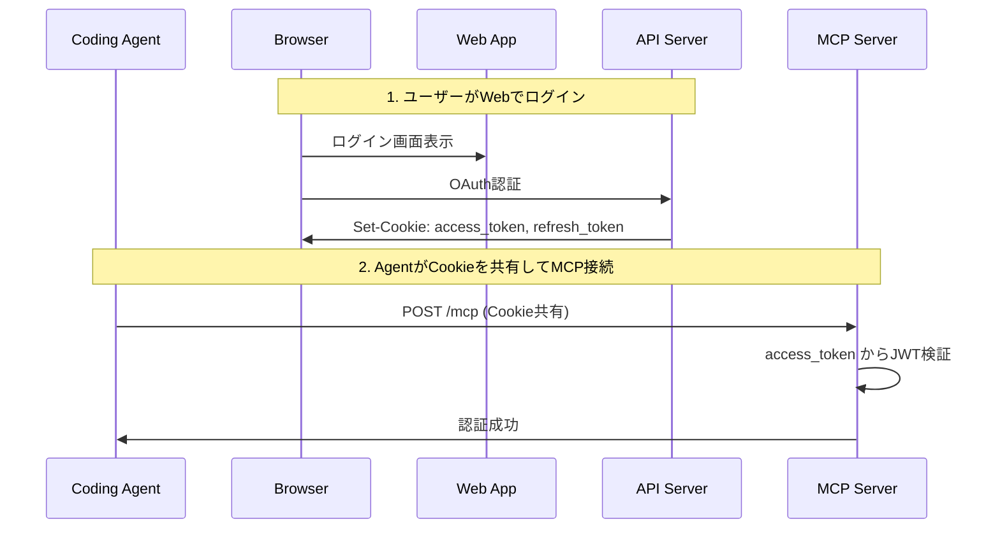
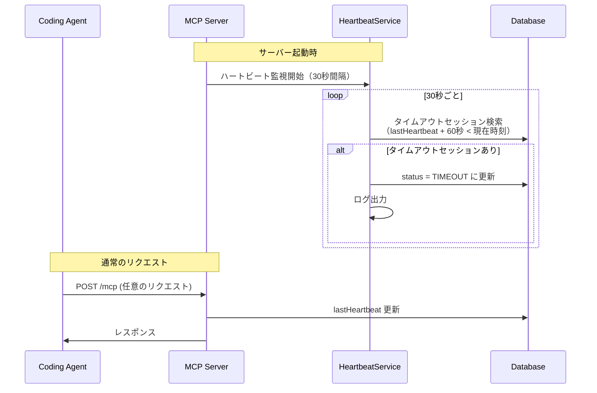
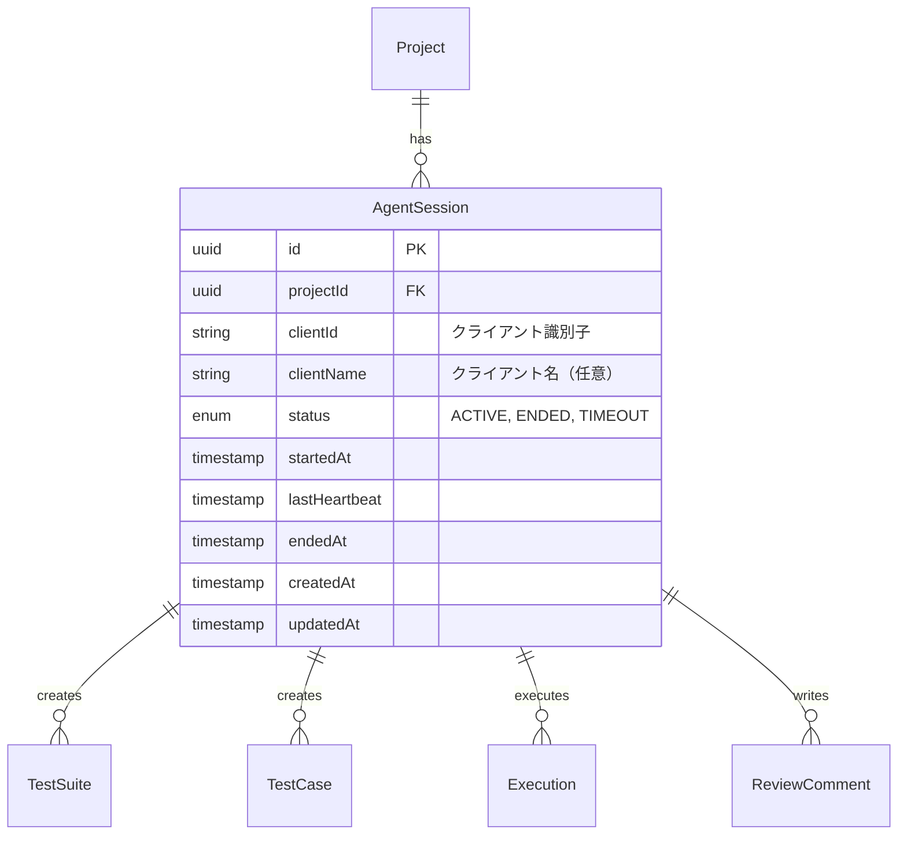
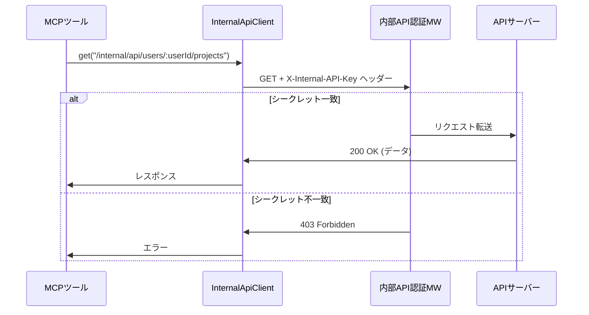

# MCP連携機能

## 概要

Coding Agent（Claude Code等）からAgentestのテスト管理機能を利用するためのMCP（Model Context Protocol）サーバーを提供する機能。Streamable HTTP + SSEトランスポートによる通信、Cookie共有によるOAuth認証連携、AgentSessionによるセッション管理を実装する。

## 機能一覧

| ID | 機能名 | 説明 | 状態 |
|----|--------|------|------|
| MCP-001 | MCP接続 | MCPプロトコルによる接続・初期化 | 実装済 |
| MCP-002 | Cookie認証連携 | Webアプリと同じOAuth認証情報を共有 | 実装済 |
| MCP-003 | AgentSession管理 | AIエージェントのセッション作成・管理 | 実装済 |
| MCP-004 | ハートビート | セッションの生存確認・タイムアウト検出 | 実装済 |
| MCP-005 | ツール登録基盤 | MCPツールの登録・実行基盤 | 実装済 |
| MCP-006 | プロジェクト検索ツール | アクセス可能なプロジェクト一覧を検索 | 実装済 |
| MCP-007 | 内部API連携 | MCP↔API間の内部API通信基盤 | 実装済 |
| MCP-008 | テスト管理ツール | テストスイート・ケースの操作ツール | 未実装 |
| MCP-009 | 実行ツール | テスト実行・結果記録ツール | 未実装 |

## システム構成

### アーキテクチャ

```
┌─────────────────────────────────────────────────────────────────┐
│                      Coding Agent (Claude Code)                  │
└─────────────────────────────────────────────────────────────────┘
                                │
                    MCP Protocol (Streamable HTTP + SSE)
                                │
                                ▼
┌─────────────────────────────────────────────────────────────────┐
│                         MCP Server                               │
│  ┌─────────────┐  ┌──────────────┐  ┌─────────────────────────┐ │
│  │  認証MW     │→│ SessionMW    │→│  MCPハンドラー          │ │
│  │(Cookie JWT) │  │(AgentSession)│  │  (ツール実行)           │ │
│  └─────────────┘  └──────────────┘  └─────────────────────────┘ │
│                                              │                   │
│                                    内部APIクライアント           │
│                                    (X-Internal-API-Key)          │
└─────────────────────────────────────────────────────────────────┘
                │                              │
    共通認証・DB・ストレージ           内部API呼び出し
                │                              │
                ▼                              ▼
┌─────────────────────────────────────────────────────────────────┐
│                      既存インフラ                                │
│  ┌──────────┐  ┌──────────┐  ┌──────────┐  ┌──────────────────┐│
│  │PostgreSQL│  │  Redis   │  │  MinIO   │  │   API Server     ││
│  └──────────┘  └──────────┘  └──────────┘  │ (/internal/api)  ││
│                                             └──────────────────┘│
└─────────────────────────────────────────────────────────────────┘
```

### エンドポイント

#### MCPサーバー（外部公開）

| メソッド | パス | 説明 | 認証 |
|----------|------|------|------|
| POST | /mcp | MCPリクエスト処理 | 必須 |
| GET | /mcp | SSEストリーム開始 | 必須 |
| DELETE | /mcp | MCPセッション終了 | 必須 |
| GET | /health | ヘルスチェック | 不要 |

#### 内部API（MCP↔API間）

| メソッド | パス | 説明 | 認証 |
|----------|------|------|------|
| GET | /internal/api/users/:userId/projects | ユーザーのプロジェクト一覧 | 共有シークレット |

## 業務フロー

### MCP接続フロー



### 認証フロー



### ハートビート・タイムアウトフロー



## データモデル



### ステータス定義

#### AgentSessionStatus

| ステータス | 説明 |
|-----------|------|
| ACTIVE | 接続中（正常動作） |
| ENDED | 正常終了（クライアントからの切断） |
| TIMEOUT | タイムアウト（ハートビート途絶） |

## ビジネスルール

### 認証

- MCPサーバーはWebアプリと同じOAuth認証を共有
- access_tokenはHttpOnly Cookieで受け渡し
- トークン検証には`@agentest/auth`の`verifyAccessToken`を使用
- 削除済みユーザー（deletedAt != null）は認証拒否

### セッション管理

- 同一プロジェクト + 同一clientIdで既存ACTIVEセッションがあれば再利用
- 新規接続時は新しいAgentSessionを作成
- すべてのMCPリクエストでハートビートを自動更新
- ハートビートタイムアウト（60秒）でセッションをTIMEOUT状態に移行

### ヘッダー仕様

| ヘッダー | 必須 | 説明 |
|----------|------|------|
| X-MCP-Client-Id | 条件付き | クライアント識別子（セッション管理時に必要） |
| X-MCP-Client-Name | 任意 | クライアント名（表示用） |
| X-MCP-Project-Id | 条件付き | プロジェクトID（セッション管理時に必要） |
| Mcp-Session-Id | 任意 | MCPセッションID（SDK管理） |

### エラーハンドリング

| エラー | HTTPステータス | JSON-RPCコード | 対応 |
|--------|---------------|----------------|------|
| 認証トークンなし | 401 | -32001 | Cookieにaccess_tokenが必要 |
| 無効なトークン | 401 | -32001 | 再ログインが必要 |
| ユーザー削除済み | 401 | -32001 | アカウント無効 |
| 認可エラー | 403 | -32002 | プロジェクト権限不足 |
| バリデーションエラー | 400 | -32003 | リクエスト形式不正 |
| 内部エラー | 500 | -32603 | サーバーエラー |

## 権限

### プロジェクトロール継承

MCPツールの操作権限は、ユーザーのプロジェクトロールを継承する。

| 操作 | OWNER | ADMIN | WRITE | READ |
|------|:-----:|:-----:|:-----:|:----:|
| MCP接続 | ✓ | ✓ | ✓ | ✓ |
| テストスイート取得 | ✓ | ✓ | ✓ | ✓ |
| テストスイート作成 | ✓ | ✓ | ✓ | - |
| テストケース作成 | ✓ | ✓ | ✓ | - |
| テスト実行 | ✓ | ✓ | ✓ | - |
| 結果記録 | ✓ | ✓ | ✓ | - |

## 設定値

| 項目 | 値 | 説明 |
|------|-----|------|
| PORT | 3004 | MCPサーバーポート |
| HEARTBEAT_INTERVAL | 30秒 | ハートビートチェック間隔 |
| HEARTBEAT_TIMEOUT | 60秒 | ハートビートタイムアウト |
| JWT_ACCESS_EXPIRY | 15分 | アクセストークン有効期限 |
| JWT_REFRESH_EXPIRY | 7日 | リフレッシュトークン有効期限 |
| JSON_BODY_LIMIT | 1MB | リクエストボディサイズ上限 |
| INTERNAL_API_SECRET | 32文字以上 | 内部API認証用共有シークレット |
| API_INTERNAL_URL | http://api:3001 | 内部API接続先URL |

## ツール登録基盤

### ToolContext

ツール実行時に利用可能なコンテキスト情報。

```typescript
interface ToolContext {
  // 認証済みユーザーID
  userId: string;
  // AgentSession情報（存在する場合）
  agentSession?: AgentSession;
  // プロジェクトID（ヘッダーから取得）
  projectId?: string;
}
```

### ツール定義例

```typescript
import { z } from 'zod';
import { toolRegistry } from './tools/index.js';

// ツール登録
toolRegistry.register({
  name: 'list_test_suites',
  description: 'プロジェクトのテストスイート一覧を取得',
  inputSchema: z.object({
    projectId: z.string().uuid(),
    limit: z.number().optional().default(20),
    offset: z.number().optional().default(0),
  }),
  handler: async (input, context) => {
    // ツール実装
    return { testSuites: [...] };
  },
});
```

## セキュリティ考慮事項

### Cookie設定

- HttpOnly: XSS対策（JavaScriptからアクセス不可）
- Secure: 本番環境ではHTTPS必須
- SameSite=Strict: CSRF対策

### CORS設定

- 許可オリジンは環境変数で設定
- credentialsを有効化（Cookie送信許可）
- 許可ヘッダーを明示的に指定

### 入力検証

- リクエストボディサイズ制限（1MB）
- JSONパース前のContent-Type検証
- Zodスキーマによる入力バリデーション

## 内部API連携（MCP-007）

### 概要

MCPサーバーからAPIサーバーのビジネスロジックを呼び出すための内部API通信基盤。共有シークレット認証により、Docker内部ネットワーク内でセキュアな通信を実現する。

### 設計方針

- **MCPサーバー**: API側への橋渡しのみ。ビジネスロジックは持たない
- **APIサーバー**: 既存のサービス層（userService等）を再利用
- **認証**: 共有シークレット（`X-Internal-API-Key`ヘッダー）

### アーキテクチャ

```
[MCPクライアント] → [MCPサーバー] → [APIサーバー(内部API)] → [DB]
                       ↑                    ↑
                  橋渡しのみ          認証:共有シークレット
                                      ビジネスロジック配置
```

### 実装ファイル

| ファイル | 役割 |
|----------|------|
| `apps/api/src/routes/internal.ts` | 内部APIルート定義 |
| `apps/api/src/middleware/internal-api.middleware.ts` | 共有シークレット認証 |
| `apps/mcp-server/src/clients/api-client.ts` | 内部APIクライアント |
| `apps/mcp-server/src/types/context.ts` | リクエストコンテキスト型 |
| `apps/mcp-server/src/transport/streamable-http.ts` | AsyncLocalStorage管理 |

### 内部API認証フロー



### コンテキスト伝達

MCPツールハンドラーへのユーザー情報伝達にAsyncLocalStorageを使用。

```typescript
// リクエスト処理時にコンテキストを設定
await requestContext.run(
  { sessionId, userId: req.user?.id, agentSession: req.agentSession },
  async () => {
    await transport.handleRequest(req, res, req.body);
  }
);

// ツールハンドラー内でコンテキストを取得
const ctx = requestContext.getStore();
const context: ToolContext = {
  userId: ctx?.userId || '',
  agentSession: ctx?.agentSession,
};
```

### セッションデータ管理

```typescript
interface McpSessionData {
  userId: string;
  agentSession?: AgentSession;
}

// セッションデータの操作
getSessionData(sessionId): McpSessionData | undefined
deleteSession(sessionId): void
cleanupAllSessions(): void
```

## search_project ツール（MCP-006）

### 概要

AIエージェントがアクセス可能なプロジェクト一覧を検索するMCPツール。

### 入力パラメータ

| パラメータ | 型 | 必須 | デフォルト | 説明 |
|-----------|-----|------|-----------|------|
| q | string | 任意 | - | プロジェクト名で検索（最大100文字） |
| limit | number | 任意 | 50 | 取得件数（1-50） |
| offset | number | 任意 | 0 | オフセット |

### レスポンス

```typescript
interface SearchProjectResponse {
  projects: Array<{
    id: string;
    name: string;
    description: string | null;
    organizationId: string | null;
    organization: {
      id: string;
      name: string;
      slug: string;
    } | null;
    role: string;          // ユーザーのプロジェクトロール
    _count: {
      testSuites: number;  // テストスイート数
    };
    createdAt: string;
    updatedAt: string;
  }>;
  pagination: {
    total: number;
    limit: number;
    offset: number;
    hasMore: boolean;
  };
}
```

### 使用例

```json
// リクエスト
{
  "name": "search_project",
  "arguments": {
    "q": "認証",
    "limit": 10
  }
}

// レスポンス
{
  "projects": [
    {
      "id": "proj_xxx",
      "name": "認証システムテスト",
      "description": "OAuth認証機能のテストプロジェクト",
      "organizationId": "org_xxx",
      "organization": {
        "id": "org_xxx",
        "name": "開発チーム",
        "slug": "dev-team"
      },
      "role": "WRITE",
      "_count": { "testSuites": 5 },
      "createdAt": "2024-01-01T00:00:00.000Z",
      "updatedAt": "2024-01-15T00:00:00.000Z"
    }
  ],
  "pagination": {
    "total": 1,
    "limit": 10,
    "offset": 0,
    "hasMore": false
  }
}
```

### 実装ファイル

| ファイル | 役割 |
|----------|------|
| `apps/mcp-server/src/tools/search-project.ts` | ツール定義・ハンドラー |
| `apps/api/src/routes/internal.ts` | 内部APIエンドポイント |
| `apps/api/src/services/user.service.ts` | getProjects/countProjectsメソッド |

## MCPツール一覧

### プロジェクト管理

| ツール名 | 説明 | 状態 |
|----------|------|------|
| search_project | アクセス可能なプロジェクト一覧を検索 | 実装済 |

### テスト管理

| ツール名 | 説明 | 状態 |
|----------|------|------|
| list_test_suites | テストスイート一覧取得 | 未実装 |
| get_test_suite | テストスイート詳細取得 | 未実装 |
| create_test_suite | テストスイート作成 | 未実装 |
| update_test_suite | テストスイート更新 | 未実装 |
| list_test_cases | テストケース一覧取得 | 未実装 |
| get_test_case | テストケース詳細取得 | 未実装 |
| create_test_case | テストケース作成 | 未実装 |
| update_test_case | テストケース更新 | 未実装 |

### テスト実行

| ツール名 | 説明 | 状態 |
|----------|------|------|
| start_execution | テスト実行開始 | 未実装 |
| record_result | テスト結果記録 | 未実装 |
| complete_execution | テスト実行完了 | 未実装 |
| upload_evidence | エビデンスアップロード | 未実装 |

## 関連機能

- [認証機能](./authentication.md) - OAuth認証、JWT管理
- [プロジェクト管理](./project-management.md) - プロジェクト権限
- [テストスイート管理](./test-suite-management.md) - ツール操作対象
- [テストケース管理](./test-case-management.md) - ツール操作対象
- [テスト実行](./test-execution.md) - ツール操作対象
- [監査ログ](./audit-log.md) - AgentSession操作の記録
