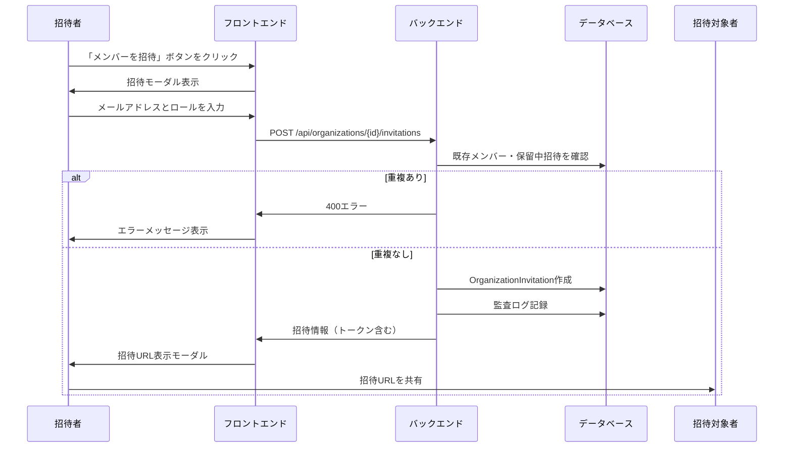
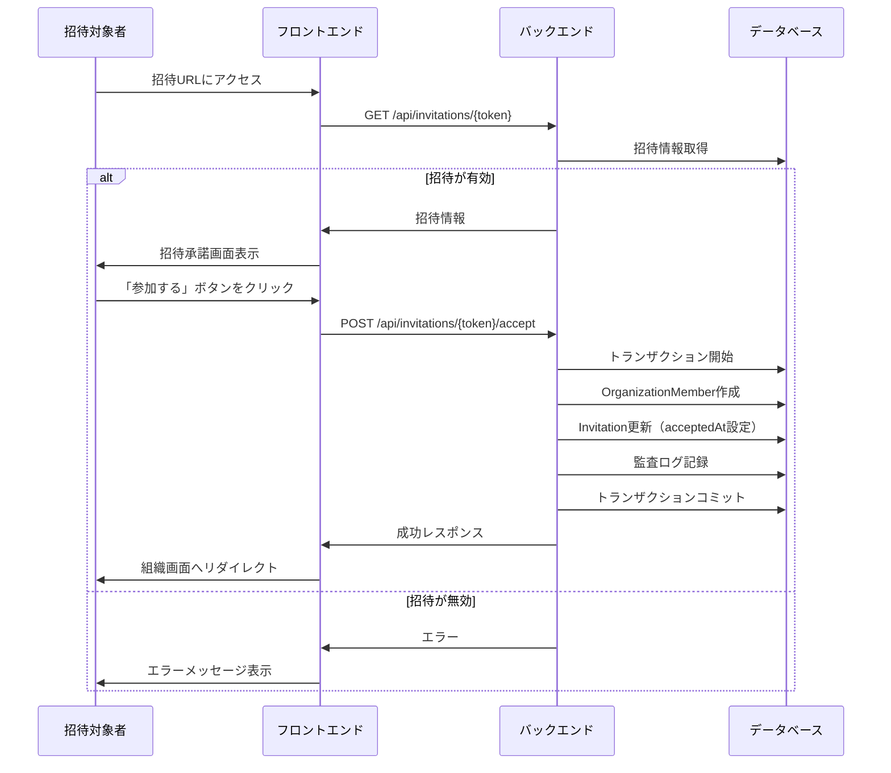
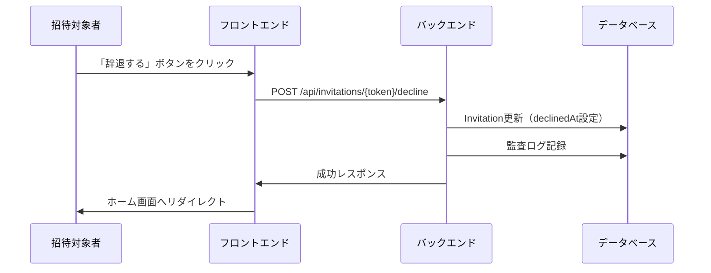
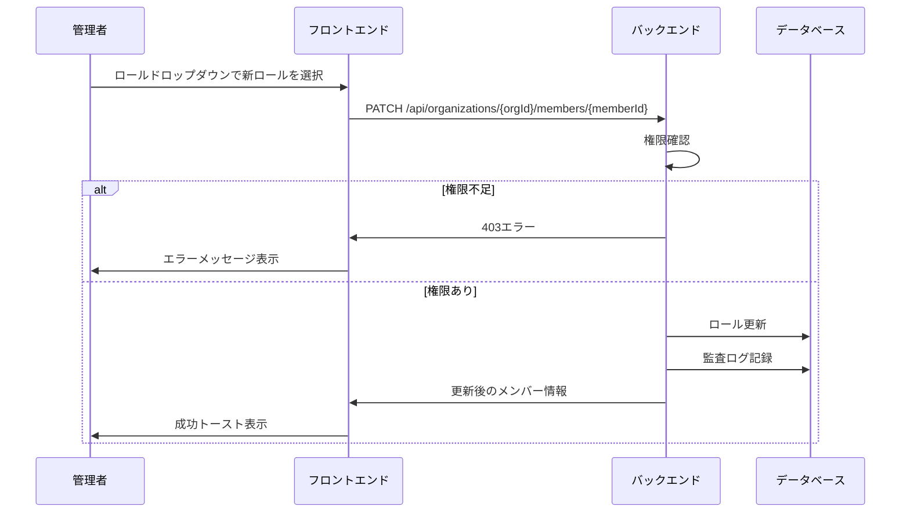
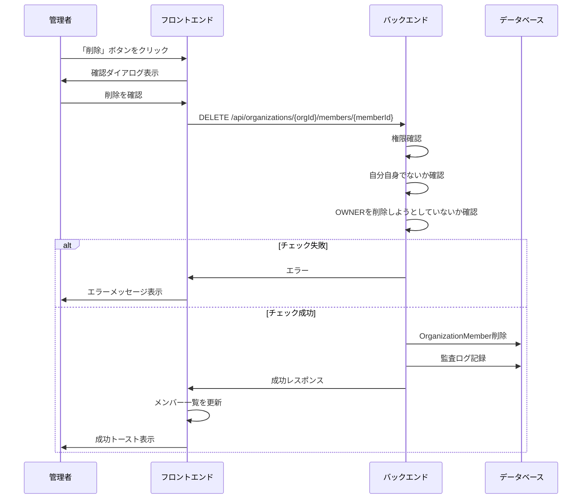
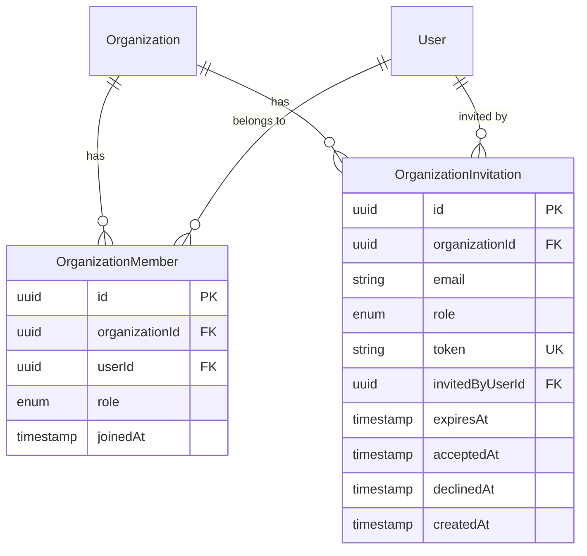

# メンバー管理機能

## 概要

組織へのメンバー招待、ロール変更、メンバー削除などのチームメンバー管理機能を提供する。

## 機能一覧

| ID | 機能名 | 説明 | 状態 |
|----|--------|------|------|
| MBR-001 | メンバー招待 | メールアドレスでメンバーを招待 | 実装済 |
| MBR-002 | 招待承諾 | 招待を承諾して組織に参加 | 実装済 |
| MBR-003 | 招待辞退 | 招待を辞退 | 実装済 |
| MBR-004 | 招待取消 | 保留中の招待をキャンセル | 実装済 |
| MBR-005 | 招待一覧 | 保留中の招待を一覧表示 | 実装済 |
| MBR-006 | メンバー一覧 | 組織メンバーを一覧表示 | 実装済 |
| MBR-007 | ロール変更 | メンバーのロールを変更 | 実装済 |
| MBR-008 | メンバー削除 | 組織からメンバーを削除 | 実装済 |

## 画面仕様

### メンバー一覧画面

- **URL**: `/organizations/{id}/members`
- **表示要素**
  - メンバータブ / 招待タブ
  - メンバー一覧
    - アバター
    - 名前
    - メールアドレス
    - ロール（OWNER/ADMIN/MEMBER）
    - 参加日
    - アクションメニュー（権限に応じて表示）
  - 「メンバーを招待」ボタン
- **権限による表示制御**
  - OWNER: 全メンバーのロール変更・削除が可能
  - ADMIN: ADMIN/MEMBERのロール変更・削除が可能
  - MEMBER: 閲覧のみ

### 招待一覧画面

- **URL**: `/organizations/{id}/members`（招待タブ）
- **表示要素**
  - 保留中の招待一覧
    - メールアドレス
    - 招待したロール
    - 招待者
    - 有効期限
    - 「取消」ボタン
- **権限**
  - OWNER, ADMIN: 招待一覧の表示・取消が可能
  - MEMBER: 表示不可

### メンバー招待モーダル

- **表示要素**
  - メールアドレス入力欄（必須）
  - ロール選択（ADMIN/MEMBER）
  - キャンセルボタン
  - 招待ボタン
- **バリデーション**
  - メールアドレス: 有効なメール形式
  - 既存メンバーのメールは招待不可
  - 保留中の招待と重複不可
- **操作**
  - 招待ボタン → 招待作成 → 招待URL表示

### 招待URL表示モーダル

- **表示要素**
  - 招待URL
  - 「URLをコピー」ボタン
  - 閉じるボタン
- **説明**
  - 招待URLを招待対象者に共有する旨を表示
  - 有効期限（7日間）の説明

### 招待承諾画面

- **URL**: `/invitations/{token}`
- **表示要素**
  - 組織名
  - 招待者名
  - 付与されるロール
  - 「参加する」ボタン
  - 「辞退する」ボタン
- **状態別表示**
  - 未ログイン: ログイン画面へリダイレクト
  - 期限切れ: エラーメッセージ
  - 既に承諾済み: 組織画面へリダイレクト

### ロール変更ドロップダウン

- **表示要素**
  - 現在のロール表示
  - ロール選択オプション（変更可能なもののみ）
- **権限による制御**
  - OWNER: 全ロール（ADMIN/MEMBER）に変更可能
  - ADMIN: MEMBER ↔ ADMIN の変更が可能（OWNERは変更不可）

## 業務フロー

### メンバー招待フロー

### 招待承諾フロー

### 招待辞退フロー

### ロール変更フロー

### メンバー削除フロー

## データモデル

## ビジネスルール

### ロール階層

| ロール | 説明 | 優先度 |
|--------|------|--------|
| OWNER | 組織オーナー | 最高 |
| ADMIN | 管理者 | 中 |
| MEMBER | 一般メンバー | 最低 |

### 招待ルール

- 招待は7日間有効
- 1メールアドレスにつき1組織1招待まで（重複不可）
- 既存メンバーのメールアドレスは招待不可
- 招待URLはトークンベース（推測不可）
- 招待の取消は招待者または上位ロールが実行可能

### ロール変更ルール

- OWNERは全メンバーのロールを変更可能
- ADMINはADMIN/MEMBERのロールを変更可能
- OWNERのロールは変更不可（オーナー移譲のみ）
- 自分自身のロールは変更不可

### メンバー削除ルール

- OWNERは全メンバーを削除可能
- ADMINはADMIN/MEMBERを削除可能
- OWNERは削除不可
- 自分自身は削除不可（組織退出機能で対応）

## 権限

| 操作 | OWNER | ADMIN | MEMBER |
|------|-------|-------|--------|
| メンバー一覧閲覧 | ✓ | ✓ | ✓ |
| 招待一覧閲覧 | ✓ | ✓ | - |
| メンバー招待 | ✓ | ✓ | - |
| 招待取消 | ✓ | ✓ | - |
| ロール変更（ADMIN↔MEMBER） | ✓ | ✓ | - |
| ロール変更（→OWNER） | - | - | - |
| メンバー削除（ADMIN/MEMBER） | ✓ | ✓* | - |
| メンバー削除（OWNER） | - | - | - |

*ADMINは他のADMIN/MEMBERのみ削除可能

## 設定値

| 項目 | 値 | 説明 |
|------|-----|------|
| INVITATION_EXPIRY_DAYS | 7 | 招待有効期限（日） |
| 招待トークン長 | 32文字 | UUID形式 |

## エラーメッセージ

| エラー | メッセージ |
|--------|----------|
| 既存メンバー | このメールアドレスは既に組織のメンバーです。 |
| 招待重複 | このメールアドレスには既に招待が送信されています。 |
| 招待期限切れ | この招待は有効期限が切れています。 |
| 招待済み | この招待は既に使用されています。 |
| 権限不足 | この操作を行う権限がありません。 |
| OWNER削除不可 | オーナーを削除することはできません。 |
| 自己削除不可 | 自分自身を削除することはできません。 |

## 関連機能

- [組織管理](./organization.md) - オーナー移譲
- [監査ログ](./audit-log.md) - メンバー操作の記録
