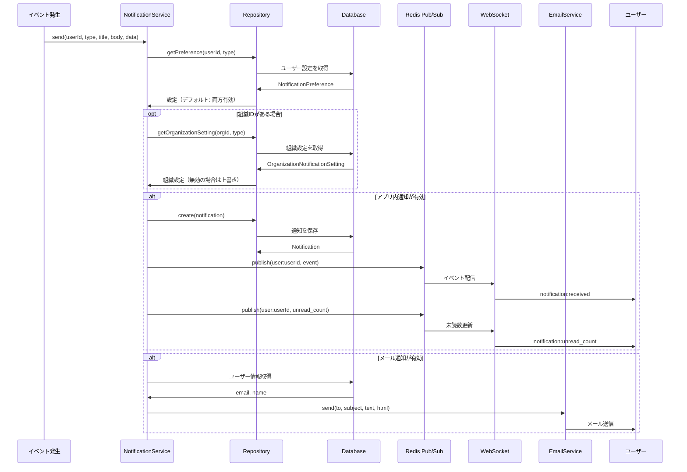
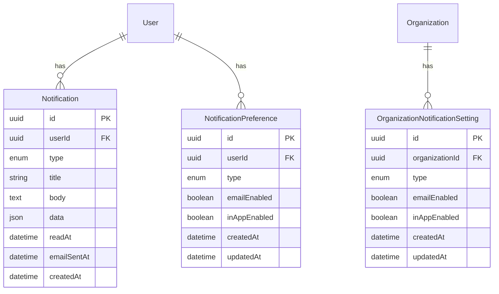

# 通知機能

## 概要

アプリ内通知（WebSocket リアルタイム配信）とメール通知を提供する機能。ユーザーは通知タイプごとにメール/アプリ内通知の ON/OFF を設定でき、組織レベルでの一括制御も可能。

## 機能一覧

| ID | 機能名 | 説明 | 状態 |
|----|--------|------|------|
| NOTIF-001 | 通知一覧表示 | ユーザーの通知一覧をページネーション付きで表示 | 実装済 |
| NOTIF-002 | 未読数バッジ | ヘッダーのベルアイコンに未読数を表示 | 実装済 |
| NOTIF-003 | 既読処理 | 個別・一括での既読処理 | 実装済 |
| NOTIF-004 | 通知削除 | 個別の通知を削除 | 実装済 |
| NOTIF-005 | WebSocket 配信 | Redis Pub/Sub 経由でリアルタイム配信 | 実装済 |
| NOTIF-006 | メール通知 | SMTP 経由でメール送信（dev: Mailpit） | 実装済 |
| NOTIF-007 | ユーザー設定 | 通知タイプ別のメール/アプリ内 ON/OFF | 実装済 |
| NOTIF-008 | 組織設定 | 組織レベルでの通知一括制御 | 実装済 |
| NOTIF-009 | 通知クリックナビゲーション | 通知タイプに応じた関連ページへの自動遷移 | 実装済 |

## 画面仕様

### NotificationCenter（ヘッダー）

- **位置**: ヘッダー右側のベルアイコン
- **表示要素**
  - ベルアイコン
  - 未読数バッジ（未読がある場合のみ表示）
  - ドロップダウンメニュー
    - 最新の通知一覧（最大 5 件）
    - 「すべて表示」リンク → Notifications ページへ
    - 「すべて既読にする」ボタン
- **操作**
  - ベルアイコンクリック → ドロップダウン表示/非表示
  - 通知クリック → 通知タイプに応じた関連ページへ遷移（未読の場合は自動的に既読処理も実行）
  - 通知を既読にする → 自動的に既読処理
- **リアルタイム更新**
  - WebSocket で新着通知を受信 → リストに追加
  - 未読数の更新をリアルタイムで反映

### Notifications ページ

- **URL**: `/notifications`
- **表示要素**
  - 通知一覧（無限スクロール or ページネーション）
  - フィルター（未読のみ表示）
  - 「すべて既読にする」ボタン
  - 各通知の削除ボタン
- **操作**
  - 通知クリック → 関連ページへ遷移
  - 削除ボタン → 確認なしで削除

### NotificationSettings ページ（予定）

- **URL**: `/settings/notifications`
- **表示要素**
  - 通知タイプ別の設定一覧
    - タイプ名
    - メール通知 ON/OFF トグル
    - アプリ内通知 ON/OFF トグル
- **操作**
  - トグル切り替え → 設定を即座に保存

## 業務フロー

### 通知送信フロー



### 設定優先順位

```
組織設定（無効の場合） → ユーザー設定を上書き → 送信しない
組織設定（有効 or 未設定） → ユーザー設定を使用
ユーザー設定（未設定） → デフォルト（有効）
```

## データモデル



## 通知タイプ

| タイプ | 説明 | トリガー |
|--------|------|----------|
| `ORG_INVITATION` | 組織への招待 | 招待メール送信時 |
| `INVITATION_ACCEPTED` | 招待の承諾 | ユーザーが招待を受諾時 |
| `PROJECT_ADDED` | プロジェクト追加 | プロジェクトメンバーに追加時 |
| `REVIEW_COMMENT` | レビューコメント | コメント・返信追加時 |
| `TEST_COMPLETED` | テスト完了 | テスト実行完了時 |
| `TEST_FAILED` | テスト失敗 | テスト実行失敗時 |
| `SECURITY_ALERT` | セキュリティ | 異常ログイン検知等 |

### 通知クリック時のナビゲーション先

通知をクリックした際、`data` フィールドの値に基づいて関連ページへ遷移する。ナビゲーションロジックは純粋関数 `getNotificationNavigationPath()` として `apps/web/src/lib/notification-navigation.ts` に実装されている。

| タイプ | data のキー | 遷移先 |
|--------|------------|--------|
| `ORG_INVITATION` | `inviteToken` | `/invitations/:inviteToken` |
| `INVITATION_ACCEPTED` | `organizationId` | `/organizations/:organizationId/settings` |
| `PROJECT_ADDED` | `projectId` | `/projects/:projectId` |
| `REVIEW_COMMENT` | `testSuiteId` | `/test-suites/:testSuiteId` |
| `TEST_COMPLETED` | `executionId` | `/executions/:executionId` |
| `TEST_FAILED` | `executionId` | `/executions/:executionId` |
| `SECURITY_ALERT` | - | ナビゲーションなし |

**ナビゲーションしない条件**:
- `data` が `null` の場合
- 必要なプロパティが欠損・空文字列・非文字列の場合
- パスセグメントとして不正な文字（英数字・ハイフン・アンダースコア以外）を含む場合

### テスト完了/失敗通知の詳細

テスト実行において全ての期待結果が判定完了したタイミングで通知を送信する。

#### 通知トリガー条件

| 条件 | 説明 |
|------|------|
| 全期待結果が判定完了 | PENDING の期待結果が 0 件になった時点 |
| 実行者と判定者が異なる | 自分で開始したテストを自分で完了させた場合は通知しない |
| 実行者が存在する | executedByUserId が設定されている場合のみ |

#### 通知タイプの選択

| 条件 | 通知タイプ |
|------|-----------|
| FAIL が 0 件 | `TEST_COMPLETED` |
| FAIL が 1 件以上 | `TEST_FAILED` |

#### 通知本文の形式

```
「{テストスイート名}」のテスト実行が完了しました（成功: X件、失敗: Y件、スキップ: Z件／合計N件）
```

※ 0件の項目は省略される

#### 通知データ（data フィールド）

```json
{
  "executionId": "uuid",
  "testSuiteId": "uuid",
  "testSuiteName": "テストスイート名",
  "passCount": 10,
  "failCount": 2,
  "skippedCount": 1,
  "totalCount": 13
}
```

#### エラーハンドリング

- 通知送信に失敗しても期待結果の更新処理は成功する（非同期・非依存）

## WebSocket イベント

| イベント | 方向 | 説明 |
|---------|------|------|
| `notification:received` | Server → Client | 新着通知を配信 |
| `notification:read` | Server → Client | 通知が既読になった |
| `notification:unread_count` | Server → Client | 未読数の更新 |

### notification:received ペイロード

```typescript
interface NotificationReceivedEvent {
  type: 'notification:received';
  eventId: string;
  timestamp: number;
  notification: {
    id: string;
    type: NotificationType;
    title: string;
    body: string;
    data: Record<string, unknown> | null;
    createdAt: string;
  };
}
```

## ビジネスルール

### 通知設定

- ユーザー設定のデフォルトは全て有効（メール・アプリ内両方）
- 組織設定で無効にすると、ユーザー設定に関わらず通知をスキップ
- 組織設定は管理者のみ変更可能

### メール送信

- メール送信失敗はアプリ内通知に影響しない（非同期処理）
- 開発環境では Mailpit に送信（実際のメール送信なし）
- 本番環境では SMTP サーバー経由で送信

### 保持期間

- 通知の保持期間: 無期限（削除されるまで保持）
- 既読状態: 永続的に保持

## 設定値

| 項目 | 値 | 説明 |
|------|-----|------|
| `SMTP_HOST` | `mailpit` (dev) | SMTP サーバーホスト |
| `SMTP_PORT` | `1025` (dev) | SMTP ポート |
| `SMTP_FROM` | `noreply@agentest.local` | 送信元アドレス |

## 権限

| ロール | 権限 |
|--------|------|
| 全ユーザー | 自分の通知一覧表示・既読・削除・設定変更 |
| 組織オーナー | 組織の通知設定変更 |
| 組織管理者 | 組織の通知設定変更 |

## セキュリティ考慮事項

- 通知は所有者のみがアクセス可能（他ユーザーの通知は取得不可）
- WebSocket は認証済みユーザー専用チャンネル（`user:{userId}`）に配信
- メール本文には機密情報を含めない

## 関連機能

- [メンバー管理](./member-management.md) - 招待通知のトリガー
- [レビューコメント](./review-comment.md) - コメント通知のトリガー
- [テスト実行](./test-execution.md) - 完了/失敗通知のトリガー
- [通知 API](../../api/notifications.md) - API リファレンス
