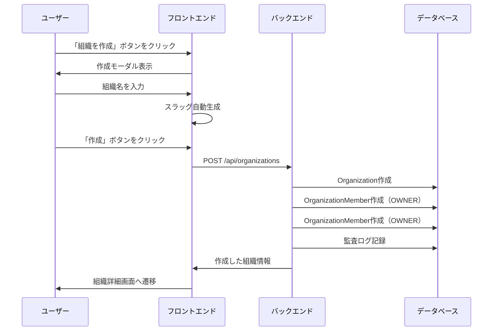
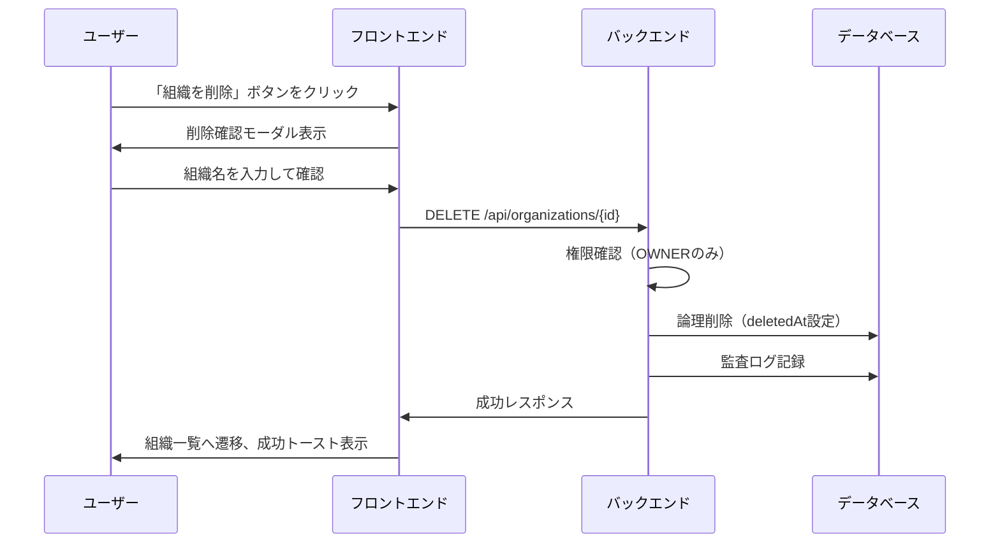
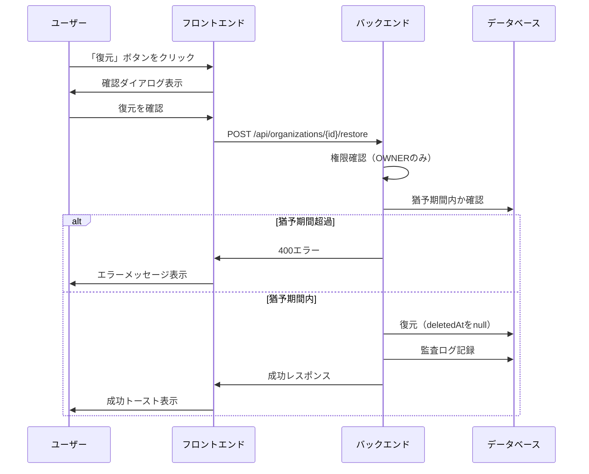
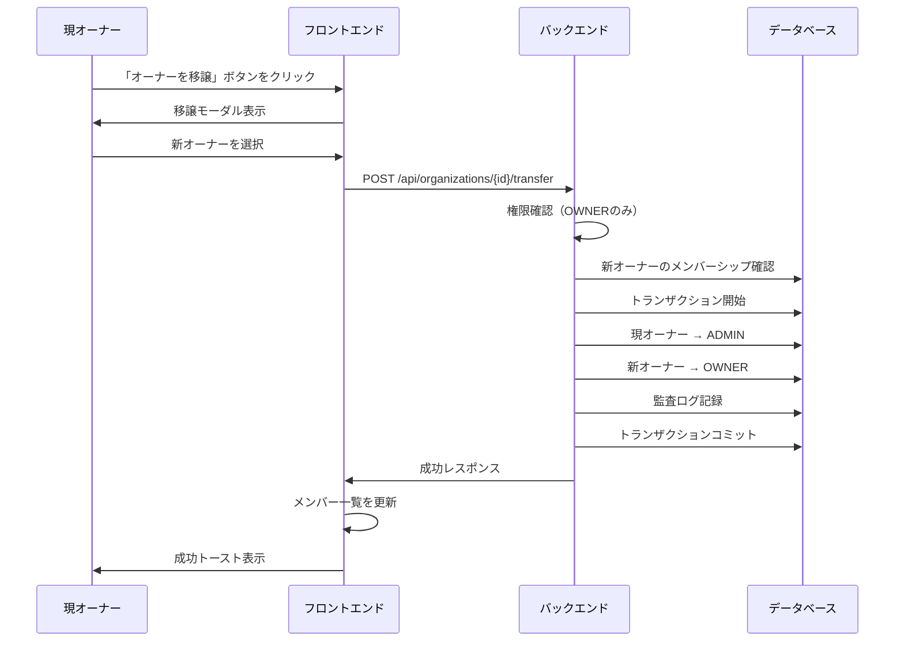
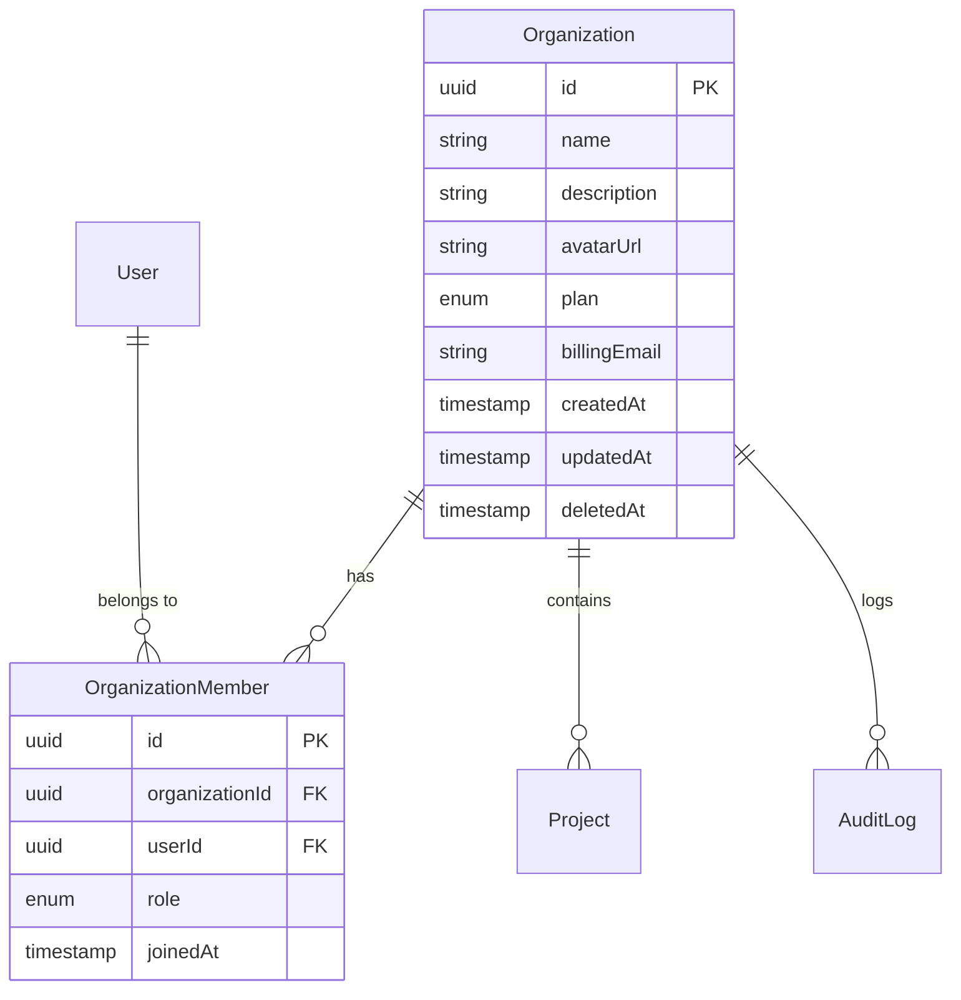

# 組織管理機能

## 概要

チーム利用の基盤となる組織の作成・設定・削除機能を提供する。組織はプロジェクトやメンバーを束ねる単位として機能する。

## 機能一覧

| ID | 機能名 | 説明 | 状態 |
|----|--------|------|------|
| ORG-001 | 組織作成 | 新規組織を作成 | 実装済 |
| ORG-002 | 組織一覧 | 所属する組織の一覧を表示 | 実装済 |
| ORG-003 | 組織設定表示 | 組織の詳細情報を表示 | 実装済 |
| ORG-004 | 組織設定編集 | 組織名、説明、請求先メールを編集 | 実装済 |
| ORG-005 | 組織削除 | 組織を論理削除（30日猶予期間） | 実装済 |
| ORG-006 | 組織復元 | 削除済み組織を復元 | 実装済 |
| ORG-007 | オーナー移譲 | 組織のオーナー権限を他メンバーに移譲 | 実装済 |
| ORG-008 | 組織課金 | 組織のTEAMプラン契約・支払い方法管理 | 実装済 |

## 画面仕様

### 組織一覧画面

- **URL**: `/organizations`
- **表示要素**
  - 組織カード一覧
    - 組織名
    - 説明（あれば）
    - メンバー数
    - 自分のロール
    - 削除済みの場合は残り日数表示
  - 「組織を作成」ボタン
- **操作**
  - 組織カードクリック → 組織詳細へ遷移
  - 作成ボタン → 組織作成モーダル表示

### 組織作成モーダル

- **表示要素**
  - 組織名入力欄（必須）
  - 説明入力欄（任意）
  - キャンセルボタン
  - 作成ボタン
- **バリデーション**
  - 組織名: 1〜100文字
  - 説明: 最大500文字
- **操作**
  - 作成ボタン → 組織作成 → 組織詳細へ遷移

### 組織設定画面

- **URL**: `/organizations/{id}/settings`
- **表示要素**
  - 基本情報セクション
    - 組織名入力欄
    - 説明入力欄
    - 請求先メール入力欄
    - 保存ボタン
  - 危険な操作セクション（OWNERのみ表示）
    - オーナー移譲ボタン
    - 組織削除ボタン（赤色）
- **バリデーション**
  - 組織名: 1〜100文字
  - 説明: 最大500文字
  - 請求先メール: 有効なメール形式
- **権限**
  - 表示: OWNER, ADMIN
  - 編集: OWNER, ADMIN
  - 危険な操作: OWNERのみ

### オーナー移譲モーダル

- **表示要素**
  - 警告メッセージ
  - メンバー選択ドロップダウン（ADMIN/MEMBERのみ）
  - キャンセルボタン
  - 移譲ボタン
- **操作**
  - メンバー選択 → 移譲ボタン有効化
  - 移譲ボタン → 確認ダイアログ → 移譲実行

### 組織削除モーダル

- **表示要素**
  - 警告メッセージ（30日猶予期間の説明）
  - 確認入力欄（組織名を入力）
  - キャンセルボタン
  - 削除ボタン（赤色）
- **操作**
  - 組織名入力 → 削除ボタン有効化
  - 削除ボタン → 論理削除 → 組織一覧へ遷移

### 削除済み組織の表示

- **表示要素**
  - 削除済みバッジ
  - 完全削除までの残り日数
  - 「復元」ボタン（OWNERのみ）
- **操作**
  - 復元ボタン → 確認ダイアログ → 復元実行

## 業務フロー

### 組織作成フロー

### 組織削除フロー

### 組織復元フロー

### オーナー移譲フロー

## データモデル

## ビジネスルール

### 組織作成

- 組織作成者は自動的にOWNERになる

### 組織削除

- OWNERのみ削除可能
- 削除は論理削除（deletedAtに現在時刻を設定）
- 30日間の猶予期間あり
- 猶予期間中は復元可能
- 猶予期間経過後、バッチ処理で物理削除

### 組織復元

- OWNERのみ復元可能
- 猶予期間内のみ復元可能
- 復元するとdeletedAtがnullになる

### オーナー移譲

- OWNERのみ実行可能
- 移譲先は現在のADMINまたはMEMBER
- 移譲後、現オーナーはADMINになる
- 1組織に1人のOWNERのみ

### プラン

| プラン | 説明 | 料金 |
|--------|------|------|
| (無料) | 組織作成直後のデフォルト状態 | ¥0 |
| TEAM | チーム向けプラン | ¥1,200/ユーザー/月 または ¥12,000/ユーザー/年 |
| ENTERPRISE | エンタープライズプラン | 要問い合わせ（初期リリース対象外） |

### TEAM プラン機能

- プロジェクト数: 無制限
- テストケース数: 無制限
- MCP連携: 利用可能
- チーム機能: 利用可能
- メンバー管理: ロールベースアクセス制御
- 優先サポート: メールサポート

### 組織課金関連画面

| 画面 | URL | 説明 |
|------|-----|------|
| 組織設定（請求タブ） | `/organizations/{id}/settings?tab=billing` | サブスクリプション・支払い方法管理 |

## 権限

| 操作 | OWNER | ADMIN | MEMBER |
|------|-------|-------|--------|
| 組織情報閲覧 | ✓ | ✓ | ✓ |
| 組織設定変更 | ✓ | ✓ | - |
| オーナー移譲 | ✓ | - | - |
| 組織削除 | ✓ | - | - |
| 組織復元 | ✓ | - | - |

## 設定値

| 項目 | 値 | 説明 |
|------|-----|------|
| DELETION_GRACE_PERIOD_DAYS | 30 | 削除猶予期間（日） |
| 組織名最大長 | 100文字 | |
| 説明最大長 | 500文字 | |

## 関連機能

- [メンバー管理](./member-management.md) - メンバーの招待・削除
- [監査ログ](./audit-log.md) - 組織操作の記録
- [組織課金](./billing.md#課金機能組織プラン) - TEAM プラン・支払い方法管理
