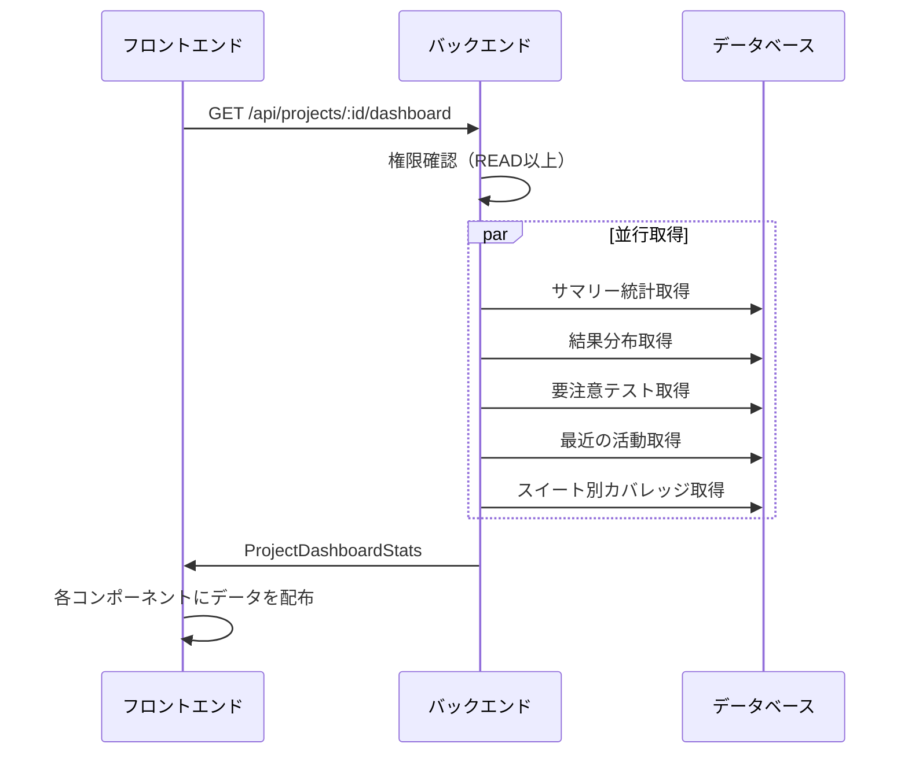

# プロジェクトダッシュボード機能

## 概要

プロジェクト詳細画面の「概要」タブで表示されるダッシュボード機能。プロジェクト内のテスト状況を一目で把握できるKPI、結果分布、要注意テスト、最近の活動、テストスイート別カバレッジを提供する。

## 機能一覧

| ID | 機能名 | 説明 | 状態 |
|----|--------|------|------|
| PDB-001 | KPIサマリーカード | テストケース数、最終実行日時、成功率、実行中テスト数を表示 | 実装済 |
| PDB-002 | 実行結果の分布 | 過去30日間の実行結果をドーナツチャートで表示 | 実装済 |
| PDB-003 | 要注意テスト一覧 | 失敗中・長期未実行・不安定なテストを一覧表示 | 実装済 |
| PDB-004 | 最近の活動 | 実行完了・テストケース更新・レビューをタイムラインで表示 | 実装済 |
| PDB-005 | テストスイート別カバレッジ | 各テストスイートの実行状況・成功率を一覧表示 | 実装済 |

## 画面仕様

### ダッシュボードレイアウト

- **URL**: `/projects/{projectId}?tab=overview`（デフォルトタブ）
- **レイアウト**: 2カラムグリッド

```
┌─────────────────────────────────────────────────────────────────────┐
│  KPIサマリーカード（4つのカード）                                      │
│  ┌──────────┐ ┌──────────┐ ┌──────────┐ ┌──────────┐              │
│  │テストケース│ │最終実行   │ │成功率     │ │実行中    │              │
│  └──────────┘ └──────────┘ └──────────┘ └──────────┘              │
├─────────────────────────────────┬───────────────────────────────────┤
│  実行結果の分布                  │  最近の活動                        │
│  ┌───────────────────────────┐ │  ┌─────────────────────────────┐  │
│  │      ドーナツチャート       │ │  │  タイムライン形式           │  │
│  │                           │ │  │                             │  │
│  └───────────────────────────┘ │  └─────────────────────────────┘  │
├─────────────────────────────────┴───────────────────────────────────┤
│  要注意テスト                                                        │
│  ┌─────────────────────────────────────────────────────────────────┐│
│  │  タブ: 失敗中 | 長期未実行 | 不安定                              ││
│  │  テーブル形式の一覧                                              ││
│  └─────────────────────────────────────────────────────────────────┘│
├─────────────────────────────────────────────────────────────────────┤
│  テストスイート別カバレッジ                                           │
│  ┌─────────────────────────────────────────────────────────────────┐│
│  │  リスト形式（プログレスバー付き）                                  ││
│  └─────────────────────────────────────────────────────────────────┘│
└─────────────────────────────────────────────────────────────────────┘
```

### KPIサマリーカード

| カード | 表示内容 | 説明 |
|--------|----------|------|
| テストケース数 | 総数 | プロジェクト内のアクティブなテストケース数 |
| 最終実行 | 相対時間 | 最後にテスト実行が完了した日時 |
| 成功率 | パーセンテージ | 過去30日間の全テスト結果の成功率 |
| 実行中 | 件数 | 現在実行中のテスト数 |

### 実行結果の分布（ドーナツチャート）

- **対象期間**: 過去30日間
- **表示カテゴリ**:
  - 成功（Pass）: 緑色
  - 失敗（Fail）: 赤色
  - スキップ（Skipped）: 黄色
  - 未判定（Pending）: グレー

### 要注意テスト一覧

3つのタブで構成：

#### 失敗中テスト
- **条件**: 最新の実行結果がFAILのテストケース
- **表示項目**: テストケース名、テストスイート名、連続失敗回数、最終実行日時
- **ソート**: 連続失敗回数の多い順
- **最大件数**: 10件

#### 長期未実行テスト
- **条件**: 30日以上実行されていない、または一度も実行されていないテストケース
- **表示項目**: テストケース名、テストスイート名、未実行日数、最終実行日時
- **ソート**: 未実行日数の多い順（未実行は先頭）
- **最大件数**: 10件

#### 不安定なテスト（Flaky）
- **条件**: 過去10回の実行で成功率が50%〜90%のテストケース
- **表示項目**: テストケース名、テストスイート名、成功率、実行回数
- **ソート**: 成功率が50%に近い順（より不安定な順）
- **最大件数**: 10件

### 最近の活動

- **表示件数**: 最大10件
- **活動種別**:
  - テスト実行完了: 「〇〇のテスト実行が完了」
  - テストケース更新: 「〇〇を更新」
  - レビュー提出: 「〇〇のレビューを承認/要修正/コメント」
- **表示項目**: アクターアバター、説明、相対時間

### テストスイート別カバレッジ

- **表示項目**:
  - テストスイート名
  - テストケース数
  - 実行済み数 / 総数
  - 成功率（プログレスバー）
  - 最終実行日時

## 業務フロー

### データ取得フロー



## データモデル

### ProjectDashboardStats

```typescript
/** プロジェクトダッシュボード統計 */
interface ProjectDashboardStats {
  /** サマリー */
  summary: ProjectDashboardSummary;
  /** 実行結果の分布 */
  resultDistribution: ResultDistribution;
  /** 要注意テスト一覧 */
  attentionRequired: AttentionRequired;
  /** 最近の活動 */
  recentActivities: RecentActivityItem[];
  /** テストスイート別カバレッジ */
  suiteCoverage: SuiteCoverageItem[];
}

/** サマリー */
interface ProjectDashboardSummary {
  totalTestCases: number;
  lastExecutionAt: Date | null;
  overallPassRate: number;
  inProgressExecutions: number;
}

/** 実行結果の分布 */
interface ResultDistribution {
  pass: number;
  fail: number;
  skipped: number;
  pending: number;
}

/** 要注意テスト一覧 */
interface AttentionRequired {
  failingTests: FailingTestItem[];
  longNotExecuted: LongNotExecutedItem[];
  flakyTests: FlakyTestItem[];
}

/** 最近の活動種別 */
type RecentActivityType = 'execution' | 'testCaseUpdate' | 'review';

/** テストスイート別カバレッジ項目 */
interface SuiteCoverageItem {
  testSuiteId: string;
  name: string;
  testCaseCount: number;
  executedCount: number;
  passRate: number;
  lastExecutedAt: Date | null;
}
```

## ビジネスルール

### 統計対象期間

| 項目 | 対象期間 |
|------|----------|
| 成功率計算 | 過去30日間の完了した実行 |
| 結果分布 | 過去30日間の完了した実行 |
| 長期未実行判定 | 30日以上前 |

### 要注意テスト判定基準

| 種別 | 判定条件 |
|------|----------|
| 失敗中 | 最新の実行結果がFAIL |
| 長期未実行 | 30日以上実行されていない、または未実行 |
| 不安定（Flaky） | 過去10回の成功率が50%〜90%（最低3回の実行が必要） |

### データ集計ルール

- 論理削除されたテストスイート・テストケースは集計対象外
- 実行中（IN_PROGRESS）のテストは結果分布に含まない
- 成功率は小数点以下切り捨て

## 権限

| 操作 | 必要権限 |
|------|----------|
| ダッシュボード閲覧 | READ以上 |

## 設定値

| 項目 | 値 | 説明 |
|------|-----|------|
| STATS_DAYS | 30 | 統計対象の日数 |
| LONG_NOT_EXECUTED_DAYS | 30 | 長期未実行とみなす日数 |
| FLAKY_EXECUTION_COUNT | 10 | 不安定テスト判定用の実行回数 |
| FLAKY_PASS_RATE_MIN | 50 | 不安定テストの成功率下限（%） |
| FLAKY_PASS_RATE_MAX | 90 | 不安定テストの成功率上限（%） |
| RECENT_ACTIVITIES_LIMIT | 10 | 最近の活動取得件数 |
| ATTENTION_LIMIT | 10 | 要注意テストの取得件数（各カテゴリ） |

## API エンドポイント

| メソッド | パス | 説明 | 権限 |
|----------|------|------|------|
| GET | /api/projects/:id/dashboard | ダッシュボード統計取得 | READ以上 |

### レスポンス例

```json
{
  "data": {
    "summary": {
      "totalTestCases": 150,
      "lastExecutionAt": "2024-01-15T10:30:00Z",
      "overallPassRate": 85,
      "inProgressExecutions": 2
    },
    "resultDistribution": {
      "pass": 120,
      "fail": 15,
      "skipped": 10,
      "pending": 2
    },
    "attentionRequired": {
      "failingTests": [...],
      "longNotExecuted": [...],
      "flakyTests": [...]
    },
    "recentActivities": [...],
    "suiteCoverage": [...]
  }
}
```

## フロントエンドコンポーネント

| ファイル | 説明 |
|----------|------|
| `apps/web/src/components/project/dashboard/KpiSummaryCards.tsx` | KPIサマリーカード |
| `apps/web/src/components/project/dashboard/ResultDistributionChart.tsx` | 実行結果分布ドーナツチャート |
| `apps/web/src/components/project/dashboard/AttentionRequiredTable.tsx` | 要注意テスト一覧（タブ付きテーブル） |
| `apps/web/src/components/project/dashboard/RecentActivityTimeline.tsx` | 最近の活動タイムライン |
| `apps/web/src/components/project/dashboard/SuiteCoverageList.tsx` | テストスイート別カバレッジ |

## バックエンド実装

| ファイル | 説明 |
|----------|------|
| `apps/api/src/services/project-dashboard.service.ts` | ダッシュボードサービス |
| `packages/shared/src/types/project-dashboard.ts` | 共有型定義 |

## 関連機能

- [プロジェクト管理](./project-management.md) - プロジェクト詳細画面
- [テスト実行](./test-execution.md) - 実行結果の管理
- [テストケース管理](./test-case-management.md) - テストケースの更新履歴
- [レビューコメント](./review-comment.md) - レビュー機能
