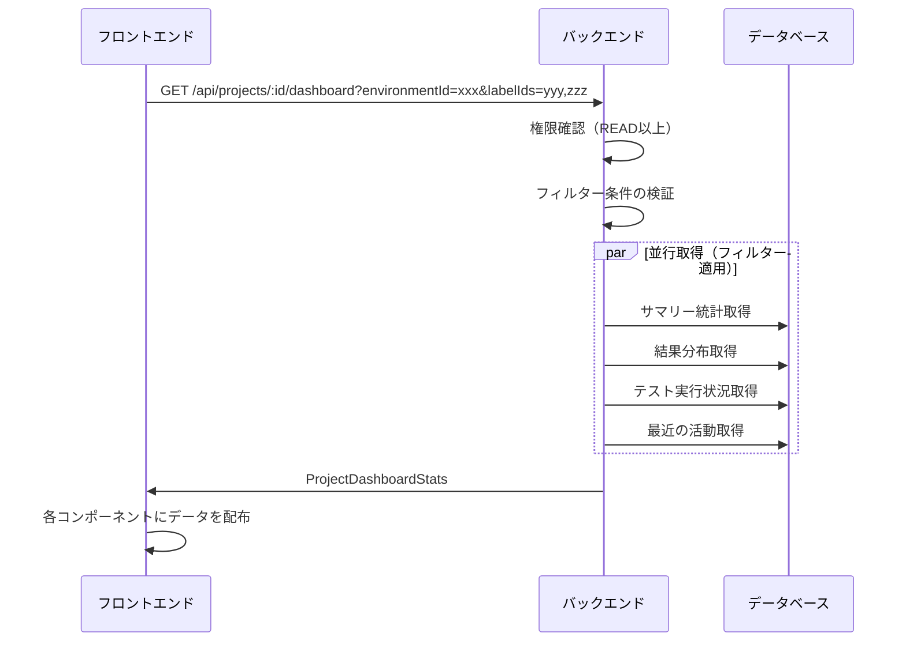
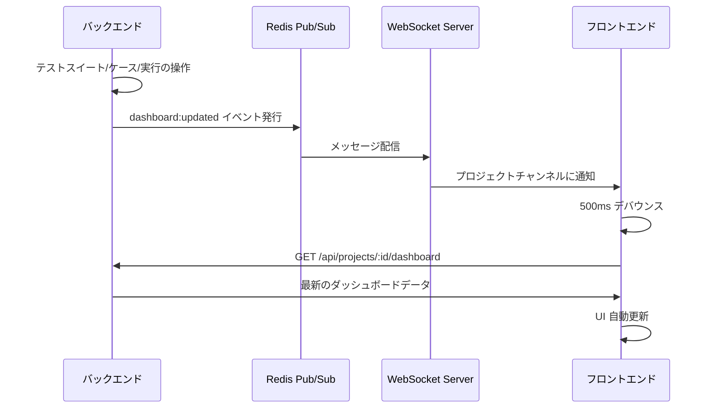

# プロジェクトダッシュボード機能

## 概要

プロジェクト詳細画面の「概要」タブで表示されるダッシュボード機能。プロジェクト内のテスト状況を一目で把握できるKPI、結果分布、テスト実行状況、最近の活動を提供する。環境・ラベルによるフィルター機能でデータを絞り込める。

## 機能一覧

| ID | 機能名 | 説明 | 状態 |
|----|--------|------|------|
| PDB-001 | KPIサマリーカード | テストスイート数、テストケース数、期待結果数を表示（3枚） | 実装済 |
| PDB-002 | 実行結果の分布 | 過去30日間の実行結果をドーナツチャートで表示 | 実装済 |
| PDB-003 | テスト実行状況 | 失敗中・スキップ中・テスト未実施・テスト実行中のテストスイートを一覧表示 | 実装済 |
| PDB-004 | 最近の活動 | 実行完了・テストケース更新・レビューをタイムラインで表示 | 実装済 |
| PDB-005 | フィルター機能 | 環境・ラベルによるダッシュボードデータの絞り込み | 実装済 |
| PDB-006 | リアルタイム更新 | WebSocketによるダッシュボードの自動更新 | 実装済 |

## 画面仕様

### ダッシュボードレイアウト

- **URL**: `/projects/{projectId}?tab=overview`（デフォルトタブ）
- **レイアウト**: 2カラムグリッド

```
┌─────────────────────────────────────────────────────────────────────┐
│  フィルター                                                          │
│  ┌──────────────────┐ ┌──────────────────────────────────────────┐ │
│  │ 環境選択         │ │ ラベル選択（複数）                         │ │
│  └──────────────────┘ └──────────────────────────────────────────┘ │
├─────────────────────────────────────────────────────────────────────┤
│  KPIサマリーカード（3つのカード）                                      │
│  ┌────────────────┐ ┌────────────────┐ ┌────────────────┐          │
│  │テストスイート数 │ │テストケース数  │ │期待結果数      │          │
│  └────────────────┘ └────────────────┘ └────────────────┘          │
├─────────────────────────────────┬───────────────────────────────────┤
│  実行結果の分布                  │  最近の活動                        │
│  ┌───────────────────────────┐ │  ┌─────────────────────────────┐  │
│  │      ドーナツチャート       │ │  │  タイムライン形式           │  │
│  │                           │ │  │                             │  │
│  └───────────────────────────┘ │  └─────────────────────────────┘  │
│  （高さ揃え）                    │  （高さ揃え）                      │
├─────────────────────────────────┴───────────────────────────────────┤
│  テスト実行状況                                                      │
│  ┌─────────────────────────────────────────────────────────────────┐│
│  │  タブ: 失敗中 | スキップ中 | テスト未実施 | テスト実行中          ││
│  │  テーブル形式の一覧（ページネーション付き）                       ││
│  └─────────────────────────────────────────────────────────────────┘│
└─────────────────────────────────────────────────────────────────────┘
```

### フィルター

| フィルター | 説明 |
|------------|------|
| 環境 | 実行環境でフィルタリング（単一選択） |
| ラベル | ラベルでフィルタリング（複数選択可） |

- フィルターを設定すると、KPI・結果分布・テスト実行状況・最近の活動すべてに反映される
- 環境フィルター: 選択した環境での実行結果のみを集計
- ラベルフィルター: 選択したラベルが付与されたテストスイートのデータのみを集計

### KPIサマリーカード

| カード | 表示内容 | 説明 |
|--------|----------|------|
| テストスイート数 | 総数 | フィルター条件に一致するアクティブなテストスイート数 |
| テストケース数 | 総数 | フィルター条件に一致するテストスイート内のアクティブなテストケース数 |
| 期待結果数 | 総数 | フィルター条件に一致するテストケース内の期待結果数 |

### 実行結果の分布（ドーナツチャート）

- **対象期間**: 過去30日間
- **表示カテゴリ**:
  - 成功（Pass）: 緑色
  - 失敗（Fail）: 赤色
  - スキップ（Skipped）: 黄色
  - 未判定（Pending）: グレー

### テスト実行状況

4つのタブで構成（テストスイート単位）：

#### 失敗中タブ
- **条件**: 最新の実行結果がFAILのテストスイート
- **表示項目**: テストスイート名、環境名、連続失敗回数、最終実行日時
- **ソート**: 連続失敗回数の多い順
- **リンク**: 行クリックで実行詳細画面（`/executions/{id}`）に遷移
- **ページネーション**: 10件ずつ

#### スキップ中タブ
- **条件**: 最新の実行結果がSKIPPEDのテストスイート
- **表示項目**: テストスイート名、環境名、連続スキップ回数、最終実行日時
- **ソート**: 連続スキップ回数の多い順
- **リンク**: 行クリックで実行詳細画面（`/executions/{id}`）に遷移
- **ページネーション**: 10件ずつ

#### テスト未実施タブ
- **条件**: 一度も実行されていないテストスイート
- **表示項目**: テストスイート名、作成日時
- **ソート**: 作成日時の古い順
- **リンク**: 行クリックでテストスイート詳細画面（`/test-suites/{id}`）に遷移
- **ページネーション**: 10件ずつ

#### テスト実行中タブ
- **条件**: ステータスがIN_PROGRESSのテストスイート
- **表示項目**: テストスイート名、環境名、開始日時
- **ソート**: 開始日時の古い順
- **リンク**: 行クリックで実行詳細画面（`/executions/{id}`）に遷移
- **ページネーション**: 10件ずつ

### 最近の活動

- **表示件数**: 最大10件
- **活動種別**:
  - テスト実行完了: 「〇〇のテスト実行が完了」
  - テストケース更新: 「〇〇を更新」
  - レビュー提出: 「〇〇のレビューを承認/要修正/コメント」
- **表示項目**: アクターアバター、説明、相対時間

## 業務フロー

### データ取得フロー



### リアルタイム更新フロー



## リアルタイム更新

### 概要

プロジェクトダッシュボードは WebSocket を通じてリアルタイムに更新される。テスト実行結果の変更、テストスイート・テストケースの追加・更新時に自動で画面が更新される。

### WebSocket イベント

| イベント | 説明 |
|----------|------|
| `dashboard:updated` | ダッシュボードデータの更新通知 |

### トリガー種別

| trigger | 発火タイミング |
|---------|----------------|
| `execution` | テスト実行開始、結果更新時 |
| `test_suite` | テストスイート作成・更新・削除・復元時 |
| `test_case` | テストケース作成・更新・削除・復元時 |
| `review` | レビュー関連操作時 |

### 更新の仕組み

1. バックエンドでテストスイート/ケース/実行の操作が発生
2. Redis Pub/Sub 経由で `dashboard:updated` イベントを発行
3. WebSocket サーバーがプロジェクトチャンネルに配信
4. フロントエンドの `useProjectDashboard` フックがイベントを受信
5. 500ms のデバウンス後、ダッシュボード API をリフェッチ
6. UI が自動更新

## データモデル

### ProjectDashboardStats

```typescript
/** ダッシュボードフィルターパラメータ */
interface DashboardFilterParams {
  /** 環境ID（単一選択） */
  environmentId?: string;
  /** ラベルID一覧（複数選択） */
  labelIds?: string[];
}

/** プロジェクトダッシュボード統計 */
interface ProjectDashboardStats {
  /** サマリー */
  summary: ProjectDashboardSummary;
  /** 実行結果の分布 */
  resultDistribution: ResultDistribution;
  /** テスト実行状況 */
  executionStatus: ExecutionStatusSuites;
  /** 最近の活動 */
  recentActivities: RecentActivityItem[];
}

/** サマリー */
interface ProjectDashboardSummary {
  /** テストスイート数 */
  totalTestSuites: number;
  /** テストケース数 */
  totalTestCases: number;
  /** 期待結果数 */
  totalExpectedResults: number;
}

/** 実行結果の分布 */
interface ResultDistribution {
  pass: number;
  fail: number;
  skipped: number;
  pending: number;
}

/** テスト実行状況（テストスイート単位） */
interface ExecutionStatusSuites {
  /** 失敗中のテストスイート */
  failing: PaginatedResult<FailingTestSuiteItem>;
  /** スキップ中のテストスイート */
  skipped: PaginatedResult<SkippedTestSuiteItem>;
  /** テスト未実施のテストスイート */
  neverExecuted: PaginatedResult<NeverExecutedTestSuiteItem>;
  /** テスト実行中のテストスイート */
  inProgress: PaginatedResult<InProgressTestSuiteItem>;
}

/** ページネーション付きの結果 */
interface PaginatedResult<T> {
  items: T[];
  total: number;
  page: number;
  pageSize: number;
  totalPages: number;
}

/** 最近の活動種別 */
type RecentActivityType = 'execution' | 'testCaseUpdate' | 'review';
```

## ビジネスルール

### 統計対象期間

| 項目 | 対象期間 |
|------|----------|
| 成功率計算 | 過去30日間の完了した実行 |
| 結果分布 | 過去30日間の完了した実行 |

### テスト実行状況の判定基準

| 種別 | 判定条件 |
|------|----------|
| 失敗中 | 最新の実行結果がFAILのテストスイート |
| スキップ中 | 最新の実行結果がSKIPPEDのテストスイート |
| テスト未実施 | 一度も実行されていないテストスイート |
| テスト実行中 | ステータスがIN_PROGRESSのテストスイート |

### データ集計ルール

- 論理削除されたテストスイート・テストケースは集計対象外
- 実行中（IN_PROGRESS）のテストは結果分布に含まない
- 成功率は小数点以下切り捨て

## 権限

| 操作 | 必要権限 |
|------|----------|
| ダッシュボード閲覧 | READ以上 |

## 設定値

| 項目 | 値 | 説明 |
|------|-----|------|
| STATS_DAYS | 30 | 統計対象の日数 |
| RECENT_ACTIVITIES_LIMIT | 10 | 最近の活動取得件数 |
| PAGE_SIZE | 10 | テスト実行状況のページサイズ（各タブ共通） |

## API エンドポイント

| メソッド | パス | 説明 | 権限 |
|----------|------|------|------|
| GET | /api/projects/:id/dashboard | ダッシュボード統計取得 | READ以上 |

### クエリパラメータ

| パラメータ | 型 | 必須 | 説明 |
|------------|------|------|------|
| environmentId | string | いいえ | 環境IDでフィルタリング |
| labelIds | string | いいえ | ラベルIDでフィルタリング（カンマ区切り） |

### レスポンス例

```json
{
  "data": {
    "summary": {
      "totalTestSuites": 12,
      "totalTestCases": 150,
      "totalExpectedResults": 450
    },
    "resultDistribution": {
      "pass": 120,
      "fail": 15,
      "skipped": 10,
      "pending": 2
    },
    "executionStatus": {
      "failing": { "items": [...], "total": 5, "page": 1, "pageSize": 10, "totalPages": 1 },
      "skipped": { "items": [...], "total": 3, "page": 1, "pageSize": 10, "totalPages": 1 },
      "neverExecuted": { "items": [...], "total": 12, "page": 1, "pageSize": 10, "totalPages": 2 },
      "inProgress": { "items": [...], "total": 2, "page": 1, "pageSize": 10, "totalPages": 1 }
    },
    "recentActivities": [...]
  }
}
```

## フロントエンドコンポーネント

| ファイル | 説明 |
|----------|------|
| `apps/web/src/hooks/useProjectDashboard.ts` | ダッシュボードデータ取得・WebSocket購読フック |
| `apps/web/src/components/project/dashboard/DashboardFilters.tsx` | フィルター（環境・ラベル選択） |
| `apps/web/src/components/project/dashboard/KpiSummaryCards.tsx` | KPIサマリーカード |
| `apps/web/src/components/project/dashboard/ResultDistributionChart.tsx` | 実行結果分布ドーナツチャート |
| `apps/web/src/components/project/dashboard/ExecutionStatusTable.tsx` | テスト実行状況（タブ付きテーブル、ページネーション対応） |
| `apps/web/src/components/project/dashboard/RecentActivityTimeline.tsx` | 最近の活動タイムライン |

## バックエンド実装

| ファイル | 説明 |
|----------|------|
| `apps/api/src/services/project-dashboard.service.ts` | ダッシュボードサービス |
| `apps/api/src/lib/redis-publisher.ts` | Redis Pub/Sub イベント発行 |
| `packages/shared/src/types/project-dashboard.ts` | 共有型定義 |
| `packages/ws-types/src/events.ts` | DashboardUpdatedEvent 型定義 |

## 関連機能

- [プロジェクト管理](./project-management.md) - プロジェクト詳細画面
- [テスト実行](./test-execution.md) - 実行結果の管理
- [テストケース管理](./test-case-management.md) - テストケースの更新履歴
- [レビューコメント](./review-comment.md) - レビュー機能
