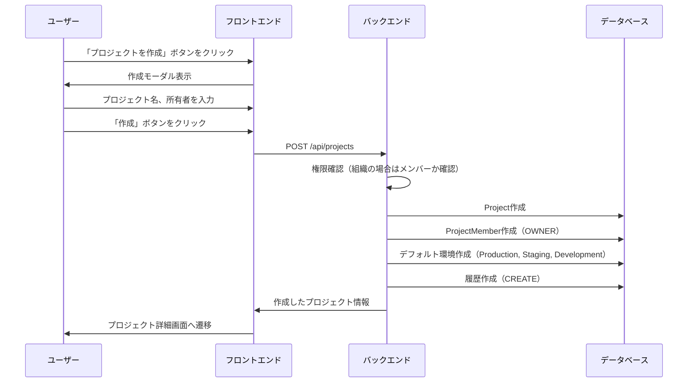
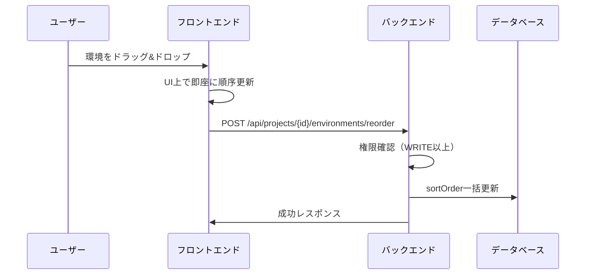
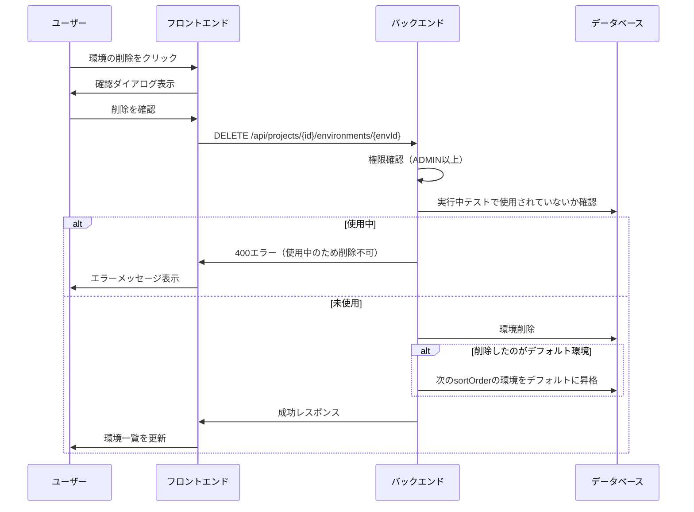
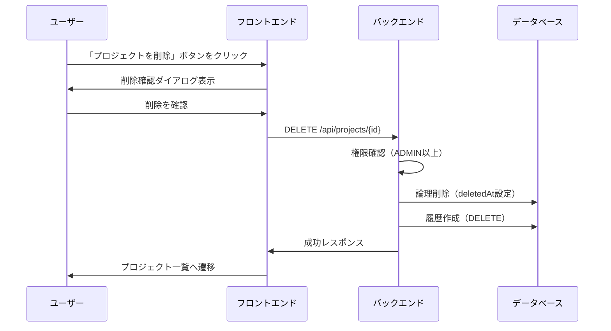
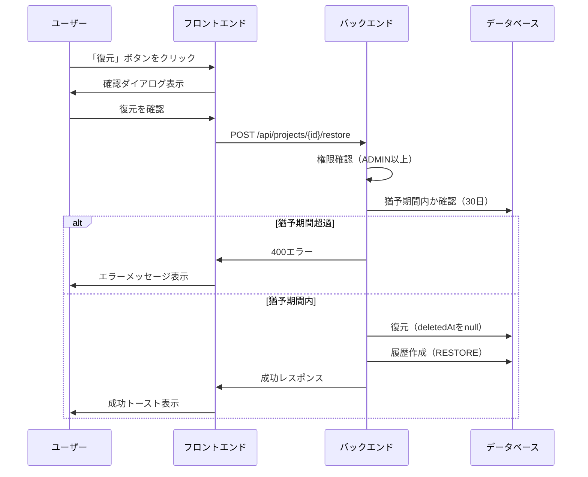
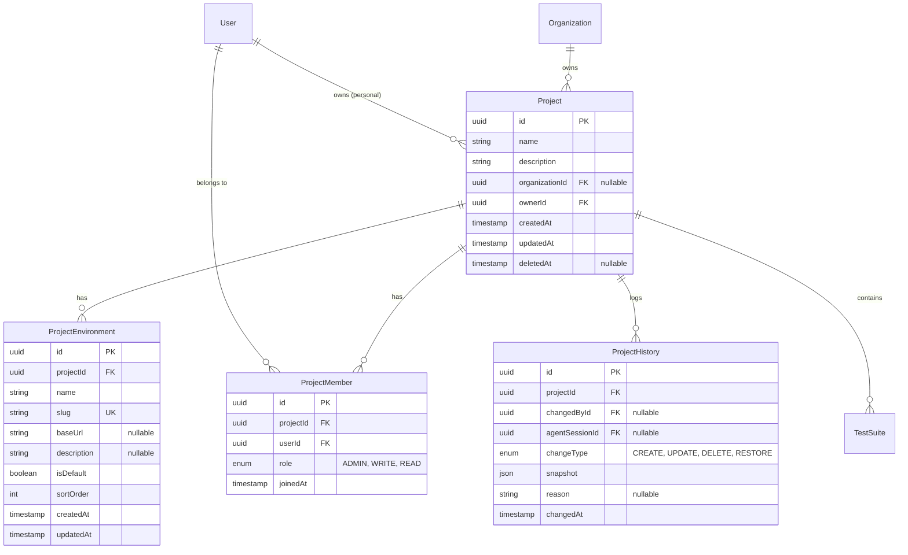

# プロジェクト管理機能

## 概要

テスト管理の基盤となるプロジェクトの作成・設定・削除機能を提供する。プロジェクトはテストスイート、テストケース、実行環境を束ねる単位として機能し、個人所有または組織所有のいずれかで管理される。

## 機能一覧

| ID | 機能名 | 説明 | 状態 |
|----|--------|------|------|
| PRJ-001 | プロジェクト作成 | 新規プロジェクトを作成（個人/組織選択可） | 実装済 |
| PRJ-002 | プロジェクト一覧 | 所属するプロジェクトの一覧を表示 | 実装済 |
| PRJ-003 | プロジェクト設定 | プロジェクト詳細情報の表示・編集 | 実装済 |
| PRJ-004 | 変更履歴 | プロジェクトの変更履歴を表示 | 実装済 |
| PRJ-005 | 論理削除・復元 | プロジェクトを論理削除（30日猶予期間）、復元 | 実装済 |
| PRJ-006 | プロジェクト検索 | 名前、組織でフィルタリング | 実装済 |
| PRJ-007 | 環境設定 | 実行環境の作成・編集・削除・並替 | 実装済 |
| PRJ-008 | メンバー管理 | メンバーの追加・削除・ロール変更 | 実装済 |

## 画面仕様

### プロジェクト一覧画面

- **URL**: `/projects`
- **表示要素**
  - プロジェクトカード一覧
    - プロジェクト名
    - 説明（あれば）
    - 所属組織（個人の場合は「Personal」）
    - テストスイート数
    - 自分のロール
    - 削除済みの場合はグレーアウト + 残り日数表示
  - 「プロジェクトを作成」ボタン
  - フィルター（組織選択、削除済み含む）
- **操作**
  - プロジェクトカードクリック → プロジェクト詳細へ遷移
  - 作成ボタン → プロジェクト作成モーダル表示

### プロジェクト作成モーダル

- **表示要素**
  - プロジェクト名入力欄（必須）
  - 説明入力欄（任意）
  - 所有者選択（個人/組織）
    - 個人: 作成者が自動的にオーナーになる
    - 組織: 所属組織から選択（アクティブな組織のみ）
  - キャンセルボタン
  - 作成ボタン
- **バリデーション**
  - プロジェクト名: 1〜100文字
  - 説明: 最大500文字
- **操作**
  - 作成ボタン → プロジェクト作成 → プロジェクト詳細へ遷移

### プロジェクト詳細画面

- **URL**: `/projects/{projectId}`
- **表示要素**
  - プロジェクト名
  - 説明
  - 所有者情報（個人/組織）
  - テストスイート一覧
  - 「設定」リンク（ADMIN以上）
- **操作**
  - テストスイートカードクリック → テストスイート詳細へ遷移
  - 設定リンク → 設定画面へ遷移

### プロジェクト設定画面

- **URL**: `/projects/{projectId}/settings`
- **タブ構成**: 一般 / メンバー / 環境 / 履歴 / 危険な操作
- **権限**: OWNER, ADMIN のみアクセス可能

#### 一般タブ

- **表示要素**
  - プロジェクト名入力欄
  - 説明入力欄
  - 所属組織/オーナー（読み取り専用）
  - 保存ボタン
- **バリデーション**
  - プロジェクト名: 1〜100文字
  - 説明: 最大500文字

#### メンバータブ

- **表示要素**
  - メンバー一覧テーブル
    - アバター、名前、メールアドレス
    - ロール（OWNER/ADMIN/WRITE/READ）
    - ロール変更ドロップダウン（ADMIN以上）
    - 削除ボタン（ADMIN以上、オーナー以外）
  - 「メンバーを追加」ボタン
- **操作**
  - 追加ボタン → メンバー追加モーダル表示

#### 環境タブ

- **表示要素**
  - 環境一覧（sortOrder順）
    - 環境名
    - slug
    - baseUrl
    - デフォルトバッジ
    - ドラッグハンドル（並替用）
    - アクションメニュー（編集/デフォルト設定/削除）
  - 「環境を追加」ボタン
- **操作**
  - ドラッグ&ドロップ → 環境の並び順変更
  - 編集 → 環境編集モーダル表示
  - デフォルト設定 → 該当環境をデフォルトに変更
  - 削除 → 確認ダイアログ → 環境削除

#### 履歴タブ

- **表示要素**
  - 変更履歴タイムライン
    - 変更者アバター、名前
    - 変更タイプ（CREATE/UPDATE/DELETE/RESTORE）
    - 変更内容の差分
    - 変更理由（あれば）
    - 日時（相対時間 + 絶対時間ツールチップ）
  - ページネーション（20件ずつ）
- **変更タイプアイコン**
  - CREATE: 緑色
  - UPDATE: 青色
  - DELETE: 赤色
  - RESTORE: 紫色

#### 危険な操作タブ

- **表示要素（通常プロジェクト）**
  - 削除セクション
    - 警告メッセージ（30日猶予期間の説明）
    - 削除ボタン（赤色）
- **表示要素（削除済みプロジェクト）**
  - 復元セクション
    - 完全削除までの残り日数
    - 復元ボタン

### 環境作成/編集モーダル

- **表示要素**
  - 環境名入力欄（必須）
  - slug入力欄（自動生成、編集可能）
  - baseUrl入力欄（任意）
  - 説明入力欄（任意）
  - 「デフォルトにする」チェックボックス
  - キャンセルボタン
  - 保存ボタン
- **バリデーション**
  - 環境名: 1〜50文字
  - slug: 1〜50文字、小文字英数字とハイフンのみ、プロジェクト内で一意
  - baseUrl: 有効なURL形式（http/https）
  - 説明: 最大200文字
- **操作**
  - 環境名入力 → slug自動生成（新規作成時のみ）
  - 保存ボタン → 環境作成/更新

### メンバー追加モーダル

- **表示要素**
  - ユーザー検索欄
  - ロール選択（ADMIN/WRITE/READ）
  - キャンセルボタン
  - 追加ボタン
- **操作**
  - ユーザー検索 → 候補表示
  - 追加ボタン → メンバー追加

## 業務フロー

### プロジェクト作成フロー

### 環境並替フロー

### 環境削除フロー

### プロジェクト削除フロー

### プロジェクト復元フロー

## データモデル

### プロジェクト所有権

プロジェクトは以下のいずれかの所有形態を持つ：

| 形態 | organizationId | ownerId | 説明 |
|------|----------------|---------|------|
| 個人所有 | null | ユーザーID | 作成者が唯一のオーナー |
| 組織所有 | 組織ID | ユーザーID | 組織に属する、作成者はオーナー |

## ビジネスルール

### プロジェクト作成

- 作成者は自動的にOWNERになる
- 組織所有の場合、作成者はその組織のメンバーである必要がある
- 作成時にデフォルト環境（Production, Staging, Development）が自動生成される
- 履歴レコード（CREATE）が自動作成される

### プロジェクト更新

- ADMIN以上のロールが必要
- 更新時に履歴レコード（UPDATE）が自動作成される
- スナップショットには変更前の値が保存される

### プロジェクト削除

- ADMIN以上のロールが必要
- 削除は論理削除（deletedAtに現在時刻を設定）
- 30日間の猶予期間あり
- 猶予期間中は復元可能
- 猶予期間経過後、バッチ処理で物理削除
- 削除時に履歴レコード（DELETE）が自動作成される

### プロジェクト復元

- ADMIN以上のロールが必要
- 猶予期間内のみ復元可能
- 復元するとdeletedAtがnullになる
- 復元時に履歴レコード（RESTORE）が自動作成される

### 環境管理

- 環境のslugはプロジェクト内で一意
- 1プロジェクトに必ず1つのデフォルト環境が存在
- デフォルト環境は削除不可（他の環境に変更後のみ削除可能）
- デフォルト環境削除時は次のsortOrderの環境が昇格
- 実行中テストで使用されている環境は削除不可
- 環境作成・編集はWRITE以上、削除はADMIN以上

### メンバー管理

- オーナー（OWNER）は削除不可
- オーナー（OWNER）のロールは変更不可
- 同一ユーザーの重複追加は不可
- ロール変更はADMIN以上

### 履歴管理

- すべての変更操作（CREATE/UPDATE/DELETE/RESTORE）で履歴が自動記録される
- 履歴は削除不可
- スナップショットには変更前の状態がJSON形式で保存される

## 権限

### プロジェクトロール

| ロール | 説明 |
|--------|------|
| OWNER | プロジェクトオーナー（作成者） |
| ADMIN | 管理者（設定変更、メンバー管理可能） |
| WRITE | 編集者（テストケース編集、環境作成可能） |
| READ | 閲覧者（閲覧のみ） |

### 操作別権限

| 操作 | OWNER | ADMIN | WRITE | READ |
|------|:-----:|:-----:|:-----:|:----:|
| プロジェクト閲覧 | ✓ | ✓ | ✓ | ✓ |
| プロジェクト設定変更 | ✓ | ✓ | - | - |
| プロジェクト削除 | ✓ | ✓ | - | - |
| プロジェクト復元 | ✓ | ✓ | - | - |
| メンバー管理 | ✓ | ✓ | - | - |
| 環境作成・編集 | ✓ | ✓ | ✓ | - |
| 環境削除 | ✓ | ✓ | - | - |
| 履歴閲覧 | ✓ | ✓ | ✓ | ✓ |

## 設定値

| 項目 | 値 | 説明 |
|------|-----|------|
| DELETION_GRACE_PERIOD_DAYS | 30 | 削除猶予期間（日） |
| RESTORE_LIMIT_DAYS | 30 | 復元可能期間（日） |
| プロジェクト名最大長 | 100文字 | |
| 説明最大長 | 500文字 | |
| 環境名最大長 | 50文字 | |
| 環境slug最大長 | 50文字 | |
| 環境baseUrl最大長 | 2048文字 | |
| 環境説明最大長 | 200文字 | |
| 履歴ページサイズ | 20件 | ページネーションのデフォルト件数 |

## API エンドポイント

### プロジェクト

| メソッド | パス | 説明 | 権限 |
|----------|------|------|------|
| POST | /api/projects | プロジェクト作成 | 認証ユーザー |
| GET | /api/projects/:id | プロジェクト取得 | READ以上 |
| PATCH | /api/projects/:id | プロジェクト更新 | ADMIN以上 |
| DELETE | /api/projects/:id | プロジェクト削除（論理） | ADMIN以上 |
| POST | /api/projects/:id/restore | プロジェクト復元 | ADMIN以上 |
| GET | /api/projects/:id/histories | 履歴一覧取得 | READ以上 |

### メンバー

| メソッド | パス | 説明 | 権限 |
|----------|------|------|------|
| GET | /api/projects/:id/members | メンバー一覧取得 | READ以上 |
| POST | /api/projects/:id/members | メンバー追加 | ADMIN以上 |
| PATCH | /api/projects/:id/members/:userId | ロール変更 | ADMIN以上 |
| DELETE | /api/projects/:id/members/:userId | メンバー削除 | ADMIN以上 |

### 環境

| メソッド | パス | 説明 | 権限 |
|----------|------|------|------|
| GET | /api/projects/:id/environments | 環境一覧取得 | READ以上 |
| POST | /api/projects/:id/environments | 環境作成 | WRITE以上 |
| PATCH | /api/projects/:id/environments/:envId | 環境更新 | WRITE以上 |
| DELETE | /api/projects/:id/environments/:envId | 環境削除 | ADMIN以上 |
| POST | /api/projects/:id/environments/reorder | 環境並替 | WRITE以上 |

## 関連機能

- [組織管理](./organization.md) - プロジェクトの所有者となる組織
- [メンバー管理](./member-management.md) - 組織メンバーの招待・削除
- [監査ログ](./audit-log.md) - プロジェクト操作の記録
