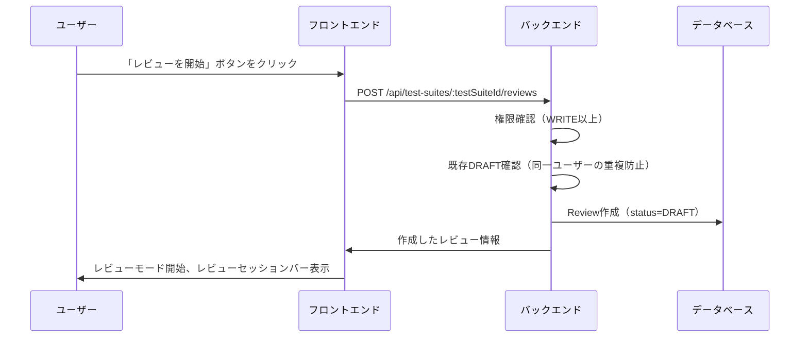
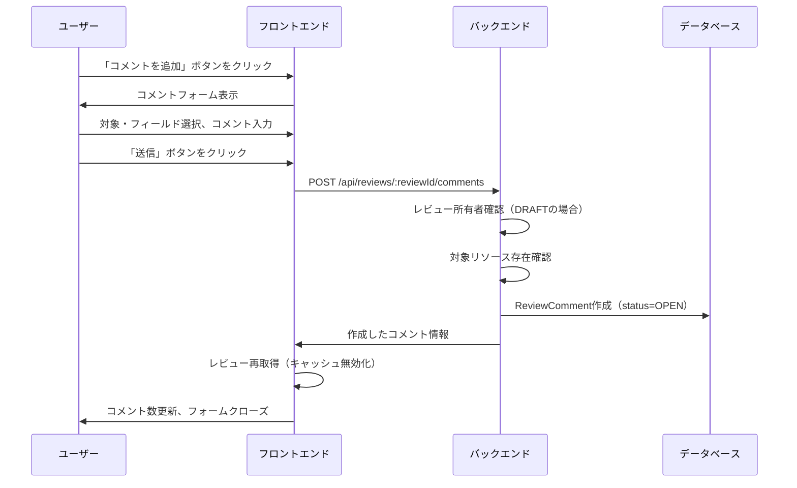
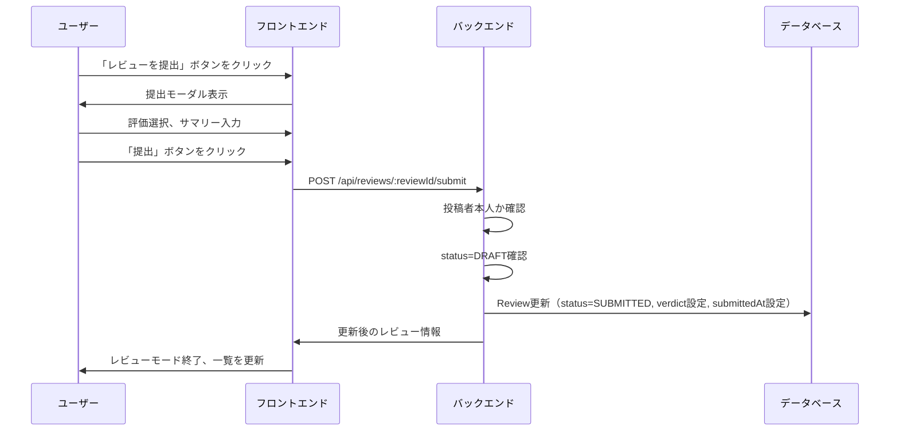
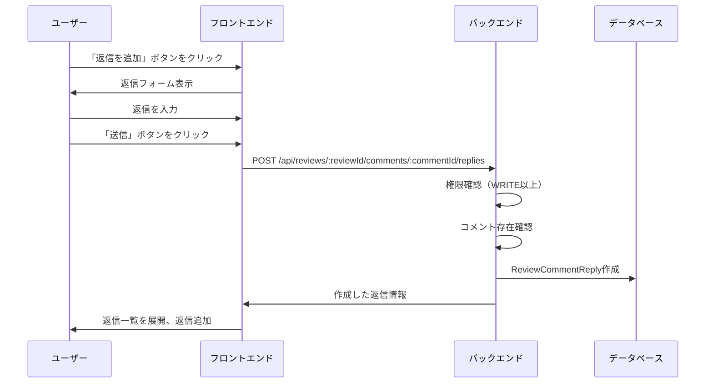
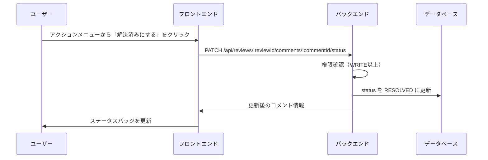
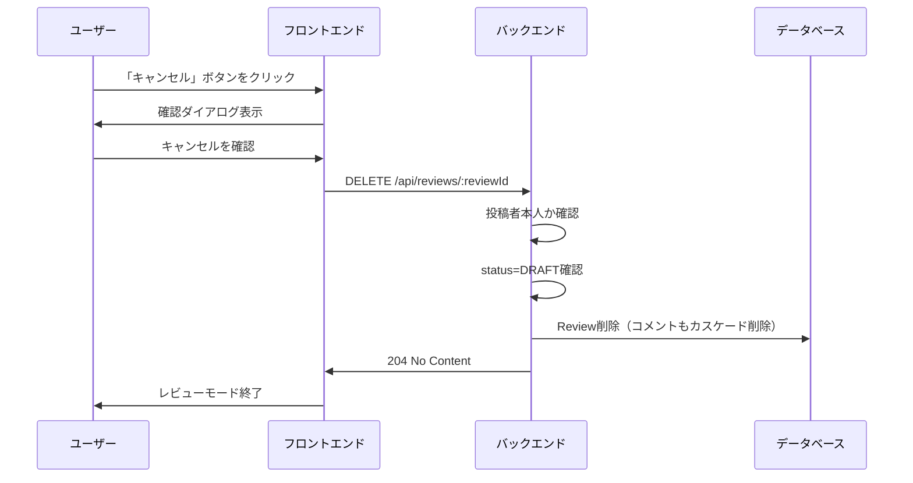
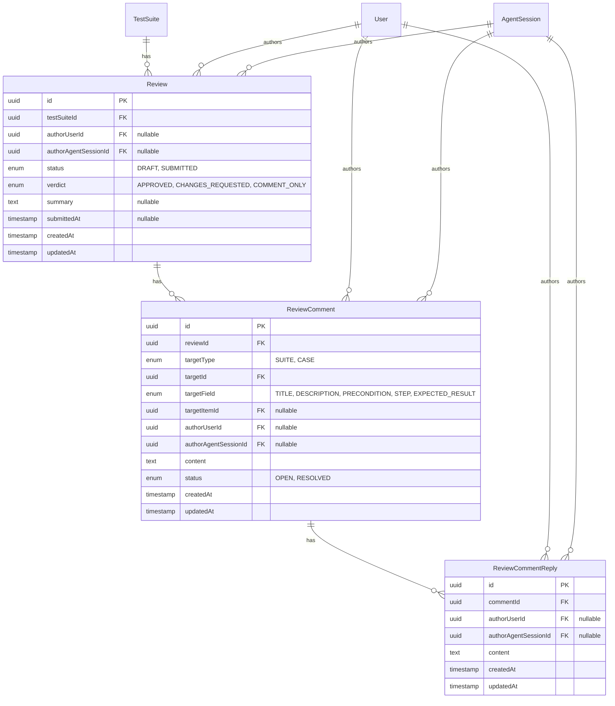

# レビュー機能

## 概要

GitHub の PR Review のような「レビューセッション」ベースのレビュー機能を提供する。レビューは「開始→コメント追加→提出」の流れで行い、提出するまでコメントは非公開となる。提出時に承認(APPROVED)/要修正(CHANGES_REQUESTED)/コメントのみ(COMMENT_ONLY)の評価を選択する。コメントはテストスイート・テストケースの特定のフィールドに紐付け可能。ユーザーと AI エージェントの両方からレビュー・コメント可能。

## 機能一覧

### レビュー操作

| ID | 機能名 | 説明 | 状態 |
|----|--------|------|------|
| RV-001 | レビュー開始 | テストスイートに対するレビューセッションを開始（DRAFT 作成） | 実装済 |
| RV-002 | レビュー提出 | 下書きレビューを提出（評価選択） | 実装済 |
| RV-003 | レビュー削除 | 下書きレビューの削除（DRAFT のみ） | 実装済 |
| RV-004 | レビュー一覧 | 提出済みレビューの一覧表示（評価別フィルタ） | 実装済 |
| RV-005 | レビュー詳細 | レビューの詳細とコメント一覧の表示 | 実装済 |
| RV-006 | 下書き一覧 | 自分の下書きレビュー一覧の取得 | 実装済 |

### コメント操作

| ID | 機能名 | 説明 | 状態 |
|----|--------|------|------|
| RC-001 | コメント追加 | レビューにコメントを追加 | 実装済 |
| RC-002 | 返信 | コメントへの返信（スレッド形式） | 実装済 |
| RC-003 | コメント編集 | 投稿者本人によるコメント編集 | 実装済 |
| RC-004 | コメント削除 | 投稿者本人によるコメント削除（返信も連動削除） | 実装済 |
| RC-005 | ステータス変更 | OPEN/RESOLVED の切り替え | 実装済 |
| RC-006 | 返信編集/削除 | 投稿者本人による返信の編集・削除 | 実装済 |

### 統合機能

| ID | 機能名 | 説明 | 状態 |
|----|--------|------|------|
| TS-005 | テストスイートレビュー連携 | テストスイート詳細にレビュータブ追加 | 実装済 |

## 画面仕様

### レビュータブ

テストスイート詳細ページ内のタブに「レビュー」を追加。

```
┌──────────────────────────────────────────────────────────────────┐
│ テストスイート名                                                   │
├──────────────────────────────────────────────────────────────────┤
│ [概要] [テストケース] [実行履歴] [レビュー] [履歴] [設定]          │
├──────────────────────────────────────────────────────────────────┤
│                                                                  │
│ ┌────────────────────────────────────────────────────────────┐   │
│ │ [レビューを開始]            フィルター: [すべて ▼]          │   │
│ │                            自分の下書き: 1件 [確認する]     │   │
│ └────────────────────────────────────────────────────────────┘   │
│                                                                  │
│ ┌────────────────────────────────────────────────────────────┐   │
│ │ 👤 田中太郎                      2024/01/15 14:30          │   │
│ │ ✅ 承認                                                    │   │
│ │ 問題ありません。このまま進めてください。                    │   │
│ │ 💬 3件のコメント                            [詳細→]       │   │
│ └────────────────────────────────────────────────────────────┘   │
│                                                                  │
│ ┌────────────────────────────────────────────────────────────┐   │
│ │ 👤 佐藤花子                      2024/01/14 10:00          │   │
│ │ ⚠ 要修正                                                   │   │
│ │ 以下の点を修正してください...                              │   │
│ │ 💬 5件のコメント                            [詳細→]       │   │
│ └────────────────────────────────────────────────────────────┘   │
│                                                                  │
│ ┌────────────────────────────────────────────────────────────┐   │
│ │ 🤖 Claude Code                   2024/01/13 09:00          │   │
│ │ 💬 コメントのみ                                            │   │
│ │ テストカバレッジについて確認しました。                     │   │
│ │ 💬 2件のコメント                            [詳細→]       │   │
│ └────────────────────────────────────────────────────────────┘   │
│                                                                  │
└──────────────────────────────────────────────────────────────────┘
```

- **表示要素**
  - ヘッダー: レビュー開始ボタン、評価別フィルター、下書き表示
  - レビュー一覧（提出済みのみ）
    - 投稿者アバター・名前（エージェントの場合は🤖アイコン）
    - 投稿日時
    - 評価バッジ（✅ 承認 / ⚠ 要修正 / 💬 コメントのみ）
    - サマリーテキスト
    - コメント数
    - 詳細ボタン

### レビュー中バー（画面下部固定）

レビュー開始後、画面下部に固定表示されるバー。

```
┌─────────────────────────────────────────────────────────────────┐
│ 📝 レビュー中 │ コメント: 3件 │      [キャンセル] [レビューを提出] │
└─────────────────────────────────────────────────────────────────┘
```

- **表示要素**
  - レビュー中ステータス
  - 追加したコメント数
  - キャンセルボタン（下書き削除）
  - 提出ボタン

### レビュー提出モーダル

```
┌─────────────────────────────────────────────────────────────────┐
│ レビューを提出                                           [×]    │
├─────────────────────────────────────────────────────────────────┤
│                                                                 │
│ 評価を選択してください                                          │
│                                                                 │
│ ┌─────────────────────────────────────────────────────────────┐ │
│ │ ○ 承認                                                     │ │
│ │   問題なし。このまま進めてください                          │ │
│ └─────────────────────────────────────────────────────────────┘ │
│                                                                 │
│ ┌─────────────────────────────────────────────────────────────┐ │
│ │ ○ 要修正                                                   │ │
│ │   修正が必要です。対応後に再度確認します                    │ │
│ └─────────────────────────────────────────────────────────────┘ │
│                                                                 │
│ ┌─────────────────────────────────────────────────────────────┐ │
│ │ ○ コメントのみ                                             │ │
│ │   評価なしでコメントを残します                              │ │
│ └─────────────────────────────────────────────────────────────┘ │
│                                                                 │
│ サマリー（オプション）                                          │
│ ┌─────────────────────────────────────────────────────────────┐ │
│ │                                                             │ │
│ └─────────────────────────────────────────────────────────────┘ │
│                                                                 │
│                               [キャンセル] [提出]               │
└─────────────────────────────────────────────────────────────────┘
```

- **操作**
  - 評価（verdict）選択（必須）
  - サマリーテキスト入力（オプション）
  - 提出ボタンで確定

### レビュー詳細モーダル

```
┌─────────────────────────────────────────────────────────────────┐
│ レビュー詳細                                             [×]    │
├─────────────────────────────────────────────────────────────────┤
│ 👤 田中太郎                           2024/01/15 14:30          │
│ ✅ 承認                                                         │
│ 問題ありません。このまま進めてください。                        │
├─────────────────────────────────────────────────────────────────┤
│ コメント（3件）                                                 │
│                                                                 │
│ ┌─────────────────────────────────────────────────────────────┐ │
│ │ ⚠ 全体 (TITLE)                                     [⋮]    │ │
│ │ 👤 田中太郎  2024/01/15 14:30                              │ │
│ │ タイトルをもう少し具体的にしてください                     │ │
│ │                                                             │ │
│ │ ▼ 2件の返信                                                │ │
│ │ ┌─────────────────────────────────────────────────────────┐ │ │
│ │ │ 🤖 Claude Code  2024/01/15 15:00                        │ │ │
│ │ │ 修正しました。確認お願いします。                        │ │ │
│ │ └─────────────────────────────────────────────────────────┘ │ │
│ │ ┌─────────────────────────────────────────────────────────┐ │ │
│ │ │ 👤 田中太郎  2024/01/15 15:30                           │ │ │
│ │ │ 確認しました。OKです。                                  │ │ │
│ │ └─────────────────────────────────────────────────────────┘ │ │
│ │                                               [返信を追加] │ │
│ └─────────────────────────────────────────────────────────────┘ │
│                                                                 │
│ ┌─────────────────────────────────────────────────────────────┐ │
│ │ ✓ 手順 (STEP) - ステップ1                          [⋮]    │ │
│ │ 👤 田中太郎  2024/01/15 14:35                              │ │
│ │ 具体的な操作内容を記載してください                         │ │
│ └─────────────────────────────────────────────────────────────┘ │
│                                                                 │
└─────────────────────────────────────────────────────────────────┘
```

- **表示要素**
  - レビュー情報（投稿者、日時、評価、サマリー）
  - コメント一覧
    - ステータスバッジ（⚠ OPEN / ✓ RESOLVED）
    - 対象フィールド・アイテム名
    - 投稿者、日時
    - コメント内容
    - 返信アコーディオン
    - アクションメニュー（編集/削除/ステータス変更）

### コメント作成フォーム

レビュー中にコメントを追加するフォーム。

```
┌────────────────────────────────────────────────────────────┐
│ 対象                                                        │
│ [テストスイート ▼] [全体 (タイトル) ▼]                      │
│                                                            │
│ ┌────────────────────────────────────────────────────────┐ │
│ │ コメントを入力...                                       │ │
│ │                                                        │ │
│ └────────────────────────────────────────────────────────┘ │
│                                                            │
│ 1,980 文字               [キャンセル] [📤 送信]            │
└────────────────────────────────────────────────────────────┘
```

- **操作**
  - 対象種別選択（テストスイート/テストケース）
  - 対象フィールド選択（TITLE/DESCRIPTION/PRECONDITION/STEP/EXPECTED_RESULT）
  - 対象アイテム選択（STEP/EXPECTED_RESULT の場合）
  - コメント入力（最大 2000 文字）
  - Ctrl/Cmd + Enter で送信
  - Escape でキャンセル

## 業務フロー

### レビュー開始フロー



### コメント追加フロー



### レビュー提出フロー



### 返信追加フロー



### ステータス変更フロー



### レビューキャンセルフロー



## データモデル



### レビューセッションステータス

| 値 | 説明 | 可視性 |
|----|------|--------|
| DRAFT | 下書き中 | 作成者本人のみ |
| SUBMITTED | 提出済み | 全ユーザー |

### レビュー評価

| 値 | 説明 | 表示 |
|----|------|------|
| APPROVED | 承認 | ✅ 緑色バッジ |
| CHANGES_REQUESTED | 要修正 | ⚠ 黄色バッジ |
| COMMENT_ONLY | コメントのみ | 💬 灰色バッジ |

### ターゲットタイプ

| 値 | 説明 |
|----|------|
| SUITE | テストスイート |
| CASE | テストケース |

### ターゲットフィールド

| 値 | 説明 | 対象 |
|----|------|------|
| TITLE | 全体（タイトル） | SUITE, CASE |
| DESCRIPTION | 説明 | SUITE, CASE |
| PRECONDITION | 前提条件 | SUITE, CASE |
| STEP | ステップ | CASE のみ |
| EXPECTED_RESULT | 期待結果 | CASE のみ |

### コメントステータス

| 値 | 説明 | 表示 |
|----|------|------|
| OPEN | 未解決 | ⚠ 黄色バッジ |
| RESOLVED | 解決済み | ✓ 緑色バッジ |

## ビジネスルール

### レビュー開始

- 対象リソース（テストスイート）の WRITE 以上のロールが必要
- 同一ユーザーが同一テストスイートに対して複数の DRAFT を持つことは不可
- 作成時のデフォルトステータスは DRAFT
- DRAFT レビューは作成者本人のみ閲覧可能

### レビュー提出

- 投稿者本人のみ提出可能
- DRAFT ステータスのみ提出可能
- 提出時に verdict（評価）の選択が必須
- 提出後は SUBMITTED となり公開される
- submittedAt が自動設定される

### レビュー削除

- 投稿者本人のみ削除可能
- DRAFT ステータスのみ削除可能
- 削除時にコメントも連動削除される（カスケード）

### コメント追加

- DRAFT レビューの場合: レビュー所有者のみ追加可能
- SUBMITTED レビューの場合: WRITE 以上のロールで追加可能
- 作成者はユーザーまたは AI エージェント（排他的に設定）
- 作成時のデフォルトステータスは OPEN
- 対象リソース（テストスイート/ケース）の存在確認
- `targetItemId` 指定時は該当アイテム（前提条件/ステップ/期待結果）の存在確認

### コメント編集/削除

- 投稿者本人のみ可能
- 編集すると updatedAt が更新される
- 削除時に返信もカスケード削除される

### ステータス変更

- 対象リソースの WRITE 以上のロールが必要
- OPEN ↔ RESOLVED の双方向変更可能

### 返信作成

- SUBMITTED レビューのコメントに対してのみ返信可能
- 対象リソースの WRITE 以上のロールが必要
- 作成者はユーザーまたは AI エージェント

### 返信編集/削除

- 投稿者本人のみ可能

## 権限

### プロジェクトロール

| ロール | 説明 |
|--------|------|
| OWNER | プロジェクトオーナー（最高権限） |
| ADMIN | 管理者（全操作可能） |
| WRITE | 編集者（作成・編集・削除可能） |
| READ | 閲覧者（閲覧のみ） |

### 操作別権限

| 操作 | OWNER | ADMIN | WRITE | READ |
|------|:-----:|:-----:|:-----:|:----:|
| レビュー一覧閲覧 | ✓ | ✓ | ✓ | ✓ |
| レビュー詳細閲覧 | ✓ | ✓ | ✓ | ✓ |
| レビュー開始 | ✓ | ✓ | ✓ | - |
| 自分のレビュー提出 | ✓ | ✓ | ✓ | - |
| 自分のレビュー削除 | ✓ | ✓ | ✓ | - |
| コメント追加 | ✓ | ✓ | ✓ | - |
| 自分のコメント編集 | ✓ | ✓ | ✓ | - |
| 自分のコメント削除 | ✓ | ✓ | ✓ | - |
| ステータス変更 | ✓ | ✓ | ✓ | - |
| 返信追加 | ✓ | ✓ | ✓ | - |
| 自分の返信編集 | ✓ | ✓ | ✓ | - |
| 自分の返信削除 | ✓ | ✓ | ✓ | - |

### DRAFT レビューのアクセス制御

- DRAFT レビューは作成者本人のみアクセス可能
- 他のユーザーはレビュー一覧で DRAFT を見ることができない
- 直接アクセスしても 404 が返される

## 設定値

| 項目 | 値 | 説明 |
|------|-----|------|
| サマリー最大長 | 2000 文字 | summary の最大長 |
| コメント最大長 | 2000 文字 | content の最大長 |
| 返信最大長 | 2000 文字 | content の最大長 |
| デフォルト取得件数 | 50 件 | limit のデフォルト値 |
| 最大取得件数 | 100 件 | limit の最大値 |

## API エンドポイント

### レビュー操作

| メソッド | パス | 説明 | 権限 |
|----------|------|------|------|
| POST | /api/test-suites/:testSuiteId/reviews | レビュー開始（DRAFT 作成） | WRITE 以上 |
| GET | /api/test-suites/:testSuiteId/reviews | レビュー一覧取得（SUBMITTED のみ） | READ 以上 |
| GET | /api/reviews/drafts | 自分の下書き一覧 | 認証済み |
| GET | /api/reviews/:reviewId | レビュー詳細取得 | READ 以上 |
| PATCH | /api/reviews/:reviewId | レビュー更新 | 投稿者本人 |
| POST | /api/reviews/:reviewId/submit | レビュー提出 | 投稿者本人 |
| DELETE | /api/reviews/:reviewId | レビュー削除（DRAFT のみ） | 投稿者本人 |

### コメント操作

| メソッド | パス | 説明 | 権限 |
|----------|------|------|------|
| POST | /api/reviews/:reviewId/comments | コメント追加 | レビュー所有者 or WRITE 以上 |
| PATCH | /api/reviews/:reviewId/comments/:commentId | コメント編集 | 投稿者本人 |
| DELETE | /api/reviews/:reviewId/comments/:commentId | コメント削除 | 投稿者本人 |
| PATCH | /api/reviews/:reviewId/comments/:commentId/status | ステータス変更 | WRITE 以上 |

### 返信操作

| メソッド | パス | 説明 | 権限 |
|----------|------|------|------|
| POST | /api/reviews/:reviewId/comments/:commentId/replies | 返信追加 | WRITE 以上 |
| PATCH | /api/reviews/:reviewId/comments/:commentId/replies/:replyId | 返信編集 | 投稿者本人 |
| DELETE | /api/reviews/:reviewId/comments/:commentId/replies/:replyId | 返信削除 | 投稿者本人 |

### 一覧取得クエリパラメータ

| パラメータ | 型 | 説明 | デフォルト |
|-----------|-----|------|-----------|
| verdict | enum | 評価フィルタ（APPROVED/CHANGES_REQUESTED/COMMENT_ONLY） | - |
| limit | number | 取得件数（1-100） | 50 |
| offset | number | オフセット | 0 |

## リクエスト・レスポンス仕様

### レビュー開始

**リクエスト**
```json
{
  "summary": "オプションの初期サマリー"
}
```

**レスポンス**
```json
{
  "review": {
    "id": "uuid",
    "testSuiteId": "uuid",
    "authorUserId": "uuid",
    "authorAgentSessionId": null,
    "status": "DRAFT",
    "verdict": null,
    "summary": null,
    "submittedAt": null,
    "createdAt": "2024-01-01T00:00:00Z",
    "updatedAt": "2024-01-01T00:00:00Z",
    "author": {
      "id": "uuid",
      "name": "山田太郎",
      "avatarUrl": "https://..."
    },
    "agentSession": null,
    "comments": [],
    "_count": { "comments": 0 }
  }
}
```

### レビュー提出

**リクエスト**
```json
{
  "verdict": "APPROVED",
  "summary": "全体的に問題ありません。"
}
```

**レスポンス**
```json
{
  "review": {
    "id": "uuid",
    "status": "SUBMITTED",
    "verdict": "APPROVED",
    "summary": "全体的に問題ありません。",
    "submittedAt": "2024-01-01T10:00:00Z",
    ...
  }
}
```

### レビュー一覧取得

**リクエスト**
```
GET /api/test-suites/:testSuiteId/reviews?verdict=APPROVED&limit=50&offset=0
```

**レスポンス**
```json
{
  "reviews": [
    {
      "id": "uuid",
      "testSuiteId": "uuid",
      "status": "SUBMITTED",
      "verdict": "APPROVED",
      "summary": "問題ありません",
      "submittedAt": "2024-01-15T14:30:00Z",
      "author": { ... },
      "agentSession": null,
      "_count": { "comments": 3 }
    }
  ],
  "total": 10,
  "limit": 50,
  "offset": 0
}
```

### コメント追加

**リクエスト**
```json
{
  "targetType": "SUITE",
  "targetId": "uuid",
  "targetField": "TITLE",
  "targetItemId": null,
  "content": "コメント内容"
}
```

**レスポンス**
```json
{
  "comment": {
    "id": "uuid",
    "reviewId": "uuid",
    "targetType": "SUITE",
    "targetId": "uuid",
    "targetField": "TITLE",
    "targetItemId": null,
    "authorUserId": "uuid",
    "authorAgentSessionId": null,
    "content": "コメント内容",
    "status": "OPEN",
    "createdAt": "2024-01-01T00:00:00Z",
    "updatedAt": "2024-01-01T00:00:00Z",
    "author": {
      "id": "uuid",
      "name": "山田太郎",
      "avatarUrl": "https://..."
    },
    "agentSession": null,
    "replies": [],
    "_count": { "replies": 0 }
  }
}
```

### ステータス変更

**リクエスト**
```json
{
  "status": "RESOLVED"
}
```

**レスポンス**
```json
{
  "comment": {
    "id": "uuid",
    "status": "RESOLVED",
    "updatedAt": "2024-01-01T03:00:00Z",
    ...
  }
}
```

### 返信追加

**リクエスト**
```json
{
  "content": "返信内容"
}
```

**レスポンス**
```json
{
  "reply": {
    "id": "uuid",
    "commentId": "uuid",
    "authorUserId": "uuid",
    "authorAgentSessionId": null,
    "content": "返信内容",
    "createdAt": "2024-01-01T04:00:00Z",
    "updatedAt": "2024-01-01T04:00:00Z",
    "author": {
      "id": "uuid",
      "name": "佐藤花子",
      "avatarUrl": "https://..."
    },
    "agentSession": null
  }
}
```

## コンポーネント構成

### フロントエンド

```
apps/web/src/
├── contexts/
│   └── ReviewSessionContext.tsx      # レビューセッション状態管理Context
├── components/
│   └── review/
│       ├── ReviewPanel.tsx           # レビュータブのメインパネル
│       ├── ReviewList.tsx            # 提出済みレビュー一覧
│       ├── ReviewItem.tsx            # 個別レビュー表示
│       ├── ReviewDetailModal.tsx     # レビュー詳細モーダル
│       ├── ReviewSessionBar.tsx      # レビュー中バー（画面下部固定）
│       ├── ReviewSubmitModal.tsx     # 提出確認モーダル
│       ├── ReviewVerdictBadge.tsx    # 評価バッジ
│       ├── ReviewCommentList.tsx     # コメント一覧
│       ├── ReviewCommentItem.tsx     # コメントアイテム
│       ├── ReviewCommentForm.tsx     # コメント入力フォーム
│       ├── ReviewCommentEditor.tsx   # インライン編集エディタ
│       └── ReviewStatusBadge.tsx     # OPEN/RESOLVEDバッジ
├── lib/
│   └── api.ts                        # reviewsApi
└── pages/
    └── TestSuiteCases.tsx            # レビューパネル統合
```

### バックエンド

```
apps/api/src/
├── routes/
│   ├── reviews.ts                    # レビュールート
│   └── test-suites.ts                # レビュー開始・一覧エンドポイント
├── controllers/
│   └── review.controller.ts          # コントローラー
├── services/
│   └── review.service.ts             # ビジネスロジック・認可
├── repositories/
│   └── review.repository.ts          # DB操作
└── middleware/
    └── require-review-role.ts        # レビュー権限ミドルウェア
```

### 共通パッケージ

```
packages/
├── shared/src/
│   ├── types/
│   │   ├── review.ts                 # 型定義
│   │   └── enums.ts                  # ReviewSessionStatus, ReviewVerdict など
│   └── validators/
│       └── schemas.ts                # バリデーションスキーマ
└── db/prisma/
    └── schema.prisma                 # Review, ReviewComment, ReviewCommentReply モデル
```

## React Query キー

```typescript
// レビュー一覧（テストスイート別）
['test-suite-reviews', testSuiteId]
['test-suite-reviews', testSuiteId, verdictFilter]

// 自分の下書きレビュー一覧
['review-drafts']

// レビュー詳細
['review', reviewId]
```

## 関連機能

- [テストスイート管理](./test-suite-management.md) - レビュー対象
- [プロジェクト管理](./project-management.md) - 権限の継承元
- [認証・認可](./authentication.md) - 認証基盤

## 関連ドキュメント

- [レビュー テーブル定義](../database/review.md)
