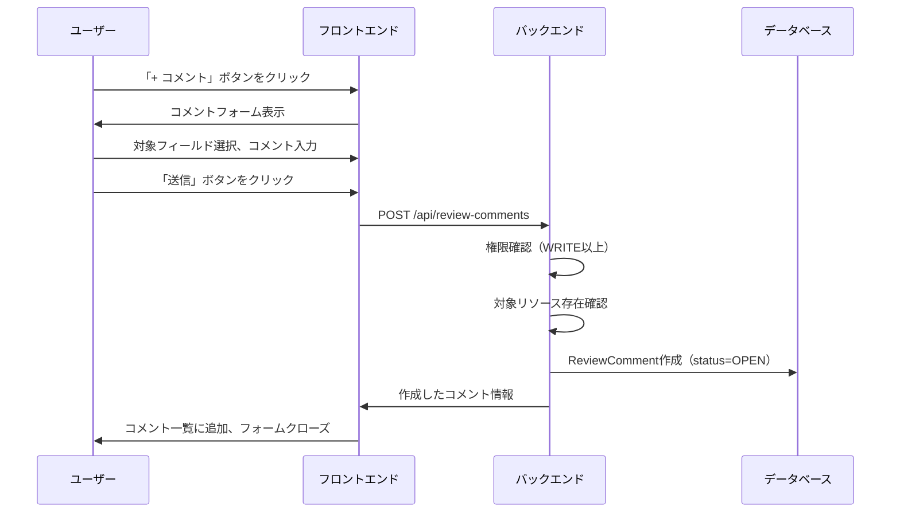
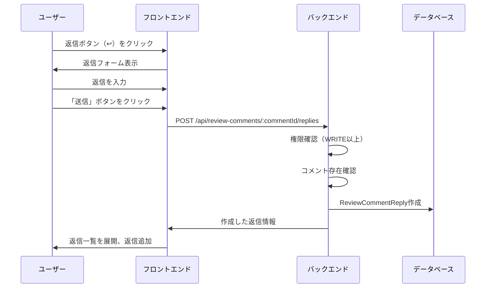
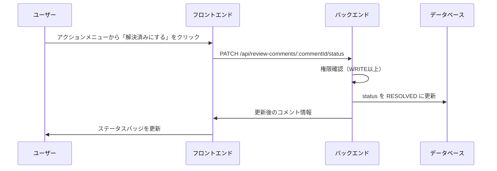
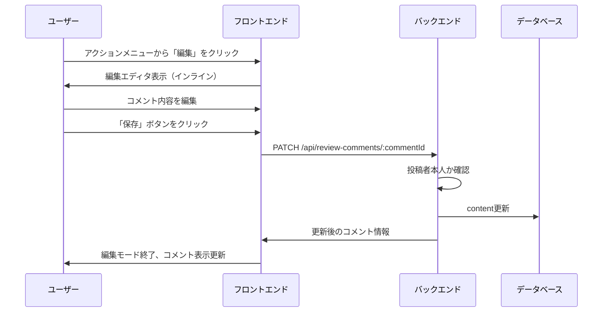
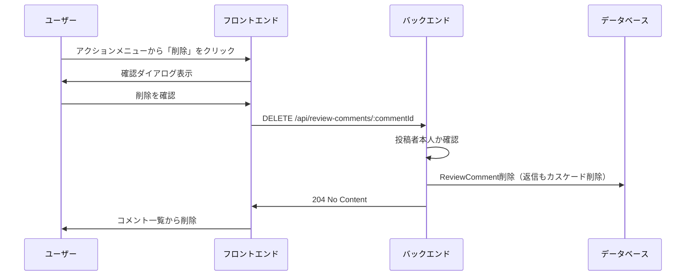
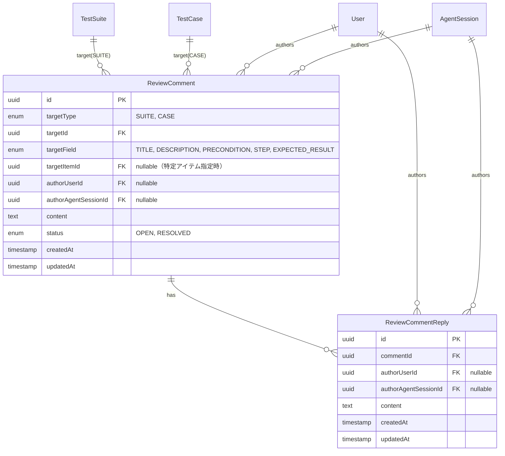

# レビューコメント機能

## 概要

テストスイート・テストケースに対するレビューコメント機能を提供する。コメントはタイトル・説明・前提条件・ステップ・期待結果などの特定のフィールドに紐付けることができ、OPEN/RESOLVEDのステータス管理や返信機能を備える。ユーザーとAIエージェントの両方からコメント可能。

## 機能一覧

| ID | 機能名 | 説明 | 状態 |
|----|--------|------|------|
| RC-001 | コメント登録 | テストスイート/ケースにコメントを追加 | 実装済 |
| RC-002 | 返信 | コメントへの返信 | 実装済 |
| RC-003 | コメント編集 | 投稿者本人によるコメント編集 | 実装済 |
| RC-004 | コメント削除 | 投稿者本人によるコメント削除（返信も連動削除） | 実装済 |
| RC-005 | ステータス変更 | OPEN/RESOLVED の切り替え | 実装済 |
| RC-006 | フィルタリング | ステータス・対象フィールドでフィルタ | 実装済 |
| TS-005 | テストスイートレビュー連携 | テストスイート詳細にレビュータブ追加 | 実装済 |
| TC-006 | テストケースレビュー連携 | テストケース詳細にレビュータブ追加 | 実装済 |

## 画面仕様

### テストスイート詳細のレビュータブ

テストスイート詳細ページ内のタブに「レビュー」を追加。

```
┌──────────────────────────────────────────────────────────────────┐
│ テストスイート名                                                   │
├──────────────────────────────────────────────────────────────────┤
│ [概要] [実行履歴] [レビュー] [履歴] [設定]                         │
├──────────────────────────────────────────────────────────────────┤
│                                                                  │
│ ┌────────────────────────────────────────────────────────────┐   │
│ │ 💬 レビューコメント (2 件の未解決 / 5 件)      [+ コメント] │   │
│ └────────────────────────────────────────────────────────────┘   │
│                                                                  │
│ ┌────────────────────────────────────────────────────────────┐   │
│ │ フィルタ: [すべて ▼] [全フィールド ▼]                      │   │
│ └────────────────────────────────────────────────────────────┘   │
│                                                                  │
│ ┌────────────────────────────────────────────────────────────┐   │
│ │ ⚠ 全体                                                     │   │
│ │ ┌────────────────────────────────────────────────────────┐ │   │
│ │ │ 👤 山田太郎  2024/01/01 10:00              [⋮]         │ │   │
│ │ │ この説明をもう少し詳しくしてください                     │ │   │
│ │ └────────────────────────────────────────────────────────┘ │   │
│ │ ▼ 2 件の返信                                               │   │
│ │ ┌────────────────────────────────────────────────────────┐ │   │
│ │ │ 👤 佐藤花子  2024/01/01 11:00                          │ │   │
│ │ │ 修正しました、確認お願いします                          │ │   │
│ │ └────────────────────────────────────────────────────────┘ │   │
│ └────────────────────────────────────────────────────────────┘   │
│                                                                  │
│ ┌────────────────────────────────────────────────────────────┐   │
│ │ ✓ 説明                                                     │   │
│ │ ┌────────────────────────────────────────────────────────┐ │   │
│ │ │ 🤖 Claude Code  2024/01/02 09:00                       │ │   │
│ │ │ テスト条件の網羅性を確認しました                        │ │   │
│ │ └────────────────────────────────────────────────────────┘ │   │
│ └────────────────────────────────────────────────────────────┘   │
└──────────────────────────────────────────────────────────────────┘
```

- **表示要素**
  - ヘッダー: コメント数（未解決/全件）、新規コメントボタン
  - フィルター: ステータス（すべて/未解決/解決済み）、対象フィールド
  - コメント一覧
    - ステータスバッジ（⚠ 未解決 / ✓ 解決済み）
    - 対象フィールド名
    - 投稿者アバター・名前（エージェントの場合は🤖アイコン）
    - 投稿日時
    - アクションメニュー（編集/削除/ステータス変更）
    - コメント本文
    - 返信アコーディオン

### テストケース詳細のレビュータブ

テストケース詳細パネル内のタブに「レビュー」を追加。構成はテストスイートと同様だが、対象フィールドが異なる。

- **テストスイートの対象フィールド**
  - 全体（TITLE）
  - 説明（DESCRIPTION）
  - 前提条件（PRECONDITION）

- **テストケースの対象フィールド**
  - 全体（TITLE）
  - 説明（DESCRIPTION）
  - 前提条件（PRECONDITION）
  - ステップ（STEP）
  - 期待結果（EXPECTED_RESULT）

### コメント作成フォーム

```
┌────────────────────────────────────────────────────────────┐
│ 対象フィールド                                              │
│ [全体 ▼]                                                   │
│                                                            │
│ ┌────────────────────────────────────────────────────────┐ │
│ │ コメントを入力...                                       │ │
│ │                                                        │ │
│ │                                                        │ │
│ └────────────────────────────────────────────────────────┘ │
│                                                            │
│ 1,980 文字               [キャンセル] [📤 送信]            │
└────────────────────────────────────────────────────────────┘
```

- **操作**
  - 対象フィールド選択
  - コメント入力（最大2000文字）
  - Ctrl/Cmd + Enter で送信
  - Escape でキャンセル

### コメント編集エディタ

インライン編集UI。コメント本文をクリック後、編集モードに切り替わる。

- **操作**
  - コメント内容を編集
  - 保存ボタンで更新
  - キャンセルボタンで編集モード終了
  - Escape でキャンセル
  - Ctrl/Cmd + Enter で保存

## 業務フロー

### コメント作成フロー



### 返信作成フロー



### ステータス変更フロー



### コメント編集フロー



### コメント削除フロー



## データモデル



### ターゲットタイプ定義

| 値 | 説明 |
|----|------|
| SUITE | テストスイート |
| CASE | テストケース |

### ターゲットフィールド定義

| 値 | 説明 | 対象 |
|----|------|------|
| TITLE | 全体（タイトル） | SUITE, CASE |
| DESCRIPTION | 説明 | SUITE, CASE |
| PRECONDITION | 前提条件 | SUITE, CASE |
| STEP | ステップ | CASE のみ |
| EXPECTED_RESULT | 期待結果 | CASE のみ |

### ステータス定義

| 値 | 説明 | 表示 |
|----|------|------|
| OPEN | 未解決 | ⚠ 黄色バッジ |
| RESOLVED | 解決済み | ✓ 緑色バッジ |

## ビジネスルール

### コメント作成

- 作成者はユーザーまたはAIエージェント（排他的に設定）
- 作成時のデフォルトステータスは OPEN
- 対象リソース（テストスイート/ケース）の存在確認
- 削除済みリソースにはコメント不可
- `targetItemId` 指定時は該当アイテム（前提条件/ステップ/期待結果）の存在確認

### コメント編集

- 投稿者本人のみ編集可能
- 編集するとupdatedAtが更新される

### コメント削除

- 投稿者本人のみ削除可能
- 削除時に返信もカスケード削除される
- 物理削除（論理削除なし）

### ステータス変更

- 対象リソースの WRITE 以上のロールが必要
- OPEN ↔ RESOLVED の双方向変更可能

### 返信作成

- 対象リソースの WRITE 以上のロールが必要
- 作成者はユーザーまたはAIエージェント

### 返信編集/削除

- 投稿者本人のみ可能

### フィルタリング

- ステータスフィルタ: ALL / OPEN / RESOLVED
- 対象フィールドフィルタ: ALL / 各フィールド
- ページネーション: limit/offset によるオフセットベース

## 権限

### プロジェクトロール（コメント操作に必要）

| ロール | 説明 |
|--------|------|
| OWNER | プロジェクトオーナー（最高権限） |
| ADMIN | 管理者（全操作可能） |
| WRITE | 編集者（作成・編集・削除可能） |
| READ | 閲覧者（閲覧のみ） |

### 操作別権限

| 操作 | OWNER | ADMIN | WRITE | READ |
|------|:-----:|:-----:|:-----:|:----:|
| コメント閲覧 | ✓ | ✓ | ✓ | ✓ |
| コメント作成 | ✓ | ✓ | ✓ | - |
| 自分のコメント編集 | ✓ | ✓ | ✓ | - |
| 自分のコメント削除 | ✓ | ✓ | ✓ | - |
| ステータス変更 | ✓ | ✓ | ✓ | - |
| 返信作成 | ✓ | ✓ | ✓ | - |
| 自分の返信編集 | ✓ | ✓ | ✓ | - |
| 自分の返信削除 | ✓ | ✓ | ✓ | - |

### 認可フロー

1. **ミドルウェア層**: `requireReviewCommentRole` でコメントIDから対象リソースのプロジェクトIDを取得し、プロジェクトメンバーシップをチェック
2. **サービス層**: 投稿者本人チェック（編集/削除操作時）

## 設定値

| 項目 | 値 | 説明 |
|------|-----|------|
| コメント最大長 | 2000文字 | content の最大長 |
| 返信最大長 | 2000文字 | content の最大長 |
| デフォルト取得件数 | 50件 | limit のデフォルト値 |
| 最大取得件数 | 100件 | limit の最大値 |

## API エンドポイント

### レビューコメント

| メソッド | パス | 説明 | 権限 |
|----------|------|------|------|
| POST | /api/review-comments | コメント作成 | WRITE以上 |
| GET | /api/review-comments/:commentId | コメント詳細取得 | READ以上 |
| PATCH | /api/review-comments/:commentId | コメント編集 | 投稿者本人 |
| DELETE | /api/review-comments/:commentId | コメント削除 | 投稿者本人 |
| PATCH | /api/review-comments/:commentId/status | ステータス変更 | WRITE以上 |
| POST | /api/review-comments/:commentId/replies | 返信作成 | WRITE以上 |
| PATCH | /api/review-comments/:commentId/replies/:replyId | 返信編集 | 投稿者本人 |
| DELETE | /api/review-comments/:commentId/replies/:replyId | 返信削除 | 投稿者本人 |

### 既存エンドポイントへの追加

| メソッド | パス | 説明 | 権限 |
|----------|------|------|------|
| GET | /api/test-suites/:testSuiteId/comments | スイートのコメント一覧 | READ以上 |
| GET | /api/test-cases/:testCaseId/comments | ケースのコメント一覧 | READ以上 |

### 一覧取得クエリパラメータ

| パラメータ | 型 | 説明 | デフォルト |
|-----------|-----|------|-----------|
| status | enum | ステータスフィルタ（OPEN/RESOLVED/ALL） | ALL |
| targetField | enum | 対象フィールドフィルタ | - |
| limit | number | 取得件数（1-100） | 50 |
| offset | number | オフセット | 0 |

## リクエスト・レスポンス仕様

### コメント作成

**リクエスト**
```json
{
  "targetType": "SUITE",
  "targetId": "uuid",
  "targetField": "TITLE",
  "targetItemId": "uuid（任意）",
  "content": "コメント内容"
}
```

**レスポンス**
```json
{
  "comment": {
    "id": "uuid",
    "targetType": "SUITE",
    "targetId": "uuid",
    "targetField": "TITLE",
    "targetItemId": null,
    "authorUserId": "uuid",
    "authorAgentSessionId": null,
    "content": "コメント内容",
    "status": "OPEN",
    "createdAt": "2024-01-01T00:00:00Z",
    "updatedAt": "2024-01-01T00:00:00Z",
    "author": {
      "id": "uuid",
      "name": "山田太郎",
      "avatarUrl": "https://..."
    },
    "agentSession": null,
    "replies": [],
    "_count": {
      "replies": 0
    }
  }
}
```

### コメント一覧取得

**リクエスト**
```
GET /api/test-suites/:testSuiteId/comments?status=OPEN&targetField=TITLE&limit=50&offset=0
```

**レスポンス**
```json
{
  "comments": [
    {
      "id": "uuid",
      "targetType": "SUITE",
      "targetId": "uuid",
      "targetField": "TITLE",
      "targetItemId": null,
      "authorUserId": "uuid",
      "authorAgentSessionId": null,
      "content": "コメント内容",
      "status": "OPEN",
      "createdAt": "2024-01-01T00:00:00Z",
      "updatedAt": "2024-01-01T00:00:00Z",
      "author": {
        "id": "uuid",
        "name": "山田太郎",
        "avatarUrl": "https://..."
      },
      "agentSession": null,
      "replies": [
        {
          "id": "uuid",
          "commentId": "uuid",
          "authorUserId": "uuid",
          "authorAgentSessionId": null,
          "content": "返信内容",
          "createdAt": "2024-01-01T01:00:00Z",
          "updatedAt": "2024-01-01T01:00:00Z",
          "author": {
            "id": "uuid",
            "name": "佐藤花子",
            "avatarUrl": "https://..."
          },
          "agentSession": null
        }
      ],
      "_count": {
        "replies": 1
      }
    }
  ],
  "total": 10,
  "limit": 50,
  "offset": 0
}
```

### コメント編集

**リクエスト**
```json
{
  "content": "更新後のコメント内容"
}
```

**レスポンス**
```json
{
  "comment": {
    "id": "uuid",
    "content": "更新後のコメント内容",
    "updatedAt": "2024-01-01T02:00:00Z",
    ...
  }
}
```

### ステータス変更

**リクエスト**
```json
{
  "status": "RESOLVED"
}
```

**レスポンス**
```json
{
  "comment": {
    "id": "uuid",
    "status": "RESOLVED",
    "updatedAt": "2024-01-01T03:00:00Z",
    ...
  }
}
```

### 返信作成

**リクエスト**
```json
{
  "content": "返信内容"
}
```

**レスポンス**
```json
{
  "reply": {
    "id": "uuid",
    "commentId": "uuid",
    "authorUserId": "uuid",
    "authorAgentSessionId": null,
    "content": "返信内容",
    "createdAt": "2024-01-01T04:00:00Z",
    "updatedAt": "2024-01-01T04:00:00Z",
    "author": {
      "id": "uuid",
      "name": "佐藤花子",
      "avatarUrl": "https://..."
    },
    "agentSession": null
  }
}
```

## コンポーネント構成

### フロントエンド

```
apps/web/src/
├── components/
│   └── review/
│       ├── ReviewCommentList.tsx        # コメント一覧（フィルタ・作成含む）
│       ├── ReviewCommentItem.tsx        # コメントアイテム（返信含む）
│       ├── ReviewCommentForm.tsx        # コメント/返信入力フォーム
│       ├── ReviewCommentEditor.tsx      # インライン編集エディタ
│       └── ReviewStatusBadge.tsx        # OPEN/RESOLVEDバッジ
├── lib/
│   └── api.ts                           # reviewCommentsApi 追加
└── pages/
    └── TestSuiteDetail.tsx              # レビュータブ統合
```

### バックエンド

```
apps/api/src/
├── routes/
│   ├── review-comments.ts               # レビューコメントルート
│   ├── test-suites.ts                   # コメント一覧エンドポイント追加
│   └── test-cases.ts                    # コメント一覧エンドポイント追加
├── controllers/
│   └── review-comment.controller.ts     # コントローラー
├── services/
│   └── review-comment.service.ts        # ビジネスロジック・認可
├── repositories/
│   └── review-comment.repository.ts     # DB操作
└── middleware/
    └── require-review-comment-role.ts   # コメント権限ミドルウェア
```

### 共通パッケージ

```
packages/
├── shared/src/
│   ├── types/
│   │   ├── review.ts                    # 型定義
│   │   ├── enums.ts                     # ReviewTargetType, ReviewTargetField, ReviewStatus
│   │   └── index.ts                     # エクスポート
│   └── validators/
│       └── schemas.ts                   # バリデーションスキーマ追加
└── db/prisma/
    └── schema.prisma                    # ReviewComment, ReviewCommentReply モデル
```

## React Query キー

```typescript
// コメント一覧
['review-comments', { targetType, targetId }]

// コメント一覧（フィルタ条件含む）
['review-comments', { targetType, targetId, status, field }]

// コメント詳細
['review-comment', commentId]
```

## 関連機能

- [テストスイート管理](./test-suite-management.md) - レビューコメントの対象（SUITE）
- [テストケース管理](./test-case-management.md) - レビューコメントの対象（CASE）
- [プロジェクト管理](./project-management.md) - 権限の継承元
- [認証・認可](./authentication.md) - 認証基盤
