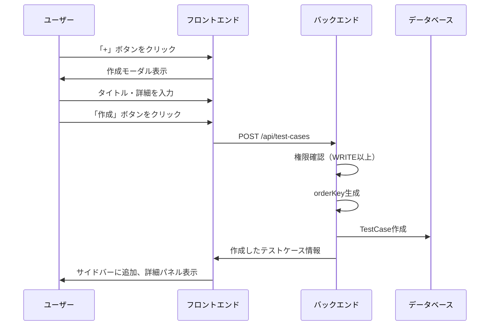
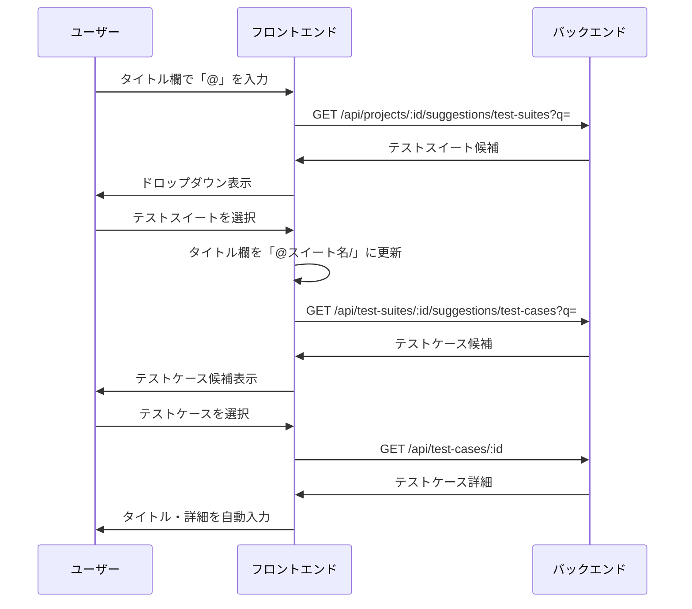
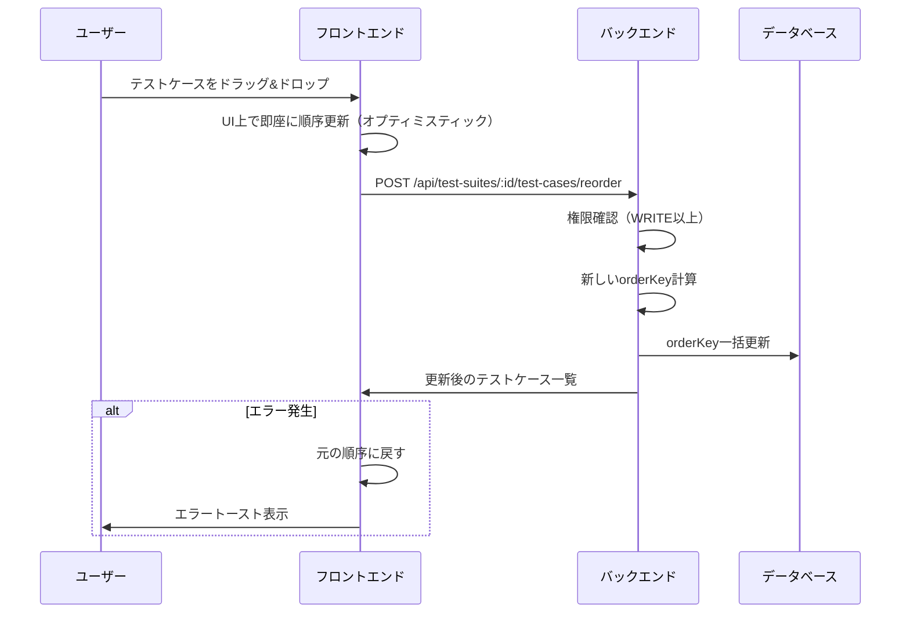
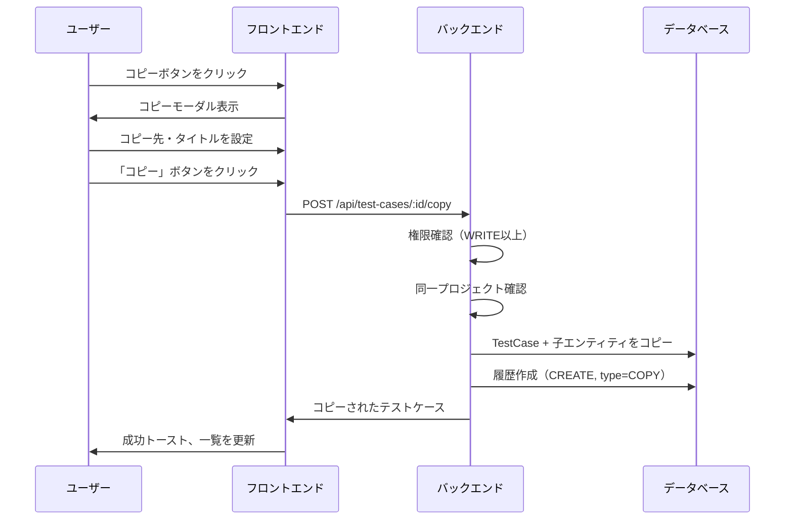
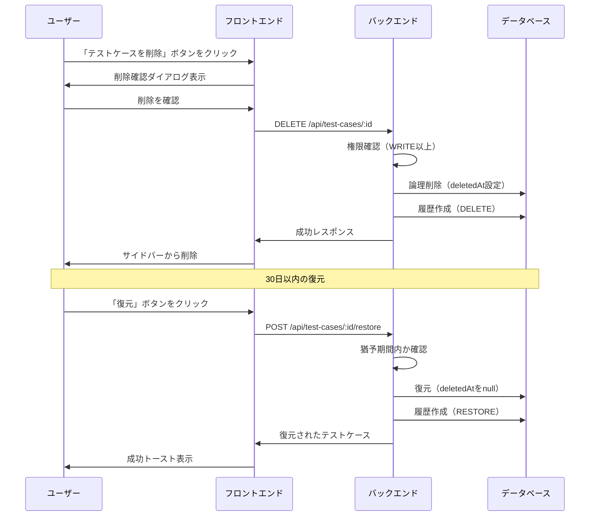
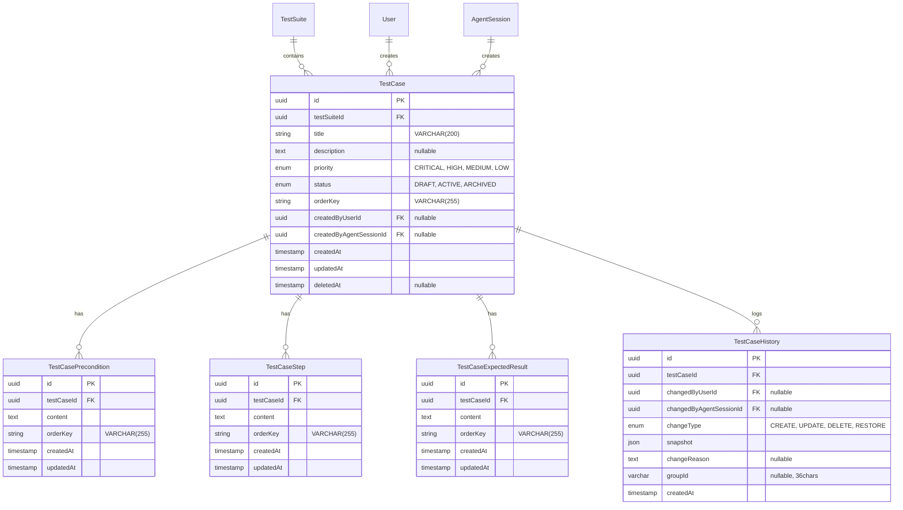

# テストケース管理機能

## 概要

テストスイート内の個別のテストケースを管理する機能を提供する。テストケースは前提条件・テスト手順・期待結果の構造化されたデータを持ち、作成・編集・削除・コピー・並替・履歴管理・検索などの機能を備える。ユーザーとAIエージェントの両方から操作可能。

## 機能一覧

| ID | 機能名 | 説明 | 状態 |
|----|--------|------|------|
| TC-001 | テストケース作成 | 新規テストケースを作成 | 実装済 |
| TC-002 | テストケース構造 | 前提条件・ステップ・期待結果の管理 | 実装済 |
| TC-003 | テストケースコピー | 既存テストケースを複製 | 実装済 |
| TC-004 | @参照入力 | テストケース作成時に既存テストケースを参照 | 実装済 |
| TC-005 | 履歴・復元 | テストケースの変更履歴表示と復元 | 実装済 |
| TC-006 | 並び替え | D&Dによるテストケースの並び替え | 実装済 |
| TC-007 | テストケース削除 | 論理削除（30日猶予期間） | 実装済 |
| TC-008 | 検索 | タイトル・説明でフィルタリング | 実装済 |

## 画面仕様

### テストケース一覧（サイドバー）

テストスイート詳細ページ内のサイドバーにテストケース一覧を表示。

```
┌──────────────────────────────────────────────────────────────────┐
│ ヘッダー: テストスイート名、アクションボタン                       │
├──────────────────┬───────────────────────────────────────────────┤
│ サイドバー        │ メインコンテンツ                               │
│ (w-64)           │                                               │
│                  │ ┌─────────────────────────────────────────────┐│
│ テストケース [+]  │ │ テストケース詳細                             ││
│                  │ │                                             ││
│ ┌──────────────┐ │ │ タイトル: ログイン正常系        [コピー] [×] ││
│ │ 🔍 検索...   │ │ │ 優先度: HIGH  ステータス: ACTIVE            ││
│ └──────────────┘ │ │                                             ││
│                  │ │ [概要] [履歴] [設定]                         ││
│ ┌──────────────┐ │ │                                             ││
│ │ ≡ ● ケース1 │ │ │ 説明                                        ││
│ ├──────────────┤ │ │ ユーザーがログインできることを確認           ││
│ │ ≡ ● ケース2 │◀┼─│                                             ││
│ ├──────────────┤ │ │ 優先度: HIGH    ステータス: ACTIVE          ││
│ │ ≡ ● ケース3 │ │ │                                             ││
│ └──────────────┘ │ │ [前提条件]                                  ││
│                  │ │  1. ユーザーが登録済み                       ││
│ D&Dで並替可能    │ │                                             ││
│                  │ │ [ステップ]                                   ││
│ ────────────     │ │  1. ログインページを開く                     ││
│ 3 件             │ │  2. 認証情報を入力                          ││
│                  │ │                                             ││
│                  │ │ [期待結果]                                   ││
│                  │ │  1. ダッシュボードが表示される                ││
│                  │ └─────────────────────────────────────────────┘│
└──────────────────┴───────────────────────────────────────────────┘
```

- **表示要素（サイドバー）**
  - 「テストケース」ヘッダー + 新規作成ボタン
  - 検索ボックス（タイトル・説明で絞り込み）
  - テストケース一覧
    - ドラッグハンドル（≡）
    - 優先度ドット（●: 色で表示）
    - タイトル
  - 件数表示
- **操作**
  - テストケースクリック → 右側パネルに詳細表示
  - D&D → 並び替え（APIで永続化）
  - 新規作成ボタン → テストケース作成モーダル表示

### テストケース作成モーダル

- **表示要素**
  - タイトル入力欄（必須、@参照入力対応）
  - 説明入力欄（任意）
  - 優先度選択（CRITICAL/HIGH/MEDIUM/LOW）
  - ステータス選択（DRAFT/ACTIVE/ARCHIVED）
  - キャンセルボタン
  - 作成ボタン
- **バリデーション**
  - タイトル: 1〜200文字
  - 説明: 最大2000文字
- **@参照入力**
  - `@`入力でテストスイート候補を表示
  - スイート選択後`/`で区切りテストケース候補を表示
  - テストケース選択でタイトルと詳細が自動入力

### テストケース詳細パネル

- **URL**: `/test-suites/{testSuiteId}?testCase={testCaseId}`
- **タブ構成**: 概要 / 履歴 / 設定
- **表示要素（共通）**
  - テストケースタイトル（インライン編集可能）
  - 優先度バッジ
  - ステータスバッジ
  - コピーボタン
  - 閉じるボタン

#### 概要タブ

- **表示要素**
  - 説明（インライン編集可能）
  - 基本情報セクション
    - 優先度（インライン変更可能）
    - ステータス（インライン変更可能）
  - 前提条件リスト
    - D&D対応で順番入れ替え可能
    - 追加・編集・削除ボタン
  - ステップリスト
    - D&D対応で順番入れ替え可能
    - 追加・編集・削除ボタン
  - 期待結果リスト
    - D&D対応で順番入れ替え可能
    - 追加・編集・削除ボタン

#### 履歴タブ

- **表示要素**
  - 変更履歴タイムライン（グループ化対応）
    - **単一変更の場合**
      - 変更者アバター、名前
      - 変更タイプバッジ（CREATE/UPDATE/DELETE/RESTORE）
      - 変更内容のサマリー（例: 「タイトル、優先度を変更」）
      - 「詳細を見る」ボタン（UPDATE/CREATEで`changeDetail`がある場合のみ）
      - 日時（相対時間 + 絶対時間ツールチップ）
    - **グループ化された変更の場合**（同一 groupId の複数履歴）
      - グループアイコン（Layers アイコン）
      - 変更者アバター、名前
      - 「更新 (N件)」バッジ（N=グループ内の履歴数）
      - 変更内容のサマリー（例: 「タイトル、ステップ、期待結果を変更」）
      - 「詳細を見る」ボタン
      - 日時（グループの作成日時）
  - 詳細展開時（グループ化対応）
    - カテゴリ別の変更内容表示
      - 基本情報（FileText アイコン）: タイトル、説明、優先度、ステータス
      - 前提条件（List アイコン）: 追加/更新/削除
      - 手順（Pencil アイコン）: 追加/更新/削除
      - 期待結果（CheckCircle アイコン）: 追加/更新/削除
    - 各カテゴリ内で変更件数を表示
  - 差分表示（折りたたみ式）
    - 変更前の値（赤色、取り消し線）
    - 変更後の値（緑色）
  - ページネーション（20グループずつ）
    - グループ単位でのページネーション
    - ページ境界でグループが分断されない設計
- **変更タイプアイコン**
  - CREATE: 緑色（PlusCircle アイコン）
  - UPDATE: 青色（Pencil アイコン）
  - DELETE: 赤色（Trash2 アイコン）
  - RESTORE: 紫色（RotateCcw アイコン）
  - グループ: 青色（Layers アイコン）
- **差分表示対応項目**
  - 基本情報: タイトル、説明、優先度、ステータス
  - 子エンティティ: 前提条件、ステップ、期待結果（追加/更新/削除/並び替え）
  - コピー: コピー元テストケース情報
- **後方互換性**
  - groupId が NULL の既存データは個別の単一変更として表示
  - 新規データは同一トランザクション内の変更が自動的にグループ化

#### 設定タブ

- **表示要素（通常テストケース）**
  - 削除セクション
    - 警告メッセージ（30日猶予期間の説明）
    - 削除ボタン（赤色）
- **表示要素（削除済みテストケース）**
  - 復元セクション
    - 完全削除までの残り日数
    - 復元ボタン
- **権限**: WRITE以上のみ削除・復元可能

### コピーモーダル

- **表示要素**
  - コピー先テストスイート選択（デフォルト: 同一スイート）
  - 新しいタイトル（デフォルト: "元タイトル (コピー)"）
  - キャンセルボタン
  - コピーボタン
- **制約**
  - 同一プロジェクト内のみコピー可能
  - コピー後のステータスはDRAFT固定

## 業務フロー

### テストケース作成フロー



### @参照入力フロー



### テストケース並替フロー



### テストケースコピーフロー



### テストケース削除・復元フロー



## データモデル



### 優先度定義

| 優先度 | 説明 | 表示色 |
|--------|------|--------|
| CRITICAL | 緊急 | 赤色 |
| HIGH | 高 | オレンジ |
| MEDIUM | 中 | 青色 |
| LOW | 低 | グレー |

### ステータス定義

| ステータス | 説明 | 用途 |
|-----------|------|------|
| DRAFT | 下書き | 作成中、レビュー前 |
| ACTIVE | アクティブ | 実行可能な状態 |
| ARCHIVED | アーカイブ | 使用停止、参照のみ |

### orderKey（連番方式）

テストケースおよび子エンティティの並び順を表すキー。5桁の0埋め連番（"00001", "00002", ...）を使用。

- 新規追加時: 既存の最大orderKeyに+1
- 並び替え時: 新しい順序に従って全件のorderKeyを再計算
- 削除時: 残りの要素のorderKeyを再整列

## ビジネスルール

### テストケース作成

- 作成者はユーザーまたはAIエージェント
- 作成時のデフォルトステータスはDRAFT
- 作成時のデフォルト優先度はMEDIUM
- orderKeyは自動採番（末尾に追加）

### テストケース更新

- WRITE以上のロールが必要
- 更新時に履歴レコード（UPDATE）が自動作成される
- スナップショットには変更前の値が保存される

### テストケース削除

- WRITE以上のロールが必要
- 削除は論理削除（deletedAtに現在時刻を設定）
- 30日間の猶予期間あり
- 猶予期間中は復元可能
- 猶予期間経過後、バッチ処理で物理削除
- 削除済みテストケースからも履歴は参照可能

### テストケース復元

- WRITE以上のロールが必要
- 猶予期間内（30日）のみ復元可能
- 親テストスイートが削除されている場合は復元不可
- 復元するとdeletedAtがnullになる
- 復元時に履歴レコード（RESTORE）が自動作成される

### テストケースコピー

- WRITE以上のロールが必要
- 同一プロジェクト内のみコピー可能
- 削除済みテストケースはコピー不可
- コピー後のステータスはDRAFT固定
- 前提条件・ステップ・期待結果も全てコピー
- 履歴にコピー元情報を記録

### 子エンティティ（前提条件/ステップ/期待結果）管理

- WRITE以上のロールが必要
- 追加・更新・削除時に親テストケースの履歴が記録される
- 並び替えはorderKeyの一括更新で実現
- 同値更新（内容が同じ）の場合は更新をスキップ

### 検索・フィルタ

- READ以上のロールがあれば検索可能
- タイトルと説明の部分一致検索
- サイドバー内でのクライアントサイドフィルタリング

### 履歴管理

- すべての変更操作で履歴が自動記録される
- 履歴は削除不可
- スナップショットには変更前の状態がJSON形式で保存される
- `changeDetail`フィールドで変更の詳細を記録
  - 基本情報更新時: 変更前後の値をフィールドごとに記録（`BASIC_INFO_UPDATE`）
  - 子エンティティ操作時: 追加/更新/削除/並び替えの詳細を記録
  - コピー時: コピー元のテストケースID・タイトルを記録（`COPY`）
- フロントエンドでサマリー表示と折りたたみ式差分表示を提供
- **グループ化機能**（groupId）
  - 同一 API リクエスト内の複数変更を1つのグループとして記録
  - MCP 経由の更新: MCP ツール内で groupId を生成し、全カテゴリの変更を統合
  - Web UI 経由の更新: サービス層で groupId を自動生成
  - グループ化されない変更（単一フィールドの更新など）は単独で表示
  - 既存データ（groupId が NULL）との後方互換性を確保

#### 履歴グループ化の型定義

グループ化された履歴をカテゴリ別に分類して返す構造。

```typescript
// カテゴリ別に分類された履歴
interface CategorizedHistories {
  basicInfo: TestCaseHistory[];       // 基本情報の変更
  preconditions: TestCaseHistory[];   // 前提条件の変更
  steps: TestCaseHistory[];           // ステップの変更
  expectedResults: TestCaseHistory[]; // 期待結果の変更
}

// グループ化された履歴アイテム（API レスポンス用）
interface TestCaseHistoryGroupedItem {
  groupId: string | null;                    // グループ ID（NULL の場合は単一履歴）
  categorizedHistories: CategorizedHistories; // カテゴリ別履歴
  createdAt: Date;                           // グループの作成日時
}

// 履歴一覧 API レスポンス
interface TestCaseHistoriesGroupedResponse {
  items: TestCaseHistoryGroupedItem[];  // グループ化された履歴アイテム
  totalGroups: number;                  // グループ総数（ページネーション用）
  total: number;                        // 履歴レコード総数
}
```

#### カテゴリ分類ロジック

`changeDetail.type` の値に基づいてカテゴリを判定:

| changeDetail.type | カテゴリ |
|-------------------|----------|
| `BASIC_INFO_UPDATE` | basicInfo |
| `PRECONDITION_*` | preconditions |
| `STEP_*` | steps |
| `EXPECTED_RESULT_*` | expectedResults |
| `COPY` | basicInfo |

#### グループ化された履歴の表示例

```
┌─────────────────────────────────────────────────────────────────┐
│ 📋 [更新 (3件)] 山田太郎                                         │
│    タイトル、ステップ、期待結果を変更  [▼ 詳細を見る]             │
│    2分前                                                        │
│                                                                 │
│    ├── 📄 基本情報 (1件)                                        │
│    │   └─ タイトル: 「旧タイトル」→「新タイトル」                 │
│    │                                                            │
│    ├── ✏️ 手順 (1件)                                            │
│    │   └─ 追加: 「ボタンをクリック」                             │
│    │                                                            │
│    └── ✓ 期待結果 (1件)                                         │
│        └─ 更新: 「エラー表示」→「成功メッセージ表示」             │
└─────────────────────────────────────────────────────────────────┘
```

**単一変更の場合**（groupId が NULL または1件のみ）:
```
┌─────────────────────────────────────────────────────────────────┐
│ ✏️ [更新] 山田太郎                                               │
│    タイトルを変更  [▼ 詳細を見る]                                │
│    5分前                                                        │
│                                                                 │
│    └─ タイトル: 「旧タイトル」→「新タイトル」                     │
└─────────────────────────────────────────────────────────────────┘
```

## 権限

### プロジェクトロール（テストケース操作に必要）

| ロール | 説明 |
|--------|------|
| OWNER | プロジェクトオーナー（最高権限） |
| ADMIN | 管理者（全操作可能） |
| WRITE | 編集者（作成・編集・削除可能） |
| READ | 閲覧者（閲覧のみ） |

### 操作別権限

| 操作 | OWNER | ADMIN | WRITE | READ |
|------|:-----:|:-----:|:-----:|:----:|
| テストケース閲覧 | ✓ | ✓ | ✓ | ✓ |
| テストケース作成 | ✓ | ✓ | ✓ | - |
| テストケース更新 | ✓ | ✓ | ✓ | - |
| テストケース削除 | ✓ | ✓ | ✓ | - |
| テストケース復元 | ✓ | ✓ | ✓ | - |
| テストケースコピー | ✓ | ✓ | ✓ | - |
| テストケース並替 | ✓ | ✓ | ✓ | - |
| 子エンティティ管理 | ✓ | ✓ | ✓ | - |
| 履歴閲覧 | ✓ | ✓ | ✓ | ✓ |

## 設定値

| 項目 | 値 | 説明 |
|------|-----|------|
| DELETION_GRACE_PERIOD_DAYS | 30 | 削除猶予期間（日） |
| RESTORE_LIMIT_DAYS | 30 | 復元可能期間（日） |
| テストケースタイトル最大長 | 200文字 | |
| 説明最大長 | 2000文字 | |
| 子エンティティ内容最大長 | 制限なし（TEXT型） | |
| 履歴ページサイズ | 20グループ | ページネーションのデフォルト件数（グループ単位） |
| サジェスト取得件数 | 10件 | @参照入力の候補数 |
| デバウンス時間 | 300ms | 検索・サジェストのデバウンス |

## API エンドポイント

### テストケース

| メソッド | パス | 説明 | 権限 |
|----------|------|------|------|
| POST | /api/test-cases | テストケース作成 | WRITE以上 |
| GET | /api/test-cases/:id | テストケース取得 | READ以上 |
| PATCH | /api/test-cases/:id | テストケース更新 | WRITE以上 |
| DELETE | /api/test-cases/:id | テストケース削除（論理） | WRITE以上 |
| POST | /api/test-cases/:id/copy | テストケースコピー | WRITE以上 |
| GET | /api/test-cases/:id/histories | 履歴一覧取得 | READ以上 |
| POST | /api/test-cases/:id/restore | テストケース復元 | WRITE以上 |

### 前提条件

| メソッド | パス | 説明 | 権限 |
|----------|------|------|------|
| GET | /api/test-cases/:id/preconditions | 前提条件一覧取得 | READ以上 |
| POST | /api/test-cases/:id/preconditions | 前提条件追加 | WRITE以上 |
| PATCH | /api/test-cases/:id/preconditions/:preconditionId | 前提条件更新 | WRITE以上 |
| DELETE | /api/test-cases/:id/preconditions/:preconditionId | 前提条件削除 | WRITE以上 |
| POST | /api/test-cases/:id/preconditions/reorder | 前提条件並替 | WRITE以上 |

### ステップ

| メソッド | パス | 説明 | 権限 |
|----------|------|------|------|
| GET | /api/test-cases/:id/steps | ステップ一覧取得 | READ以上 |
| POST | /api/test-cases/:id/steps | ステップ追加 | WRITE以上 |
| PATCH | /api/test-cases/:id/steps/:stepId | ステップ更新 | WRITE以上 |
| DELETE | /api/test-cases/:id/steps/:stepId | ステップ削除 | WRITE以上 |
| POST | /api/test-cases/:id/steps/reorder | ステップ並替 | WRITE以上 |

### 期待結果

| メソッド | パス | 説明 | 権限 |
|----------|------|------|------|
| GET | /api/test-cases/:id/expected-results | 期待結果一覧取得 | READ以上 |
| POST | /api/test-cases/:id/expected-results | 期待結果追加 | WRITE以上 |
| PATCH | /api/test-cases/:id/expected-results/:expectedResultId | 期待結果更新 | WRITE以上 |
| DELETE | /api/test-cases/:id/expected-results/:expectedResultId | 期待結果削除 | WRITE以上 |
| POST | /api/test-cases/:id/expected-results/reorder | 期待結果並替 | WRITE以上 |

### サジェスト（@参照用）

| メソッド | パス | 説明 | 権限 |
|----------|------|------|------|
| GET | /api/projects/:id/suggestions/test-suites | テストスイートサジェスト | READ以上 |
| GET | /api/test-suites/:id/suggestions/test-cases | テストケースサジェスト | READ以上 |

### 並び替え（テストスイート経由）

| メソッド | パス | 説明 | 権限 |
|----------|------|------|------|
| GET | /api/test-suites/:id/test-cases | テストケース一覧取得 | READ以上 |
| POST | /api/test-suites/:id/test-cases/reorder | テストケース並替 | WRITE以上 |

#### テストケース一覧クエリパラメータ

| パラメータ | 型 | 説明 | デフォルト |
|-----------|-----|------|-----------|
| q | string | 検索キーワード（タイトル・説明） | - |
| status | enum | ステータスフィルタ | - |
| priority | enum | 優先度フィルタ | - |
| limit | number | 取得件数（1-100） | 100 |
| offset | number | オフセット | 0 |
| sortBy | enum | ソート項目（title/createdAt/orderKey） | orderKey |
| sortOrder | enum | ソート順（asc/desc） | asc |

## リクエスト・レスポンス仕様

### テストケース作成

**リクエスト**
```json
{
  "testSuiteId": "uuid",
  "title": "ログイン正常系テスト",
  "description": "有効な認証情報でログインできることを確認",
  "priority": "HIGH",
  "status": "DRAFT"
}
```

**レスポンス**
```json
{
  "testCase": {
    "id": "uuid",
    "testSuiteId": "uuid",
    "title": "ログイン正常系テスト",
    "description": "有効な認証情報でログインできることを確認",
    "priority": "HIGH",
    "status": "DRAFT",
    "orderKey": "00001",
    "createdAt": "2024-01-01T00:00:00Z",
    "updatedAt": "2024-01-01T00:00:00Z",
    "deletedAt": null
  }
}
```

### テストケース詳細取得

**レスポンス**
```json
{
  "testCase": {
    "id": "uuid",
    "testSuiteId": "uuid",
    "title": "ログイン正常系テスト",
    "description": "有効な認証情報でログインできることを確認",
    "priority": "HIGH",
    "status": "ACTIVE",
    "orderKey": "00001",
    "createdAt": "2024-01-01T00:00:00Z",
    "updatedAt": "2024-01-01T00:00:00Z",
    "deletedAt": null,
    "testSuite": {
      "id": "uuid",
      "name": "認証テストスイート",
      "projectId": "uuid"
    },
    "createdByUser": {
      "id": "uuid",
      "name": "ユーザー名",
      "avatarUrl": "https://..."
    },
    "preconditions": [
      {
        "id": "uuid",
        "content": "テストユーザーが登録済み",
        "orderKey": "00001"
      }
    ],
    "steps": [
      {
        "id": "uuid",
        "content": "ログインページを開く",
        "orderKey": "00001"
      },
      {
        "id": "uuid",
        "content": "ユーザー名とパスワードを入力",
        "orderKey": "00002"
      }
    ],
    "expectedResults": [
      {
        "id": "uuid",
        "content": "ダッシュボードページが表示される",
        "orderKey": "00001"
      }
    ]
  }
}
```

### テストケースコピー

**リクエスト**
```json
{
  "targetTestSuiteId": "uuid",
  "title": "ログイン正常系テスト (コピー)"
}
```

**レスポンス**
```json
{
  "testCase": {
    "id": "uuid",
    "testSuiteId": "uuid",
    "title": "ログイン正常系テスト (コピー)",
    "status": "DRAFT",
    "preconditions": [...],
    "steps": [...],
    "expectedResults": [...]
  }
}
```

### 子エンティティ追加

**リクエスト**
```json
{
  "content": "テストユーザーが登録済み"
}
```

**レスポンス**
```json
{
  "precondition": {
    "id": "uuid",
    "testCaseId": "uuid",
    "content": "テストユーザーが登録済み",
    "orderKey": "00001",
    "createdAt": "2024-01-01T00:00:00Z",
    "updatedAt": "2024-01-01T00:00:00Z"
  }
}
```

### 並び替え

**リクエスト**
```json
{
  "testCaseIds": ["uuid3", "uuid1", "uuid2"]
}
```

**レスポンス**
```json
{
  "testCases": [
    { "id": "uuid3", "orderKey": "00001", ... },
    { "id": "uuid1", "orderKey": "00002", ... },
    { "id": "uuid2", "orderKey": "00003", ... }
  ]
}
```

### 履歴一覧取得

**レスポンス**
```json
{
  "histories": [
    {
      "id": "uuid",
      "testCaseId": "uuid",
      "changeType": "UPDATE",
      "snapshot": {
        "id": "uuid",
        "testSuiteId": "uuid",
        "title": "旧タイトル",
        "description": "旧説明",
        "priority": "MEDIUM",
        "status": "DRAFT",
        "changeDetail": {
          "type": "BASIC_INFO_UPDATE",
          "fields": {
            "title": { "before": "旧タイトル", "after": "新タイトル" },
            "priority": { "before": "MEDIUM", "after": "HIGH" }
          }
        }
      },
      "createdAt": "2024-01-01T00:00:00Z",
      "changedBy": {
        "id": "uuid",
        "name": "ユーザー名",
        "avatarUrl": "https://..."
      }
    },
    {
      "id": "uuid",
      "testCaseId": "uuid",
      "changeType": "UPDATE",
      "snapshot": {
        "id": "uuid",
        "testSuiteId": "uuid",
        "title": "テストケースタイトル",
        "description": null,
        "priority": "HIGH",
        "status": "ACTIVE",
        "steps": [{ "id": "uuid", "content": "ステップ内容", "orderKey": "00001" }],
        "changeDetail": {
          "type": "STEP_ADD",
          "stepId": "uuid",
          "added": { "content": "新しいステップ", "orderKey": "00002" }
        }
      },
      "createdAt": "2024-01-01T00:00:00Z",
      "changedBy": {
        "id": "uuid",
        "name": "ユーザー名",
        "avatarUrl": "https://..."
      }
    }
  ],
  "total": 10
}
```

### サジェスト

**リクエスト**
```
GET /api/test-suites/:id/suggestions/test-cases?q=ログイン&limit=10
```

**レスポンス**
```json
{
  "suggestions": [
    {
      "id": "uuid",
      "title": "ログイン正常系テスト",
      "description": "有効な認証情報でログイン...",
      "status": "ACTIVE"
    }
  ]
}
```

## コンポーネント構成

### フロントエンド

```
apps/web/src/
├── components/
│   ├── test-suite/
│   │   └── TestCaseSidebar.tsx      # テストケースサイドバー
│   ├── test-case/
│   │   ├── TestCaseDetailPanel.tsx          # 詳細パネル
│   │   ├── TestCasePreconditionList.tsx     # 前提条件リスト
│   │   ├── TestCaseStepList.tsx             # ステップリスト
│   │   ├── TestCaseExpectedResultList.tsx   # 期待結果リスト
│   │   ├── TestCaseItemFormModal.tsx        # 項目編集モーダル
│   │   ├── TestCaseHistoryList.tsx          # 履歴リスト
│   │   ├── DeleteTestCaseSection.tsx        # 削除セクション
│   │   └── CopyTestCaseModal.tsx            # コピーモーダル
│   └── common/
│       └── MentionInput.tsx           # @参照入力
└── pages/
    └── TestSuiteDetail.tsx            # テストスイート詳細（統合）
```

### バックエンド

```
apps/api/src/
├── routes/
│   ├── test-cases.ts                  # テストケースルート
│   └── test-suites.ts                 # テストスイートルート（並替・サジェスト含む）
├── controllers/
│   ├── test-case.controller.ts        # テストケースコントローラー
│   └── test-suite.controller.ts       # テストスイートコントローラー
├── services/
│   ├── test-case.service.ts           # テストケースサービス
│   └── test-suite.service.ts          # テストスイートサービス
├── repositories/
│   └── test-case.repository.ts        # テストケースリポジトリ
└── middleware/
    └── require-test-case-role.ts      # テストケース権限ミドルウェア
```

## 関連機能

- [テストスイート管理](./test-suite-management.md) - テストケースの親リソース
- [プロジェクト管理](./project-management.md) - 権限の継承元
- [監査ログ](./audit-log.md) - 操作の記録
- テスト実行 - テストケースの実行（未作成）
