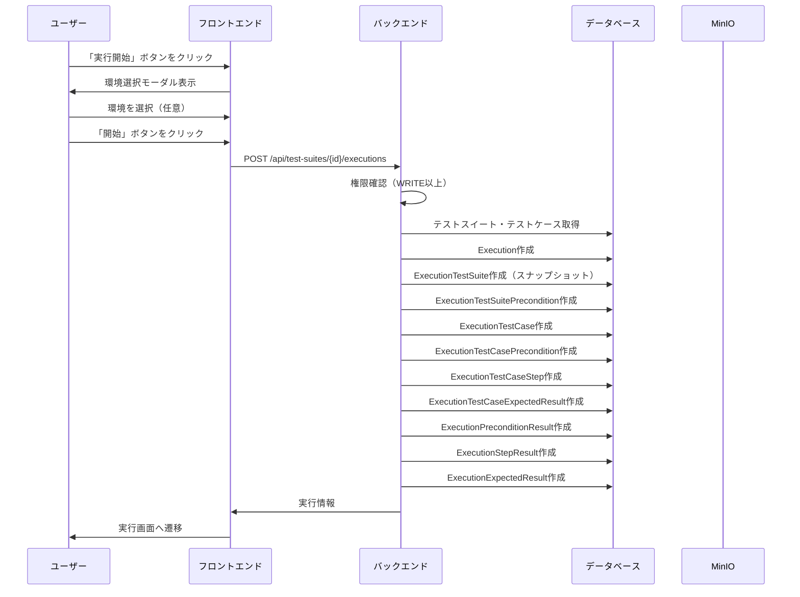
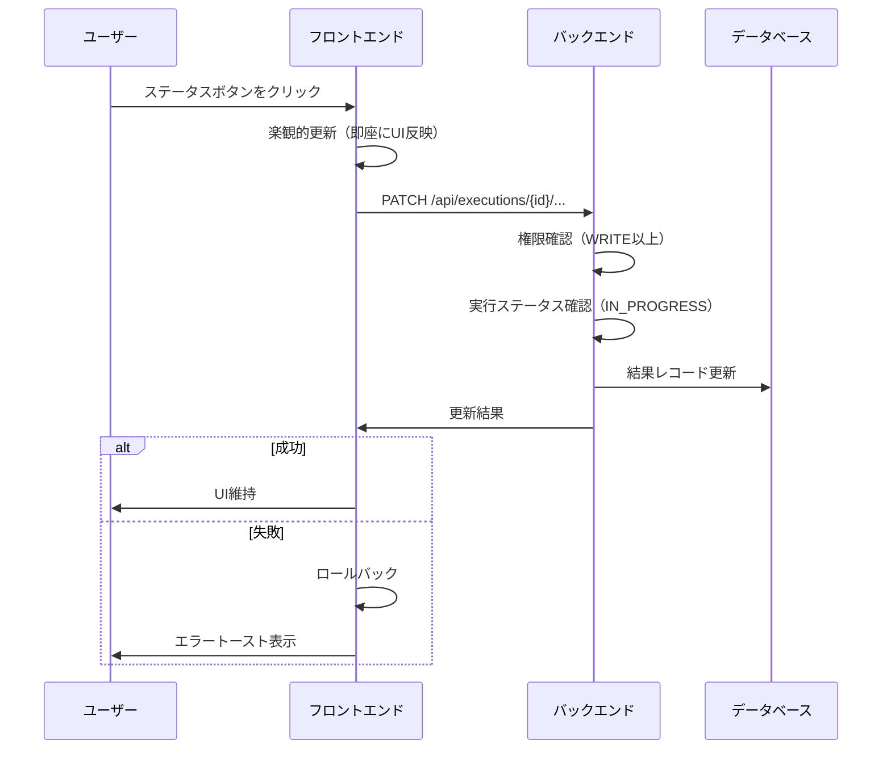
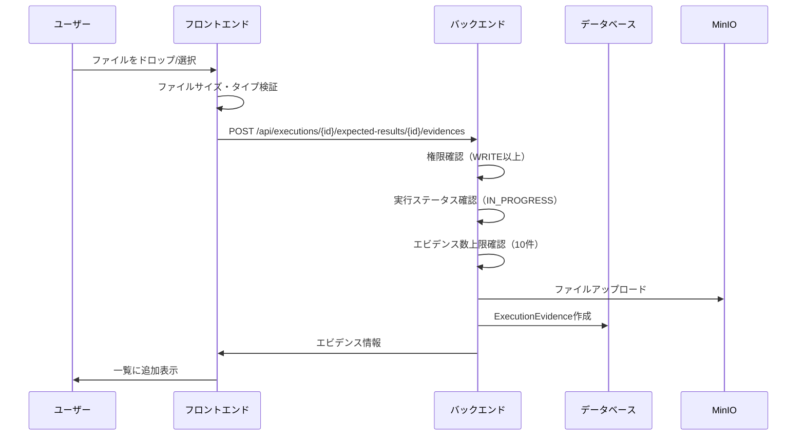
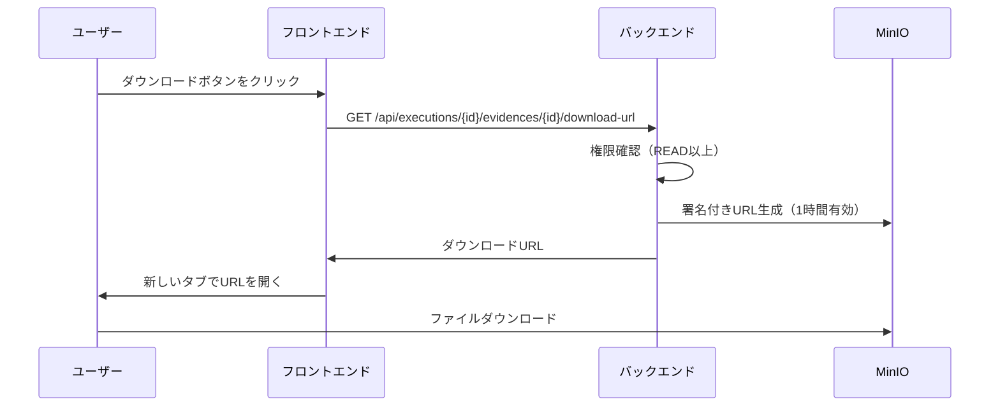
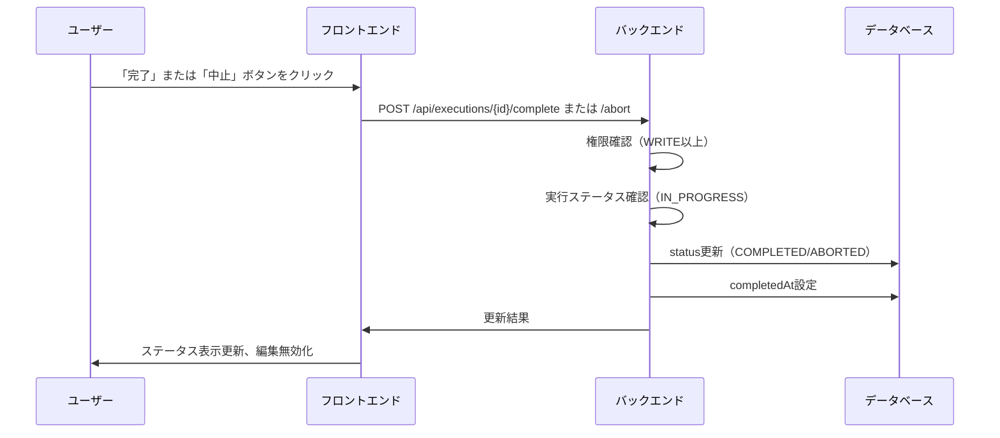
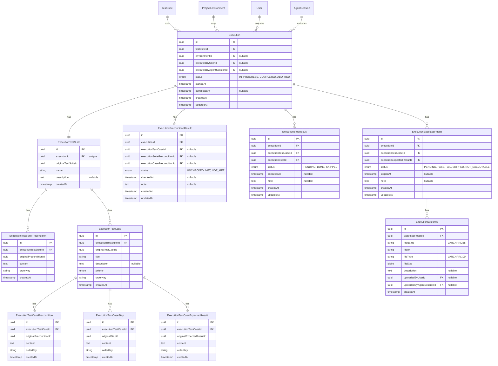

# テスト実行機能

## 概要

テストスイート単位でのテスト実行と結果記録を管理する機能を提供する。実行開始時にテストスイートとテストケースのスナップショットを作成し、実行中の変更に影響されない状態で結果を記録する。前提条件確認、ステップ実施記録、期待値判定、エビデンスファイルのアップロードをサポートする。

## 機能一覧

| ID | 機能名 | 説明 | 状態 |
|----|--------|------|------|
| EX-001 | 実行開始 | テストスイート詳細から環境を選択して実行開始 | 実装済 |
| EX-002 | 環境選択 | プロジェクト設定の環境リストから選択 | 実装済 |
| EX-003 | スナップショット作成 | 実行開始時にテストスイート・テストケースの状態を保存 | 実装済 |
| EX-004 | 前提条件・ステップ記録 | 前提条件確認、ステップ実施の結果を記録 | 実装済 |
| EX-005 | 期待値判定 | 期待結果のPass/Fail判定を記録 | 実装済 |
| EX-006 | 実行結果一覧 | 履歴表示、フィルタリング、ページネーション | 実装済 |
| EX-007 | エビデンス管理 | ファイルアップロード、ダウンロード、削除 | 実装済 |

## 画面仕様

### 実行開始モーダル（StartExecutionModal）

- **表示タイミング**: テストスイート詳細の「実行開始」ボタンクリック時
- **表示要素**
  - テストスイート名
  - 環境選択ドロップダウン（プロジェクト設定から取得）
  - 含まれるテストケース数
  - キャンセルボタン
  - 実行開始ボタン
- **操作**
  - 実行開始ボタン → 実行作成 → 実行画面へ遷移

### 実行画面（Execution.tsx）

- **URL**: `/executions/{executionId}`
- **表示要素（ヘッダー）**
  - テストスイートに戻るリンク
  - テストスイート名（スナップショットから）
  - ステータスバッジ（実行中/完了/中断）
  - 開始日時、終了日時（完了時のみ）
  - 環境名（選択時のみ）
  - 中止ボタン（実行中のみ）
  - 完了ボタン（実行中のみ）

#### サマリーカード

4つのカードを横並びで表示：
- **成功**: 期待結果がPASSの件数（緑色）
- **失敗**: 期待結果がFAILの件数（赤色）
- **スキップ**: SKIPPED/NOT_EXECUTABLEの件数（黄色）
- **未実行**: PENDINGの件数（グレー）

#### スイート前提条件セクション

- **表示条件**: テストスイートに前提条件がある場合のみ
- **表示要素**
  - 前提条件一覧
  - 各前提条件のステータス（UNCHECKED/MET/NOT_MET）
  - ノート入力欄
- **操作（実行中のみ）**
  - ステータスボタンをクリックして更新
  - ノートを入力して保存

#### テストケース一覧セクション

- **表示要素**
  - テストケースをアコーディオン形式で表示
  - 各テストケースの展開/折り畳み
  - テストケース名
  - テストケースごとの結果サマリー（PASS/FAIL/PENDING数）

#### テストケース詳細（アコーディオン展開時）

1. **テストケース前提条件**
   - 各前提条件のステータス更新
   - ノート入力

2. **ステップ一覧**
   - ステップ番号、手順内容
   - ステータス（PENDING/DONE/SKIPPED）
   - ノート入力

3. **期待結果一覧**
   - 期待結果の内容
   - ステータス（PENDING/PASS/FAIL/SKIPPED/NOT_EXECUTABLE）
   - ノート入力
   - エビデンスアップロード領域
   - エビデンス一覧

#### エビデンス表示

- **表示要素**
  - ファイル名
  - ファイルサイズ
  - アップロード日時
  - ダウンロードボタン
  - 削除ボタン（実行中のみ）
- **アップロード**
  - ドラッグ&ドロップ対応
  - クリックしてファイル選択
  - アップロード中はローディング表示

### 実行履歴一覧（ExecutionHistoryList）

- **表示場所**: テストスイート詳細の「実行履歴」タブ
- **表示要素**
  - ステータスバッジ
  - 開始日時
  - 終了日時（完了時のみ）
  - 実行者
  - 環境名
  - 結果サマリー（PASS/FAIL/SKIPPED/PENDING）
  - 詳細リンク
- **フィルタリング**
  - ステータス（IN_PROGRESS/COMPLETED/ABORTED）
  - 日付範囲（開始日、終了日）
- **ページネーション**: 20件ずつ

## 業務フロー

### 実行開始フロー



### 結果更新フロー



### エビデンスアップロードフロー



### エビデンスダウンロードフロー



### 実行完了/中止フロー



## データモデル



### 正規化テーブルによるスナップショット

実行開始時に、テストスイートとテストケースの状態を正規化テーブル群に保存します。JSONBではなく正規化テーブルを使用することで、データの整合性とクエリ性能が向上します。

```
Execution
    │
    └──1:1── ExecutionTestSuite
                 │
                 ├──1:N── ExecutionTestSuitePrecondition
                 │
                 └──1:N── ExecutionTestCase
                              │
                              ├──1:N── ExecutionTestCasePrecondition
                              ├──1:N── ExecutionTestCaseStep
                              └──1:N── ExecutionTestCaseExpectedResult
```

各スナップショットテーブルは元のテーブルのIDを`original*Id`として保持し、実行時点のデータをコピーします。

### ステータス定義

#### 実行ステータス (ExecutionStatus)

| ステータス | 説明 | 用途 |
|-----------|------|------|
| IN_PROGRESS | 実行中 | 結果入力可能、エビデンスアップロード可能 |
| COMPLETED | 完了 | 結果確定、閲覧のみ |
| ABORTED | 中断 | 途中終了、閲覧のみ |

#### 前提条件ステータス (PreconditionStatus)

| ステータス | 説明 |
|-----------|------|
| UNCHECKED | 未確認 |
| MET | 満たされている |
| NOT_MET | 満たされていない |

#### ステップステータス (StepStatus)

| ステータス | 説明 |
|-----------|------|
| PENDING | 未実施 |
| DONE | 実施済み |
| SKIPPED | スキップ |

#### 判定ステータス (JudgmentStatus)

| ステータス | 説明 |
|-----------|------|
| PENDING | 未判定 |
| PASS | 合格 |
| FAIL | 不合格 |
| SKIPPED | スキップ |
| NOT_EXECUTABLE | 実行不可 |

## ビジネスルール

### 実行開始

- WRITE以上のロールが必要
- 実行開始時にテストスイートとすべてのテストケースの状態をスナップショットとして保存
- スナップショットは実行中のテストスイート編集に影響されない
- 環境選択は任意（未選択でも実行可能）

### 結果更新

- WRITE以上のロールが必要
- ステータスがIN_PROGRESSの実行のみ更新可能
- 楽観的更新によりUI遅延を最小化
- ノートは任意入力

### 実行完了/中止

- WRITE以上のロールが必要
- IN_PROGRESSの実行のみ完了/中止可能
- 完了/中止後は結果の変更不可
- 完了/中止後もエビデンスの閲覧は可能

### エビデンス管理

- アップロード: WRITE以上のロール、IN_PROGRESSの実行のみ
- 削除: WRITE以上のロール、IN_PROGRESSの実行のみ
- ダウンロード: READ以上のロール、どのステータスでも可能
- 1期待結果あたり最大10ファイル

### ファイルアップロード制限

| 項目 | 制限値 |
|------|--------|
| ファイルサイズ上限 | 100MB |
| 1期待結果あたりのファイル数 | 10件 |

### 許可ファイルタイプ

- 画像: image/jpeg, image/png, image/gif, image/webp, image/svg+xml, image/bmp
- 動画: video/mp4, video/webm, video/quicktime, video/x-msvideo
- 音声: audio/mpeg, audio/wav, audio/ogg, audio/webm
- ドキュメント: application/pdf, text/plain, text/csv, application/json, application/zip

### MinIOストレージ構造

```
agentest/
└── evidences/
    └── {executionId}/
        └── {expectedResultId}/
            └── {uuid}_{originalFilename}
```

## 権限

### プロジェクトロール（実行操作に必要）

| ロール | 説明 |
|--------|------|
| OWNER | プロジェクトオーナー（最高権限） |
| ADMIN | 管理者 |
| WRITE | 編集者（実行・結果記録可能） |
| READ | 閲覧者（閲覧のみ） |

### 操作別権限

| 操作 | OWNER | ADMIN | WRITE | READ |
|------|:-----:|:-----:|:-----:|:----:|
| 実行詳細閲覧 | ✓ | ✓ | ✓ | ✓ |
| 実行開始 | ✓ | ✓ | ✓ | - |
| 実行中止 | ✓ | ✓ | ✓ | - |
| 実行完了 | ✓ | ✓ | ✓ | - |
| 結果更新（前提条件/ステップ/期待値） | ✓ | ✓ | ✓ | - |
| エビデンスアップロード | ✓ | ✓ | ✓ | - |
| エビデンス削除 | ✓ | ✓ | ✓ | - |
| エビデンスダウンロード | ✓ | ✓ | ✓ | ✓ |
| 実行履歴閲覧 | ✓ | ✓ | ✓ | ✓ |

## 設定値

| 項目 | 値 | 説明 |
|------|-----|------|
| MAX_FILE_SIZE | 100MB (104857600) | エビデンスファイルサイズ上限 |
| MAX_EVIDENCES_PER_RESULT | 10 | 1期待結果あたりのエビデンス上限 |
| DOWNLOAD_URL_EXPIRES_IN | 3600秒 (1時間) | 署名付きダウンロードURLの有効期限 |
| 実行履歴ページサイズ | 20件 | ページネーションのデフォルト件数 |
| 自動更新間隔 | 10秒 | 実行中の画面自動リフレッシュ間隔 |

## API エンドポイント

### 実行

| メソッド | パス | 説明 | 権限 |
|----------|------|------|------|
| POST | /api/test-suites/:id/executions | 実行開始 | WRITE以上 |
| GET | /api/test-suites/:id/executions | 実行履歴一覧 | READ以上 |
| GET | /api/executions/:id | 実行詳細取得（軽量） | READ以上 |
| GET | /api/executions/:id/details | 実行詳細取得（全データ） | READ以上 |
| POST | /api/executions/:id/abort | 実行中止 | WRITE以上 |
| POST | /api/executions/:id/complete | 実行完了 | WRITE以上 |

### 結果更新

| メソッド | パス | 説明 | 権限 |
|----------|------|------|------|
| PATCH | /api/executions/:id/preconditions/:resultId | 前提条件結果更新 | WRITE以上 |
| PATCH | /api/executions/:id/steps/:resultId | ステップ結果更新 | WRITE以上 |
| PATCH | /api/executions/:id/expected-results/:resultId | 期待結果更新 | WRITE以上 |

### エビデンス

| メソッド | パス | 説明 | 権限 |
|----------|------|------|------|
| POST | /api/executions/:id/expected-results/:resultId/evidences | エビデンスアップロード | WRITE以上 |
| DELETE | /api/executions/:id/evidences/:evidenceId | エビデンス削除 | WRITE以上 |
| GET | /api/executions/:id/evidences/:evidenceId/download-url | ダウンロードURL取得 | READ以上 |

### 実行履歴検索クエリパラメータ

| パラメータ | 型 | 説明 | デフォルト |
|-----------|-----|------|-----------|
| status | enum | ステータスフィルタ（IN_PROGRESS/COMPLETED/ABORTED） | - |
| fromDate | datetime | 開始日 | - |
| toDate | datetime | 終了日 | - |
| limit | number | 取得件数（1-100） | 20 |
| offset | number | オフセット | 0 |

## リクエスト・レスポンス仕様

### 実行開始

**リクエスト**
```json
{
  "environmentId": "uuid"  // 任意
}
```

**レスポンス**
```json
{
  "execution": {
    "id": "uuid",
    "testSuiteId": "uuid",
    "environmentId": "uuid",
    "status": "IN_PROGRESS",
    "startedAt": "2024-01-01T00:00:00Z",
    "completedAt": null
  }
}
```

### 実行詳細取得（全データ）

**レスポンス**
```json
{
  "execution": {
    "id": "uuid",
    "testSuiteId": "uuid",
    "environmentId": "uuid",
    "status": "IN_PROGRESS",
    "startedAt": "2024-01-01T00:00:00Z",
    "completedAt": null,
    "environment": {
      "id": "uuid",
      "name": "本番環境"
    },
    "executionTestSuite": {
      "id": "uuid",
      "originalTestSuiteId": "uuid",
      "name": "テストスイート名",
      "description": "説明",
      "preconditions": [
        {
          "id": "uuid",
          "originalPreconditionId": "uuid",
          "content": "前提条件内容",
          "orderKey": "00001"
        }
      ],
      "testCases": [
        {
          "id": "uuid",
          "originalTestCaseId": "uuid",
          "title": "テストケース名",
          "description": "説明",
          "priority": "HIGH",
          "orderKey": "00001",
          "preconditions": [
            {
              "id": "uuid",
              "originalPreconditionId": "uuid",
              "content": "ケース前提条件",
              "orderKey": "00001"
            }
          ],
          "steps": [
            {
              "id": "uuid",
              "originalStepId": "uuid",
              "content": "操作手順",
              "orderKey": "00001"
            }
          ],
          "expectedResults": [
            {
              "id": "uuid",
              "originalExpectedResultId": "uuid",
              "content": "期待結果",
              "orderKey": "00001"
            }
          ]
        }
      ]
    },
    "preconditionResults": [
      {
        "id": "uuid",
        "executionTestCaseId": null,
        "executionSuitePreconditionId": "uuid",
        "executionCasePreconditionId": null,
        "status": "UNCHECKED",
        "checkedAt": null,
        "note": null
      }
    ],
    "stepResults": [
      {
        "id": "uuid",
        "executionTestCaseId": "uuid",
        "executionStepId": "uuid",
        "status": "PENDING",
        "executedAt": null,
        "note": null
      }
    ],
    "expectedResults": [
      {
        "id": "uuid",
        "executionTestCaseId": "uuid",
        "executionExpectedResultId": "uuid",
        "status": "PENDING",
        "judgedAt": null,
        "note": null,
        "evidences": [
          {
            "id": "uuid",
            "fileName": "screenshot.png",
            "fileType": "image/png",
            "fileSize": 12345,
            "description": "エラー画面のスクリーンショット",
            "createdAt": "2024-01-01T00:00:00Z"
          }
        ]
      }
    ]
  }
}
```

### 結果更新

**リクエスト（共通）**
```json
{
  "status": "PASS",  // 各結果タイプに応じたステータス
  "note": "メモ"     // 任意
}
```

**レスポンス**
```json
{
  "result": {
    "id": "uuid",
    "status": "PASS",
    "note": "メモ",
    "judgedAt": "2024-01-01T00:00:00Z"
  }
}
```

### エビデンスアップロード

**リクエスト**: multipart/form-data
- `file`: ファイル（必須）
- `description`: 説明（任意）

**レスポンス**
```json
{
  "evidence": {
    "id": "uuid",
    "fileName": "screenshot.png",
    "fileType": "image/png",
    "fileSize": 12345,
    "description": "エラー画面のスクリーンショット",
    "createdAt": "2024-01-01T00:00:00Z"
  }
}
```

### エビデンスダウンロードURL取得

**レスポンス**
```json
{
  "downloadUrl": "https://minio.example.com/agentest/evidences/...?signature=..."
}
```

### 実行履歴一覧

**レスポンス**
```json
{
  "executions": [
    {
      "id": "uuid",
      "testSuiteId": "uuid",
      "environmentId": "uuid",
      "status": "COMPLETED",
      "startedAt": "2024-01-01T00:00:00Z",
      "completedAt": "2024-01-01T01:00:00Z",
      "environment": {
        "id": "uuid",
        "name": "本番環境"
      },
      "executedByUser": {
        "id": "uuid",
        "name": "テスター",
        "avatarUrl": "https://..."
      },
      "_count": {
        "expectedResults": 10
      },
      "passCount": 8,
      "failCount": 1,
      "skipCount": 1
    }
  ],
  "total": 100,
  "limit": 20,
  "offset": 0
}
```

## 関連機能

- [テストスイート管理](./test-suite-management.md) - 実行対象のテストスイート
- [テストケース管理](./test-case-management.md) - 実行対象のテストケース
- [プロジェクト管理](./project-management.md) - 環境設定の参照元
- [監査ログ](./audit-log.md) - 実行操作の記録
