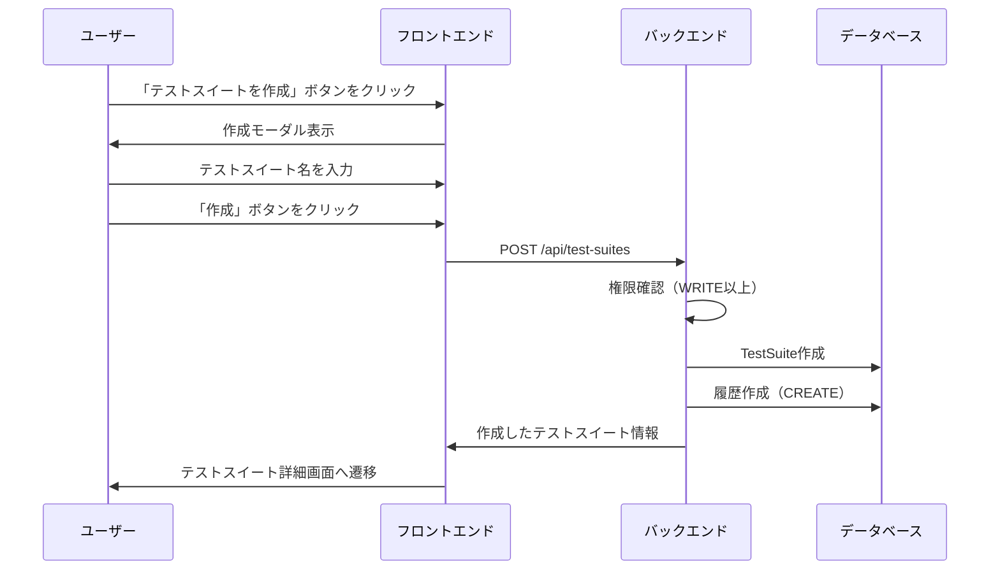
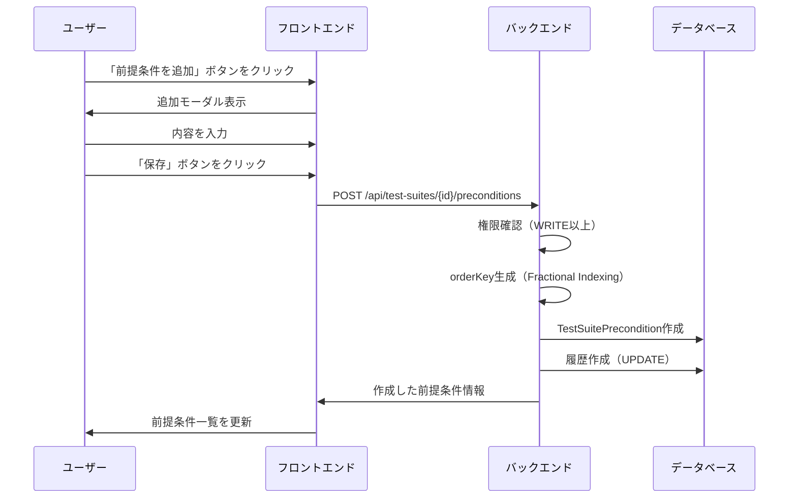
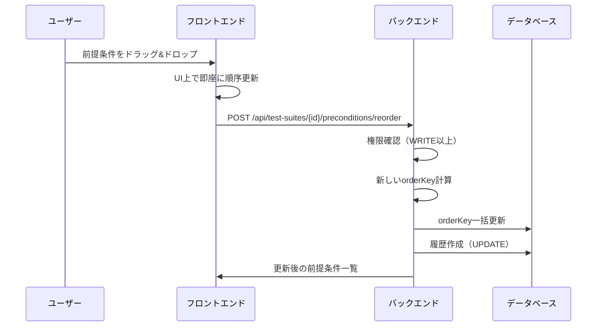
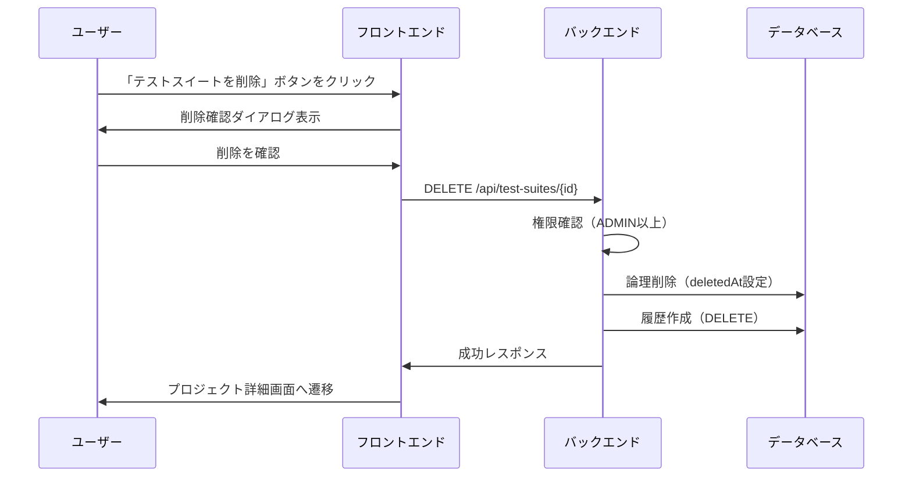
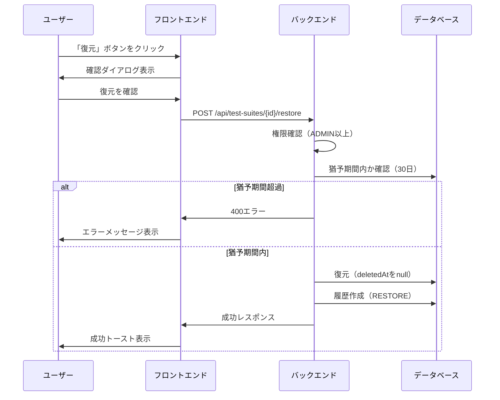
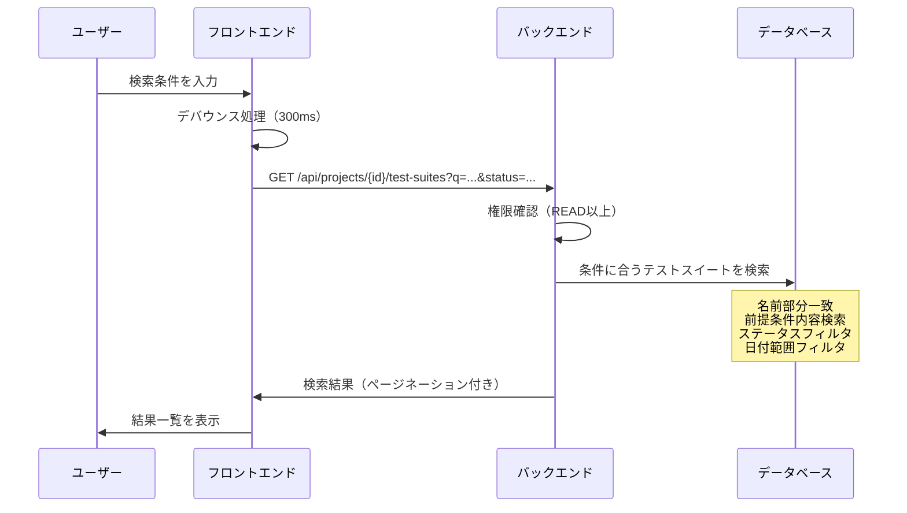
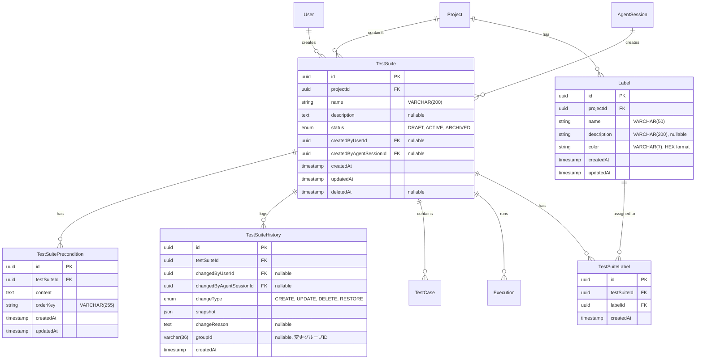

# テストスイート管理機能

## 概要

テストケースをグループ化・管理するためのテストスイート機能を提供する。テストスイートはプロジェクトに属し、複数のテストケースと共通の前提条件を持つ。作成・編集・削除・履歴管理・検索などの機能を備え、ユーザーとAIエージェントの両方から操作可能。

## 機能一覧

| ID | 機能名 | 説明 | 状態 |
|----|--------|------|------|
| TS-001 | テストスイート作成 | 新規テストスイートを作成（前提条件付き） | 実装済 |
| TS-002 | 前提条件管理 | 前提条件の追加・更新・削除・並替 | 実装済 |
| TS-003 | 一覧表示 | プロジェクト内のテストスイート一覧を表示 | 実装済 |
| TS-004 | 変更履歴 | テストスイートの変更履歴を表示 | 実装済 |
| TS-006 | 論理削除・復元 | テストスイートを論理削除（30日猶予期間）、復元 | 実装済 |
| TS-007 | 検索 | 名前・前提条件内容でテストスイートを検索 | 実装済 |
| TS-008 | フィルタ | ステータス・作成者・日付でフィルタリング | 実装済 |
| TS-009 | ラベル管理 | テストスイートへのラベル付与・管理 | 実装済 |

## 画面仕様

### テストスイート一覧画面（プロジェクト詳細内）

- **URL**: `/projects/{projectId}`
- **表示要素**
  - 検索ボックス（名前・前提条件内容で検索）
  - フィルター
    - ステータス（DRAFT/ACTIVE/ARCHIVED）
    - 作成者
    - 作成日範囲
    - 削除済み含む
  - テストスイートカード一覧
    - テストスイート名
    - ラベル（色付きバッジ、複数表示可）
    - ステータスバッジ（DRAFT/ARCHIVEDのみ表示、ACTIVEは非表示）
    - テストケース数
    - 最終実行結果（環境名 + 判定結果カウント）
      - 表示形式: `[環境名] X成功 Y失敗 Z未実施 ...`
      - 0件の判定結果は非表示
      - 表示順: 成功 → 失敗 → 未実施 → スキップ → 実施不可
    - 削除済みの場合はグレーアウト + 残り日数表示
  - 「テストスイートを作成」ボタン
  - ページネーション（20件ずつ）
- **操作**
  - テストスイートカードクリック → テストスイート詳細へ遷移
  - 作成ボタン → テストスイート作成モーダル表示
  - 検索 → リアルタイムフィルタリング

### テストスイート作成モーダル

- **表示要素**
  - テストスイート名入力欄（必須）
  - 説明入力欄（任意）
  - ステータス選択（DRAFT/ACTIVE/ARCHIVED）
  - キャンセルボタン
  - 作成ボタン
- **バリデーション**
  - テストスイート名: 1〜200文字
  - 説明: 最大2000文字
- **操作**
  - 作成ボタン → テストスイート作成 → テストスイート詳細へ遷移

### テストスイート詳細画面

- **URL**: `/test-suites/{testSuiteId}`
- **タブ構成**: 概要 / 履歴 / 設定
- **表示要素（共通）**
  - パンくずリンク（プロジェクトに戻る）
  - テストスイート名
  - 説明
  - ステータスバッジ
  - 「テストケース追加」ボタン
  - 「実行開始」ボタン

#### 概要タブ

- **表示要素**
  - ラベルセクション
    - 付与済みラベル一覧（色付きバッジ）
    - ラベル編集ボタン（ラベル選択モーダルを開く）
  - 前提条件セクション
    - 前提条件一覧（ドラッグ&ドロップ可能）
    - 前提条件追加ボタン
    - 各前提条件の編集・削除ボタン
  - テストケース一覧
    - タイトル、説明、優先度
    - 詳細リンク
  - 実行履歴（最新5件）
    - ステータス、実行日時
    - 詳細リンク

#### 履歴タブ

- **表示要素**
  - 変更履歴タイムライン（グループ化対応）
    - **単一変更の場合**
      - 変更者アバター、名前
      - 変更タイプバッジ（CREATE/UPDATE/DELETE/RESTORE）
      - 変更内容のサマリー（例: 「名前、説明を変更」）
      - 「詳細を見る」ボタン（UPDATE/CREATEで`changeDetail`がある場合のみ）
      - 日時（相対時間 + 絶対時間ツールチップ）
    - **グループ化された変更の場合**（同一 groupId の複数履歴）
      - グループアイコン（Layers アイコン）
      - 変更者アバター、名前
      - 「更新 (N件)」バッジ（N=グループ内の履歴数）
      - 変更内容のサマリー（例: 「名前、前提条件を変更」）
      - 「詳細を見る」ボタン
      - 日時（グループの作成日時）
  - 詳細展開時（グループ化対応）
    - カテゴリ別の変更内容表示
      - 基本情報（FileText アイコン）: 名前、説明、ステータス
      - 前提条件（List アイコン）: 追加/更新/削除/並び替え
    - 各カテゴリ内で変更件数を表示
  - 差分表示（折りたたみ式）
    - 変更前の値（赤色、取り消し線）
    - 変更後の値（緑色）
  - ページネーション（20グループずつ）
    - グループ単位でのページネーション
    - ページ境界でグループが分断されない設計
- **変更タイプアイコン**
  - CREATE: 緑色（PlusCircle アイコン）
  - UPDATE: 青色（Pencil アイコン）
  - DELETE: 赤色（Trash2 アイコン）
  - RESTORE: 紫色（RotateCcw アイコン）
  - グループ: 青色（Layers アイコン）
- **差分表示対応項目**
  - 基本情報: 名前、説明、ステータス
  - 子エンティティ: 前提条件（追加/更新/削除/並び替え）、テストケース（並び替え）
- **後方互換性**
  - groupId が NULL の既存データは個別の単一変更として表示
  - 新規データは同一トランザクション内の変更が自動的にグループ化

#### 設定タブ

- **表示要素（通常テストスイート）**
  - 削除セクション
    - 警告メッセージ（30日猶予期間の説明）
    - 削除ボタン（赤色）
- **表示要素（削除済みテストスイート）**
  - 復元セクション
    - 完全削除までの残り日数
    - 復元ボタン
- **権限**: ADMIN以上のみ削除・復元可能

### 前提条件編集モーダル

- **表示要素**
  - 内容入力欄（必須）
  - キャンセルボタン
  - 保存ボタン
- **バリデーション**
  - 内容: 1〜2000文字
- **操作**
  - 保存ボタン → 前提条件作成/更新

## 業務フロー

### テストスイート作成フロー



### 前提条件追加フロー



### 前提条件並替フロー



### テストスイート削除フロー



### テストスイート復元フロー



### テストスイート検索フロー



## データモデル



### ステータス定義

| ステータス | 説明 | 用途 |
|-----------|------|------|
| DRAFT | 下書き | 作成中、レビュー前 |
| ACTIVE | アクティブ | 実行可能な状態 |
| ARCHIVED | アーカイブ | 使用停止、参照のみ |

### orderKey（Fractional Indexing）

前提条件の並び順を表すキー。挿入時に前後の要素間の値を計算することで、既存要素の更新を最小限に抑える。

```
例: a, b, c の間に d を挿入
before: ["a", "c"]
after:  ["a", "b", "c"]  （b を新規生成）
```

## ビジネスルール

### テストスイート作成

- 作成者はユーザーまたはAIエージェント
- 作成時のデフォルトステータスはDRAFT
- 履歴レコード（CREATE）が自動作成される

### テストスイート更新

- WRITE以上のロールが必要
- 更新時に履歴レコード（UPDATE）が自動作成される
- スナップショットには変更前の値が保存される

### テストスイート削除

- ADMIN以上のロールが必要
- 削除は論理削除（deletedAtに現在時刻を設定）
- 30日間の猶予期間あり
- 猶予期間中は復元可能
- 猶予期間経過後、バッチ処理で物理削除
- 削除時に履歴レコード（DELETE）が自動作成される
- 削除済みテストスイートからも履歴は参照可能

### テストスイート復元

- ADMIN以上のロールが必要
- 猶予期間内のみ復元可能
- 復元するとdeletedAtがnullになる
- 復元時に履歴レコード（RESTORE）が自動作成される

### 前提条件管理

- WRITE以上のロールが必要
- 前提条件の追加・更新・削除時に親テストスイートの履歴が記録される
- 並び替えはorderKeyの更新で実現
- orderKeyはFractional Indexingアルゴリズムを使用

### 検索・フィルタ

- READ以上のロールがあれば検索可能
- 名前は部分一致検索
- 前提条件内容も検索対象（OR条件）
- ステータス、作成者、日付範囲でフィルタ可能
- 削除済みテストスイートはincludeDeleted=trueで含める

### 履歴管理

- すべての変更操作（CREATE/UPDATE/DELETE/RESTORE）で履歴が自動記録される
- 履歴は削除不可
- スナップショットには変更前の状態がJSON形式で保存される
- 変更者はユーザーまたはAIエージェント

## 権限

### プロジェクトロール（テストスイート操作に必要）

| ロール | 説明 |
|--------|------|
| OWNER | プロジェクトオーナー（最高権限） |
| ADMIN | 管理者（削除・復元可能） |
| WRITE | 編集者（作成・編集可能） |
| READ | 閲覧者（閲覧のみ） |

### 操作別権限

| 操作 | OWNER | ADMIN | WRITE | READ |
|------|:-----:|:-----:|:-----:|:----:|
| テストスイート閲覧 | ✓ | ✓ | ✓ | ✓ |
| テストスイート作成 | ✓ | ✓ | ✓ | - |
| テストスイート更新 | ✓ | ✓ | ✓ | - |
| テストスイート削除 | ✓ | ✓ | - | - |
| テストスイート復元 | ✓ | ✓ | - | - |
| 前提条件管理 | ✓ | ✓ | ✓ | - |
| 履歴閲覧 | ✓ | ✓ | ✓ | ✓ |
| テスト実行開始 | ✓ | ✓ | ✓ | - |
| 検索・フィルタ | ✓ | ✓ | ✓ | ✓ |

## 設定値

| 項目 | 値 | 説明 |
|------|-----|------|
| DELETION_GRACE_PERIOD_DAYS | 30 | 削除猶予期間（日） |
| RESTORE_LIMIT_DAYS | 30 | 復元可能期間（日） |
| テストスイート名最大長 | 200文字 | |
| 説明最大長 | 2000文字 | |
| 前提条件内容最大長 | 2000文字 | |
| 履歴ページサイズ | 20件 | ページネーションのデフォルト件数 |
| 検索ページサイズ | 20件 | ページネーションのデフォルト件数 |
| 検索キーワード最大長 | 100文字 | |

## API エンドポイント

### テストスイート

| メソッド | パス | 説明 | 権限 |
|----------|------|------|------|
| POST | /api/test-suites | テストスイート作成 | WRITE以上 |
| GET | /api/test-suites/:id | テストスイート取得 | READ以上 |
| PATCH | /api/test-suites/:id | テストスイート更新 | WRITE以上 |
| DELETE | /api/test-suites/:id | テストスイート削除（論理） | ADMIN以上 |
| POST | /api/test-suites/:id/restore | テストスイート復元 | ADMIN以上 |
| GET | /api/test-suites/:id/histories | 履歴一覧取得 | READ以上 |
| GET | /api/test-suites/:id/test-cases | テストケース一覧取得 | READ以上 |
| GET | /api/test-suites/:id/executions | 実行履歴取得 | READ以上 |
| POST | /api/test-suites/:id/executions | テスト実行開始 | WRITE以上 |

### 前提条件

| メソッド | パス | 説明 | 権限 |
|----------|------|------|------|
| GET | /api/test-suites/:id/preconditions | 前提条件一覧取得 | READ以上 |
| POST | /api/test-suites/:id/preconditions | 前提条件追加 | WRITE以上 |
| PATCH | /api/test-suites/:id/preconditions/:preconditionId | 前提条件更新 | WRITE以上 |
| DELETE | /api/test-suites/:id/preconditions/:preconditionId | 前提条件削除 | WRITE以上 |
| POST | /api/test-suites/:id/preconditions/reorder | 前提条件並替 | WRITE以上 |

### ラベル

| メソッド | パス | 説明 | 権限 |
|----------|------|------|------|
| GET | /api/test-suites/:id/labels | ラベル一覧取得 | READ以上 |
| PUT | /api/test-suites/:id/labels | ラベル一括更新 | WRITE以上 |

### 検索（プロジェクト経由）

| メソッド | パス | 説明 | 権限 |
|----------|------|------|------|
| GET | /api/projects/:id/test-suites | テストスイート一覧・検索 | READ以上 |

#### 検索クエリパラメータ

| パラメータ | 型 | 説明 | デフォルト |
|-----------|-----|------|-----------|
| q | string | 検索キーワード（名前・前提条件内容） | - |
| status | enum | ステータスフィルタ | - |
| createdBy | uuid | 作成者ID | - |
| from | datetime | 作成日開始 | - |
| to | datetime | 作成日終了 | - |
| limit | number | 取得件数（1-100） | 20 |
| offset | number | オフセット | 0 |
| sortBy | enum | ソート項目（name/createdAt/updatedAt） | createdAt |
| sortOrder | enum | ソート順（asc/desc） | desc |
| includeDeleted | boolean | 削除済みを含む | false |

## リクエスト・レスポンス仕様

### テストスイート作成

**リクエスト**
```json
{
  "projectId": "uuid",
  "name": "ログイン機能テスト",
  "description": "ログイン関連の機能テスト群",
  "status": "DRAFT"
}
```

**レスポンス**
```json
{
  "testSuite": {
    "id": "uuid",
    "projectId": "uuid",
    "name": "ログイン機能テスト",
    "description": "ログイン関連の機能テスト群",
    "status": "DRAFT",
    "createdAt": "2024-01-01T00:00:00Z",
    "updatedAt": "2024-01-01T00:00:00Z",
    "deletedAt": null
  }
}
```

### 前提条件追加

**リクエスト**
```json
{
  "content": "テスト用ユーザーが存在すること",
  "orderKey": "a0"
}
```

**レスポンス**
```json
{
  "precondition": {
    "id": "uuid",
    "testSuiteId": "uuid",
    "content": "テスト用ユーザーが存在すること",
    "orderKey": "a0",
    "createdAt": "2024-01-01T00:00:00Z",
    "updatedAt": "2024-01-01T00:00:00Z"
  }
}
```

### 前提条件並替

**リクエスト**
```json
{
  "preconditionIds": ["uuid1", "uuid3", "uuid2"]
}
```

**レスポンス**
```json
{
  "preconditions": [
    { "id": "uuid1", "orderKey": "a0", ... },
    { "id": "uuid3", "orderKey": "a1", ... },
    { "id": "uuid2", "orderKey": "a2", ... }
  ]
}
```

### 履歴一覧取得（グループ化対応）

**レスポンス**
```json
{
  "items": [
    {
      "groupId": "uuid",
      "categorizedHistories": {
        "basicInfo": [
          {
            "id": "uuid",
            "testSuiteId": "uuid",
            "changeType": "UPDATE",
            "snapshot": {
              "name": "旧テストスイート名",
              "description": "旧説明",
              "status": "DRAFT",
              "changeDetail": {
                "type": "BASIC_INFO_UPDATE",
                "fields": {
                  "name": { "before": "旧名前", "after": "新名前" }
                }
              }
            },
            "changeReason": null,
            "groupId": "uuid",
            "createdAt": "2024-01-01T00:00:00Z",
            "changedBy": {
              "id": "uuid",
              "email": "user@example.com",
              "name": "ユーザー名",
              "avatarUrl": "https://..."
            }
          }
        ],
        "preconditions": [
          {
            "id": "uuid",
            "changeType": "UPDATE",
            "snapshot": {
              "changeDetail": {
                "type": "PRECONDITION_ADD",
                "preconditionId": "uuid",
                "added": { "content": "前提条件内容", "orderKey": "a0" }
              }
            },
            "groupId": "uuid",
            "createdAt": "2024-01-01T00:00:00Z",
            "changedBy": { ... }
          }
        ]
      },
      "createdAt": "2024-01-01T00:00:00Z"
    }
  ],
  "totalGroups": 10,
  "total": 25
}
```

**changeDetail の型**

| type | 説明 | 追加フィールド |
|------|------|----------------|
| `BASIC_INFO_UPDATE` | 基本情報変更 | `fields`: 変更されたフィールドの before/after |
| `PRECONDITION_ADD` | 前提条件追加 | `preconditionId`, `added` |
| `PRECONDITION_UPDATE` | 前提条件更新 | `preconditionId`, `before`, `after` |
| `PRECONDITION_DELETE` | 前提条件削除 | `preconditionId`, `deleted` |
| `PRECONDITION_REORDER` | 前提条件並替 | `before`, `after`（ID配列） |
| `TEST_CASE_REORDER` | テストケース並替 | `before`, `after`（ID配列） |

### テストスイート検索

**レスポンス**
```json
{
  "testSuites": [
    {
      "id": "uuid",
      "projectId": "uuid",
      "name": "ログイン機能テスト",
      "status": "ACTIVE",
      "labels": [
        { "id": "uuid", "name": "重要", "color": "#FF0000" }
      ],
      "lastExecution": {
        "id": "uuid",
        "environment": { "id": "uuid", "name": "Production" },
        "judgmentCounts": {
          "PASS": 10,
          "FAIL": 2,
          "NOT_EXECUTED": 3,
          "SKIPPED": 0,
          "NOT_EXECUTABLE": 0
        }
      },
      "_count": {
        "testCases": 5,
        "preconditions": 2
      }
    }
  ],
  "total": 100,
  "limit": 20,
  "offset": 0
}
```

## 関連機能

- [プロジェクト管理](./project-management.md) - テストスイートの親リソース、ラベルマスタの管理
- [テストケース管理](./test-case-management.md) - テストスイートに属するテストケース
- [テスト実行](./test-execution.md) - テストスイート単位での実行
- [監査ログ](./audit-log.md) - 操作の記録
- [ラベル API](../../api/labels.md) - ラベル管理 API の詳細
- [ラベル データベース](../database/label.md) - ラベルテーブルの設計
