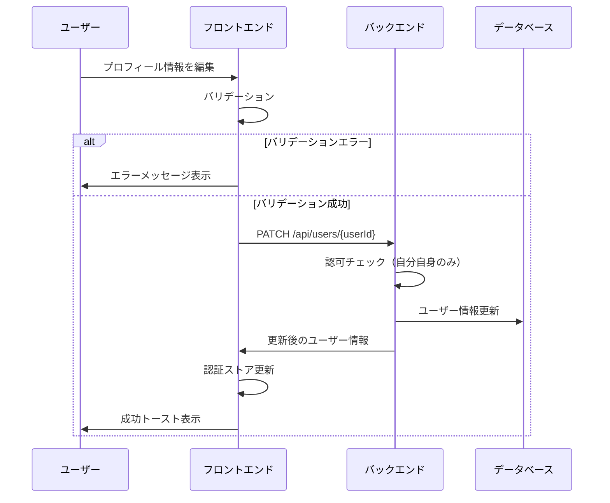
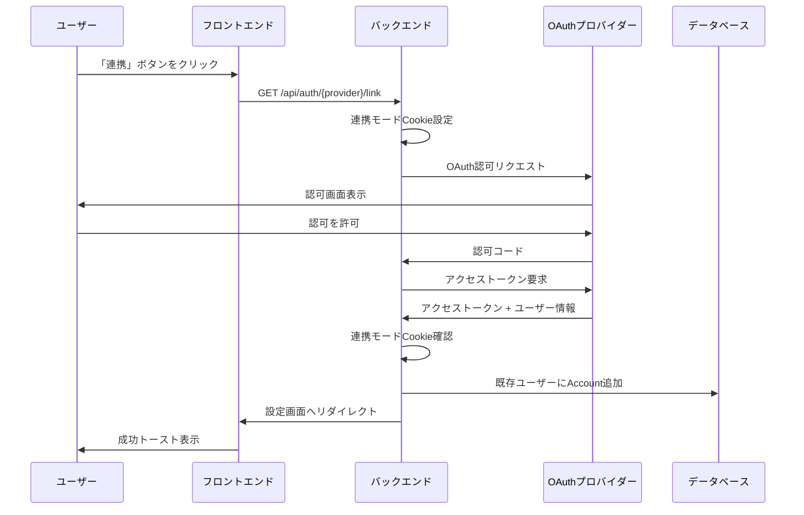
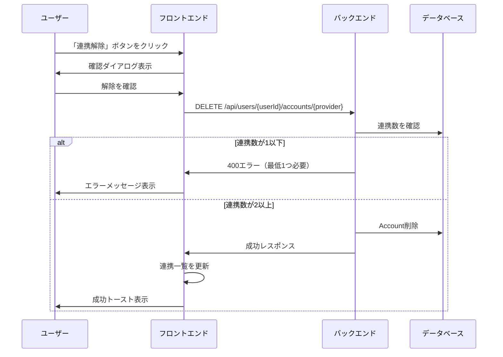
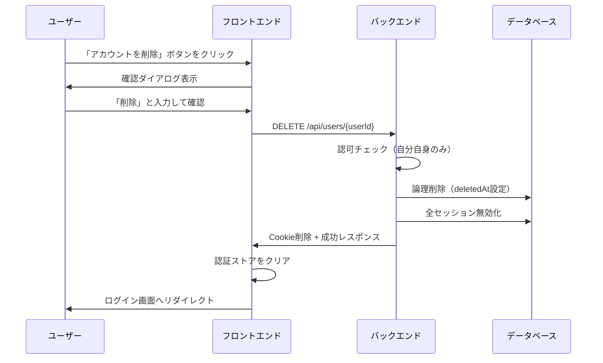
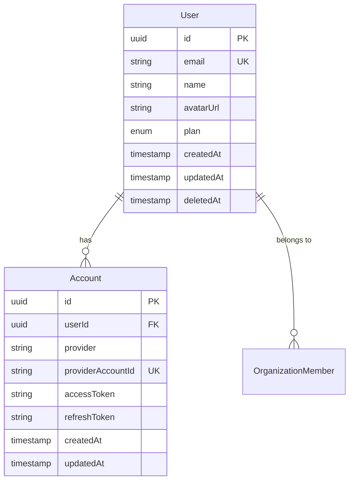

# ユーザー管理機能

## 概要

ユーザーのプロフィール設定、OAuth連携管理、アカウント削除などの自己管理機能を提供する。

## 機能一覧

| ID | 機能名 | 説明 | 状態 |
|----|--------|------|------|
| USR-001 | プロフィール表示 | 自分のプロフィール情報を表示 | 実装済 |
| USR-002 | プロフィール編集 | 表示名、アバターを変更 | 実装済 |
| USR-003 | OAuth連携一覧 | 連携中のOAuthプロバイダーを表示 | 実装済 |
| USR-004 | OAuth連携追加 | 別のプロバイダーを連携 | 実装済 |
| USR-005 | OAuth連携解除 | 連携済みプロバイダーを解除 | 実装済 |
| USR-006 | アカウント削除 | 自分のアカウントを削除 | 実装済 |

## 画面仕様

### 設定画面（プロフィールタブ）

- **URL**: `/settings`
- **表示要素**
  - アバター画像（クリックで変更可能）
  - 表示名入力欄
  - メールアドレス（読み取り専用）
  - 「保存」ボタン
- **バリデーション**
  - 表示名: 1〜100文字
  - アバターURL: 有効なURL形式
- **操作**
  - 入力変更 → 保存ボタン有効化
  - 保存ボタン → API呼び出し → 成功トースト表示

### 設定画面（セキュリティタブ）

- **URL**: `/settings`（セキュリティタブ）
- **表示要素**
  - OAuth連携セクション
    - 連携済みプロバイダー一覧
    - 各プロバイダーの「連携解除」ボタン
    - 未連携プロバイダーの「連携」ボタン
  - セッション管理セクション（[認証機能](./authentication.md)参照）
  - アカウント削除セクション
    - 「アカウントを削除」ボタン（赤色）
- **操作**
  - 連携ボタン → OAuthフローへリダイレクト
  - 連携解除ボタン → 確認ダイアログ → 解除実行
  - アカウント削除ボタン → 確認ダイアログ（入力確認付き）→ 削除実行

### アカウント削除確認ダイアログ

- **表示要素**
  - 警告メッセージ
  - 確認入力欄（「削除」と入力）
  - キャンセルボタン
  - 削除ボタン（赤色、確認入力完了まで無効）
- **操作**
  - 「削除」と入力 → 削除ボタン有効化
  - 削除ボタン → アカウント削除 → ログイン画面へリダイレクト

## 業務フロー

### プロフィール編集フロー

### OAuth連携追加フロー

### OAuth連携解除フロー

### アカウント削除フロー

## データモデル

## ビジネスルール

### プロフィール編集

- 表示名は1〜100文字
- アバターURLは有効なURL形式、またはnull
- メールアドレスはOAuthプロバイダーから取得、変更不可
- 自分自身のプロフィールのみ編集可能

### OAuth連携

- 1ユーザーに複数プロバイダーを連携可能
- 同一プロバイダーの重複連携は不可
- 最低1つのOAuth連携が必須
- 連携数が1の場合、解除は不可
- 連携追加時、既に別ユーザーに連携済みのアカウントはエラー

### アカウント削除

- 自分自身のアカウントのみ削除可能
- 論理削除（deletedAtに現在時刻を設定）
- 削除後は同一メールアドレスで再登録可能
- 削除時、全セッションを無効化
- 組織のオーナーの場合、オーナー移譲が必要（削除不可）

### エラーメッセージ

| エラー | メッセージ |
|--------|----------|
| 連携解除不可 | 最低1つのOAuth連携が必要です。連携を解除する前に別のプロバイダーを連携してください。 |
| 連携済みアカウント | このアカウントは既に別のユーザーに連携されています。 |
| オーナー削除不可 | 組織のオーナーはアカウントを削除できません。先にオーナー権限を移譲してください。 |

## 設定値

| 項目 | 値 | 説明 |
|------|-----|------|
| 表示名最大長 | 100文字 | プロフィール名の最大長 |
| 対応プロバイダー | GitHub, Google | OAuth連携対応プロバイダー |

## 関連機能

- [認証](./authentication.md) - セッション管理
- [組織管理](./organization.md) - 組織のオーナー移譲
